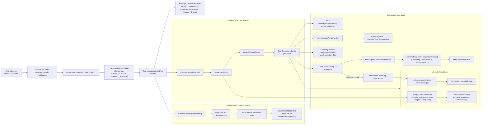

## STFService architecture & flows

### Service, monitors, responders

### Agent + minitouch input path

```mermaid
flowchart LR
    A["Android process<br/>stf.agent (Agent.main)"] --> B["ProcUtil.setArgV0(PROCESS_NAME)"]
    B --> C["Looper.prepareMainLooper()<br/>Handler(handler)"]
    C --> D["Parse args:<br/>--version / --debug-info / default"]
    D --> E["MinitouchAgent.getScreenSize()"]
    E --> F["new MinitouchAgent(w, h, handler).start()"]
    F --> G["new Agent(handler).start()"]
    G --> H["Looper.loop()"]

    subgraph AG["Agent.run()"]
      H0["Thread.start()"] --> H1["Init PowerManagerWrapper / InputManagerWrapper / WindowManagerWrapper"]
      H1 --> H2["selectDevice(): chọn deviceId<br/>VIRTUAL_KEYBOARD hoặc BUILT_IN_KEYBOARD"]
      H2 --> H3["loadKeyCharacterMap(deviceId)"]
      H3 --> H4["startServer(): LocalServerSocket @stfagent"]
      H4 --> H5["waitForClients(): loop accept()"]
      H5 --> H6["Cho mỗi client -> new InputClient(socket).start()"]
    end

    subgraph IC["InputClient (per minitouch conn)"]
      H6 --> I1["InputClient.run() loop"]
      I1 --> I2["Wire.Envelope.parseDelimitedFrom(input)"]
      I2 -->|null| I9["break & close socket"]
      I2 --> I3{"envelope.getType() ?"}

      I3 -->|DO_KEYEVENT| K1["handleKeyEventRequest()<br/>build metaState flags"]
      K1 --> K2{"request.getEvent()"}
      K2 -->|DOWN| KD["keyDown(keyCode, meta)"]
      K2 -->|UP| KU["keyUp(keyCode, meta)"]
      K2 -->|PRESS| KP["keyPress(keyCode, meta)<br/>DOWN + UP"]

      I3 -->|DO_TYPE| T1["handleTypeRequest()<br/>type(text) -> keyCharacterMap.getEvents()"]
      I3 -->|DO_WAKE| W1["handleWakeRequest()<br/>wake()"]
      I3 -->|SET_ROTATION| R1["handleSetRotationRequest()<br/>freezeRotation() / thawRotation()"]
      I3 -->|default| D1["Log 'Unknown request type'"]

      KD --> IM["handler.post{ InputManagerWrapper.injectKeyEvent(KeyEvent ACTION_DOWN) }"]
      KU --> IM
      KP --> IM
      T1 --> IM
      W1 --> PM["PowerManagerWrapper.wakeUp()"]
      R1 --> WM["WindowManagerWrapper.freezeRotation()/thawRotation()"]
    end
```

### Ý chính để scale

- **Điểm vào I/O chính**
  - `Service` dùng `LocalServerSocket @stfservice` + per-`Connection` thread.
  - `Agent` dùng `LocalServerSocket @stfagent` + per-`InputClient` thread.
- **Routing / extension**
  - `MessageRouter` + `AbstractResponder` cho toàn bộ DO/GET/SET; thêm feature = thêm responder + `router.register`.
  - `AbstractMonitor` cho các luồng monitor push event (Battery, Connectivity, Rotation, ...).
- **Bottleneck & contention**
  - `MessageWriter.Pool writers` + mọi monitor broadcast qua cùng một pool -> nếu nhiều client/monitor sẽ cần nghĩ tới batching, ưu tiên message hoặc tách writer pool theo loại traffic.
  - `Agent` đẩy toàn bộ key events vào main looper qua `Handler.post` -> giới hạn throughput nằm ở UI thread / InputManager.
- **Portability / device diversity**
  - `InputManagerWrapper`, `PowerManagerWrapper`, `WindowManagerWrapper` là lớp adapter để migrate giữa các API/Android version mà không động vào core logic.
  - Monitors/Responders phụ thuộc context Android nhưng tách biệt khá rõ; có thể refactor để reuse trên các variant build khác nhau.
