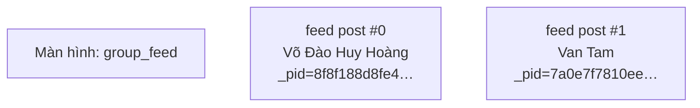

# Post ↔ Comment extra-data parity

- Serial: `10AE7S00HD002JK`
- Screen: `group_feed`
- Navigation: **không** (chỉ đọc hierarchy)

```mermaid
flowchart TB
  screen["Màn hình: group_feed"]
  FP0["feed post #0<br/>Võ Đào Huy Hoàng<br/>_pid=8f8f188d8fe4…"]
  FP1["feed post #1<br/>Van Tam<br/>_pid=7a0e7f7810ee…"]
```
