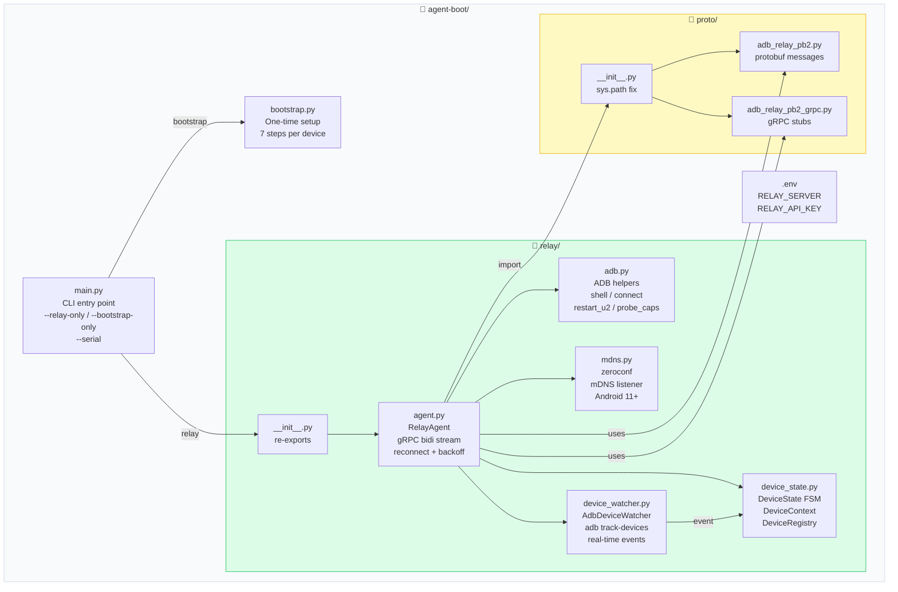

# Diagram: Agent-Boot Folder Structure

## ASCII Version

```
agent-boot/
│
├── main.py                    ← CLI entry point
│     ├── --relay-only          skip bootstrap, run relay daemon
│     ├── --bootstrap-only      setup devices then exit
│     ├── --serial <s>          target specific device
│     └── (default)             bootstrap → relay
│
├── bootstrap.py               ← One-time device setup (7 steps)
│     ├── step_tcpip()           adb tcpip (USB only, skip if WiFi)
│     ├── step_wireless_debug()  Android 11+ mDNS enable
│     ├── step_install_u2()      uiautomator2 APKs
│     ├── step_push_atx_agent()  push + start atx-agent :7912
│     ├── step_install_stf()     STFService.apk
│     ├── step_grant_perms()     WRITE_SECURE_SETTINGS
│     └── step_open_app()        launch → scan QR
│
├── relay/                     ← Long-running relay daemon (package)
│     ├── __init__.py            re-exports for main.py
│     ├── agent.py               RelayAgent — gRPC bidi stream
│     ├── adb.py                 ADB helpers (ppadb wrapper)
│     ├── mdns.py                zeroconf mDNS listener (Android 11+)
│     ├── device_state.py        DeviceState FSM + DeviceRegistry
│     └── device_watcher.py      AdbDeviceWatcher (adb track-devices)
│
├── proto/                     ← Generated gRPC stubs (DO NOT EDIT)
│     ├── __init__.py            adds proto/ to sys.path
│     ├── adb_relay_pb2.py       protobuf messages
│     └── adb_relay_pb2_grpc.py  gRPC service stubs
│
├── .env                       ← RELAY_SERVER, RELAY_API_KEY
├── .env.example               ← template
└── pyproject.toml
```

## Mermaid Version



## Dependency Map

```
main.py
  └── relay  (package)
        ├── relay/__init__.py
        │     └── proto  ← adds proto/ to sys.path
        ├── relay/agent.py
        │     ├── adb_relay_pb2       (via proto/)
        │     ├── adb_relay_pb2_grpc  (via proto/)
        │     ├── relay/adb.py
        │     ├── relay/mdns.py
        │     ├── relay/device_state.py
        │     └── relay/device_watcher.py
        ├── relay/adb.py
        │     └── ppadb  (external)
        └── relay/mdns.py
              └── zeroconf  (external)

bootstrap.py  (standalone — no relay imports)
```

## Responsibility Matrix

| File | Responsibility | I/O |
|------|---------------|-----|
| `main.py` | CLI, orchestrate bootstrap→relay | — |
| `bootstrap.py` | One-time APK install + permissions | adb subprocess |
| `relay/agent.py` | gRPC stream lifecycle, command dispatch | gRPC network |
| `relay/adb.py` | ADB shell/connect/restart_u2/probe | ppadb :5037 |
| `relay/mdns.py` | mDNS service browser → adb connect | zeroconf UDP |
| `relay/device_state.py` | State transitions, registry, capabilities | in-memory |
| `relay/device_watcher.py` | `adb track-devices` subprocess, diff snapshots | subprocess |
| `proto/__init__.py` | sys.path fix for generated stubs | — |
| `proto/adb_relay_pb2*.py` | Protobuf/gRPC generated code | — |
```
