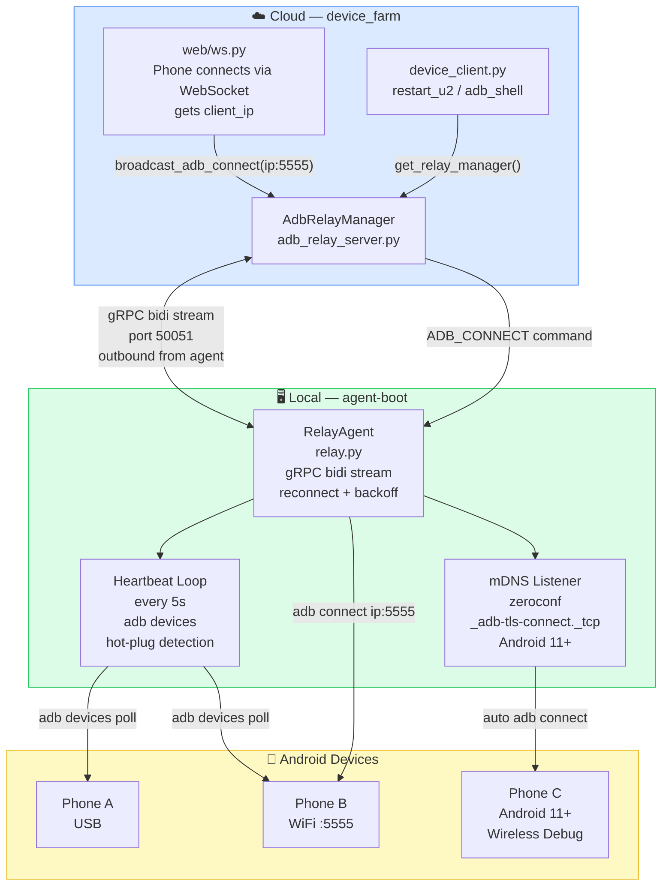

# Diagram: Agent-Boot Relay Architecture

## ASCII Version

```
┌─────────────────────────────────────────────────────────────────────────┐
│                        CLOUD  (device_farm)                             │
│                                                                         │
│  ┌──────────────┐    ┌─────────────────────┐    ┌──────────────────┐   │
│  │  web/ws.py   │    │ adb_relay_server.py  │    │ device_client.py │   │
│  │              │    │                      │    │                  │   │
│  │ Phone scans  │───▶│  AdbRelayManager     │◀───│  restart_u2()    │   │
│  │ QR → get IP  │    │  broadcast_adb_      │    │  adb_shell()     │   │
│  │              │    │  connect(ip:5555)    │    │                  │   │
│  └──────────────┘    └──────────┬───────────┘    └──────────────────┘   │
│                                 │ gRPC bidi stream (port 50051)          │
└─────────────────────────────────│───────────────────────────────────────┘
                                  │ OUTBOUND (agent connects to cloud)
┌─────────────────────────────────│───────────────────────────────────────┐
│                    LOCAL  (agent-boot)                                  │
│                                 │                                        │
│  ┌──────────────────────────────▼──────────────────────────────────┐    │
│  │                        relay.py                                  │    │
│  │                                                                  │    │
│  │  ┌─────────────────┐  ┌──────────────┐  ┌────────────────────┐  │    │
│  │  │  RelayAgent      │  │ Heartbeat    │  │  mDNS Listener     │  │    │
│  │  │  gRPC stream     │  │ Loop (5s)    │  │  (zeroconf)        │  │    │
│  │  │  reconnect+      │  │ adb devices  │  │  _adb-tls-connect  │  │    │
│  │  │  backoff         │  │ hot-plug     │  │  Android 11+       │  │    │
│  │  └────────┬─────────┘  └──────┬───────┘  └─────────┬──────────┘  │    │
│  │           │                   │                     │              │    │
│  │           └───────────────────┴─────────────────────┘              │    │
│  │                               │                                    │    │
│  │              ADB_CONNECT / SHELL / RESTART_U2                      │    │
│  └──────────────────────────────────────────────────────────────────┘    │
│                                  │                                        │
│              ┌───────────────────┼────────────────────┐                  │
│              │                   │                    │                   │
│     ┌────────▼──────┐  ┌────────▼──────┐  ┌─────────▼─────┐            │
│     │  Phone A      │  │  Phone B      │  │  Phone C      │            │
│     │  USB ADB      │  │  WiFi :5555   │  │  Android 11+  │            │
│     │               │  │               │  │  mDNS auto    │            │
│     └───────────────┘  └───────────────┘  └───────────────┘            │
└─────────────────────────────────────────────────────────────────────────┘

Discovery methods:
  [A] USB         → adb devices polling (always works)
  [B] WiFi :5555  → server push IP via broadcast_adb_connect (phone scans QR)
  [C] Android 11+ → zeroconf mDNS auto-discovery (no server needed)
```

## Mermaid Version



## File Organization

```
agent-boot/
├── main.py          # CLI entry point
│   ├── --relay-only        → skip bootstrap, just relay
│   ├── --bootstrap-only    → setup then exit
│   └── (default)           → bootstrap → relay
│
├── bootstrap.py     # One-time device setup
│   ├── step_tcpip()        → adb tcpip 5555
│   ├── step_install_u2()   → install uiautomator2 APKs
│   ├── step_push_atx_agent() → push + start atx-agent :7912
│   ├── step_install_stf()  → install STFService.apk
│   ├── step_grant_permissions()
│   └── step_open_app()     → open STFService → scan QR
│
├── relay.py         # Long-running daemon
│   ├── RelayAgent          → gRPC bidi stream + reconnect
│   ├── _heartbeat_loop()   → hot-plug every 5s
│   ├── _AdbMdnsListener    → zeroconf Android 11+ discovery
│   └── _execute_command()  → ADB_CONNECT / SHELL / RESTART_U2
│
├── .env             # RELAY_SERVER, RELAY_API_KEY
└── .env.example     # Template
```

## Optimization Notes

| # | Issue | Fix |
|---|-------|-----|
| 1 | `broadcast_adb_connect` fires and forgets — no feedback to server | Add result logging per relay |
| 2 | mDNS listener runs in thread; `_adb_connect` is blocking | Already OK: runs in `_execute_command` thread pool |
| 3 | Relay ID regenerated on every restart | Persist relay_id to `.relay_id` file for stable identity |
| 4 | No retry on `adb connect` failure | heartbeat loop catches it within 5s anyway |
| 5 | proto stubs must be manually generated | `adb_relay_server.py` auto-generates on first import |
