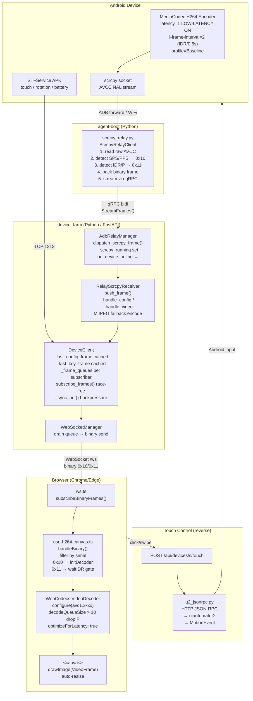

# Diagram: Device Farm H264 Streaming Pipeline

## ASCII Version

```
┌──────────────────────────────────────────────────────────────────────────────────────────┐
│                             ANDROID DEVICE                                               │
│                                                                                          │
│   ┌─────────────────┐     ┌──────────────────────────────────────────────────────────┐  │
│   │  STFService APK │     │              scrcpy-server (Java)                        │  │
│   │  (WebSocket)    │     │  MediaCodec H264 encoder                                 │  │
│   │                 │     │  video_codec_options:                                    │  │
│   │  touch events   │     │    profile:int=1  (Baseline)                            │  │
│   │  rotation       │     │    latency:int=1  (low-latency ON ✓)                   │  │
│   │  battery        │     │    i-frame-interval:int=2  (IDR every 0.5s)            │  │
│   └────────┬────────┘     │                                                          │  │
│            │ TCP 1313      │  Output: AVCC NAL units (length-prefixed)               │  │
│            │              └───────────────────────┬──────────────────────────────────┘  │
│            │                                      │ Local UNIX socket / TCP 27183        │
└────────────┼──────────────────────────────────────┼──────────────────────────────────────┘
             │                                      │ adb forward / WiFi direct
             │                         ┌────────────▼────────────────────────────────────┐
             │                         │           agent-boot  (Python)                  │
             │                         │     relay/scrcpy_relay.py                       │
             │                         │                                                  │
             │                         │  1. Connect to scrcpy socket                    │
             │                         │  2. Read raw H264 AVCC stream                  │
             │                         │  3. Parse NAL units                             │
             │                         │  4. Detect SPS/PPS → type 0x10 (config)        │
             │                         │  5. Detect IDR/P-frames → type 0x11 (video)    │
             │                         │                                                  │
             │                         │  Frame packing:                                 │
             │                         │  [type:1B][slen:1B][serial][w:2BE][h:2BE]      │
             │                         │  + for 0x10: [flags:1B][AVCDecoderConfigRec]   │
             │                         │  + for 0x11: [isKey:1B][ptsHi:4BE][ptsLo:4BE] │
             │                         │              [AVCC data]                        │
             │                         └──────────────────┬──────────────────────────────┘
             │                                            │ gRPC bidi stream
             │                                            │ ScrcpyRelay.StreamFrames()
             │                         ┌──────────────────▼──────────────────────────────┐
             │                         │        device_farm (Python / FastAPI)            │
             │                         │                                                  │
             │                         │  runtime/transports/adb_relay_server.py         │
             │                         │    AdbRelayManager                               │
             │                         │    • dispatch_scrcpy_frame(serial, frame)        │
             │                         │    • _scrcpy_running set                         │
             │                         │    • on_device_online callback → server.py       │
             │                         │                                                  │
             │                         │  runtime/transports/scrcpy_receiver.py          │
             │                         │    RelayScrcpyReceiver                           │
             │                         │    • push_frame() → _handle_config/_handle_video│
             │                         │    • MJPEG encode (fallback for legacy UI)       │
             │                         │                                                  │
             │                         │  runtime/core/device_client.py                  │
             │                         │    DeviceClient                                  │
             │                         │    • _last_config_frame  ← cached SPS/PPS       │
             │                         │    • _last_key_frame     ← cached IDR            │
             │                         │    • _frame_queues[]     ← per-subscriber queue  │
             │                         │    • subscribe_frames():                         │
             │                         │        [under _frame_lock]                       │
             │                         │        put_nowait(config) → put_nowait(IDR)      │
             │                         │        → append queue  (race-free bootstrap)     │
             │                         │    • _sync_put(): IDR/config evict oldest;       │
             │                         │                   P-frame dropped if full        │
             │                         │                                                  │
             │                         │  web/ws.py                                       │
             │                         │    WebSocketManager                              │
             │                         │    • drains per-subscriber queue                 │
             │                         │    • sends raw binary frames to browser          │
             │                         └──────────────────┬──────────────────────────────┘
             │                                            │ WebSocket /ws
             │                                            │ binary frames (0x10 / 0x11)
             │                         ┌──────────────────▼──────────────────────────────┐
             │                         │           Browser (Chrome / Edge)               │
             │                         │                                                  │
             │                         │  services/ws.ts                                  │
             │                         │    subscribeBinaryFrames(callback)               │
             │                         │                                                  │
             │                         │  hooks/use-h264-canvas.ts                        │
             │                         │    handleBinary(buf):                            │
             │                         │    • Parse frame header, filter by serial        │
             │                         │    • 0x10 → initDecoder(avccRecord)              │
             │                         │    • 0x11 → waitIDR gate → decode()             │
             │                         │                                                  │
             │                         │    VideoDecoder (WebCodecs API):                 │
             │                         │    • configure({ codec:"avc1.xxxx",             │
             │                         │                  description: avccRecord,        │
             │                         │                  optimizeForLatency: true })      │
             │                         │    • decodeQueueSize > 10 → drop P-frame         │
             │                         │    • output(VideoFrame) → drawImage(canvas)      │
             │                         │                                                  │
             │                         │    <canvas> element                              │
             │                         │    auto-sized to frame.displayWidth/Height       │
             └─────────────────────────┼─────────────────────────────────────────────────┘
                                       │
                    ┌──────────────────▼──────────────────────────────┐
                    │              TOUCH CONTROL (reverse)             │
                    │                                                  │
                    │  Browser → POST /api/devices/{s}/touch          │
                    │  device_farm → DeviceClient.send_touch()        │
                    │  → u2_jsonrpc.py → HTTP JSON-RPC → uiautomator2 │
                    │  → Android MotionEvent                           │
                    └──────────────────────────────────────────────────┘
```

---

## Mermaid Version



---

## Connection Instability & Config Bootstrap Fixes

```
Relay Reconnect Flow (FIXED):
══════════════════════════════

  gRPC disconnect
       │
       ▼
  AdbRelayManager.unregister(serial)
  → _scrcpy_running.discard(serial)      ← marks session dead
       │
       ▼ (gRPC reconnect from agent-boot)
  _on_relay_device_online(serial)
       │
       ├─ WS-APK device exists?
       │   YES → set_event_loop()
       │         attach_scrcpy_stream()   ← ALWAYS called (was: early return ✗)
       │              │
       │              └─ guard: is_scrcpy_running() == False?
       │                   → stop dead RelayScrcpyReceiver
       │                   → _scrcpy_active stays True           ← keeps _last_config_frame
       │                   → fall through → re-issue scrcpy_start
       │
       └─ New device → ensure_device() → attach_scrcpy_stream()


Config Frame Bootstrap (FIXED):
════════════════════════════════

  Browser connects → subscribe_frames()
       │
       ▼
  [under _frame_lock]                   ← atomic: no live frame can race
  put_nowait(_last_config_frame) 0x10   ← SPS/PPS arrives FIRST guaranteed
  put_nowait(_last_key_frame)    0x11   ← IDR arrives SECOND
  append queue to _frame_queues
       │
       ▼
  WebSocketManager drains queue → sends to browser
       │
       ▼
  Browser: 0x10 → initDecoder() → 0x11 → waitIDR=false → decode() → canvas ✓


Encoder Low-Latency (FIXED):
═════════════════════════════

  BEFORE: video_codec_options=latency:int=0   → low-latency DISABLED (adds 100-300ms buffer)
  AFTER:  video_codec_options=latency:int=1   → low-latency ENABLED  (encode-then-send immediately)

  BEFORE: i-frame-interval:int=1  → worst-case stutter = 1000ms waiting for IDR
  AFTER:  i-frame-interval:int=2  → worst-case stutter = 500ms  (2 IDRs/sec)

  BEFORE: decodeQueueSize > 4   → drops P-frames on any React render spike (133ms@30fps)
  AFTER:  decodeQueueSize > 10  → 333ms tolerance before dropping P-frames
```
