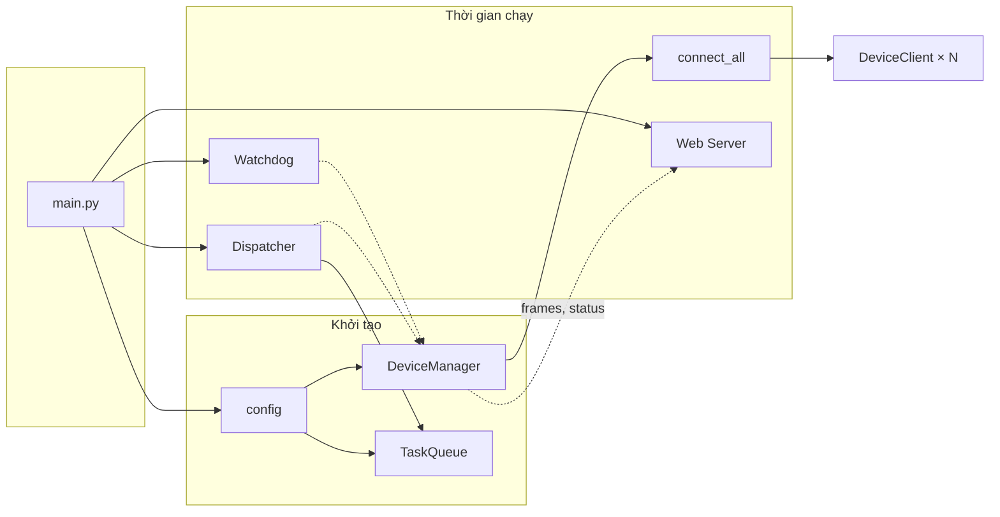
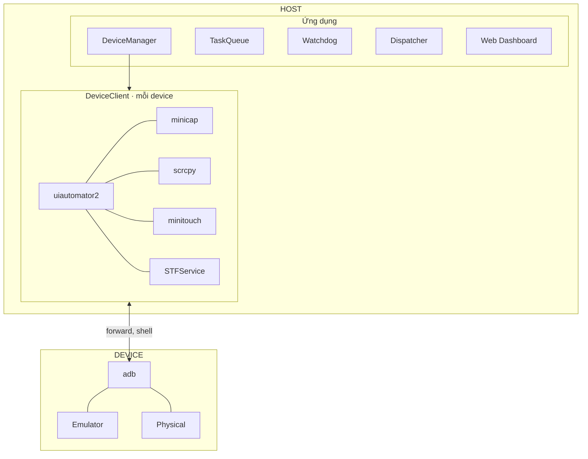
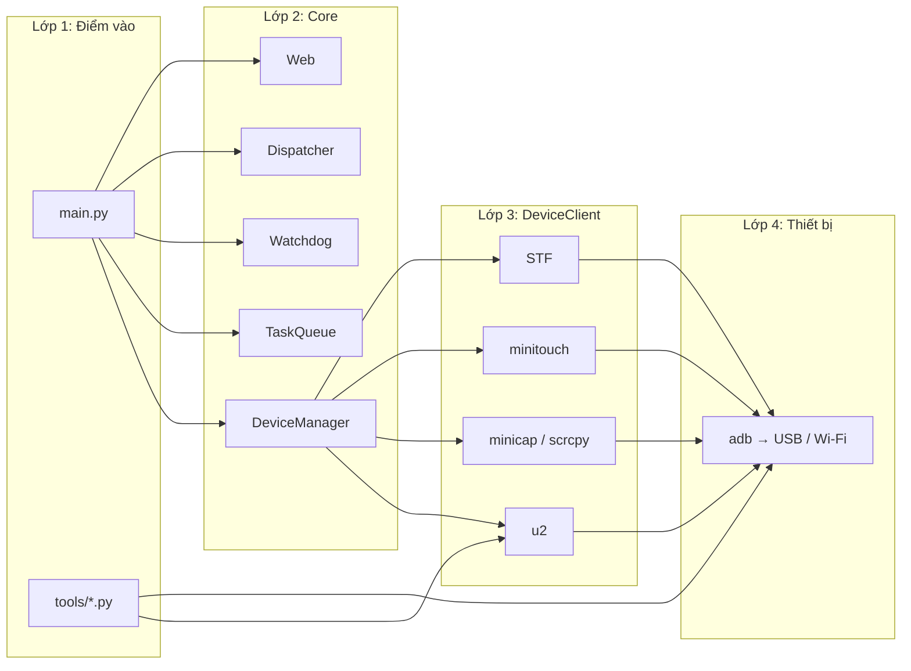
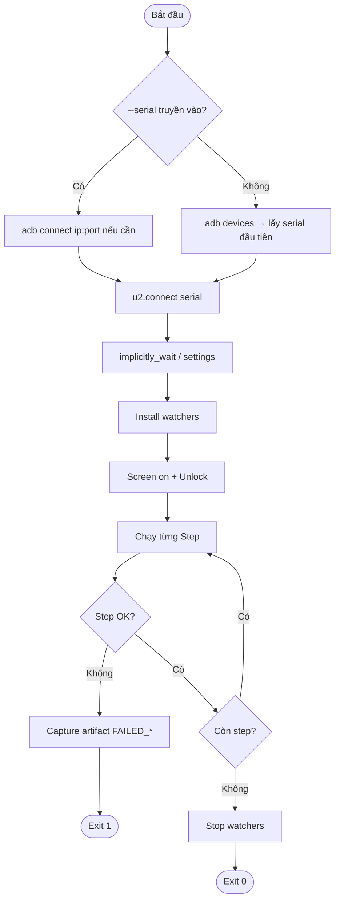
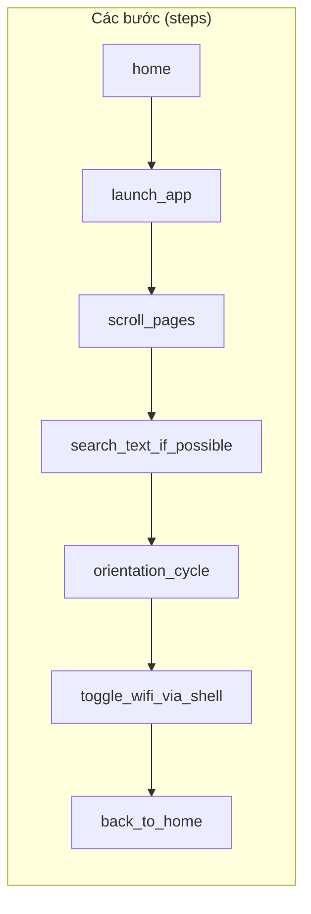
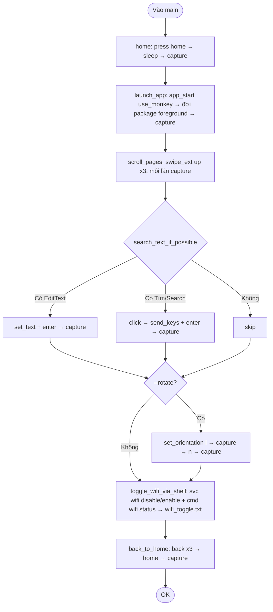
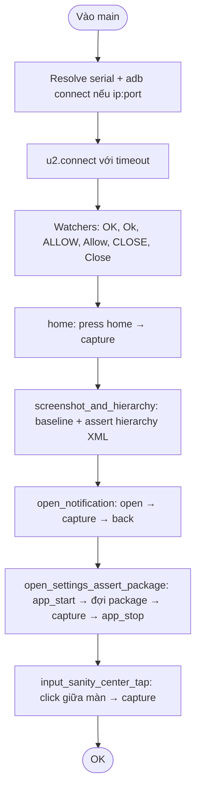
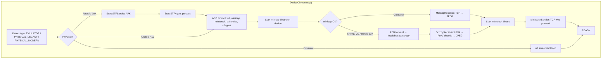
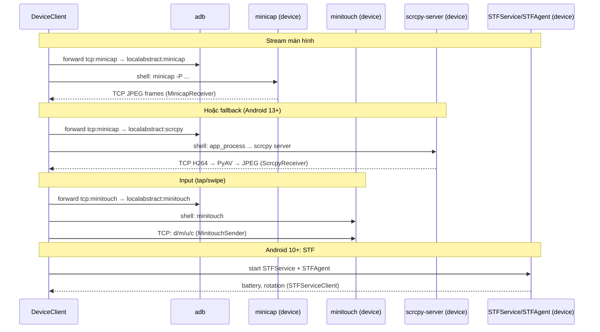

# Luồng kịch bản uiautomator2 & Device Farm

Tài liệu mô tả flow, thư viện và các ý quan trọng cho các script trong `tools/` và kiến trúc Device Farm.

---

## Tổng quan project

### Luồng khởi động (main.py)



### Kiến trúc thành phần



### Vai trò từng lớp



### Bảng mô tả khối

| Khối | Mô tả ngắn |
|------|------------|
| **main.py** | Khởi tạo config, DeviceManager, TaskQueue, Watchdog, Dispatcher; discover & setup từng device; chạy web server (uvicorn). |
| **DeviceManager** | Gọi `adb devices`, tạo/giữ registry DeviceClient, persist serial→index; `connect_all()` setup song song. |
| **DeviceClient** | Một device: u2 + stream (minicap hoặc scrcpy) + input (minitouch) + STF (Android 10+). Trạng thái: DISCONNECTED → CONNECTING → READY → BUSY / ERROR / DEAD. |
| **Watchdog** | Định kỳ kiểm tra device healthy, reconnect nếu cần, đánh dấu DEAD sau N lần thất bại. |
| **Dispatcher** | Lấy task từ TaskQueue, gán cho device READY, gọi device thực thi (tap, swipe, …). |
| **Web** | FastAPI phục vụ dashboard; WebSocket push frame (JPEG), status, log từ từng DeviceClient. |
| **tools/*.py** | Script độc lập: chỉ u2 + adb, không dùng minicap/minitouch/scrcpy/STF; chạy kịch bản smoke/complex, ghi artifacts. |

---

## 1. Luồng tổng quát (mọi script u2 trong tools/)



---

## 2. Luồng chi tiết: u2_complex_scenario.py





---

## 3. Luồng chi tiết: u2_strict_smoke.py



---

## 4. Kiến trúc giao tiếp Host ↔ Device

```mermaid
sequenceDiagram
    participant Script as Python script (tools/)
    participant u2 as uiautomator2 (host)
    participant ADB as adb
    participant Agent as u2 (device, am instrument :9008)
    participant U2Server as uiautomator2 server (device)
    participant Android as Android UI / shell

    Script->>u2: connect(serial)
    u2->>ADB: forward tcp:9008
    u2->>Agent: HTTP JSON-RPC
    Agent->>U2Server: UIAutomator / Accessibility
    U2Server->>Android: click, swipe, dump_hierarchy, ...
    Android-->>U2Server: result
    U2Server-->>Agent-->>u2-->>Script: return
```

---

## 5. Device Farm: minicap, minitouch, scrcpy, STFService / STFAgent

Các script trong `tools/` **chỉ dùng uiautomator2**. Phần **Device Farm** (ứng dụng chính: `main.py` + `runtime/core/device_client.py`) dùng thêm **minicap**, **minitouch**, **scrcpy**, **STFService** và **STFAgent** để stream màn hình và gửi touch cho **thiết bị vật lý**.

### 5.1 Khi nào dùng gì

| Loại thiết bị | Screenshot / stream | Input (tap, swipe) |
|---------------|---------------------|----------------------|
| **Emulator** | uiautomator2 screenshot loop (~4 FPS) | u2.click / u2.swipe |
| **Physical Android &lt; 10** | minicap (binary JPEG over TCP) | minitouch (wire protocol over TCP) |
| **Physical Android 10+** | minicap **hoặc** scrcpy (fallback khi minicap không chạy, VD Android 13+) | minitouch (chạy qua **STFAgent** relay) + **STFService** (battery, rotation) |

### 5.2 Luồng setup Device Farm cho một device vật lý



### 5.3 Mô tả từng thành phần

| Thành phần | Vai trò | Giao thức / công nghệ |
|------------|--------|-------------------------|
| **minicap** | Chụp màn hình realtime trên device, gửi JPEG qua socket. Dùng cho **stream dashboard** (xem màn hình thiết bị). | Binary wire: 24-byte global header (resolution, orientation) + từng frame (4-byte size + raw JPEG). Host đọc qua `adb forward tcp:PORT → localabstract:minicap`. |
| **minitouch** | Nhận lệnh chạm (down/move/up) từ host, đẩy vào device. **Latency thấp hơn** so với tap qua u2. | Text protocol: header `v/^/$`, lệnh `d`, `m`, `u`, `c`, `w`, `r`. Host kết nối TCP (forward minitouch), gửi tọa độ đã scale theo `max_x/max_y` từ header. Android 10+ cần **STFAgent** chạy trước để minitouch hoạt động qua relay. |
| **scrcpy** | Thay thế minicap khi minicap không chạy (VD Android 13+ do thay đổi MediaProjection). Stream **H264** từ device, host decode → JPEG. | Push `scrcpy-server` JAR lên device, chạy `app_process`, forward `tcp:PORT → localabstract:scrcpy`. Socket nhận 68-byte device info rồi stream (pts + size + H264 NAL). Host dùng **PyAV** decode, chuyển frame thành JPEG. |
| **STFService** | APK trên device: gửi **pin battery**, **rotation** lên host; hỗ trợ inject key. | Protocol Buffers (varint-length-prefixed) qua socket `localabstract:stfservice`. Host parse thủ công (không .proto) để lấy battery level, rotation event. |
| **STFAgent** | Process trên device (từ STF APK): relay cho **minitouch** trên Android 10+ (SELinux / security). Không cần đổi code minitouch; minitouch tự nhận diện relay. | Socket `localabstract:stfagent`. DeviceClient start bằng `app_process`, rồi kết nối từ host qua ADB forward. |

### 5.4 Luồng dữ liệu Host ↔ Device (stream + input)



---

## 6. Thư viện sử dụng

### 6.1 Script tools/ (u2_complex_scenario, u2_strict_smoke)

| Thư viện | Vai trò |
|----------|--------|
| **uiautomator2** | Client Python: `connect`, `click`, `swipe`, `app_start`, `dump_hierarchy`, `screenshot`, `watcher`, `shell`, `swipe_ext`, `set_orientation`, ... |
| **adbutils** | Dependency của uiautomator2: giao tiếp ADB (device, shell, forward). Script không import trực tiếp. |
| **subprocess** | Gọi `adb devices`, `adb connect` trong tools. |
| **pathlib** | Đường dẫn thư mục artifacts. |
| **argparse** | Parse `--serial`, `--adb`, `--artifacts`, `--app-pkg`, `--search-text`, `--rotate`. |
| **dataclasses** | `Step(name, fn)` trong script. |
| **time** | `sleep`, `monotonic` cho wait/interval. |

### 6.2 Device Farm (main app + `runtime/`)

| Thư viện / thành phần | Vai trò |
|------------------------|--------|
| **uiautomator2** | Kết nối device, u2.click/swipe (emulator), screenshot loop (emulator), hỗ trợ automation. |
| **minicap** (binary + MinicapReceiver) | Đọc TCP stream JPEG từ device; **không** dùng pip package — binary đặt tại `config.device.minicap_bin` trên device. |
| **minitouch** (binary + MinitouchSender) | Gửi lệnh touch qua TCP wire protocol; binary tại `config.device.minitouch_bin` trên device. |
| **scrcpy** (scrcpy-server JAR + ScrcpyReceiver) | Stream H264 từ device; host dùng **av** (PyAV) decode → JPEG. JAR trên host: `config.device.scrcpy_jar`. |
| **STFService / STFAgent** (stf_client.py) | Socket + **struct** + parse protobuf thủ công (varint, tag); không dùng package protobuf runtime. APK: `jp.co.cyberagent.stf`. |
| **av** (PyAV) | Decode H264 trong ScrcpyReceiver. |
| **numpy** | Chuyển frame từ PyAV sang ảnh (ScrcpyReceiver). |
| **fastapi, uvicorn, websockets** | Web dashboard, streaming frame qua WebSocket. |
| **pyyaml, jinja2** | Config, template. |
| **opencv-python, pillow** | Xử lý ảnh (nếu dùng trong tasks). |
| **aiohttp, protobuf** | Dependency khác của stack. |

*Lưu ý: scrcpy, minitouch, minicap, STF là **tên công cụ / binary / giao thức**, không phải tên package pip. Code Python chỉ gọi binary qua adb shell và đọc/ghi socket.*

---

## 7. Các ý quan trọng

- **Watcher API (u2):** `d.watcher("name").when("text").click()` — `when()` nhận **XPath-like / text** (không phải keyword `text="OK"`). Watcher chạy nền, tự click khi điều kiện khớp (dialog Allow/OK/Đồng ý…). Luôn `watcher.start()` sau khi đăng ký, `watcher.stop()` trong `finally`.
- **Serial Wi‑Fi:** Nếu serial dạng `ip:port` và chưa có trong `adb devices`, script tự gọi `adb connect ip:port`. Cắm USB một lần, chạy `adb tcpip 5555`, rồi dùng Wi‑Fi sau.
- **Artifacts:** Mỗi step (hoặc khi fail) ghi vào thư mục `artifacts` / `artifacts_complex`: screenshot PNG, hierarchy XML, `app_current`, và (trong complex) file `wifi_toggle.txt`. Tên file có timestamp + tag để không ghi đè.
- **Timeout:** `_wait_until(predicate, timeout_s)` dùng để đợi app lên foreground hoặc điều kiện khác. Tránh gọi RPC block vô hạn (có thể wrap `u2.connect` hoặc step dài trong `ThreadPoolExecutor` + `result(timeout=...)` nếu cần).
- **Step fail:** Nếu một step ném exception, script capture artifact với tag `FAILED_<step_name>`, in lỗi, thoát với code 1. Các step sau không chạy.
- **Orientation:** `d.set_orientation("l")` / `"n"` (landscape / natural). Một số OEM có thể không hỗ trợ đầy đủ; nên bọc trong try/except và restore best-effort.
- **Search UI:** Trong complex scenario, search thử hai đường: (1) `EditText` → `set_text`; (2) node text/desc chứa "Tìm"/"Search" → click → `send_keys`. Có thể mở rộng thêm selector cho app cụ thể.

---

## 8. Chạy nhanh

```bash
# Complex scenario (Settings, scroll, search, tùy chọn rotate)
.venv/bin/python tools/u2_complex_scenario.py --serial 172.16.0.91:5555 --rotate

# Strict smoke (home, notification, Settings, center tap)
.venv/bin/python tools/u2_strict_smoke.py --serial 172.16.0.91:5555
```

Artifacts: `device_farm/artifacts_complex/<serial>/` và `device_farm/artifacts/<serial>/`.
