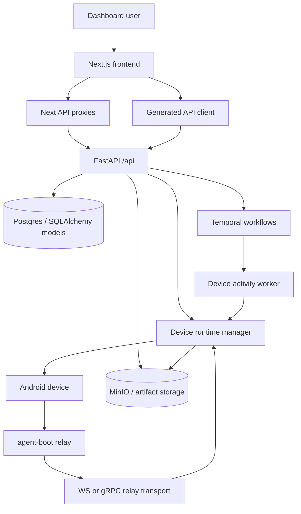

# Device Farm Documentation

Status: active
Last audited: 2026-05-18

This directory is the implementation-facing documentation set for Device Farm.
Agents should treat `docs/product/prd.md` as the product source of truth and
the files under `docs/modules/`, `docs/api/`, and `docs/data/` as the
implementation source of truth. Historical PRDs, research notes, and old ticket
specs are kept under `docs/archive/` for context only.

## Start Here

- `docs/product/prd.md` defines active product requirements and product direction.
- `docs/product/platforms/README.md` defines target platform coverage profiles.
- `docs/modules/README.md` maps the current system by module.
- `docs/api/route-matrix.md` maps exposed API surfaces, auth boundary, and source files.
- `docs/data/schema.md` maps database ownership and migration sources.
- `docs/doc-template.md` defines the format for future module docs.

## Canonical Modules

| Module | Current doc | Primary source paths |
|---|---|---|
| Platform runtime | `docs/modules/platform-runtime.md` | `device_farm/web/server.py`, `device_farm/api/mount.py`, `device_farm/runtime/lifecycle.py` |
| API auth and tenancy | `docs/modules/api-auth-tenancy.md` | `device_farm/api/deps.py`, `device_farm/api/auth/*`, `device_farm/api/crud/router.py` |
| Devices and control plane | `docs/modules/devices-control-plane.md` | `device_farm/api/routes/devices.py`, `device_farm/api/routes/device_control/*`, `device_farm/runtime/core/*` |
| Campaigns, scenarios, executions | `docs/modules/campaigns-scenarios-executions.md` | `device_farm/api/routes/campaigns.py`, `device_farm/services/campaign_dispatch.py`, `device_farm/tasks/scenario/*`, `device_farm/temporal/*` |
| Scheduling | `docs/modules/scheduling.md` | `device_farm/api/routes/schedules.py`, `device_farm/services/scheduler.py`, `device_farm/temporal/schedule_*` |
| Content, extraction, artifacts | `docs/modules/content-extraction-artifacts.md` | `device_farm/api/routes/content.py`, `device_farm/api/routes/extraction.py`, `device_farm/tasks/scenario/steps/extraction.py` |
| Accounts and groups | `docs/modules/accounts-groups.md` | `device_farm/api/routes/accounts.py`, `device_farm/api/routes/account_groups.py`, `device_farm/services/account_manager.py` |
| Notifications and analytics | `docs/modules/notifications-analytics.md` | `device_farm/api/routes/notifications.py`, `device_farm/api/routes/analytics.py`, `device_farm/services/notification_service.py` |
| Social node contract | `docs/modules/social-node-contract.md` | `device_farm/services/social_actions/*`, `device_farm/tasks/scenario/steps/social_actions.py`, `device_farm/services/scenario_dsl/step_tree.py` |
| Agent boot and relay | `docs/modules/agent-boot-relay.md` | `agent-boot/*`, `agent-boot/relay/*`, `device_farm/runtime/transports/*` |
| MCP agent tools | `docs/modules/mcp-agent-tools.md` | `device_farm/mcp/*`, `device_farm/api/routes/device_control/*` |
| Frontend | `docs/modules/frontend.md` | `front-end/src/features/*`, `front-end/src/app/api/*`, `front-end/generate/openapi.json` |

## System Map

## Documentation Rules For Agents

1. Use `docs/product/prd.md` for product intent and `docs/modules/*.md` for implementation contracts.
2. When a module doc conflicts with source code, source code wins and the doc must be updated in the same change.
3. Do not add new one-off plan files for durable product behavior. Add or update a module doc.
4. Use `docs/archive/` only for historical context. Do not implement from archived docs without re-validating against source.
5. For API changes, update `docs/api/route-matrix.md` and regenerate/check `front-end/generate/openapi.json`.
