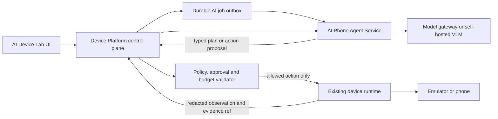

# Research: AI phone-agent service tách khỏi Device Platform Tester

Ngày đánh giá: 2026-10-04

## Kết luận

Không nên đặt model client và vòng lặp agent tự trị bên trong backend Device Platform Tester. Repo hiện tại nên tiếp tục sở hữu tenant, campaign, approval, policy, device lease, action execution, evidence và audit. AI nên chạy trong một service riêng, nhận observation đã lọc và trả về plan hoặc action có schema; platform kiểm policy rồi mới thực thi.

Lựa chọn phù hợp nhất để làm baseline service là [droidrun/mobilerun](https://github.com/droidrun/mobilerun). Đây là framework MIT, hỗ trợ Android/iOS, nhiều model provider, CLI/Python/Docker, accessibility tree kết hợp screenshot, structured output và tracing. Không nên dùng Portal/device-control của Mobilerun làm đường production mặc định ngay từ đầu; nên thay lớp tool của nó bằng adapter gọi Device Platform Tester để giữ lease, policy và evidence hiện có.

[zai-org/Open-AutoGLM](https://github.com/zai-org/Open-AutoGLM) là ứng viên thứ hai cần benchmark. Nó có phone-agent loop chuyên dụng, ADB/multi-device selection, model API tương thích OpenAI và hướng dẫn self-host AutoGLM-Phone-9B bằng vLLM/SGLang. Repo tự mô tả là phục vụ nghiên cứu/học tập, vì vậy phù hợp làm model/agent candidate hơn là control plane production.

## Shortlist

| Repo | Vai trò phù hợp | Điểm mạnh | Hạn chế với dự án | License | Khuyến nghị |
|---|---|---|---|---|---|
| [droidrun/mobilerun](https://github.com/droidrun/mobilerun) | Nền cho AI-agent service | LLM-agnostic; Android/iOS; Python API; Docker; UI tree + vision; reasoning mode; structured output; Phoenix/Langfuse tracing | Portal và control stack trùng với runtime hiện có; phải thay bằng platform adapter để không bypass policy/audit | MIT | **Ưu tiên POC** |
| [zai-org/Open-AutoGLM](https://github.com/zai-org/Open-AutoGLM) | Phone-use model và agent baseline | Agent chuyên cho phone; ADB/HDC; chọn device ID; OpenAI-compatible inference; self-host AutoGLM-Phone-9B | Agent gọi ADB trực tiếp; tài liệu ghi research/learning; cần bọc action schema và policy | Apache-2.0 | **Benchmark song song** |
| [appium/appium-mcp](https://github.com/appium/appium-mcp) | Actuator/MCP sidecar | Android UiAutomator2, iOS XCUITest, real/simulator; session tools; element finding; plugin API; behavioral evals | Không phải full planner; tài liệu cảnh báo không expose MCP trực tiếp cho client không tin cậy | Apache-2.0 | Dùng khi cần iOS/Appium backend |
| [google-research/android_world](https://github.com/google-research/android_world) | Eval/benchmark | 116 task trên 20 app, reward reproducible, M3A/T3A/SeeAct, tạo agent mới qua interface chuẩn | Chủ yếu chạy emulator; không phải production agent service | Apache-2.0 | **Dùng làm eval harness** |
| [X-PLUG/MobileAgent](https://github.com/X-PLUG/MobileAgent) | Nghiên cứu planner/critic/memory | Mobile-Agent v1-v3.5, GUI-Owl, planning, reflection, memory, mobile/desktop/browser | Monorepo nghiên cứu lớn; model/runtime nặng; cần nhiều công sức hardening và service hóa | MIT | Theo dõi và benchmark sau |
| [TencentQQGYLab/AppAgent](https://github.com/TencentQQGYLab/AppAgent) | Baseline học từ exploration/demo | Set-of-Mark, exploration và knowledge base theo app; dễ hiểu | Baseline cũ dựa GPT-4V/Qwen-VL; config/provider và production controls hạn chế | MIT | Chỉ tham khảo |
| [srmorete/mobile-device-mcp](https://github.com/srmorete/mobile-device-mcp) | MCP multi-device nhẹ | Android/iOS, native/WebView, bearer token theo device, nhiều device song song | Cộng đồng nhỏ; không có agent planner đầy đủ | MIT | POC phụ, không làm lõi |
| [shenyuexin/mobile-e2e-mcp](https://github.com/shenyuexin/mobile-e2e-mcp) | Tham khảo governance | Policy profile, session/lease/audit/evidence, deterministic-first và bounded visual fallback | Cộng đồng rất nhỏ; nhiều phần vừa implementation vừa target architecture | MIT | Mượn pattern, chưa chọn dependency lõi |

Số sao hoặc độ phổ biến không được dùng làm tiêu chí production duy nhất. Tại thời điểm kiểm tra, các repo trên đều không archived; Mobilerun, Appium MCP và AndroidWorld có cập nhật gần ngày đánh giá. AppAgent có nhịp cập nhật chậm hơn và phù hợp làm tài liệu nghiên cứu.

## Kiến trúc đề xuất

Ranh giới trách nhiệm:

- Device Platform Tester giữ `org_id`, campaign/lane/attempt, approved scenario version/hash, device reservation, fencing, idempotency, allowed operations, evidence và terminal reducer.
- AI service giữ prompt/model routing, planning, screen understanding, memory ngắn hạn, critic, token/step budget và model telemetry.
- AI service không nhận ADB credential, tenant secret hoặc URL evidence dài hạn. Screenshot/UI tree phải được redact và có TTL.
- Mọi action từ AI là đề xuất có schema. Platform là bên duy nhất quyết định action có được chạy trên device hay không.
- Action nhạy cảm như thanh toán, gửi tin, xóa dữ liệu, thay credential hoặc vượt app/package scope cần deny hoặc human approval theo policy.

## Hai chế độ AI

1. **Compile mode:** `goal + app/build + capability snapshot -> scenario draft`. Đây là đường thay cho việc backend gọi thẳng OpenAI/Gemini trong wizard. Draft vẫn phải validate, review và approve trước khi chạy.
2. **Reactive mode:** `approved goal + current observation + bounded history -> next action proposal`. Chỉ bật cho exploration/recovery hoặc khi deterministic selector thất bại; có `max_steps`, deadline, token/cost budget và circuit breaker.

Không nên để agent tự trị điều khiển device ngay khi generate scenario. Compile mode có thể chạy không cần device; reactive mode phải gắn với một lease và execution cụ thể.

## Contract service tối thiểu

- `POST /v1/plans`: tạo job idempotent từ intake version/hash; trả job ID.
- `GET /v1/plans/{id}` hoặc event stream: trạng thái và draft đã validate ở cấp schema.
- `POST /v1/sessions`: mở reactive session với execution ID, policy version và budget.
- `POST /v1/sessions/{id}/observations`: gửi UI tree/screenshot ref đã lọc; nhận đúng một action proposal.
- `POST /v1/sessions/{id}/action-results`: trả kết quả thực thi để agent cập nhật tiến độ.
- `POST /v1/sessions/{id}/cancel`: hủy idempotent và drain agent loop.
- `GET /health/live`, `/health/ready`, `/metrics`: readiness model/provider, queue depth, latency, token/cost, valid-action rate và task success.

Mỗi response cần `schema_version`, `job/session_id`, `correlation_id`, `model`, `model_revision`, `prompt_policy_version`, `input_hash`, `action_id`, `confidence`, `reason_code` và expiry. Không lưu raw chain-of-thought; chỉ lưu tóm tắt quyết định và tool/action trace cần cho audit.

## Thay đổi cần làm ở repo hiện tại sau khi POC đạt

- Thay direct call trong `backend/services/ai_device_lab/wizard.py` bằng durable AI outbox/client.
- Chuyển provider code ở `backend/runtime/ai/ai_scenario.py` và `ai_client.py` sang service mới hoặc giữ tạm như compatibility adapter có feature flag.
- Giữ nguyên `AiLabIntake`, `ScenarioGenerationOperation`, `ScenarioVersion`, `ScenarioApproval`, policy validation và immutable approval trong platform.
- Thêm action-proposal endpoint nội bộ có mTLS/service identity, lease/fencing token, idempotency key và strict allowlist.
- Không cho AI service gọi raw ADB, relay hoặc database production trực tiếp.

## POC được đề xuất

1. Tạo repo/service riêng, đóng gói Docker, dùng Mobilerun làm agent framework ban đầu.
2. Viết tool adapter chỉ có `observe`, `tap`, `swipe`, `type`, `key`, `launch`, `wait`, `finish`; các tool gọi API nội bộ của platform trên emulator hiện có.
3. Chạy cùng một bộ 20-30 task trên Mobilerun và Open-AutoGLM; đo task success, valid-action rate, median/p95 latency, model calls, token/cost, loop/recovery rate và policy denials.
4. Dùng AndroidWorld làm regression/eval, sau đó chạy E2E riêng của dự án: Settings, app-under-test, session reset và 10 account tuần tự.
5. Chỉ chọn model/framework sau khi có kết quả; không chọn theo demo hoặc số sao.
6. Dark-launch: AI chỉ sinh plan, operator review; chưa cấp quyền reactive control.
7. Khi reactive control đạt gate, rollout theo package/action allowlist, một emulator, concurrency 1, rồi mới mở rộng.

## Quyết định đề xuất

- **Foundation:** Mobilerun trong service riêng, fork/pin version nếu cần thay tool layer.
- **Model candidate:** benchmark AutoGLM-Phone và một VLM provider hiện có qua model gateway.
- **Actuator:** tiếp tục dùng device runtime của dự án; Appium MCP chỉ là backend bổ sung cho iOS hoặc Appium ecosystem.
- **Evaluation:** AndroidWorld cộng với bộ task/evidence của AI Device Lab.
- **Research only:** MobileAgent và AppAgent; không đưa thẳng vào production path.

## Nguồn chính

- [Mobilerun repository](https://github.com/droidrun/mobilerun)
- [Open-AutoGLM repository](https://github.com/zai-org/Open-AutoGLM)
- [Appium MCP repository](https://github.com/appium/appium-mcp)
- [AndroidWorld repository](https://github.com/google-research/android_world)
- [AndroidWorld agents](https://github.com/google-research/android_world/blob/main/android_world/agents/README.md)
- [MobileAgent repository](https://github.com/X-PLUG/MobileAgent)
- [AppAgent repository](https://github.com/TencentQQGYLab/AppAgent)
- [Mobile Device MCP repository](https://github.com/srmorete/mobile-device-mcp)
- [Mobile E2E MCP repository](https://github.com/shenyuexin/mobile-e2e-mcp)

## Phương pháp

Đã đọc repository/tài liệu chính thức và metadata GitHub ngày 2026-10-04. Đánh giá tập trung vào Android control, service separation, self-host, model/provider portability, policy/audit, multi-device, testability, license và độ phù hợp với control plane hiện có. Không chạy code của các repository bên thứ ba trong vòng research này; hiệu năng và task-success cần được đo bằng POC trước khi quyết định dependency.
