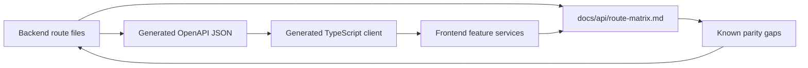

# API Route Matrix

Status: active
Last audited: 2026-05-18

This matrix describes route ownership and auth boundaries. Backend route files
are authoritative. `front-end/generate/openapi.json` and
`front-end/src/features/device-farm/services/generated/DeviceFarmApi.ts` must be
checked for generated-client parity.

## Mount Rules

| Surface | Mount | Auth boundary | Source |
|---|---|---|---|
| Public/runtime | root and `/api` subpaths from public router | public or route-local guard | `device_farm/api/routes/public.py` |
| CRUD user API | `/api/*` | user/admin route dependencies | `device_farm/api/crud/router.py` |
| Device control | `/api/*` | `device_auth` from `make_device_auth_dependency` | `device_farm/api/routes/device_control/*` |
| Device media | `/stream/*`, `/screenshot*` style routes | `device_auth` | `device_farm/api/routes/device_media.py` |
| Extraction | `/api/devices/{serial}/extract/*` | `device_auth` | `device_farm/api/routes/extraction.py` |
| Dashboard web | root/dashboard | browser web context | `device_farm/api/routes/dashboard_page.py` |

## Diagrams

### API Surface Partition

```mermaid
flowchart TB
    Client[Client] --> Public[Public/runtime routes]
    Client --> UserAPI[/api CRUD user API]
    Client --> DeviceAPI[Device-auth runtime API]
    Client --> Dashboard[Dashboard web routes]

    Public --> PublicRouter[build_public_router]
    UserAPI --> APIRouter[api_router]
    DeviceAPI --> DeviceAuth[make_device_auth_dependency]
    DeviceAuth --> DeviceControl[device_control router]
    DeviceAuth --> Media[device_media router]
    DeviceAuth --> Extraction[extraction router]
    Dashboard --> DashboardRouter[build_dashboard_router]

    APIRouter --> DomainRoutes[auth/devices/campaigns/accounts/content/schedules/executions/...]
    DomainRoutes --> Models[(DB models)]
    DeviceControl --> Runtime[DeviceManager + TaskQueue]
    Media --> Runtime
    Extraction --> Runtime
```

### OpenAPI Parity Loop



## CRUD User API

| Module | Routes | Source | Client status |
|---|---|---|---|
| Auth | `/api/auth/register`, `/api/auth/login`, `/api/auth/refresh`, `/api/auth/me` | `device_farm/api/routes/auth.py` | generated/client expected |
| Users | `/api/users*` | `device_farm/api/routes/users.py` | generated/client expected |
| Organizations | `/api/organizations*` | `device_farm/api/routes/organizations.py` | verify parity |
| Devices | `/api/devices*`, pairing, tags, sessions, bootstrap/restart, **`GET /api/devices/fleet/stats`** | `device_farm/api/routes/devices.py` | mixed generated/proxy |
| Device groups | `/api/device-groups*` | `device_farm/api/routes/device_groups.py` | generated/client expected |
| Campaigns | `/api/campaigns*`, nested scenarios, runs, content stats | `device_farm/api/routes/campaigns.py` | generated/client expected |
| Scenario device config | `/api/campaigns/{campaign_id}/scenarios/{scenario_id}/devices/{device_id}/variables` | `device_farm/api/routes/campaigns.py` | generated/client expected |
| Scenario templates | `/api/scenario-templates*` | `device_farm/api/routes/scenario_templates.py` | generated/client expected |
| Executions | `/api/executions*`, DLQ, results, summary, artifacts | `device_farm/api/routes/executions.py` | generated/client expected |
| Schedules | `/api/schedules*`, toggle, run-now, runs | `device_farm/api/routes/schedules.py` | generated/client expected |
| Content | `/api/content*`, save, stats, stream export, collections | `device_farm/api/routes/content.py` | generated/client expected |
| Accounts | `/api/accounts*`, import, device account links | `device_farm/api/routes/accounts.py` | generated/client expected |
| Account groups | `/api/account-groups*` | `device_farm/api/routes/account_groups.py` | generated/client expected |
| Relay agents | `/api/relay-agents*` | `device_farm/api/routes/relay_agents.py` | verify parity |
| Notifications | `/api/notification-channels*`, `/api/notifications*` | `device_farm/api/routes/notifications.py` | verify parity |
| Analytics | `/api/analytics/activity` | `device_farm/api/routes/analytics.py` | verify parity |

## Device-Auth Runtime API

| Module | Routes | Source |
|---|---|---|
| Connection metadata | `/api/connect/info`, `/api/scenario/schema`, `/api/connect/register` | `device_farm/api/routes/device_control/connect.py` |
| Gestures | `/api/tap/{serial}`, `/api/swipe/{serial}`, `/api/key/{serial}`, `/api/launch_app/{serial}`, `/api/open_url/{serial}`, `/api/devices/{serial}/input_text`, `/api/devices/{serial}/long_tap`, `/api/devices/{serial}/scroll`, `/api/devices/{serial}/double_tap`, `/api/devices/{serial}/pinch`, `/api/devices/{serial}/drag`, `/api/devices/{serial}/clipboard` | `device_farm/api/routes/device_control/gestures.py` |
| UI hierarchy | `/api/devices/{serial}/hierarchy`, `/api/devices/{serial}/ui_elements`, `/api/tap_selector/{serial}`, `/api/devices/{serial}/hit_test` | `device_farm/api/routes/device_control/device_ui.py` |
| Sessions | `/api/sessions/start`, `/api/sessions/end`, `/api/sessions/{session_id}`, `/api/devices/{serial}/reserve`, `/api/devices/{serial}/release` | `device_farm/api/routes/device_control/sessions.py` |
| Task queue | `/api/tasks/{task_id}`, `/api/agent/{serial}/shell`, `/api/task` | `device_farm/api/routes/device_control/tasks_queue.py` |
| Scenario preview/run | `/api/devices/{serial}/scenario/preview`, `/api/devices/{serial}/scenario/preview-stream`, `/api/devices/{serial}/scenario/run`, `/api/sessions/{session_id}/scenario/run` | `device_farm/api/routes/device_control/scenarios.py` |
| Campaign workflow control | `/api/campaigns/{campaign_id}/run`, `/api/execution/runtime`, `/api/campaigns/{campaign_id}/workflows`, `/api/devices/{serial}/running-workflows`, `/api/workflows/{workflow_id}/progress`, `/api/workflows/{workflow_id}/steps`, `/api/workflows/{workflow_id}/pause|resume|cancel` | `device_farm/api/routes/device_control/campaign_fleet.py` |
| Scrcpy | `/api/devices/{serial}/scrcpy/attach`, `/api/devices/{serial}/scrcpy/detach` | `device_farm/api/routes/device_control/scrcpy.py` |
| STF | `/api/stf/*` | `device_farm/api/routes/device_control/stf_control.py` |
| Media | `/stream/{serial}`, `/screenshot/{serial}`, `/screenshot-b64/{serial}` | `device_farm/api/routes/device_media.py` |
| Extraction | `/api/devices/{serial}/extract/hierarchy`, `/api/devices/{serial}/extract/ocr`, `/api/devices/{serial}/extract/ai` | `device_farm/api/routes/extraction.py` |

## Frontend API Surfaces

| Surface | Source | Notes |
|---|---|---|
| Generated backend client | `front-end/src/features/device-farm/services/generated/DeviceFarmApi.ts` | Derived from `front-end/generate/openapi.json` |
| Client bootstrap | `front-end/src/features/device-farm/services/client.ts`, `front-end/src/lib/farm-api.ts` | Handles base URL/auth injection |
| Next proxy adapters | `front-end/src/app/api/*` | May expose frontend-local route shapes not present in backend OpenAPI |

## Known Parity Gaps To Verify

- Notifications route group.
- Relay agents route group.
- Analytics activity route.
- Organization route coverage in generated OpenAPI.
