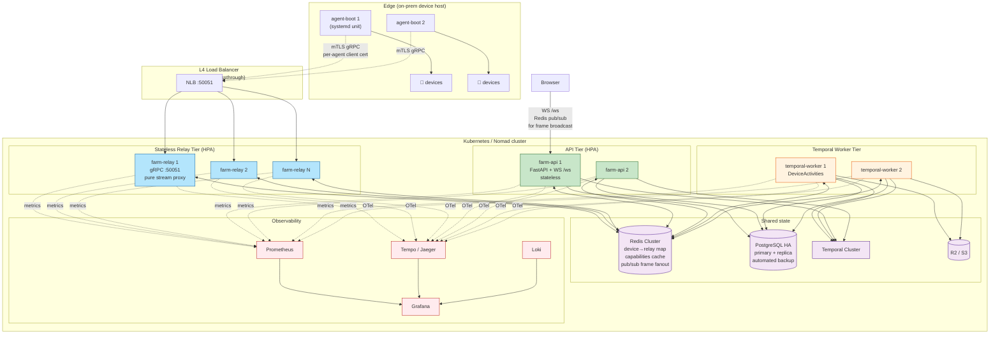

# Architecture Review — Android Device Farm

> Review độc lập từ 2 góc nhìn song song: **microservices-architect** (soundness & scalability) và **sre-engineer** (reliability & operability). Review được thực hiện bằng cách đọc `docs/architecture.md` và spot-check source code thực tế.

---

## Đính chính tài liệu

`docs/architecture.md` mục 3 ghi "Frontend service in compose is commented out" — điều này **SAI**. Đọc `docker-compose.yml:136-148` xác nhận `frontend` service vẫn active. Chỉ MinIO (profile `minio`, lines 151-186) mới bị comment. Câu này drift từ `CLAUDE.md` và cần sửa.

---

## Verdict tổng hợp

**Maturity level: ~3/5 — pragmatic early-stage, staging-ready, CHƯA production-ready.**

Kiến trúc thể hiện tay nghề khá cao ở lớp transport (gRPC bidi multiplex, outbound relay HTTP/2, ElementResolver 4-phase, self-healing selector) và có nhiều quyết định design đúng đắn (graceful degradation khi DB/Temporal tắt, device FSM rõ ràng, USB-preferred-over-WiFi). Tuy nhiên có những lỗ hổng nghiêm trọng khiến **không thể HA multi-instance** và **on-call sẽ mù quáng khi có sự cố**: không có metric Prometheus nào, không có structured logging, không có distributed tracing, Postgres backup chỉ là Docker volume local.

Nhiều singleton in-memory không thể scale ngang. Farm process là "god process" vi phạm Single Responsibility ở level architecture. MTTR ước tính >60 phút cho hầu hết các incident nghiêm trọng.

---

## Strengths

1. **Outbound relay qua HTTP/2 là đúng đắn.** Đặt ADB client-side trên server Docker là một cái bẫy phổ biến (ADB server single-socket, khó scale, NAT-hostile). Bằng cách đảo ngược hướng kết nối, farm server không cần nhìn thấy device network, agent-boot có thể nằm sau NAT, và 1 HTTP/2 stream multiplex N thiết bị tận dụng per-stream flow control — tránh head-of-line blocking mà WebSocket FIFO hay mắc.

2. **Tách biệt rõ 3 mặt phẳng:** UI (Next.js), Control (FastAPI), Data (agent-boot). Mỗi cái có thể deploy/scale độc lập (về lý thuyết), và data plane nằm ở edge — đúng pattern cloud-native.

3. **Graceful degradation tốt:** DB optional (public routes vẫn chạy), Temporal optional (Dispatcher + SchedulerEngine fallback), gRPC optional (WS `/relay-agent` fallback). Hiếm thấy ở codebase early-stage.

4. **ElementResolver 4-phase (selector → visual SSIM → heal → ratio)** là design chín chắn, thể hiện domain understanding sâu sau nhiều vòng vấp.

5. **FSM device state ở agent-boot rõ ràng** (UNKNOWN → CONNECTING → ONLINE ↔ BUSY → RECONNECTING → DEAD) với exponential backoff và USB-preferred-over-WiFi — đã nghĩ tới các failure modes thực tế.

---

## Critical concerns

### C1 — `AdbRelayManager` singleton in-memory → không thể HA

`get_relay_manager()` + `RelayConnection` lưu trong process memory. Không có Redis/DB backing state. Một agent-boot chỉ connect được tới đúng 1 farm pod.

**Hậu quả:** Không HA active-active, không rolling deploy mà không drop toàn bộ device streams, không load-balance agent-boot. Farm container restart → mọi scenario đang chạy qua in-process Dispatcher mất sạch state.

**Tác động thực tế:** Một bug Python crash, một `docker compose restart farm`, hoặc OOM kill = toàn bộ campaign in-flight fail, phải rerun từ đầu. Không có SLA khả thi > 99%.

### C2 — gRPC relay insecure + shared static API key

`grpc_relay_server.py:257` dùng `add_insecure_port` (không TLS). `RELAY_API_KEY` là một static secret shared cho mọi agent-boot. Không có mTLS, không rotation, không per-agent identity thực sự (chỉ có `x-agent-id` từ client self-report).

**Hậu quả:** Nếu port 50051 bị expose ra internet (rất thực tế khi agent-boot ở office và farm ở cloud), bất kỳ ai có key leak đều có thể: (a) inject fake devices, (b) nhận control commands đang routed tới device thật, (c) MITM scrcpy stream (có thể chứa thông tin nhạy cảm QA đang test).

**Tác động:** Compliance fail (GDPR/SOC2), data exfiltration vector, key leak không rotate được ngoài đồng loạt restart mọi agent-boot.

### C3 — TaskQueue hoàn toàn in-memory, non-Temporal path không persist

`TaskQueue` là min-heap trong RAM. Khi Temporal disabled, Dispatcher là đường duy nhất và nó sẽ mất toàn bộ pending/running task khi farm restart. `CampaignRun` có trong Postgres nhưng execution state của Dispatcher path thì không.

**Hậu quả:** Không có at-least-once guarantee cho non-Temporal path. User click "Run campaign 500 devices", farm crash giữa chừng, database nói "running", thực tế không có gì chạy. Orphaned "RUNNING" records không ai reconcile.

### C4 — Postgres backup = Docker local volume

`pgdata` trong `docker-compose.yml` là Docker named volume — lưu trên host machine cùng container. Không có backup cron, không có WAL archiving, không có pg_dump tự động. `campaign_runs`, `executions`, `content_items`, `device_events` sẽ mất vĩnh viễn nếu host chết hoặc `docker volume prune` được chạy nhầm.

**Tác động:** Catastrophic data loss. RTO hiện tại là "mất hết, restore từ đầu".

---

## High concerns

### H1 — Farm backend là "god process"

Đồng thời là: FastAPI server, asyncio event loop, threaded Dispatcher + Watchdog + EventRecorder, Temporal worker threads, gRPC relay aio server (`:50051`), và spawn agent-boot subprocess (`main.py:89`). Thêm WebSocket `/ws` broadcast, auto-attach scrcpy ThreadPoolExecutor trên background thread. **Cái gì chết thì cả hệ thống chết.** Một bug trong Temporal activity → OOM → mất WS stream của tất cả devices. SRP bị vi phạm ở level architecture.

### H2 — Dispatcher threading model có trần thấp và nhiều giới hạn ẩn

- `_MAX_DISPATCH_WORKERS = 64` ở module level, không tunable qua env.
- Mỗi task chạy trong 1 `threading.Thread` daemon riêng, còn lồng thêm 1 worker thread nữa cho timeout → **2 threads per running task**. Với Python GIL, 200 task đồng thời = 400+ threads, context switching đập chết throughput.
- Timeout thực tế không hủy được task (comment trong code thừa nhận: *"we can't truly kill the thread in Python"*) — task "bị timeout" vẫn chiếm device slot cho tới khi tự chết.
- **Tác động:** Trần thực tế ~50-100 concurrent task trước khi bottleneck. Claim "scale 1000 devices" không khả thi qua đường này.

### H3 — Single agent-boot = SPOF cho toàn bộ fleet trên host đó

- 1 HTTP/2 stream multiplex hết. agent-boot process die → tất cả N devices cùng offline. Không leader election, không hot standby.
- `fail_all pending futures` khi stream EOF: mọi command đang in-flight của mọi device đều fail đồng loạt — một task đang ở step 47/50 cũng chết. Temporal activity retry sẽ start lại scenario từ đầu (activity idempotency chưa đảm bảo).
- WiFi flap 2-5s thông thường có thể trigger mass failure.
- **Tác động:** MTTR của 1 agent-boot crash = duration của longest in-flight scenario.

### H4 — Zero observability

Không có Prometheus `/metrics`, không structured logging (chỉ plain text `%(asctime)s [%(levelname)s]`), không distributed tracing. `asyncio.run_coroutine_threadsafe` được gọi hàng chục chỗ trong `device_client.py` nhưng không có timeout tracking hay failure counter. `/api/health` chỉ trả `{"status":"ok"}` — không verify DB connectivity thực sự (không có query), không check Temporal connection, không check relay agent count.

**Hậu quả:** Khi scenario fail rate tăng đột biến 3AM, operator không biết: AI API timeout, DB pool exhausted, relay stream drop, hay device disconnect. Debug là `grep` thủ công trên log text.

### H5 — Migration race condition ở multi-replica startup

`init_db()` trong FastAPI lifespan gọi `Base.metadata.create_all()` rồi `run_migrations()` — không có advisory lock hay migration version table. Migrations dùng `IF NOT EXISTS` nên idempotent về DDL, nhưng nếu 2 replica start đồng thời, cả hai đều chạy `run_migrations()` cùng lúc. Một số migration multi-statement, Postgres không atomic-ize → nguy cơ partial execution overlap, DB corruption, hoặc deadlock.

### H6 — `device_control` routes không auth khi DB tắt

`device_control` mounted always-on, auth chỉ được áp nếu CRUD routers được mount. Ở "public mode" (no DB), **bất kỳ ai truy cập được `:8081` đều có thể tap/swipe/screenshot bất kỳ device nào**. Config local dev OK, nhưng rất dễ vô tình chạy production với `database.enabled=false`.

### H7 — Race condition trên `data/device_index.json`

Nếu có 2 farm process (hoặc uvicorn reload subprocess), cả 2 cùng write cùng file → corrupted JSON, mất device mapping. Không thấy file lock hay atomic write trong flow.

### H8 — Scrcpy frame dispatch silent drop

`asyncio.Queue(maxsize=256)` cho WS frame fanout. Khi browser WS chậm, queue đầy → frames bị drop silently (`put_nowait` có pass trong except block). Không có backpressure về agent-boot, không metric để biết đang drop bao nhiêu. User thấy "video lag" không có cách debug.

---

## Medium concerns

- **M1** — Temporal activity retry coupling với device state. Agent-boot disconnect giữa scenario → Temporal retry activity nhưng `DeviceManager.state=BUSY` có thể đã bị reset về READY bởi watchdog → race giữa retry và dispatch task mới. Thiếu advisory locking per-device ở Temporal path.

- **M2** — EventRecorder fire-and-forget unbounded. `asyncio.run_coroutine_threadsafe(self._write_db(entry), self._loop)` không có backpressure. DB chậm 30s → hàng trăm pending coroutines, task leak.

- **M3** — JWT dual storage (cookie + localStorage) trong frontend. Nếu lấy từ localStorage → XSS exfil; nếu chỉ httpOnly cookie thì không cần localStorage. Dual storage thường thể hiện confusion về security model.

- **M4** — `scenario_task.py` **3005 LOC**. Monolith trong monolith. Review không nổi, test coverage khó, merge conflict thường xuyên. Code smell mạnh cho missing module extraction.

- **M5** — `adb_relay_server.py` **1093 LOC** — `RelayConnection + AdbRelayManager + WsRelayAgentSession + dispatch logic + capabilities cache` tất cả cùng file.

- **M6** — Custom DB migrations (001-009 IF NOT EXISTS) thay vì Alembic. Idempotent SQL tốt, nhưng không có rollback, version table tracking, DAG dependencies. Scale lên 30+ migrations sẽ rất đau.

- **M7** — Frontend `control-record-view.tsx` **1070 LOC** — fat component trộn business logic + state + rendering.

- **M8** — `web/server.py:213-226`: mỗi lần relay device online tạo `ThreadPoolExecutor(max_workers=1)` mới và không track → leak executor objects.

- **M9** — `runtime/core/dispatcher.py:131-136`: timeout implement bằng `worker.join(timeout=task.timeout)` nhưng worker thread không bị kill, chỉ bị bỏ qua. Thread vẫn chạy background, chiếm device resource.

- **M10** — `agent-boot/relay/device_state.py:18`: `_MAX_RETRIES=5` hardcoded. Với exponential backoff, DEAD state có thể đạt trong ~31 giây — quá nhanh cho WiFi instability thông thường (AP switch). Không expose ra config.

---

## Low concerns

- **L1** — `uv run export-openapi → copy json → pnpm gen:api` là 3-step manual flow dễ drift. Cần `make regen` top-level.
- **L2** — `proto/generate.sh` phải manual copy stubs sang `agent-boot/` → version mismatch rất dễ xảy ra.
- **L3** — Zustand được install trong frontend mà không dùng. Dead dependency, confusion cho người mới.
- **L4** — `main.py` có dead code `_run_agent_boot` bị comment nhưng vẫn giữ.
- **L5** — Không có rate limit trung ương cho REST API. `max_tasks_per_minute` chỉ ở dispatcher level per device.
- **L6** — Không có circuit breaker cho OpenAI/Gemini. API down → retry tới timeout, làm chậm campaign + burns budget.
- **L7** — Không có distributed tracing. Farm → Temporal → Activity → Relay → agent-boot → device là 5-hop chain, debug "tại sao step này 30s" không trace được.
- **L8** — Testing story gần như vô hình. Có pytest, nhưng không có integration test cho relay handshake, không e2e cho campaign flow, không chaos test cho reconnect.
- **L9** — `LoggingConfig` format plain text không có request ID, trace ID, device serial trong log context. Correlation thủ công bằng grep.
- **L10** — `grpc_relay_server.py:62` `ctrl_q: asyncio.Queue(maxsize=256)` có bound (tốt) nhưng `put()` sẽ block writer task khi đầy. Không timeout, không metric utilization.

---

## Failure Mode Analysis

| Component | Failure Mode | Detection hiện tại | Blast Radius | Recovery |
|---|---|---|---|---|
| **Farm container** | OOM / crash / deploy | Docker `restart: unless-stopped` | TaskQueue mất, in-flight non-Temporal tasks fail | Auto-restart ~30s; Temporal workflows tự resume |
| **agent-boot** | Process exit, WiFi drop, NAT timeout | Heartbeat 30s, Watchdog frame staleness 30s | Tất cả devices trên agent offline; `fail_all` pending ngay | Exp backoff 0.5s→60s; không circuit breaker |
| **Postgres** | Container crash, disk full, OOM | `pool_pre_ping=True` → connection error | CRUD routes 500; EventRecorder skip silent; migrations fail startup | Docker restart |
| **Temporal** | Container crash, gRPC disconnect | `log.warning` tại startup | Campaign execution unavailable; SchedulerEngine fallback | Workflows durable, resume khi server up |
| **R2/MinIO** | API timeout, auth, network | `except Exception` → log warning | Screenshot upload fail silently | Scenario tiếp tục không có screenshots |
| **OpenAI/Gemini** | Rate limit, outage, key expired | Activity exception → Temporal retry | Extraction fail → retry loop đốt budget | Exponential backoff; workflow fail nếu hết retry |
| **Migration race** | 2 replicas start đồng thời | Không có | Partial migration, DB inconsistency | Manual rollback |
| **gRPC stream EOF** | Network partition, NAT timeout | `fail_all` immediate | Tất cả scenarios trên agent fail cùng lúc | Agent reconnect backoff; manual restart scenarios |
| **Watchdog DEAD** | 120s không recover sau `_bad_since` | Log error | Device không dispatch được nữa | Manual — device phải disconnect + reconnect |
| **WS write queue full** | `asyncio.Queue(maxsize=512)` | `put()` block → latency spike | Commands delay; scrcpy control lag | Backpressure tự nhiên, không metric |

---

## Recommended Improvements (theo priority)

### P0 — Phải làm trước khi đưa ra production

| # | Effort | Task |
|---|---|---|
| 1 | **M** (0.5-1d) | Bật TLS cho gRPC relay (`add_secure_port` với server cert). Không negotiable nếu expose ra ngoài localhost |
| 2 | **M** (2-3d) | Per-agent API key + DB-backed revocation list, thay shared static key |
| 3 | **S** (0.5d) | Require auth ở `device_control` ngay cả khi DB disabled (fallback config-file shared secret) |
| 4 | **M** (3-5d) hoặc **S** (docs) | Persist TaskQueue vào Postgres, hoặc mandate "Temporal is required for production" |
| 5 | **M** (1d) | Tách agent-boot auto-spawn khỏi farm process → systemd/sidecar riêng |
| 6 | **S** (2h) | `pg_try_advisory_lock` quanh `run_migrations()` để ngăn race |
| 7 | **S** (1h) | `pg_dump | gzip → R2` cron hàng đêm |

### P1 — Nên làm trong quarter tới

| # | Effort | Task |
|---|---|---|
| 8 | **L** (1-2w) | Tách gRPC relay ra process riêng (`device_farm_relay`) + Redis pub/sub cho shared state. Biggest bang-for-buck — giải C1 + H1 cùng lúc |
| 9 | **M** (2-3d) | Thay custom migrations bằng Alembic |
| 10 | **M** (3-5d) | Thêm OpenTelemetry cho FastAPI + Temporal activity + gRPC relay. Jaeger/Tempo backend |
| 11 | **M** (2-3d) | Prometheus `/metrics`: devices_online, relay_connections, task_queue_depth, dispatch_latency_p99, frame_drop_rate, temporal_workflow_duration |
| 12 | **S** (0.5d) | Circuit breaker cho AI calls (pybreaker / tenacity fail-fast) |
| 13 | **L** (1w) | Refactor `scenario_task.py` thành `step_executor/extraction/retry/screenshot_pipeline` — high risk, cần test coverage trước |
| 14 | **M** (2d) | Circuit breaker cho relay disconnect: hold `fail_all` 10-15s chờ reconnect |

### P2 — Nice to have

- Unified `make regen` build script cho openapi + proto (2h)
- E2E test harness với fake agent-boot + headless scenarios (1w)
- Xóa Zustand hoặc commit vào dùng nó (1h)
- Sticky session cho `/ws` dashboard khi có multi-pod, hoặc Redis pub/sub broadcast
- Shared `ThreadPoolExecutor` ở `app.state` (2h)
- Runbook docs ở `docs/runbooks/` cho các alert
- Proto versioning strategy với negotiation giữa agent-boot và farm

---

## Quick Wins (≤1 ngày mỗi cái)

1. **Prometheus metrics** — `pip install prometheus-fastapi-instrumentator` + 20 dòng trong `web/server.py`. Ngay lập tức có HTTP golden signals (p50/p95/p99 latency, error rate). **2h**.

2. **Fix `/api/health`** — Tách `/live` vs `/ready`. `/ready` phải `SELECT 1` DB + check relay count + check Temporal connected. **1-2h**.

3. **Structured JSON logging** — Custom `JsonFormatter`, thay format trong `LoggingConfig`. Không cần thư viện mới. **2-3h**.

4. **pg_dump cron → R2** — Script shell 10 dòng + cron. Dùng R2 credentials đã có sẵn. **1h**.

5. **Agent-boot health file** — `touch /tmp/agent-boot-healthy` trong heartbeat loop + Docker HEALTHCHECK `stat /tmp/agent-boot-healthy`. **30min**.

6. **`_MAX_DISCONNECTED_SECS` expose config** — Hiện hardcode 120s, expose ra `config.yaml` để tune WiFi vs USB. **30min**.

7. **Log Temporal activity với correlation ID** — Add `workflow_id` + `run_id` vào mọi log line trong `temporal/activities.py`. **1h**.

8. **Advisory lock migration** — Wrap `run_migrations()` bằng `pg_try_advisory_lock(1234567)` / release. **30min**.

9. **Shared ThreadPoolExecutor** — Tạo ở `app.state.scrcpy_executor`, dùng thay cho inline executor trong `_on_relay_device_online`. **1h**.

10. **Circuit breaker AI** — `pybreaker` wrap `AIVisionExtractor.extract_openai/extract_gemini`. **2h**.

---

## Strategic Investments (>1 tuần)

1. **OpenTelemetry end-to-end tracing** — Trace propagation HTTP request → Temporal workflow context → activity → device command → ADB response. **ROI cao nhất cho MTTR**. Ước tính 2-3 tuần kỹ càng.

2. **Tách farm-relay thành process riêng** + Redis cho device→relay routing + frame pub/sub → enable HA + giải quyết god-process. **1-2 tuần**.

3. **Refactor `scenario_task.py`** thành sub-modules. **1 tuần**, cần test coverage trước.

4. **Chaos test suite** mô phỏng network partition, agent crash mid-scenario, PG slow query, Temporal worker OOM. Mở rộng `tests/test_agent_reconnect.py`.

5. **K8s production deployment** với PDB, HPA, managed Postgres (RDS/Cloud SQL) với automated backup + read replica, Deployment `minReadySeconds`, readiness probe.

6. **Runbook + on-call docs** cho "devices offline", "scenario success rate drop", "farm OOM", "migration failed". Link từ Alertmanager alerts.

7. **Proto versioning strategy** — version field trong `AgentMsg`/`ControlMsg`, farm support v1+v2 song song, agent-boot negotiate version. Hiện rolling update với proto change là hard break.

---

## Recommended SLIs/SLOs

| SLI | Định nghĩa | SLO Target | Measurement Window |
|---|---|---|---|
| **API Availability** | Rate of non-5xx trên `/api/*` (trừ /health) | 99.5% | 30-day rolling |
| **Device Connection Uptime** | Có ít nhất 1 relay agent connected | 99% | 7-day rolling |
| **Scenario Success Rate** | `successful / attempted` (exclude user-cancelled) | 95% | 7-day rolling |
| **Frame Delivery Latency p95** | Device frame capture → browser WS delivery | <200ms | 1-hour |
| **Scenario Start Latency p95** | `POST /campaigns/{id}/run` → first activity start | <5s | 1-hour |
| **DB Query Latency p99** | SQLAlchemy query latency | <500ms | 1-hour |

**Error Budget Policy:**
- Scenario Success Rate <95% trong 1h → page on-call
- Scenario Success Rate <90% trong 30min → incident, feature freeze
- Scenario Success Rate <80% trong 15min → war room, rollback

---

## Refactor Target Architecture

**Key moves:**
- Tách `farm-relay` (stateless gRPC proxy) khỏi `farm-api` và `temporal-worker` → **3 deployment độc lập, HPA riêng**.
- **Redis** làm shared state cho device→relay routing, capabilities cache, và pub/sub cho frame fanout tới WS `/ws` clients → giải C1 (HA).
- **mTLS passthrough** qua L4 LB tới relay tier, per-agent client cert → giải C2 (security).
- **Temporal bắt buộc** cho production path. Dispatcher thread-pool chỉ còn cho dev mode → giải C3 (task persistence).
- **Managed Postgres** với replica + automated backup → giải C4 (data loss).
- **OpenTelemetry stack** (Tempo + Loki + Prometheus + Grafana) end-to-end → giải H4 (observability).

---

## Migration Path (từ hiện tại → target)

```mermaid
graph LR
    subgraph Phase0["Phase 0 — Current"]
        P0["1 farm container<br/>god process<br/>in-mem singleton<br/>no metrics"]
    end

    subgraph Phase1["Phase 1 — Quick wins (1-2 weeks)"]
        P1A["Prometheus /metrics"]
        P1B["/health split"]
        P1C["JSON logs"]
        P1D["pg_dump cron"]
        P1E["gRPC TLS"]
        P1F["Advisory lock migration"]
        P1G["Circuit breaker AI"]
    end

    subgraph Phase2["Phase 2 — Durability (1 month)"]
        P2A["Alembic migrations"]
        P2B["Per-agent API keys + revocation"]
        P2C["Require Temporal in prod"]
        P2D["OpenTelemetry tracing"]
        P2E["Relay disconnect circuit breaker"]
    end

    subgraph Phase3["Phase 3 — HA refactor (1 quarter)"]
        P3A["Tách farm-relay process riêng"]
        P3B["Redis shared state"]
        P3C["Managed PG + replica"]
        P3D["K8s deployment"]
        P3E["Refactor scenario_task.py"]
    end

    subgraph Phase4["Phase 4 — Production hardening"]
        P4A["Chaos suite"]
        P4B["Runbooks + alerts"]
        P4C["E2E tests"]
        P4D["Proto versioning"]
        P4E["SLO/error budget enforcement"]
    end

    P0 --> Phase1
    Phase1 --> Phase2
    Phase2 --> Phase3
    Phase3 --> Phase4

    classDef now fill:#ffcdd2,stroke:#b71c1c
    classDef qw fill:#fff9c4,stroke:#f57f17
    classDef dur fill:#c8e6c9,stroke:#1b5e20
    classDef ha fill:#b3e5fc,stroke:#01579b
    classDef hard fill:#e1bee7,stroke:#4a148c
    class P0 now
    class P1A,P1B,P1C,P1D,P1E,P1F,P1G qw
    class P2A,P2B,P2C,P2D,P2E dur
    class P3A,P3B,P3C,P3D,P3E ha
    class P4A,P4B,P4C,P4D,P4E hard
```

---

## Code-level Findings (từ spot-check)

| File:Line | Issue |
|---|---|
| `device_farm/main.py:89` | `subprocess.Popen(agent-boot)` từ farm process — nên tách thành systemd/sidecar |
| `device_farm/web/server.py:213-226` | Tạo `ThreadPoolExecutor(max_workers=1)` mới mỗi lần relay device online → executor leak |
| `device_farm/runtime/core/dispatcher.py:131-136` | `worker.join(timeout)` không kill được thread, zombie threads chiếm device slot |
| `device_farm/runtime/core/event_recorder.py:75` | `asyncio.run_coroutine_threadsafe` fire-and-forget unbounded → task leak khi DB chậm |
| `device_farm/runtime/transports/grpc_relay_server.py:62` | `ctrl_q = asyncio.Queue(maxsize=256)` có bound nhưng `put()` block không timeout, không metric |
| `device_farm/runtime/transports/grpc_relay_server.py:257` | `add_insecure_port` — không TLS |
| `device_farm/runtime/transports/adb_relay_server.py:82-1081` | File 1081 LOC monolith: RelayConnection + Manager + WsSession cùng chỗ |
| `device_farm/tasks/scenario_task.py:971-2991` | File 3005 LOC — cần tách |
| `device_farm/db/database.py:48` | `DATABASE_URL` evaluate tại module import time |
| `device_farm/core/config.py LoggingConfig` | Plain text format, không request ID / trace ID / device serial |
| `agent-boot/relay/device_state.py:18` | `_MAX_RETRIES=5` hardcoded — 31s là quá nhanh cho WiFi flap |
| `agent-boot/main.py` | `.relay_id` file sinh ngẫu nhiên — mất file → server nhận device cũ là device mới |
| `front-end/src/features/devices/control-record-view.tsx` | 1070 LOC fat component |
| `docker-compose.yml` pgdata | Local Docker volume, không backup |
| `docker-compose.yml` | Chỉ healthcheck basic, không phân biệt liveness/readiness |

---

## References

Files đã review:
- `/Users/dnntung/Projects/device-farm/docs/architecture.md`
- `/Users/dnntung/Projects/device-farm/device_farm/docs/architecture.md`
- `/Users/dnntung/Projects/device-farm/CLAUDE.md`
- `/Users/dnntung/Projects/device-farm/docker-compose.yml`
- `/Users/dnntung/Projects/device-farm/device_farm/main.py`
- `/Users/dnntung/Projects/device-farm/device_farm/web/server.py`
- `/Users/dnntung/Projects/device-farm/device_farm/runtime/core/dispatcher.py`
- `/Users/dnntung/Projects/device-farm/device_farm/runtime/core/watchdog.py`
- `/Users/dnntung/Projects/device-farm/device_farm/runtime/core/event_recorder.py`
- `/Users/dnntung/Projects/device-farm/device_farm/runtime/transports/adb_relay_server.py`
- `/Users/dnntung/Projects/device-farm/device_farm/runtime/transports/grpc_relay_server.py`
- `/Users/dnntung/Projects/device-farm/agent-boot/main.py`
- `/Users/dnntung/Projects/device-farm/agent-boot/relay/agent.py`
- `/Users/dnntung/Projects/device-farm/agent-boot/relay/grpc_client.py`
- `/Users/dnntung/Projects/device-farm/agent-boot/relay/device_state.py`

**Review methodology:** Parallel dual-angle review bằng 2 subagent chuyên biệt — microservices-architect (kiến trúc + scalability + coupling) và sre-engineer (reliability + observability + failure modes). Synthesis + đối chiếu source code.
