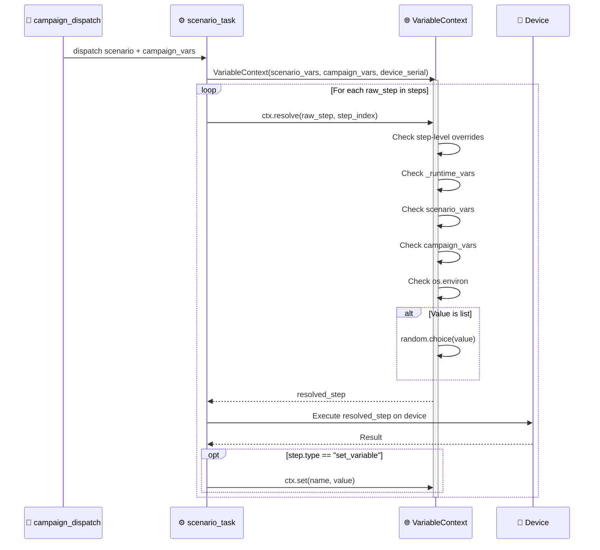
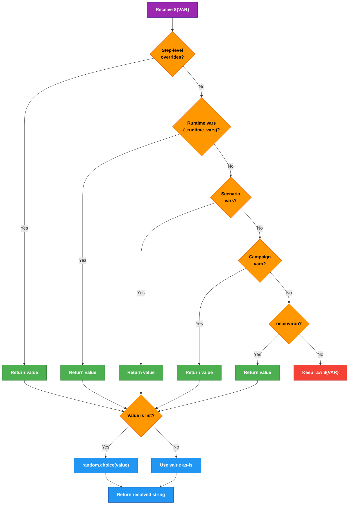

# DF-001: Variable System & Parameterization

- **Priority:** P0 (Must Have)
- **Effort:** M (1-2 tuan)
- **Phase:** 1 — Foundation
- **Dependencies:** None
- **Assignee:** —
- **Status:** Backlog

---

## 1. Muc tieu

Cho phep scenario su dung bien (`${VAR}`) de parameterize steps. Cung mot scenario co the chay voi du lieu khac nhau tren moi device (tai khoan, noi dung, URL...).

**Hien tai:** Scenario steps la static JSON — moi device chay y het nhau.
**Sau khi xong:** Steps ho tro `${VAR}` interpolation, variables tu nhieu nguon.

---

## 2. User Stories

**US-001.1:** Nguoi dung muon chay cung scenario voi tai khoan khac nhau tren moi device.
```
Cho scenario co step: { "type": "input_selector", "text": "${USERNAME}" }
Khi chay tren device A voi variables: { "USERNAME": "user_a@gmail.com" }
Thi truong text duoc thay the thanh "user_a@gmail.com"
```

**US-001.2:** Nguoi dung muon pick ngau nhien 1 gia tri tu danh sach.
```
Cho variable: { "COMMENT": ["Hay qua!", "Tuyet voi", "Like"] }
Khi step su dung ${COMMENT}
Thi he thong chon ngau nhien 1 gia tri tu list
```

**US-001.3:** Nguoi dung muon dung gia tri tu buoc truoc (extraction result) lam input buoc sau.

---

## 3. Thiet ke ky thuat

### 3.1 Variable Resolution Order

```
1. Step-level overrides (highest priority)
2. Runtime variables (set_variable step, extraction results)
3. Scenario-level variables (defineVariables trong scenario JSON)
4. Campaign-level variables
5. Environment variables (os.environ)
6. Default values (khai bao khi define)
```

### 3.2 Scenario JSON Schema — Them truong `variables`

```json
{
  "instructions": "Login va like bai viet",
  "variables": {
    "USERNAME": "default@gmail.com",
    "PASSWORD": "default_pass",
    "COMMENTS": ["Hay qua!", "Tuyet voi", "Like nhe"],
    "LIKE_COUNT": 5
  },
  "steps": [
    { "type": "input_selector", "by": "resource-id", "value": "email_field", "text": "${USERNAME}" },
    { "type": "input_selector", "by": "resource-id", "value": "pass_field", "text": "${PASSWORD}" },
    { "type": "tap_selector", "by": "text", "value": "Login" }
  ]
}
```

### 3.3 New Step Type: `set_variable`

```json
{ "type": "set_variable", "name": "MY_VAR", "value": "hello" }
{ "type": "set_variable", "name": "RANDOM_COMMENT", "from_list": ["A", "B", "C"] }
{ "type": "set_variable", "name": "COUNTER", "increment": 1 }
{ "type": "set_variable", "name": "TIMESTAMP", "value": "${__NOW__}" }
```

### 3.4 Built-in Variables

| Variable | Mo ta |
|----------|-------|
| `${__NOW__}` | ISO timestamp hien tai |
| `${__DATE__}` | YYYY-MM-DD |
| `${__TIME__}` | HH:MM:SS |
| `${__DEVICE_SERIAL__}` | Serial cua device dang chay |
| `${__DEVICE_MODEL__}` | Model name |
| `${__RANDOM_INT_1_100__}` | So ngau nhien 1-100 |
| `${__RANDOM_UUID__}` | UUID v4 |
| `${__STEP_INDEX__}` | Index cua step hien tai |

### 3.5 Implementation — Backend

**File moi:** `device_farm/common/variable_resolver.py`

```python
import re
import os
import random
from datetime import datetime
from typing import Any, Dict, Optional

BUILTIN_PATTERN = re.compile(r"\$\{(__\w+__)\}")
VAR_PATTERN = re.compile(r"\$\{(\w+)\}")


class VariableContext:
    """Manages variable scopes for scenario execution."""

    def __init__(
        self,
        scenario_vars: Optional[Dict[str, Any]] = None,
        campaign_vars: Optional[Dict[str, Any]] = None,
        device_serial: str = "",
        device_model: str = "",
    ):
        self._scenario_vars = dict(scenario_vars or {})
        self._campaign_vars = dict(campaign_vars or {})
        self._runtime_vars: Dict[str, Any] = {}
        self._device_serial = device_serial
        self._device_model = device_model
        self._counter: Dict[str, int] = {}

    def set(self, name: str, value: Any) -> None:
        self._runtime_vars[name] = value

    def set_from_list(self, name: str, values: list) -> None:
        self._runtime_vars[name] = random.choice(values)

    def increment(self, name: str, step: int = 1) -> int:
        current = self._counter.get(name, 0)
        current += step
        self._counter[name] = current
        self._runtime_vars[name] = current
        return current

    def resolve(self, value: Any, step_index: int = 0) -> Any:
        if isinstance(value, str):
            return self._resolve_string(value, step_index)
        if isinstance(value, dict):
            return {k: self.resolve(v, step_index) for k, v in value.items()}
        if isinstance(value, list):
            return [self.resolve(item, step_index) for item in value]
        return value

    def _resolve_string(self, text: str, step_index: int) -> str:
        def _replacer(match: re.Match) -> str:
            var_name = match.group(1)
            val = self._get_value(var_name, step_index)
            if val is None:
                return match.group(0)  # giu nguyen neu khong resolve duoc
            if isinstance(val, list):
                return str(random.choice(val))
            return str(val)
        return VAR_PATTERN.sub(_replacer, text)

    def _get_value(self, name: str, step_index: int) -> Any:
        # Built-in variables
        builtins = {
            "__NOW__": datetime.now().isoformat(),
            "__DATE__": datetime.now().strftime("%Y-%m-%d"),
            "__TIME__": datetime.now().strftime("%H:%M:%S"),
            "__DEVICE_SERIAL__": self._device_serial,
            "__DEVICE_MODEL__": self._device_model,
            "__RANDOM_INT_1_100__": str(random.randint(1, 100)),
            "__RANDOM_UUID__": str(__import__("uuid").uuid4()),
            "__STEP_INDEX__": str(step_index),
        }
        if name in builtins:
            return builtins[name]

        # Resolution order: runtime > scenario > campaign > env
        if name in self._runtime_vars:
            return self._runtime_vars[name]
        if name in self._scenario_vars:
            return self._scenario_vars[name]
        if name in self._campaign_vars:
            return self._campaign_vars[name]
        env_val = os.environ.get(name)
        if env_val is not None:
            return env_val
        return None
```

**Sua file:** `device_farm/tasks/scenario_task.py`

Thay doi `run_scenario_task()`:

```python
# Truoc khi chay step loop:
from device_farm.common.variable_resolver import VariableContext

def run_scenario_task(device, scenario):
    ctx = VariableContext(
        scenario_vars=scenario.get("variables", {}),
        campaign_vars=scenario.get("_campaign_vars", {}),
        device_serial=device.serial,
        device_model=getattr(device, "model", ""),
    )

    for i, raw_step in enumerate(scenario.get("steps", [])):
        # Resolve variables trong step
        step = ctx.resolve(raw_step, step_index=i)

        # Xu ly set_variable step
        if step.get("type") == "set_variable":
            _handle_set_variable(ctx, step)
            continue

        # ... existing step execution logic ...
```

**Sua file:** `device_farm/common/scenario_schema.py`

Them vao `SCENARIO_STEP_TYPES`:
```python
"set_variable": {
    "required": ["name"],
    "optional": ["value", "from_list", "increment"],
    "description": "Set or update a runtime variable",
},
```

### 3.6 Implementation — Campaign Variables

**Sua file:** `device_farm/db/models/campaign.py`

Them truong vao Campaign model:
```python
variables = Column(JSON, default=dict)  # campaign-level variables
```

**Sua file:** `device_farm/services/campaign_dispatch.py`

Khi tao scenario cho moi device, inject `_campaign_vars`:
```python
scenario_data = {
    "steps": steps,
    "variables": scenario_vars,
    "_campaign_vars": campaign.variables or {},
}
```

### 3.7 Implementation — Frontend

**Sua file:** `front-end/src/features/campaigns/components/ScenarioDialog.tsx`

Them section "Variables" trong scenario editor:
- Key-value editor (name → value/list)
- Autocomplete `${` trong text fields
- Preview resolved values

**Component moi:** `front-end/src/features/campaigns/components/variable-editor.tsx`
- DataTable voi columns: Name, Type (string/list/number), Value
- Add/remove/edit rows
- Import tu JSON

---

## 4. Database Migration

```sql
-- Them truong variables vao campaigns
ALTER TABLE campaigns ADD COLUMN variables JSON DEFAULT '{}';

-- Them truong variables vao scenarios
ALTER TABLE scenarios ADD COLUMN variables JSON DEFAULT '{}';
```

---

## 5. API Changes

### Sua Schema

```python
# device_farm/api/schemas/campaign.py

class CampaignCreate(BaseModel):
    name: str
    description: str = ""
    scenario: dict = {}
    device_ids: list[str] = []
    variables: dict = {}  # NEW

class ScenarioCreate(BaseModel):
    name: str = "Scenario"
    instructions: str = ""
    steps: list = []
    order: int = 0
    variables: dict = {}  # NEW

class ScenarioUpdate(BaseModel):
    name: str | None = None
    instructions: str | None = None
    steps: list | None = None
    order: int | None = None
    variables: dict | None = None  # NEW
```

---

## Diagrams & Mockups

### 1. Sequence Diagram: Variable Resolution During Step Execution



### 2. Flowchart: Variable Resolution Priority Chain



### 3. ASCII Mockup: Variable Editor in ScenarioDialog

```
┌──────────────────────────────────────────────────────────────────────────┐
│  Variables                                         [+ Add] [Import JSON]│
├──────────────────────────────────────────────────────────────────────────┤
│                                                                          │
│  ┌──────────────┬──────────────┬──────────────────────────────┬────────┐ │
│  │ Name         │ Type         │ Value                        │        │ │
│  ├──────────────┼──────────────┼──────────────────────────────┼────────┤ │
│  │ ┌──────────┐ │ ┌──────────┐ │ ┌──────────────────────────┐ │        │ │
│  │ │ USERNAME │ │ │ string ▼ │ │ │ user@gmail.com           │ │   🗑   │ │
│  │ └──────────┘ │ └──────────┘ │ └──────────────────────────┘ │        │ │
│  ├──────────────┼──────────────┼──────────────────────────────┼────────┤ │
│  │ ┌──────────┐ │ ┌──────────┐ │ ┌────────────┬─────────────┐ │        │ │
│  │ │ COMMENTS │ │ │ list   ▼ │ │ │ Hay qua! ✕│ Nice!     ✕│ │   🗑   │ │
│  │ └──────────┘ │ └──────────┘ │ └────────────┴─────────────┘ │        │ │
│  ├──────────────┼──────────────┼──────────────────────────────┼────────┤ │
│  │ ┌──────────┐ │ ┌──────────┐ │ ┌──────────────────────────┐ │        │ │
│  │ │LIKE_COUNT│ │ │ number ▼ │ │ │ 5                        │ │   🗑   │ │
│  │ └──────────┘ │ └──────────┘ │ └──────────────────────────┘ │        │ │
│  └──────────────┴──────────────┴──────────────────────────────┴────────┘ │
│                                                                          │
└──────────────────────────────────────────────────────────────────────────┘
```

---

## 6. Test Plan

| Test Case | Input | Expected |
|-----------|-------|----------|
| Basic string interpolation | `"text": "${USERNAME}"`, vars: `{"USERNAME": "test"}` | `"text": "test"` |
| List random pick | `"text": "${COMMENT}"`, vars: `{"COMMENT": ["A","B"]}` | `"text"` la "A" hoac "B" |
| Nested dict resolution | `{"by": "${SEL_TYPE}", "value": "${SEL_VAL}"}` | Resolve ca 2 |
| Built-in `__NOW__` | `"text": "${__NOW__}"` | ISO timestamp |
| Undefined variable | `"text": "${UNDEFINED}"` | Giu nguyen `"${UNDEFINED}"` |
| set_variable step | `{"type":"set_variable","name":"X","value":"hello"}` | `${X}` = "hello" tu step sau |
| set_variable from_list | `{"type":"set_variable","name":"X","from_list":["a","b"]}` | `${X}` random "a" or "b" |
| increment | `{"type":"set_variable","name":"CNT","increment":1}` x3 | `${CNT}` = 3 |
| Env fallback | `"text": "${HOME}"` (no scenario var) | OS env HOME |
| Campaign vars | campaign.variables = `{"BRAND":"test"}` | `${BRAND}` = "test" |
| Priority: runtime > scenario | scenario var X="a", then set_variable X="b" | `${X}` = "b" |

### Unit Tests

**File:** `tests/test_variable_resolver.py`

```python
def test_basic_interpolation():
    ctx = VariableContext(scenario_vars={"NAME": "Alice"})
    assert ctx.resolve("Hello ${NAME}") == "Hello Alice"

def test_list_random():
    ctx = VariableContext(scenario_vars={"X": ["a", "b", "c"]})
    result = ctx.resolve("${X}")
    assert result in ["a", "b", "c"]

def test_nested_dict():
    ctx = VariableContext(scenario_vars={"A": "1", "B": "2"})
    result = ctx.resolve({"x": "${A}", "y": "${B}"})
    assert result == {"x": "1", "y": "2"}

def test_builtin_device_serial():
    ctx = VariableContext(device_serial="ABC123")
    assert ctx.resolve("${__DEVICE_SERIAL__}") == "ABC123"

def test_undefined_passthrough():
    ctx = VariableContext()
    assert ctx.resolve("${NOPE}") == "${NOPE}"

def test_set_and_resolve():
    ctx = VariableContext()
    ctx.set("FOO", "bar")
    assert ctx.resolve("${FOO}") == "bar"

def test_increment():
    ctx = VariableContext()
    ctx.increment("CNT")
    ctx.increment("CNT")
    assert ctx.resolve("${CNT}") == "2"
```

---

## 7. Acceptance Criteria

- [ ] `VariableContext` class hoat dong voi tat ca test cases
- [ ] `run_scenario_task()` resolve variables truoc khi execute moi step
- [ ] `set_variable` step type hoat dong (value, from_list, increment)
- [ ] Built-in variables (`__NOW__`, `__DEVICE_SERIAL__`, ...) resolve dung
- [ ] Campaign variables truyen xuong scenario khi dispatch
- [ ] Frontend: Variable editor trong ScenarioDialog
- [ ] Frontend: Autocomplete `${` khi nhap text fields
- [ ] Migration chay thanh cong (PostgreSQL)
- [ ] Unit tests pass

---

## 8. Files Changed

| File | Action | Mo ta |
|------|--------|-------|
| `device_farm/common/variable_resolver.py` | **NEW** | VariableContext class |
| `device_farm/common/scenario_schema.py` | EDIT | Them `set_variable` step type |
| `device_farm/tasks/scenario_task.py` | EDIT | Integrate VariableContext vao run loop |
| `device_farm/db/models/campaign.py` | EDIT | Them `variables` column |
| `device_farm/api/schemas/campaign.py` | EDIT | Them `variables` field |
| `device_farm/api/routes/campaigns.py` | EDIT | Truyen variables khi create/update |
| `device_farm/services/campaign_dispatch.py` | EDIT | Inject campaign vars |
| `front-end/src/features/campaigns/components/variable-editor.tsx` | **NEW** | Variable editor component |
| `front-end/src/features/campaigns/components/ScenarioDialog.tsx` | EDIT | Them variable section |
| `tests/test_variable_resolver.py` | **NEW** | Unit tests |
| `alembic/versions/xxx_add_variables.py` | **NEW** | DB migration |
