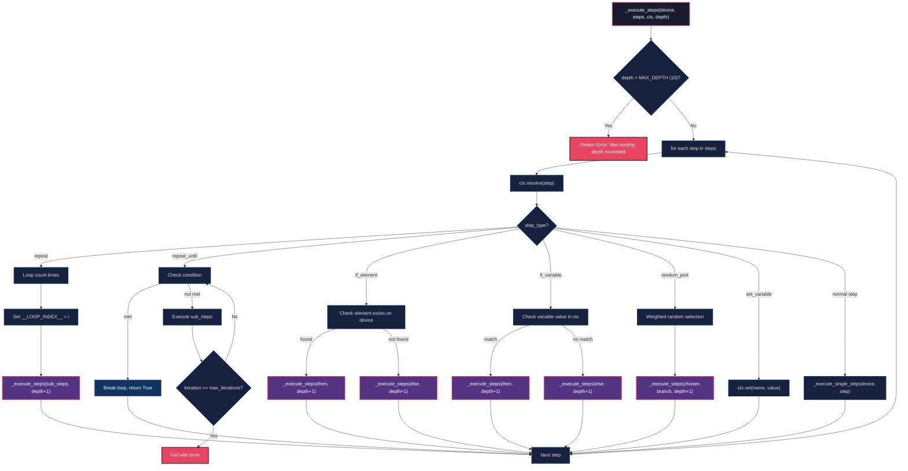
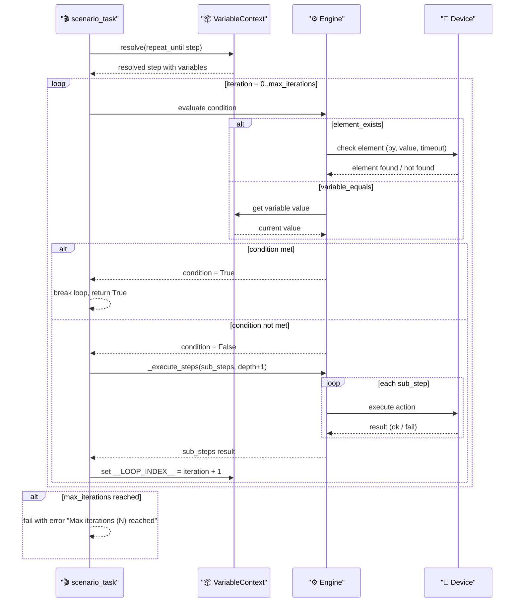

# DF-002: Conditional Logic & Loops

- **Priority:** P0 (Must Have)
- **Effort:** M (1-2 tuan)
- **Phase:** 1 — Foundation
- **Dependencies:** DF-001 (Variable System)
- **Assignee:** —
- **Status:** Backlog

---

## 1. Muc tieu

Them kha nang re nhanh (if/else) va lap (repeat/loop) vao scenario engine. Hien tai scenario chi la linear sequence — khong the bieu dien logic phuc tap nhu "neu thay popup thi dong, neu khong thi bo qua".

---

## 2. User Stories

**US-002.1:** Toi muon lap lai thao tac "scroll + like" 10 lan.
```yaml
{ "type": "repeat", "count": 10, "steps": [
    { "type": "scroll_down" },
    { "type": "tap_selector", "by": "content-desc", "value": "Like" }
]}
```

**US-002.2:** Toi muon kiem tra neu element ton tai thi thuc hien action, neu khong thi bo qua.
```yaml
{ "type": "if_element", "by": "text", "value": "Allow", "then": [
    { "type": "tap_selector", "by": "text", "value": "Allow" }
]}
```

**US-002.3:** Toi muon scroll cho den khi gap phan tu nao do (toi da 20 lan).

**US-002.4:** Toi muon chon ngau nhien 1 trong N nhom hanh dong de thuc hien.

---

## 3. Thiet ke ky thuat

### 3.1 New Step Types

#### `repeat` — Lap N lan

```json
{
  "type": "repeat",
  "count": 10,
  "delay_between": 1.5,
  "steps": [
    { "type": "scroll_down" },
    { "type": "tap_ratio", "x": 0.5, "y": 0.5 }
  ]
}
```

| Field | Type | Required | Default | Mo ta |
|-------|------|----------|---------|-------|
| `count` | int | Yes | — | So lan lap |
| `steps` | list | Yes | — | Danh sach steps con |
| `delay_between` | float | No | 0 | Delay giua moi lap (seconds) |

- Moi lan lap, `${__LOOP_INDEX__}` duoc set (0-based)
- Steps con duoc resolve variables moi lan lap

#### `repeat_until` — Lap cho den khi dieu kien thoa

```json
{
  "type": "repeat_until",
  "condition": { "element_exists": { "by": "text", "value": "End of feed" } },
  "max_iterations": 50,
  "steps": [
    { "type": "scroll_down" },
    { "type": "wait", "seconds": 1 }
  ]
}
```

| Field | Type | Required | Default | Mo ta |
|-------|------|----------|---------|-------|
| `condition` | object | Yes | — | Dieu kien dung |
| `max_iterations` | int | No | 100 | Gioi han an toan |
| `steps` | list | Yes | — | Steps thuc hien moi vong |

Condition types:
- `{ "element_exists": { "by": "text", "value": "..." } }` — dung khi element xuat hien
- `{ "element_not_exists": { "by": "text", "value": "..." } }` — dung khi element bien mat
- `{ "variable_equals": { "name": "X", "value": "done" } }` — dung khi variable co gia tri

#### `if_element` — Re nhanh theo element

```json
{
  "type": "if_element",
  "by": "text",
  "value": "Allow",
  "timeout": 3,
  "then": [
    { "type": "tap_selector", "by": "text", "value": "Allow" }
  ],
  "else": [
    { "type": "wait", "seconds": 1 }
  ]
}
```

| Field | Type | Required | Default | Mo ta |
|-------|------|----------|---------|-------|
| `by` | string | Yes | — | Selector type |
| `value` | string | Yes | — | Selector value |
| `timeout` | float | No | 3 | Thoi gian cho element |
| `then` | list | Yes | — | Steps khi element ton tai |
| `else` | list | No | [] | Steps khi element KHONG ton tai |

#### `if_variable` — Re nhanh theo variable value

```json
{
  "type": "if_variable",
  "name": "PLATFORM",
  "equals": "facebook",
  "then": [
    { "type": "launch_app", "package": "com.facebook.katana" }
  ],
  "else": [
    { "type": "launch_app", "package": "com.zhiliaoapp.musically" }
  ]
}
```

| Field | Type | Required | Default | Mo ta |
|-------|------|----------|---------|-------|
| `name` | string | Yes | — | Ten variable |
| `equals` | string | No | — | So sanh bang (1 trong cac dieu kien) |
| `not_equals` | string | No | — | So sanh khac |
| `contains` | string | No | — | Chua chuoi |
| `greater_than` | number | No | — | Lon hon |
| `then` | list | Yes | — | Steps khi dieu kien dung |
| `else` | list | No | [] | Steps khi dieu kien sai |

#### `random_pick` — Chon ngau nhien 1 nhanh

```json
{
  "type": "random_pick",
  "branches": [
    {
      "weight": 3,
      "steps": [{ "type": "scroll_down" }, { "type": "tap_selector", "by": "text", "value": "Like" }]
    },
    {
      "weight": 1,
      "steps": [{ "type": "scroll_down" }, { "type": "tap_selector", "by": "text", "value": "Comment" }]
    },
    {
      "weight": 1,
      "steps": [{ "type": "scroll_down" }]
    }
  ]
}
```

| Field | Type | Required | Default | Mo ta |
|-------|------|----------|---------|-------|
| `branches` | list | Yes | — | Danh sach cac nhanh |
| `branches[].weight` | int | No | 1 | Trong so (cao = xac suat cao) |
| `branches[].steps` | list | Yes | — | Steps cua nhanh |

### 3.2 Implementation — Scenario Engine

**Sua file:** `device_farm/tasks/scenario_task.py`

Refactor step execution thanh recursive function de ho tro nested steps:

```python
def _execute_steps(
    device: DeviceClient,
    steps: List[Dict],
    ctx: VariableContext,
    results: List[Dict],
    depth: int = 0,
) -> bool:
    """Execute list of steps. Returns False if any step fails fatally."""
    MAX_DEPTH = 10  # gioi han do sau de nesting

    if depth > MAX_DEPTH:
        results.append({"type": "error", "ok": False, "message": f"Max nesting depth {MAX_DEPTH} exceeded"})
        return False

    for i, raw_step in enumerate(steps):
        step = ctx.resolve(raw_step, step_index=i)
        step_type = step.get("type")

        if step_type == "repeat":
            ok = _handle_repeat(device, step, ctx, results, depth)
        elif step_type == "repeat_until":
            ok = _handle_repeat_until(device, step, ctx, results, depth)
        elif step_type == "if_element":
            ok = _handle_if_element(device, step, ctx, results, depth)
        elif step_type == "if_variable":
            ok = _handle_if_variable(device, step, ctx, results, depth)
        elif step_type == "random_pick":
            ok = _handle_random_pick(device, step, ctx, results, depth)
        elif step_type == "set_variable":
            ok = _handle_set_variable(ctx, step)
        else:
            ok = _execute_single_step(device, step, ctx, results)

        if not ok:
            return False

    return True


def _handle_repeat(device, step, ctx, results, depth):
    count = step.get("count", 1)
    delay = step.get("delay_between", 0)
    sub_steps = step.get("steps", [])

    for iteration in range(count):
        ctx.set("__LOOP_INDEX__", iteration)
        ok = _execute_steps(device, sub_steps, ctx, results, depth + 1)
        if not ok:
            return False
        if delay > 0 and iteration < count - 1:
            time.sleep(delay)
    return True


def _handle_repeat_until(device, step, ctx, results, depth):
    condition = step.get("condition", {})
    max_iter = step.get("max_iterations", 100)
    sub_steps = step.get("steps", [])

    for iteration in range(max_iter):
        ctx.set("__LOOP_INDEX__", iteration)
        if _evaluate_condition(device, condition, ctx):
            return True
        ok = _execute_steps(device, sub_steps, ctx, results, depth + 1)
        if not ok:
            return False

    results.append({"type": "repeat_until", "ok": False,
                    "message": f"Max iterations ({max_iter}) reached"})
    return False


def _handle_if_element(device, step, ctx, results, depth):
    by = step.get("by")
    value = step.get("value")
    timeout = step.get("timeout", 3)

    element_found = _check_element_exists(device, by, value, timeout)

    if element_found:
        sub_steps = step.get("then", [])
    else:
        sub_steps = step.get("else", [])

    if sub_steps:
        return _execute_steps(device, sub_steps, ctx, results, depth + 1)
    return True


def _handle_if_variable(device, step, ctx, results, depth):
    name = step.get("name")
    var_value = str(ctx.resolve(f"${{{name}}}"))

    condition_met = False
    if "equals" in step:
        condition_met = var_value == str(step["equals"])
    elif "not_equals" in step:
        condition_met = var_value != str(step["not_equals"])
    elif "contains" in step:
        condition_met = str(step["contains"]) in var_value
    elif "greater_than" in step:
        try:
            condition_met = float(var_value) > float(step["greater_than"])
        except ValueError:
            condition_met = False

    sub_steps = step.get("then" if condition_met else "else", [])
    if sub_steps:
        return _execute_steps(device, sub_steps, ctx, results, depth + 1)
    return True


def _handle_random_pick(device, step, ctx, results, depth):
    branches = step.get("branches", [])
    if not branches:
        return True

    weights = [b.get("weight", 1) for b in branches]
    chosen = random.choices(branches, weights=weights, k=1)[0]
    return _execute_steps(device, chosen.get("steps", []), ctx, results, depth + 1)
```

### 3.3 Schema Validation

**Sua file:** `device_farm/common/scenario_schema.py`

```python
SCENARIO_STEP_TYPES = {
    # ... existing types ...

    "repeat": {
        "required": ["count", "steps"],
        "optional": ["delay_between"],
        "description": "Repeat sub-steps N times",
    },
    "repeat_until": {
        "required": ["condition", "steps"],
        "optional": ["max_iterations"],
        "description": "Repeat until condition is met",
    },
    "if_element": {
        "required": ["by", "value", "then"],
        "optional": ["timeout", "else"],
        "description": "Branch based on element existence",
    },
    "if_variable": {
        "required": ["name", "then"],
        "optional": ["equals", "not_equals", "contains", "greater_than", "else"],
        "description": "Branch based on variable value",
    },
    "random_pick": {
        "required": ["branches"],
        "optional": [],
        "description": "Randomly pick one branch to execute",
    },
}
```

Them recursive validation cho `steps` ben trong `repeat`, `if_element`, etc.

---

## 4. Frontend Changes

### 4.1 Scenario Editor — Nested Step UI

**Sua:** `front-end/src/features/campaigns/components/ScenarioDialog.tsx`

- Hien thi nested steps voi indentation (tree view)
- Icon khac nhau cho control flow steps (loop icon, branch icon, dice icon)
- Collapse/expand nested step groups
- Drag-drop van hoat dong trong nested context

### 4.2 New Components

**File moi:** `front-end/src/features/campaigns/components/scenario-steps/`
- `RepeatStepEditor.tsx` — editor cho count, delay, nested steps
- `IfElementStepEditor.tsx` — editor cho condition + then/else branches
- `IfVariableStepEditor.tsx` — editor cho variable condition
- `RandomPickStepEditor.tsx` — editor cho branches + weights
- `NestedStepList.tsx` — recursive step list component

---

## 5. AI Prompt Update

**Sua file:** `device_farm/prompts/scenario_prompt.md`

Them vao prompt examples cho AI scenario generation:

```
You can also use control flow steps:
- repeat: { "type": "repeat", "count": 5, "steps": [...] }
- if_element: { "type": "if_element", "by": "text", "value": "Allow", "then": [...], "else": [...] }
- random_pick: { "type": "random_pick", "branches": [{"weight": 3, "steps": [...]}, ...] }
```

---

## Diagrams & Mockups

### 1. Flowchart: Recursive Step Execution Engine



### 2. Sequence Diagram: repeat_until Step Execution



### 3. ASCII Mockup: Nested Step Tree View

```
┌─ Scenario Steps ──────────────────────────────────┐
│                                                     │
│  1. 📱 launch_app  package: com.facebook.katana     │
│  2. 🔄 repeat  count: 10                           │
│     ├─ 2.1 ⬇️  scroll_down                         │
│     ├─ 2.2 🔀 if_element  by: text, value: "Like" │
│     │   ├─ then:                                    │
│     │   │   └─ 2.2.1 👆 tap_selector  "Like"       │
│     │   └─ else:                                    │
│     │       └─ 2.2.2 ⏳ wait  seconds: 1           │
│     └─ 2.3 ⏱️  random_delay  min: 1, max: 3       │
│  3. 🎲 random_pick                                 │
│     ├─ branch A (weight: 3):                       │
│     │   └─ 3.1 👆 tap_selector  "Comment"          │
│     └─ branch B (weight: 1):                       │
│         └─ 3.2 ⬇️  scroll_down                    │
│                                                     │
│  [+ Add Step]  [▶ Preview]  [💾 Save]              │
└─────────────────────────────────────────────────────┘
```

---

## 6. Test Plan

| Test Case | Input | Expected |
|-----------|-------|----------|
| repeat count=3 | 3 steps x3 | 9 step results, all ok |
| repeat with delay | count=2, delay=1 | ~1s gap between iterations |
| repeat_until element found | Element appears at iter 3 | Stops at iter 3 |
| repeat_until max_iterations | Element never appears, max=5 | Fails at iter 5 |
| if_element — found | Element exists | Execute `then` branch |
| if_element — not found | Element missing | Execute `else` branch |
| if_element — no else | Element missing, no else | Skip, continue |
| if_variable equals | VAR="a", equals="a" | Execute `then` |
| if_variable not match | VAR="a", equals="b" | Execute `else` |
| random_pick | 3 branches equal weight | Each chosen ~33% over 100 runs |
| random_pick weighted | weights [10,1,1] | First branch ~83% |
| nested repeat + if | repeat 5 { if_element ... } | Correct nested execution |
| max depth exceeded | 11 levels deep | Error, stops execution |
| `__LOOP_INDEX__` | Inside repeat | Correct 0-based index |

---

## 7. Acceptance Criteria

- [ ] `repeat` step lam viec voi count, delay_between, nested steps
- [ ] `repeat_until` dung khi condition thoa man hoac max iterations
- [ ] `if_element` re nhanh dung theo element ton tai/khong
- [ ] `if_variable` re nhanh dung theo gia tri variable
- [ ] `random_pick` chon ngau nhien co weight
- [ ] Nested steps ho tro den 10 cap
- [ ] `__LOOP_INDEX__` variable hoat dong trong repeat
- [ ] Frontend hien thi nested steps (tree view)
- [ ] AI prompt update de LLM co the generate control flow steps
- [ ] Schema validation ho tro recursive nested steps

---

## 8. Files Changed

| File | Action | Mo ta |
|------|--------|-------|
| `device_farm/tasks/scenario_task.py` | EDIT | Refactor thanh recursive execution, them handlers |
| `device_farm/common/scenario_schema.py` | EDIT | Them 5 step types moi, recursive validation |
| `device_farm/prompts/scenario_prompt.md` | EDIT | Them control flow examples |
| `front-end/src/features/campaigns/components/scenario-steps/` | **NEW** | Nested step editors |
| `front-end/src/features/campaigns/components/ScenarioDialog.tsx` | EDIT | Integrate nested step UI |
| `tests/test_control_flow.py` | **NEW** | Unit tests |
