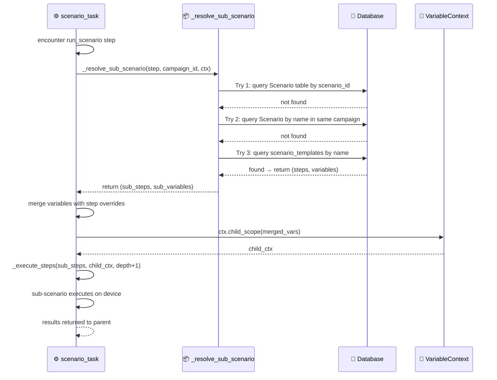
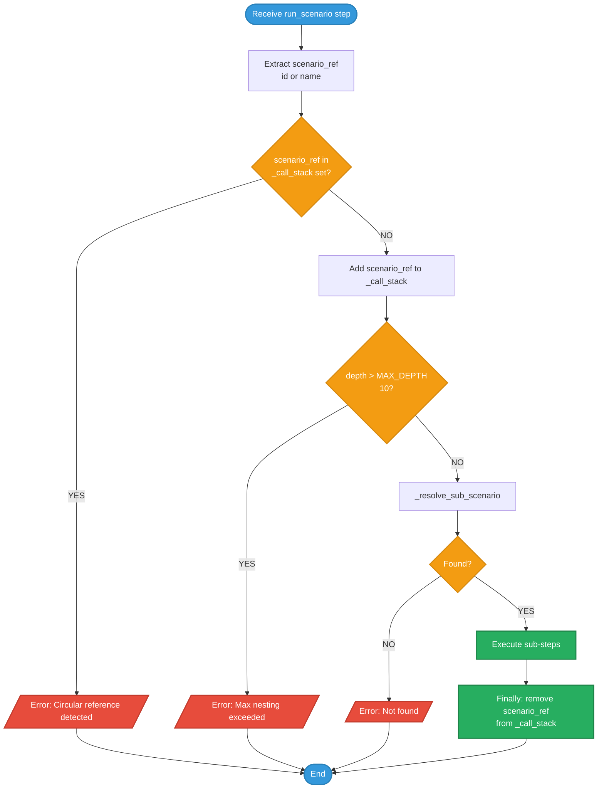

# DF-003: Flow Composition (Sub-scenarios)

- **Priority:** P0 (Must Have)
- **Effort:** S (3-5 ngay)
- **Phase:** 1 — Foundation
- **Dependencies:** DF-001 (Variable System)
- **Assignee:** —
- **Status:** Backlog

---

## 1. Muc tieu

Cho phep scenario goi lai scenario khac (sub-flow). Xay dung thu vien cac scenario building blocks (login, scroll feed, like post) de tai su dung.

**Hien tai:** Moi scenario doc lap, khong the goi nhau. Phai copy-paste steps.
**Sau khi xong:** `run_scenario` step goi scenario khac bang ID hoac name.

---

## 2. User Stories

**US-003.1:** Toi co login flow dung chung cho 10 campaigns khac nhau. Khi sua login flow, tat ca campaigns tu dong cap nhat.

**US-003.2:** Toi muon tao scenario "like 5 bai viet" = repeat 5 x run_scenario("like_one_post").

---

## 3. Thiet ke ky thuat

### 3.1 New Step Type: `run_scenario`

```json
{ "type": "run_scenario", "scenario_id": "uuid-of-login-flow" }
{ "type": "run_scenario", "scenario_name": "login_facebook" }
{ "type": "run_scenario", "scenario_name": "login_facebook", "variables": { "USERNAME": "alt@gmail.com" } }
```

| Field | Type | Required | Mo ta |
|-------|------|----------|-------|
| `scenario_id` | string | One of id/name | UUID cua scenario |
| `scenario_name` | string | One of id/name | Tim theo name (trong cung campaign hoac shared library) |
| `variables` | dict | No | Override variables cho sub-scenario |

### 3.2 Shared Scenario Library

**Database — Bang moi:** `scenario_templates`

```sql
CREATE TABLE scenario_templates (
    id VARCHAR(36) PRIMARY KEY,
    name VARCHAR(255) NOT NULL UNIQUE,
    description TEXT DEFAULT '',
    category VARCHAR(100) DEFAULT 'general',
    steps JSON NOT NULL DEFAULT '[]',
    variables JSON NOT NULL DEFAULT '{}',
    tags VARCHAR(500) DEFAULT '',
    is_builtin BOOLEAN DEFAULT FALSE,
    user_id VARCHAR(36) REFERENCES users(id) ON DELETE SET NULL,
    created_at TIMESTAMP DEFAULT NOW(),
    updated_at TIMESTAMP DEFAULT NOW()
);

CREATE INDEX idx_scenario_templates_name ON scenario_templates(name);
CREATE INDEX idx_scenario_templates_category ON scenario_templates(category);
```

| Field | Mo ta |
|-------|-------|
| `name` | Ten duy nhat, dung de reference: `"scenario_name": "login_facebook"` |
| `category` | Phan loai: `facebook`, `tiktok`, `general`, `utility` |
| `is_builtin` | True = system template, khong the xoa |
| `tags` | Comma-separated tags de filter |

### 3.3 Resolution Logic

```python
def _resolve_sub_scenario(step, campaign_id, ctx):
    """Find and return scenario steps for run_scenario step."""
    scenario_id = step.get("scenario_id")
    scenario_name = step.get("scenario_name")

    # 1. Tim theo ID trong DB (Scenario table)
    if scenario_id:
        scenario = db.get_scenario(scenario_id)
        if scenario:
            return scenario.steps, scenario.variables

    # 2. Tim theo name trong cung campaign
    if scenario_name and campaign_id:
        scenario = db.get_scenario_by_name(campaign_id, scenario_name)
        if scenario:
            return scenario.steps, scenario.variables

    # 3. Tim trong shared library (scenario_templates)
    if scenario_name:
        template = db.get_scenario_template_by_name(scenario_name)
        if template:
            return template.steps, template.variables

    raise ValueError(f"Sub-scenario not found: {scenario_id or scenario_name}")
```

### 3.4 Execution trong scenario_task.py

```python
def _handle_run_scenario(device, step, ctx, results, depth, campaign_id):
    sub_steps, sub_vars = _resolve_sub_scenario(step, campaign_id, ctx)

    # Merge variables: sub_scenario defaults < step overrides
    merged_vars = {**sub_vars, **step.get("variables", {})}
    child_ctx = ctx.child_scope(merged_vars)

    return _execute_steps(device, sub_steps, child_ctx, results, depth + 1)
```

**VariableContext.child_scope()** (them vao DF-001):
```python
def child_scope(self, extra_vars: dict) -> "VariableContext":
    """Create child scope that inherits parent vars but can override."""
    child = VariableContext(
        scenario_vars={**self._scenario_vars, **extra_vars},
        campaign_vars=self._campaign_vars,
        device_serial=self._device_serial,
        device_model=self._device_model,
    )
    child._runtime_vars = dict(self._runtime_vars)
    return child
```

### 3.5 Circular Reference Protection

```python
MAX_DEPTH = 10
_call_stack: Set[str] = set()  # track scenario IDs being executed

def _handle_run_scenario(device, step, ctx, results, depth, campaign_id):
    scenario_ref = step.get("scenario_id") or step.get("scenario_name")

    if scenario_ref in _call_stack:
        results.append({"type": "run_scenario", "ok": False,
                        "message": f"Circular reference: {scenario_ref}"})
        return False

    _call_stack.add(scenario_ref)
    try:
        # ... resolve and execute ...
    finally:
        _call_stack.discard(scenario_ref)
```

---

## 4. API Changes

### 4.1 Scenario Template CRUD

**File moi:** `device_farm/api/routes/scenario_templates.py`

```
GET    /api/scenario-templates                      → List templates (filter: category, tags)
POST   /api/scenario-templates                      → Create template
GET    /api/scenario-templates/{id}                  → Get template
PATCH  /api/scenario-templates/{id}                  → Update template
DELETE /api/scenario-templates/{id}                  → Delete template (not builtin)
POST   /api/scenario-templates/{id}/duplicate        → Duplicate template
```

### 4.2 Schemas

```python
class ScenarioTemplateCreate(BaseModel):
    name: str
    description: str = ""
    category: str = "general"
    steps: list = []
    variables: dict = {}
    tags: str = ""

class ScenarioTemplateOut(BaseModel):
    id: str
    name: str
    description: str
    category: str
    steps: list
    variables: dict
    tags: str
    is_builtin: bool
    user_id: str | None
    created_at: datetime
    updated_at: datetime
```

---

## 5. Frontend Changes

### 5.1 Scenario Template Library Page

**File moi:** `front-end/src/app/[locale]/dashboard/templates/page.tsx`

- Grid/list view cac scenario templates
- Filter by category (Facebook, TikTok, General)
- Search by name/tags
- Create/edit/delete templates
- "Use in Campaign" button → copy vao scenario

### 5.2 run_scenario Step trong Editor

**Sua:** ScenarioDialog.tsx

- Khi chon type = "run_scenario": hien dropdown chon scenario tu:
  - Same campaign scenarios
  - Shared template library
- Preview sub-scenario steps (read-only)
- Variable overrides editor

---

## 6. MCP Changes

**Sua file:** `device_farm/mcp/server.py`

Them tools:
```python
@tool
def df_list_scenario_templates(category: str = None) -> list:
    """List available scenario templates."""

@tool
def df_get_scenario_template(name: str) -> dict:
    """Get template by name."""

@tool
def df_create_scenario_template(name: str, steps: list, ...) -> dict:
    """Create a new scenario template."""
```

---

## 7. Seed Data — Builtin Templates

**File moi:** `device_farm/db/seeds/scenario_templates.py`

```python
BUILTIN_TEMPLATES = [
    {
        "name": "scroll_feed_generic",
        "category": "general",
        "description": "Scroll down N times with random delays",
        "variables": {"SCROLL_COUNT": 5, "MIN_DELAY": 1, "MAX_DELAY": 3},
        "steps": [
            {"type": "repeat", "count": "${SCROLL_COUNT}", "steps": [
                {"type": "scroll_down"},
                {"type": "set_variable", "name": "_DELAY",
                 "from_list": [1, 1.5, 2, 2.5, 3]},
                {"type": "wait", "seconds": "${_DELAY}"}
            ]}
        ]
    },
    {
        "name": "dismiss_all_popups",
        "category": "utility",
        "description": "Dismiss popups 3 times with waits",
        "steps": [
            {"type": "repeat", "count": 3, "steps": [
                {"type": "dismiss_popup"},
                {"type": "wait", "seconds": 1}
            ]}
        ]
    },
]
```

---

## Diagrams & Mockups

### 1. Sequence Diagram: Sub-scenario Resolution & Execution



### 2. Flowchart: Circular Reference & Depth Protection



### 3. ASCII Mockup: Template Library Page

```
┌──────────────────────────────────────────────────────────────────────────────┐
│  Template Library                                                            │
├──────────────────────────────────────────────────────────────────────────────┤
│                                                                              │
│  ┌─────────────────────────────────────────┐                                 │
│  │  🔍 Search templates...                 │                                 │
│  └─────────────────────────────────────────┘                                 │
│                                                                              │
│  ┌────────┐ ┌────────────┐ ┌───────────┐ ┌───────────┐                      │
│  │  All   │ │  Facebook  │ │  TikTok   │ │  Utility  │                      │
│  └────────┘ └────────────┘ └───────────┘ └───────────┘                      │
│                                                                              │
│  ┌──────────────────────────────────┐  ┌──────────────────────────────────┐  │
│  │ 📘 fb_scroll_feed               │  │ 📘 fb_like_posts                │  │
│  │                                  │  │                                  │  │
│  │ Scroll Facebook feed N times     │  │ Like N posts in current feed     │  │
│  │                                  │  │                                  │  │
│  │ ┌──────────────┐ ┌────────────┐  │  │ ┌──────────────┐                │  │
│  │ │SCROLL_COUNT=5│ │MIN_DELAY=1 │  │  │ │ LIKE_COUNT=5 │                │  │
│  │ └──────────────┘ └────────────┘  │  │ └──────────────┘                │  │
│  │                          ┌─────┐ │  │                          ┌─────┐ │  │
│  │                          │ Use │ │  │                          │ Use │ │  │
│  │                          └─────┘ │  │                          └─────┘ │  │
│  └──────────────────────────────────┘  └──────────────────────────────────┘  │
│                                                                              │
│  ┌──────────────────────────────────┐  ┌──────────────────────────────────┐  │
│  │ 🎵 tt_scroll_fyp                │  │ 🔧 warm_up_device               │  │
│  │                                  │  │                                  │  │
│  │ Scroll TikTok For You page       │  │ Basic device warm-up routine     │  │
│  │                                  │  │                                  │  │
│  │ ┌──────────────┐ ┌────────────┐  │  │ ┌──────────────┐ ┌────────────┐ │  │
│  │ │SCROLL_COUNT=8│ │MAX_DELAY=4 │  │  │ │ DURATION=300 │ │ STEPS=10   │ │  │
│  │ └──────────────┘ └────────────┘  │  │ └──────────────┘ └────────────┘ │  │
│  │                          ┌─────┐ │  │                          ┌─────┐ │  │
│  │                          │ Use │ │  │                          │ Use │ │  │
│  │                          └─────┘ │  │                          └─────┘ │  │
│  └──────────────────────────────────┘  └──────────────────────────────────┘  │
│                                                                              │
│  ┌──────────────────────────────────────────────────────────────────────┐    │
│  │                      ◀  1  2  3  ...  8  ▶                          │    │
│  └──────────────────────────────────────────────────────────────────────┘    │
│                                                                              │
└──────────────────────────────────────────────────────────────────────────────┘
```

---

## 8. Test Plan

| Test Case | Expected |
|-----------|----------|
| run_scenario by ID | Executes sub-scenario steps |
| run_scenario by name (same campaign) | Finds and executes |
| run_scenario by name (template library) | Finds template and executes |
| run_scenario with variable overrides | Overrides take effect |
| Circular reference (A calls A) | Error, stops |
| Circular reference (A calls B calls A) | Error, stops |
| Depth > 10 | Error, stops |
| Sub-scenario not found | Error with clear message |
| Template CRUD API | Create, read, update, delete work |
| Builtin template cannot be deleted | 403 error |

---

## 9. Acceptance Criteria

- [ ] `run_scenario` step resolves by ID, name (campaign), name (template)
- [ ] Variable overrides truyen vao sub-scenario
- [ ] Circular reference detection hoat dong
- [ ] Max depth = 10 duoc enforce
- [ ] `scenario_templates` table voi CRUD API
- [ ] Builtin templates seed data
- [ ] Frontend: template library page
- [ ] Frontend: run_scenario picker trong scenario editor
- [ ] MCP tools cho template management

---

## 10. Files Changed

| File | Action | Mo ta |
|------|--------|-------|
| `device_farm/db/models/scenario_template.py` | **NEW** | ScenarioTemplate model |
| `device_farm/db/crud/scenario_template.py` | **NEW** | CRUD operations |
| `device_farm/db/seeds/scenario_templates.py` | **NEW** | Builtin templates |
| `device_farm/api/routes/scenario_templates.py` | **NEW** | API endpoints |
| `device_farm/api/schemas/scenario_template.py` | **NEW** | Pydantic schemas |
| `device_farm/api/mount.py` | EDIT | Mount template router |
| `device_farm/tasks/scenario_task.py` | EDIT | Them run_scenario handler |
| `device_farm/common/scenario_schema.py` | EDIT | Them run_scenario step type |
| `device_farm/common/variable_resolver.py` | EDIT | Them child_scope() |
| `device_farm/mcp/server.py` | EDIT | Them template tools |
| `front-end/src/app/[locale]/dashboard/templates/page.tsx` | **NEW** | Template library page |
| `front-end/src/features/campaigns/components/ScenarioDialog.tsx` | EDIT | run_scenario picker |
| `alembic/versions/xxx_scenario_templates.py` | **NEW** | Migration |
| `tests/test_flow_composition.py` | **NEW** | Unit tests |
