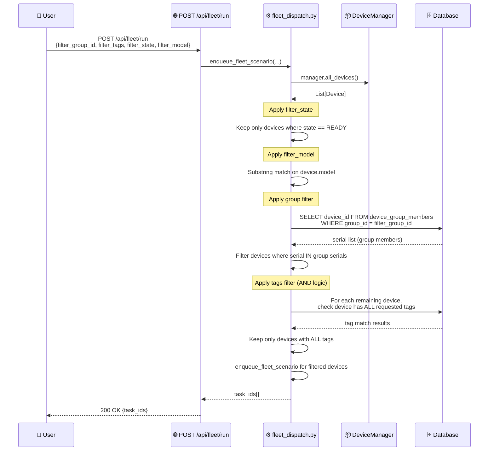
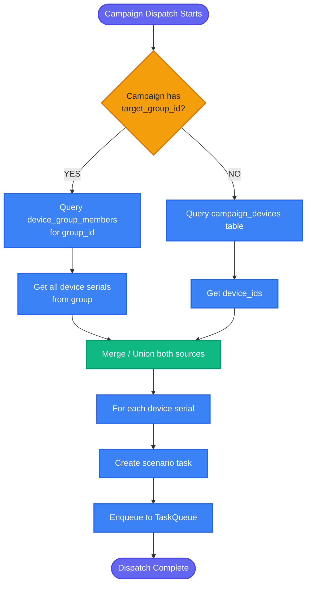

# DF-004: Device Group & Tag Management

- **Priority:** P1 (Should Have)
- **Effort:** S (3-5 ngay)
- **Phase:** 1 — Foundation
- **Dependencies:** None
- **Assignee:** —
- **Status:** Backlog

---

## 1. Muc tieu

Gom devices thanh nhom logic (vd: "FB Farm", "TikTok Farm", "Content Crawlers"). Cho phep chay campaign/fleet tren group thay vi chon tung device. Ho tro tags de filter linh hoat.

**Hien tai:** Devices chi co serial, name, model. Campaign phai add tung device bang ID.
**Sau khi xong:** Devices co tags va thuoc device groups. Campaign/fleet target theo group.

---

## 2. User Stories

**US-004.1:** Toi muon gom 20 device thanh nhom "FB Farm" va chay campaign tren ca nhom.

**US-004.2:** Toi muon tag device la "slow", "fast", "4G", "wifi" de filter khi dispatch.

---

## 3. Thiet ke ky thuat

### 3.1 Database

**Bang moi:** `device_groups`

```sql
CREATE TABLE device_groups (
    id VARCHAR(36) PRIMARY KEY,
    name VARCHAR(255) NOT NULL,
    description TEXT DEFAULT '',
    color VARCHAR(7) DEFAULT '#6366f1',
    user_id VARCHAR(36) REFERENCES users(id) ON DELETE SET NULL,
    created_at TIMESTAMP DEFAULT NOW(),
    updated_at TIMESTAMP DEFAULT NOW()
);
CREATE UNIQUE INDEX idx_device_groups_name_user ON device_groups(name, user_id);
```

**Bang moi:** `device_group_members`

```sql
CREATE TABLE device_group_members (
    id VARCHAR(36) PRIMARY KEY,
    group_id VARCHAR(36) REFERENCES device_groups(id) ON DELETE CASCADE,
    device_id VARCHAR(36) REFERENCES devices(id) ON DELETE CASCADE,
    added_at TIMESTAMP DEFAULT NOW(),
    UNIQUE(group_id, device_id)
);
CREATE INDEX idx_dgm_group ON device_group_members(group_id);
CREATE INDEX idx_dgm_device ON device_group_members(device_id);
```

**Sua bang:** `devices` — them truong `tags`

```sql
ALTER TABLE devices ADD COLUMN tags VARCHAR(500) DEFAULT '';
```

Tags la comma-separated string, vd: `"fast,wifi,samsung"`.

### 3.2 ORM Models

**File moi:** `device_farm/db/models/device_group.py`

```python
class DeviceGroup(Base):
    __tablename__ = "device_groups"
    id = Column(String(36), primary_key=True, default=gen_uuid)
    name = Column(String(255), nullable=False)
    description = Column(Text, default="")
    color = Column(String(7), default="#6366f1")
    user_id = Column(String(36), ForeignKey("users.id", ondelete="SET NULL"))
    created_at = Column(DateTime, default=datetime.utcnow)
    updated_at = Column(DateTime, default=datetime.utcnow, onupdate=datetime.utcnow)

    members = relationship("DeviceGroupMember", back_populates="group", cascade="all, delete-orphan")
    user = relationship("User")

class DeviceGroupMember(Base):
    __tablename__ = "device_group_members"
    id = Column(String(36), primary_key=True, default=gen_uuid)
    group_id = Column(String(36), ForeignKey("device_groups.id", ondelete="CASCADE"), index=True)
    device_id = Column(String(36), ForeignKey("devices.id", ondelete="CASCADE"), index=True)
    added_at = Column(DateTime, default=datetime.utcnow)

    group = relationship("DeviceGroup", back_populates="members")
    device = relationship("Device")

    __table_args__ = (UniqueConstraint("group_id", "device_id"),)
```

**Sua:** `device_farm/db/models/device.py`
```python
# Them vao Device model:
tags = Column(String(500), default="")
```

### 3.3 API Endpoints

**File moi:** `device_farm/api/routes/device_groups.py`

```
GET    /api/device-groups                           → List groups (with device count)
POST   /api/device-groups                           → Create group
GET    /api/device-groups/{id}                      → Get group with devices
PATCH  /api/device-groups/{id}                      → Update group (name, description, color)
DELETE /api/device-groups/{id}                      → Delete group
POST   /api/device-groups/{id}/devices              → Add devices to group (body: { device_ids: [...] })
DELETE /api/device-groups/{id}/devices/{device_id}  → Remove device from group
```

**Sua:** `device_farm/api/routes/devices.py`
```
PATCH  /api/devices/{device_id}/tags                → Update device tags
```

### 3.4 Fleet Dispatch — Them group_id filter

**Sua:** `device_farm/services/fleet_dispatch.py`

```python
def enqueue_fleet_scenario(
    manager, queue, *,
    steps, filter_state, filter_model,
    filter_group_id=None,        # NEW
    filter_tags=None,            # NEW: list of tags (AND logic)
    max_devices, priority, timeout, max_retries,
):
    devices = manager.all_devices()

    # Existing filters
    if filter_state:
        devices = [d for d in devices if d.state.value == filter_state]
    if filter_model:
        devices = [d for d in devices if filter_model.lower() in (d.model or "").lower()]

    # NEW: Group filter
    if filter_group_id:
        group_serials = _get_group_device_serials(filter_group_id)
        devices = [d for d in devices if d.serial in group_serials]

    # NEW: Tags filter
    if filter_tags:
        devices = [d for d in devices if _device_has_tags(d.serial, filter_tags)]

    # ... rest of dispatch logic ...
```

### 3.5 Campaign — Them group target

**Sua:** `device_farm/services/campaign_dispatch.py`

Khi enqueue campaign, neu campaign co `target_group_id`:
- Lay tat ca devices trong group thay vi `campaign_devices` table
- Hoac ket hop: campaign_devices UNION group members

### 3.6 API Schemas

```python
class DeviceGroupCreate(BaseModel):
    name: str
    description: str = ""
    color: str = "#6366f1"

class DeviceGroupOut(BaseModel):
    id: str
    name: str
    description: str
    color: str
    device_count: int
    created_at: datetime

class DeviceGroupDetailOut(DeviceGroupOut):
    devices: list[DeviceOut]

class AddDevicesToGroupBody(BaseModel):
    device_ids: list[str]

class UpdateTagsBody(BaseModel):
    tags: str  # comma-separated
```

---

## 4. Frontend Changes

### 4.1 Device Groups Page

**File moi:** `front-end/src/app/[locale]/dashboard/device-groups/page.tsx`

- Grid cac device groups (card layout voi color indicator)
- Moi card hien thi: name, device count, status summary (online/offline)
- Click vao group → chi tiet voi danh sach devices

### 4.2 Device List — Them tags column va group filter

**Sua:** `front-end/src/features/devices/components/device-list/columns.tsx`

- Them column "Tags" (badge list)
- Them column "Group" (group name)
- Filter bar: filter by group, tags

### 4.3 Campaign — Target group

**Sua:** `front-end/src/features/campaigns/components/AddDevicesDialog.tsx`

- Tab "By Device" (hien tai) + Tab "By Group" (moi)
- Chon group → tu dong add tat ca devices trong group

---

## Diagrams & Mockups

### 1. Sequence Diagram: Fleet Dispatch with Group & Tag Filters



### 2. Flowchart: Campaign Device Resolution (Individual vs Group)



### 3. ASCII Mockups

**Mockup A -- Device Groups Page**

```
┌──────────────────────────────────────────────────────────────────────────────┐
│  Device Groups                                              [+ Create Group]│
├──────────────────────────────────────────────────────────────────────────────┤
│                                                                              │
│  ┌──────────────────────┐  ┌──────────────────────┐  ┌──────────────────────┐│
│  │▓▓▓▓▓▓▓▓▓▓▓▓▓▓▓▓▓▓▓▓│  │████████████████████││  │░░░░░░░░░░░░░░░░░░░░││
│  │  FB Farm             │  │  TikTok Farm         │  │  Content Crawlers    ││
│  │                      │  │                      │  │                      ││
│  │  20 devices          │  │  15 devices          │  │  10 devices          ││
│  │  ● 18 online         │  │  ● 12 online         │  │  ● 10 online         ││
│  │  ○  2 offline        │  │  ○  3 offline        │  │  ○  0 offline        ││
│  │                      │  │                      │  │                      ││
│  └──────────────────────┘  └──────────────────────┘  └──────────────────────┘│
│                                                                              │
└──────────────────────────────────────────────────────────────────────────────┘
```

**Mockup B -- "By Group" tab in AddDevicesDialog**

```
┌──────────────────────────────────────────────────┐
│  Add Devices to Campaign                         │
├──────────────────────────────────────────────────┤
│                                                  │
│  ┌────────────┐ ┌────────────┐                   │
│  │ By Device  │ │▓By Group ▓│                   │
│  └────────────┘ └────────────┘                   │
│                                                  │
│  ┌──────────────────────────────────────────┐    │
│  │ ☐  FB Farm                  20 devices   │    │
│  ├──────────────────────────────────────────┤    │
│  │ ☑  TikTok Farm              15 devices   │    │
│  ├──────────────────────────────────────────┤    │
│  │ ☐  Content Crawlers         10 devices   │    │
│  └──────────────────────────────────────────┘    │
│                                                  │
│                   [Cancel]  [Add Selected Groups] │
└──────────────────────────────────────────────────┘
```

---

## 5. Test Plan

| Test Case | Expected |
|-----------|----------|
| Create group | Group created with name, color |
| Add devices to group | Devices linked |
| Remove device from group | Link removed, device van con |
| Delete group | Group deleted, devices khong bi xoa |
| Fleet dispatch with group filter | Chi devices trong group |
| Fleet dispatch with tags filter | Chi devices co tags |
| Tags AND logic | tags=["fast","wifi"] → device phai co CA hai |
| Device in multiple groups | Hoat dong binh thuong |
| Update device tags | Tags cap nhat |
| Campaign target group | Dispatch den tat ca devices trong group |

---

## 6. Acceptance Criteria

- [ ] Device groups CRUD API hoat dong
- [ ] Device tags (comma-separated) luu va filter duoc
- [ ] Fleet dispatch ho tro `filter_group_id` va `filter_tags`
- [ ] Campaign co the target device group
- [ ] Frontend: device groups page voi card layout
- [ ] Frontend: tags column + filter trong device list
- [ ] Frontend: "By Group" tab trong AddDevicesDialog
- [ ] Migration chay thanh cong

---

## 7. Files Changed

| File | Action | Mo ta |
|------|--------|-------|
| `device_farm/db/models/device_group.py` | **NEW** | DeviceGroup + DeviceGroupMember models |
| `device_farm/db/models/device.py` | EDIT | Them `tags` column |
| `device_farm/db/crud/device_group.py` | **NEW** | CRUD operations |
| `device_farm/api/routes/device_groups.py` | **NEW** | API endpoints |
| `device_farm/api/schemas/device_group.py` | **NEW** | Pydantic schemas |
| `device_farm/api/mount.py` | EDIT | Mount device_groups router |
| `device_farm/services/fleet_dispatch.py` | EDIT | Them group/tags filter |
| `device_farm/services/campaign_dispatch.py` | EDIT | Them group target |
| `front-end/src/app/[locale]/dashboard/device-groups/page.tsx` | **NEW** | Groups page |
| `front-end/src/features/devices/components/device-list/columns.tsx` | EDIT | Tags + group columns |
| `front-end/src/features/campaigns/components/AddDevicesDialog.tsx` | EDIT | By Group tab |
| `alembic/versions/xxx_device_groups.py` | **NEW** | Migration |
