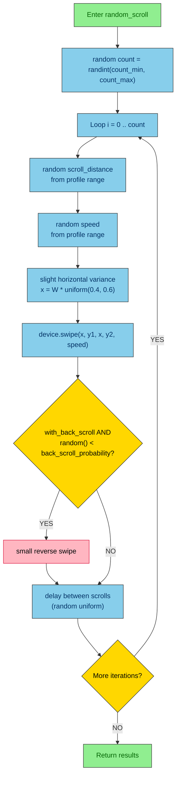
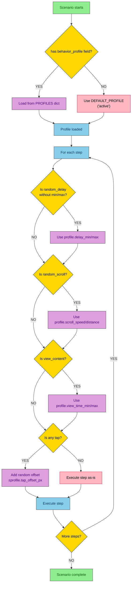

# DF-005: Human Behavior Simulation Engine

- **Priority:** P0 (Must Have)
- **Effort:** M (1-2 tuan)
- **Phase:** 2 — Social Media Automation
- **Dependencies:** DF-001 (Variables), DF-002 (Loops)
- **Assignee:** —
- **Status:** Backlog

---

## 1. Muc tieu

Tao engine mo phong hanh vi nguoi dung tu nhien: random delays (gaussian), scroll speed thay doi, random pause khi xem content, back-scroll doi khi. Muc dich: giam kha nang bi detect la bot.

**Hien tai:** `wait` la fixed seconds, `scroll_down` la fixed speed. Moi device hanh vi giong het nhau.
**Sau khi xong:** Hanh vi co random, kha config, giong nguoi that hon.

---

## 2. User Stories

**US-005.1:** Toi muon scroll feed TikTok voi thoi gian xem moi video la random 3-15 giay, doi khi cuon nguoc lai.

**US-005.2:** Toi muon delay giua cac thao tac la random (khong phai co dinh), theo phan phoi gaussian.

**US-005.3:** Toi muon chon 1 trong 3 behavior profile: casual (cham, nhieu pause), active (binh thuong), aggressive (nhanh).

---

## 3. Thiet ke ky thuat

### 3.1 Behavior Profiles

**File moi:** `device_farm/common/behavior_profiles.py`

```python
from dataclasses import dataclass

@dataclass
class BehaviorProfile:
    name: str
    # Delay config (seconds)
    delay_mean: float       # trung binh delay giua actions
    delay_stddev: float     # do lech chuan
    delay_min: float        # clamp min
    delay_max: float        # clamp max
    # Scroll config
    scroll_speed_min: int   # duration ms
    scroll_speed_max: int
    scroll_distance_min: float  # ratio 0-1
    scroll_distance_max: float
    # Content viewing
    view_time_min: float    # seconds xem content
    view_time_max: float
    # Random behaviors
    back_scroll_probability: float  # 0-1, xac suat scroll nguoc
    pause_probability: float        # 0-1, xac suat dung lai lau hon
    pause_duration_min: float
    pause_duration_max: float
    # Tap variance
    tap_offset_px: int      # random offset pixels khi tap


PROFILES = {
    "casual": BehaviorProfile(
        name="casual",
        delay_mean=2.5, delay_stddev=1.0, delay_min=1.0, delay_max=5.0,
        scroll_speed_min=400, scroll_speed_max=800,
        scroll_distance_min=0.3, scroll_distance_max=0.6,
        view_time_min=5.0, view_time_max=20.0,
        back_scroll_probability=0.15,
        pause_probability=0.2,
        pause_duration_min=3.0, pause_duration_max=10.0,
        tap_offset_px=8,
    ),
    "active": BehaviorProfile(
        name="active",
        delay_mean=1.5, delay_stddev=0.5, delay_min=0.5, delay_max=3.0,
        scroll_speed_min=250, scroll_speed_max=500,
        scroll_distance_min=0.4, scroll_distance_max=0.7,
        view_time_min=3.0, view_time_max=10.0,
        back_scroll_probability=0.08,
        pause_probability=0.1,
        pause_duration_min=2.0, pause_duration_max=5.0,
        tap_offset_px=5,
    ),
    "aggressive": BehaviorProfile(
        name="aggressive",
        delay_mean=0.8, delay_stddev=0.3, delay_min=0.3, delay_max=1.5,
        scroll_speed_min=150, scroll_speed_max=350,
        scroll_distance_min=0.5, scroll_distance_max=0.8,
        view_time_min=1.5, view_time_max=5.0,
        back_scroll_probability=0.03,
        pause_probability=0.05,
        pause_duration_min=1.0, pause_duration_max=3.0,
        tap_offset_px=3,
    ),
}

DEFAULT_PROFILE = "active"
```

### 3.2 New Step Types

#### `random_delay` — Delay tu nhien

```json
{
  "type": "random_delay",
  "min": 1.0,
  "max": 5.0,
  "distribution": "gaussian"
}
```

| Field | Type | Default | Mo ta |
|-------|------|---------|-------|
| `min` | float | profile.delay_min | Delay toi thieu |
| `max` | float | profile.delay_max | Delay toi da |
| `mean` | float | (min+max)/2 | Trung binh (gaussian) |
| `stddev` | float | (max-min)/4 | Do lech chuan (gaussian) |
| `distribution` | string | "gaussian" | "gaussian" hoac "uniform" |

Neu khong truyen min/max → lay tu behavior profile cua scenario.

#### `random_scroll` — Scroll tu nhien

```json
{
  "type": "random_scroll",
  "direction": "down",
  "count_min": 1,
  "count_max": 3,
  "delay_between_min": 0.5,
  "delay_between_max": 2.0,
  "with_back_scroll": true
}
```

| Field | Type | Default | Mo ta |
|-------|------|---------|-------|
| `direction` | string | "down" | "down" / "up" |
| `count_min` | int | 1 | So lan scroll toi thieu |
| `count_max` | int | 3 | So lan scroll toi da |
| `delay_between_min` | float | profile | Delay giua scrolls |
| `delay_between_max` | float | profile | |
| `with_back_scroll` | bool | true | Co scroll nguoc random khong |

#### `view_content` — Xem content (dung cho feed scrolling)

```json
{
  "type": "view_content",
  "min_seconds": 3,
  "max_seconds": 15,
  "interact_probability": 0.3,
  "interact_action": { "type": "tap_selector", "by": "content-desc", "value": "Like" }
}
```

| Field | Type | Default | Mo ta |
|-------|------|---------|-------|
| `min_seconds` | float | profile.view_time_min | Thoi gian xem toi thieu |
| `max_seconds` | float | profile.view_time_max | Thoi gian xem toi da |
| `interact_probability` | float | 0 | Xac suat tuong tac |
| `interact_action` | step | null | Step thuc hien khi tuong tac |

#### `human_tap` — Tap voi offset nho

```json
{
  "type": "human_tap",
  "x": 540,
  "y": 960,
  "offset_px": 5
}
```

Tap tai (x ± random_offset, y ± random_offset) de khong tap chinh xac tung pixel moi lan.

### 3.3 Scenario-level Behavior Profile

```json
{
  "instructions": "Luot Facebook",
  "behavior_profile": "casual",
  "variables": { ... },
  "steps": [ ... ]
}
```

Khi scenario co `behavior_profile`:
- Tat ca `random_delay` steps khong co min/max se lay tu profile
- `random_scroll` lay default tu profile
- `view_content` lay default tu profile
- `tap` tuc dong them random offset

### 3.4 Implementation

**Sua file:** `device_farm/tasks/scenario_task.py`

```python
import random
import math

def _gaussian_random(mean, stddev, min_val, max_val):
    """Generate gaussian random, clamped to [min, max]."""
    val = random.gauss(mean, stddev)
    return max(min_val, min(max_val, val))


def _handle_random_delay(step, profile):
    min_d = step.get("min", profile.delay_min)
    max_d = step.get("max", profile.delay_max)
    dist = step.get("distribution", "gaussian")

    if dist == "uniform":
        delay = random.uniform(min_d, max_d)
    else:  # gaussian
        mean = step.get("mean", (min_d + max_d) / 2)
        stddev = step.get("stddev", (max_d - min_d) / 4)
        delay = _gaussian_random(mean, stddev, min_d, max_d)

    time.sleep(delay)
    return {"type": "random_delay", "ok": True, "message": f"Waited {delay:.2f}s"}


def _handle_random_scroll(device, step, profile):
    direction = step.get("direction", "down")
    count = random.randint(
        step.get("count_min", 1),
        step.get("count_max", 3),
    )
    with_back = step.get("with_back_scroll", True)
    W, H = device.screen_width, device.screen_height

    for i in range(count):
        # Random scroll distance
        dist = random.uniform(profile.scroll_distance_min, profile.scroll_distance_max)
        speed = random.randint(profile.scroll_speed_min, profile.scroll_speed_max)

        if direction == "down":
            y1 = int(H * (0.5 + dist / 2))
            y2 = int(H * (0.5 - dist / 2))
        else:
            y1 = int(H * (0.5 - dist / 2))
            y2 = int(H * (0.5 + dist / 2))

        x = int(W * random.uniform(0.4, 0.6))  # slight horizontal variance
        device.swipe(x, y1, x, y2, speed)

        # Random back-scroll
        if with_back and random.random() < profile.back_scroll_probability:
            time.sleep(random.uniform(0.3, 0.8))
            small_dist = dist * random.uniform(0.2, 0.4)
            device.swipe(x, y2, x, y2 + int(H * small_dist), speed)

        # Delay between scrolls
        if i < count - 1:
            delay = random.uniform(
                step.get("delay_between_min", profile.delay_min),
                step.get("delay_between_max", profile.delay_max),
            )
            time.sleep(delay)

    return {"type": "random_scroll", "ok": True, "message": f"Scrolled {count} times"}


def _handle_view_content(device, step, profile, ctx, results, depth):
    min_s = step.get("min_seconds", profile.view_time_min)
    max_s = step.get("max_seconds", profile.view_time_max)
    view_time = random.uniform(min_s, max_s)

    time.sleep(view_time)

    # Random interaction
    prob = step.get("interact_probability", 0)
    action = step.get("interact_action")
    interacted = False
    if action and random.random() < prob:
        _execute_steps(device, [action], ctx, results, depth + 1)
        interacted = True

    return {"type": "view_content", "ok": True,
            "message": f"Viewed {view_time:.1f}s, interacted={interacted}"}
```

---

## 4. Frontend Changes

### 4.1 Behavior Profile Selector

**Sua:** ScenarioDialog.tsx

- Dropdown "Behavior Profile" (casual / active / aggressive / custom)
- Khi chon "custom": hien thi sliders cho tung parameter
- Preview: hien thi range delay, scroll speed

### 4.2 Step Type Icons

- `random_delay` → clock icon voi random symbol
- `random_scroll` → scroll icon voi shuffle
- `view_content` → eye icon
- `human_tap` → finger icon voi offset indicator

---

## Diagrams & Mockups

### 1. Flowchart: `random_scroll` Step Execution with Back-scroll



### 2. Flowchart: Behavior Profile Application to Steps



### 3. ASCII Mockup: Behavior Profile Selector (ScenarioDialog)

```
┌─────────────────────────────────────────────────────────────────┐
│  ScenarioDialog                                           [X]  │
├─────────────────────────────────────────────────────────────────┤
│                                                                 │
│  Scenario Name:  [ Luot Facebook feed               ]          │
│                                                                 │
│  Behavior Profile:                                              │
│  ┌─────────────────────────────────┐                            │
│  │  ● casual                    ▼  │                            │
│  │    active                       │                            │
│  │    aggressive                   │                            │
│  │    custom                       │                            │
│  └─────────────────────────────────┘                            │
│                                                                 │
│  ┌─── Custom Profile Settings ──────────────────────────────┐   │
│  │                                                           │   │
│  │  Delay:                                                   │   │
│  │  [1.0 ━━━━━━━━━━━━━━●━━━━━━━━━ 5.0]  mean=2.5s          │   │
│  │                                                           │   │
│  │  Scroll Speed:                                            │   │
│  │  [150 ━━━━━━●━━━━━━━━━━━━━━━━━ 800]  ms                  │   │
│  │                                                           │   │
│  │  View Time:                                               │   │
│  │  [3 ━━━━━━━━━━━━━●━━━━━━━━━━━━ 20]   seconds             │   │
│  │                                                           │   │
│  │  Back-scroll:                                             │   │
│  │  [0% ━━━●━━━━━━━━━━━━━━━━━━━━━ 30%]                      │   │
│  │                                                           │   │
│  │  Tap Offset:                                              │   │
│  │  [0 ━━━━━━━●━━━━━━━━━━━━━━━━━━ 15]   px                  │   │
│  │                                                           │   │
│  └───────────────────────────────────────────────────────────┘   │
│                                                                 │
│  Preview:                                                       │
│  ┌───────────────────────────────────────────────────────────┐   │
│  │ Delays: 1.0-5.0s gaussian | Scroll: 400-800ms |          │   │
│  │ View: 5-20s                                               │   │
│  └───────────────────────────────────────────────────────────┘   │
│                                                                 │
│                              [ Cancel ]   [ Save Scenario ]     │
└─────────────────────────────────────────────────────────────────┘
```

---

## 5. Test Plan

| Test Case | Expected |
|-----------|----------|
| random_delay gaussian | Delay nam trong [min, max], phan bo quanh mean |
| random_delay uniform | Delay nam trong [min, max], phan bo deu |
| random_scroll down 3 times | 3 swipes voi speed/distance khac nhau |
| random_scroll with back_scroll | Doi khi co scroll nguoc nho |
| view_content 3-15s | Sleep trong khoang [3, 15] |
| view_content interact 0.3 | ~30% lan co interact |
| human_tap offset | Coordinates lech ± offset_px |
| behavior_profile casual | Delays dai hon, scroll cham hon |
| behavior_profile aggressive | Delays ngan, scroll nhanh |
| No profile specified | Dung DEFAULT_PROFILE ("active") |

---

## 6. Acceptance Criteria

- [ ] 3 behavior profiles: casual, active, aggressive
- [ ] `random_delay` step voi gaussian/uniform distribution
- [ ] `random_scroll` step voi back-scroll probability
- [ ] `view_content` step voi random view time + interact probability
- [ ] `human_tap` step voi random offset
- [ ] Scenario-level `behavior_profile` field apply defaults
- [ ] Frontend: profile selector trong ScenarioDialog
- [ ] Tat ca random values clamp trong [min, max]

---

## 7. Files Changed

| File | Action | Mo ta |
|------|--------|-------|
| `device_farm/common/behavior_profiles.py` | **NEW** | Profile definitions |
| `device_farm/common/scenario_schema.py` | EDIT | Them 4 step types moi |
| `device_farm/tasks/scenario_task.py` | EDIT | Them handlers cho 4 step types |
| `front-end/src/features/campaigns/components/ScenarioDialog.tsx` | EDIT | Profile selector |
| `tests/test_behavior_simulation.py` | **NEW** | Unit tests |
