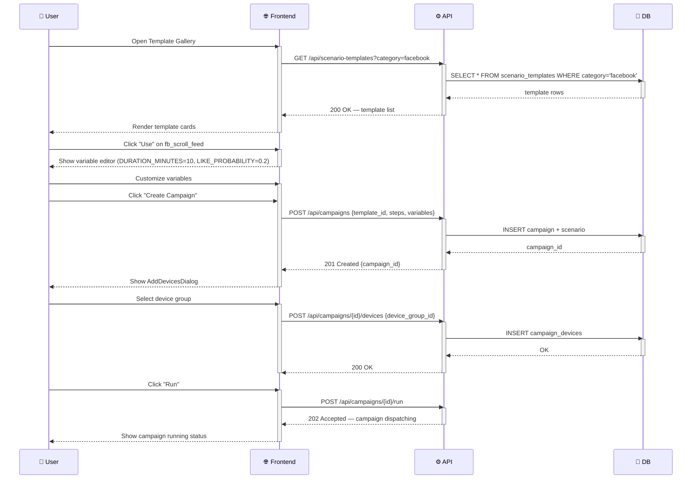
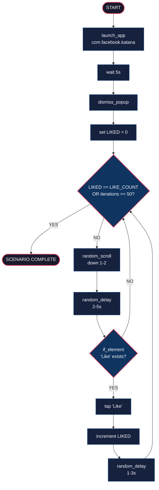

# DF-006: Social App Scenario Templates

- **Priority:** P0 (Must Have)
- **Effort:** L (2-4 tuan)
- **Phase:** 2 — Social Media Automation
- **Dependencies:** DF-001 (Variables), DF-002 (Loops), DF-003 (Sub-flows), DF-005 (Behavior)
- **Assignee:** —
- **Status:** Backlog

---

## 1. Muc tieu

Tao bo scenario templates san cho cac use case Facebook va TikTok. Templates su dung variable system, loops, behavior profiles de tao hanh vi tu nhien. Nguoi dung chi can chon template, config variables, va chay.

---

## 2. User Stories

**US-006.1:** Toi muon chon template "fb_scroll_and_like", set LIKE_COUNT=10, va chay tren 50 devices.

**US-006.2:** Toi muon template TikTok xem FYP 30 phut, random like 20% video, follow 5% creators.

**US-006.3:** Toi muon warm-up device moi: mo nhieu app, tao activity history truoc khi chay automation.

---

## 3. Template Catalog

### 3.1 Facebook Templates

#### `fb_scroll_feed` — Luot news feed

```json
{
  "name": "fb_scroll_feed",
  "category": "facebook",
  "description": "Scroll Facebook news feed with random behavior",
  "variables": {
    "DURATION_MINUTES": 10,
    "BEHAVIOR": "casual",
    "LIKE_PROBABILITY": 0.2,
    "COMMENT_PROBABILITY": 0.05,
    "COMMENTS": ["Hay qua!", "Tuyet voi", "Nice!", "Love it"],
    "APP_PACKAGE": "com.facebook.katana"
  },
  "steps": [
    { "type": "launch_app", "package": "${APP_PACKAGE}", "wait_after": 5 },
    { "type": "dismiss_popup", "retries": 3 },
    { "type": "wait_stable" },
    {
      "type": "repeat",
      "count": "${DURATION_MINUTES}",
      "steps": [
        { "type": "random_scroll", "direction": "down", "count_min": 2, "count_max": 5 },
        {
          "type": "view_content",
          "min_seconds": 3, "max_seconds": 15,
          "interact_probability": "${LIKE_PROBABILITY}",
          "interact_action": {
            "type": "if_element", "by": "content-desc", "value": "Like", "timeout": 2,
            "then": [{ "type": "tap_selector", "by": "content-desc", "value": "Like" }]
          }
        },
        { "type": "random_delay", "min": 1, "max": 3 }
      ]
    }
  ]
}
```

#### `fb_like_posts` — Like N bai viet

```json
{
  "name": "fb_like_posts",
  "category": "facebook",
  "description": "Like a specific number of posts on feed",
  "variables": {
    "LIKE_COUNT": 5,
    "APP_PACKAGE": "com.facebook.katana"
  },
  "steps": [
    { "type": "launch_app", "package": "${APP_PACKAGE}", "wait_after": 5 },
    { "type": "dismiss_popup" },
    {
      "type": "set_variable", "name": "LIKED", "value": 0
    },
    {
      "type": "repeat_until",
      "condition": { "variable_equals": { "name": "LIKED", "value": "${LIKE_COUNT}" } },
      "max_iterations": 50,
      "steps": [
        { "type": "random_scroll", "direction": "down", "count_min": 1, "count_max": 2 },
        { "type": "random_delay", "min": 2, "max": 5 },
        {
          "type": "if_element", "by": "content-desc", "value": "Like",
          "then": [
            { "type": "tap_selector", "by": "content-desc", "value": "Like" },
            { "type": "set_variable", "name": "LIKED", "increment": 1 },
            { "type": "random_delay", "min": 1, "max": 3 }
          ]
        }
      ]
    }
  ]
}
```

#### `fb_watch_reels` — Xem Facebook Reels

```json
{
  "name": "fb_watch_reels",
  "category": "facebook",
  "description": "Watch Facebook Reels with random like behavior",
  "variables": {
    "REEL_COUNT": 20,
    "LIKE_PROBABILITY": 0.25,
    "VIEW_MIN_SECONDS": 5,
    "VIEW_MAX_SECONDS": 30
  },
  "steps": [
    { "type": "launch_app", "package": "com.facebook.katana", "wait_after": 5 },
    { "type": "dismiss_popup" },
    { "type": "tap_selector", "by": "text", "value": "Reels", "timeout": 10 },
    { "type": "wait_stable" },
    {
      "type": "repeat", "count": "${REEL_COUNT}",
      "steps": [
        { "type": "view_content",
          "min_seconds": "${VIEW_MIN_SECONDS}",
          "max_seconds": "${VIEW_MAX_SECONDS}",
          "interact_probability": "${LIKE_PROBABILITY}",
          "interact_action": { "type": "tap_selector", "by": "content-desc", "value": "Like" }
        },
        { "type": "swipe_ratio", "x1": 0.5, "y1": 0.8, "x2": 0.5, "y2": 0.2, "duration_ms": 300 },
        { "type": "random_delay", "min": 0.5, "max": 2 }
      ]
    }
  ]
}
```

#### `fb_add_friends` — Gui ket ban

```json
{
  "name": "fb_add_friends",
  "category": "facebook",
  "description": "Send friend requests from People You May Know",
  "variables": {
    "MAX_REQUESTS": 5,
    "DELAY_MIN": 30,
    "DELAY_MAX": 120
  },
  "steps": [
    { "type": "launch_app", "package": "com.facebook.katana", "wait_after": 5 },
    { "type": "dismiss_popup" },
    { "type": "tap_selector", "by": "content-desc", "value": "Friends", "timeout": 10 },
    { "type": "wait_stable" },
    {
      "type": "repeat", "count": "${MAX_REQUESTS}",
      "steps": [
        { "type": "scroll_to", "by": "text", "value": "Add friend", "direction": "down", "max_swipes": 3 },
        { "type": "tap_selector", "by": "text", "value": "Add friend", "timeout": 5 },
        { "type": "random_delay", "min": "${DELAY_MIN}", "max": "${DELAY_MAX}" },
        { "type": "random_scroll", "direction": "down", "count_min": 1, "count_max": 2 }
      ]
    }
  ]
}
```

### 3.2 TikTok Templates

#### `tt_scroll_fyp` — Luot For You Page

```json
{
  "name": "tt_scroll_fyp",
  "category": "tiktok",
  "description": "Scroll TikTok FYP with natural viewing behavior",
  "variables": {
    "VIDEO_COUNT": 30,
    "LIKE_PROBABILITY": 0.2,
    "FOLLOW_PROBABILITY": 0.05,
    "VIEW_MIN_SECONDS": 5,
    "VIEW_MAX_SECONDS": 45,
    "APP_PACKAGE": "com.zhiliaoapp.musically"
  },
  "steps": [
    { "type": "launch_app", "package": "${APP_PACKAGE}", "wait_after": 5 },
    { "type": "dismiss_popup", "retries": 3 },
    { "type": "wait_stable" },
    {
      "type": "repeat", "count": "${VIDEO_COUNT}",
      "steps": [
        { "type": "view_content",
          "min_seconds": "${VIEW_MIN_SECONDS}",
          "max_seconds": "${VIEW_MAX_SECONDS}",
          "interact_probability": "${LIKE_PROBABILITY}",
          "interact_action": {
            "type": "tap_selector", "by": "content-desc", "value": "Like", "timeout": 2
          }
        },
        {
          "type": "random_pick", "branches": [
            { "weight": "${FOLLOW_PROBABILITY}", "steps": [
              { "type": "if_element", "by": "text", "value": "Follow", "timeout": 2,
                "then": [
                  { "type": "tap_selector", "by": "text", "value": "Follow" },
                  { "type": "random_delay", "min": 1, "max": 3 }
                ]
              }
            ]},
            { "weight": 1, "steps": [] }
          ]
        },
        { "type": "swipe_ratio", "x1": 0.5, "y1": 0.8, "x2": 0.5, "y2": 0.2, "duration_ms": 250 },
        { "type": "random_delay", "min": 0.3, "max": 1.5 }
      ]
    }
  ]
}
```

#### `tt_search_hashtag` — Tim kiem theo hashtag

```json
{
  "name": "tt_search_hashtag",
  "category": "tiktok",
  "description": "Search TikTok by hashtag and browse results",
  "variables": {
    "HASHTAG": "trending",
    "BROWSE_COUNT": 15,
    "LIKE_PROBABILITY": 0.3
  },
  "steps": [
    { "type": "launch_app", "package": "com.zhiliaoapp.musically", "wait_after": 5 },
    { "type": "dismiss_popup" },
    { "type": "tap_selector", "by": "content-desc", "value": "Search", "timeout": 10 },
    { "type": "wait_stable" },
    { "type": "input_text", "text": "#${HASHTAG}" },
    { "type": "key", "key": "enter" },
    { "type": "wait", "seconds": 3 },
    { "type": "tap_selector", "by": "text", "value": "Videos", "timeout": 5 },
    { "type": "wait_stable" },
    { "type": "tap_ratio", "x": 0.3, "y": 0.5 },
    { "type": "wait", "seconds": 2 },
    {
      "type": "repeat", "count": "${BROWSE_COUNT}",
      "steps": [
        { "type": "view_content",
          "min_seconds": 5, "max_seconds": 20,
          "interact_probability": "${LIKE_PROBABILITY}",
          "interact_action": { "type": "tap_selector", "by": "content-desc", "value": "Like" }
        },
        { "type": "swipe_ratio", "x1": 0.5, "y1": 0.8, "x2": 0.5, "y2": 0.2, "duration_ms": 250 },
        { "type": "random_delay", "min": 0.5, "max": 2 }
      ]
    }
  ]
}
```

### 3.3 Utility Templates

#### `warm_up_device` — Warm up thiet bi moi

```json
{
  "name": "warm_up_device",
  "category": "utility",
  "description": "Open random apps and create activity history",
  "variables": {
    "APPS": [
      "com.android.chrome",
      "com.google.android.youtube",
      "com.google.android.apps.maps",
      "com.android.settings"
    ],
    "ROUNDS": 3,
    "BROWSE_SECONDS_MIN": 30,
    "BROWSE_SECONDS_MAX": 120
  },
  "steps": [
    {
      "type": "repeat", "count": "${ROUNDS}",
      "steps": [
        { "type": "set_variable", "name": "APP", "from_list": "${APPS}" },
        { "type": "launch_app", "package": "${APP}", "wait_after": 5 },
        { "type": "dismiss_popup" },
        { "type": "random_scroll", "direction": "down", "count_min": 3, "count_max": 8 },
        { "type": "view_content", "min_seconds": "${BROWSE_SECONDS_MIN}", "max_seconds": "${BROWSE_SECONDS_MAX}" },
        { "type": "key", "key": "home" },
        { "type": "random_delay", "min": 5, "max": 15 }
      ]
    }
  ]
}
```

#### `dismiss_all_setup` — Dong tat ca popup/setup khi bat dau

```json
{
  "name": "dismiss_all_setup",
  "category": "utility",
  "description": "Dismiss all popups and setup dialogs",
  "steps": [
    { "type": "repeat", "count": 5, "delay_between": 2, "steps": [
      { "type": "dismiss_popup" },
      { "type": "if_element", "by": "text", "value": "Skip", "timeout": 1,
        "then": [{ "type": "tap_selector", "by": "text", "value": "Skip" }] },
      { "type": "if_element", "by": "text", "value": "Not now", "timeout": 1,
        "then": [{ "type": "tap_selector", "by": "text", "value": "Not now" }] },
      { "type": "if_element", "by": "text", "value": "Maybe later", "timeout": 1,
        "then": [{ "type": "tap_selector", "by": "text", "value": "Maybe later" }] }
    ]}
  ]
}
```

---

## 4. Implementation

### 4.1 Seed Templates

**Sua file:** `device_farm/db/seeds/scenario_templates.py`

Them tat ca templates tren vao `BUILTIN_TEMPLATES` list voi `is_builtin=True`.

### 4.2 Template Seeding on Startup

**Sua file:** `device_farm/web/server.py` (hoac startup event)

```python
@app.on_event("startup")
async def seed_templates():
    from device_farm.db.seeds.scenario_templates import seed_builtin_templates
    await seed_builtin_templates()
```

### 4.3 Frontend — Template Gallery

**Sua:** Template library page (DF-003)

- Category tabs: All | Facebook | TikTok | Utility
- Moi template card hien thi:
  - Icon (FB/TT/Gear)
  - Name, description
  - Variable list voi default values
  - "Use" button → copy vao campaign voi variable editor
- Search by name/description

---

## Diagrams & Mockups

### 1. Sequence Diagram: Template Selection & Campaign Creation Flow



### 2. Flowchart: fb_like_posts Template Execution Flow



### 3. ASCII Mockup: Template Gallery Page

```
┌──────────────────────────────────────────────────────────────────────────────┐
│  TEMPLATE GALLERY                                                          │
├──────────────────────────────────────────────────────────────────────────────┤
│                                                                            │
│  ┌──────────────────────────────────────────────────────────────────┐       │
│  │  🔍 Search templates...                                         │       │
│  └──────────────────────────────────────────────────────────────────┘       │
│                                                                            │
│  ┌────────┐  ┌──────────────┐  ┌─────────────┐  ┌──────────────┐          │
│  │▐ All  ▐│  │ 📱 Facebook  │  │ 🎵 TikTok   │  │ 🔧 Utility   │          │
│  └────────┘  └──────────────┘  └─────────────┘  └──────────────┘          │
│                                                                            │
│  ┌─────────────────────────────────┐  ┌─────────────────────────────────┐  │
│  │  📱 fb_scroll_feed              │  │  📱 fb_like_posts               │  │
│  │                                 │  │                                 │  │
│  │  "Scroll Facebook feed with     │  │  "Like N posts on feed"        │  │
│  │   random likes"                 │  │                                 │  │
│  │                                 │  │  Variables:                     │  │
│  │  Variables:                     │  │    LIKE_COUNT = 5               │  │
│  │    DURATION = 10                │  │                                 │  │
│  │    LIKE_PROB = 0.2              │  │                                 │  │
│  │                                 │  │                                 │  │
│  │                       ┌──────┐  │  │                       ┌──────┐  │  │
│  │                       │ Use  │  │  │                       │ Use  │  │  │
│  │                       └──────┘  │  │                       └──────┘  │  │
│  └─────────────────────────────────┘  └─────────────────────────────────┘  │
│                                                                            │
│  ┌─────────────────────────────────┐  ┌─────────────────────────────────┐  │
│  │  🎵 tt_scroll_fyp               │  │  🔧 warm_up_device              │  │
│  │                                 │  │                                 │  │
│  │  "Scroll TikTok FYP"           │  │  "Warm up device with random   │  │
│  │                                 │  │   apps"                        │  │
│  │  Variables:                     │  │                                 │  │
│  │    VIDEO_COUNT = 30             │  │  Variables:                     │  │
│  │                                 │  │    ROUNDS = 3                   │  │
│  │                                 │  │                                 │  │
│  │                                 │  │                                 │  │
│  │                       ┌──────┐  │  │                       ┌──────┐  │  │
│  │                       │ Use  │  │  │                       │ Use  │  │  │
│  │                       └──────┘  │  │                       └──────┘  │  │
│  └─────────────────────────────────┘  └─────────────────────────────────┘  │
│                                                                            │
└──────────────────────────────────────────────────────────────────────────────┘

  ┌─── Modal Overlay ──────────────────────────────────────────────────────┐
  │                                                                        │
  │   USE TEMPLATE: fb_scroll_feed                                         │
  │   ────────────────────────────────────────────────                      │
  │                                                                        │
  │   Override default variables:                                          │
  │                                                                        │
  │   DURATION_MINUTES    ┌──────────────────┐                             │
  │                       │ 10               │                             │
  │                       └──────────────────┘                             │
  │   LIKE_PROBABILITY    ┌──────────────────┐                             │
  │                       │ 0.2              │                             │
  │                       └──────────────────┘                             │
  │   COMMENT_PROBABILITY ┌──────────────────┐                             │
  │                       │ 0.05             │                             │
  │                       └──────────────────┘                             │
  │   BEHAVIOR            ┌──────────────────┐                             │
  │                       │ casual        ▼  │                             │
  │                       └──────────────────┘                             │
  │                                                                        │
  │              ┌──────────────────┐  ┌─────────┐                         │
  │              │ Create Campaign  │  │ Cancel  │                         │
  │              └──────────────────┘  └─────────┘                         │
  │                                                                        │
  └────────────────────────────────────────────────────────────────────────┘
```

---

## 5. Testing Strategy

- Moi template phai chay duoc tren emulator voi app tuong ung
- Validate JSON schema truoc khi seed
- Test variable substitution trong templates
- Test behavior profiles voi tung template

**Luu y:** Selector values (content-desc, text) co the thay doi giua cac phien ban app. Templates can cap nhat dinh ky.

---

## 6. Acceptance Criteria

- [ ] 8+ builtin templates (4 FB, 2 TT, 2 utility)
- [ ] Templates seed thanh cong khi server khoi dong
- [ ] Moi template co variables configurable
- [ ] Templates su dung control flow (repeat, if_element, random_pick)
- [ ] Templates su dung behavior simulation (random_delay, random_scroll, view_content)
- [ ] Frontend: template gallery voi category filter
- [ ] Frontend: "Use Template" → tao scenario trong campaign voi variable editor
- [ ] Template selectors validated tren Facebook/TikTok latest versions

---

## 7. Files Changed

| File | Action | Mo ta |
|------|--------|-------|
| `device_farm/db/seeds/scenario_templates.py` | EDIT | Them 8+ templates |
| `device_farm/web/server.py` | EDIT | Auto-seed on startup |
| `front-end/src/app/[locale]/dashboard/templates/page.tsx` | EDIT | Template gallery UI |
| `front-end/src/features/campaigns/components/template-picker.tsx` | **NEW** | Template picker + variable override |

---

## 8. Maintenance Notes

- Facebook app package: `com.facebook.katana` (regular), `com.facebook.lite` (Lite)
- TikTok app package: `com.zhiliaoapp.musically` (global), `com.ss.android.ugc.trill` (some regions)
- Selectors can break with app updates — maintain a selector mapping that can be updated independently
- Consider creating a `selector_map.json` per app version
