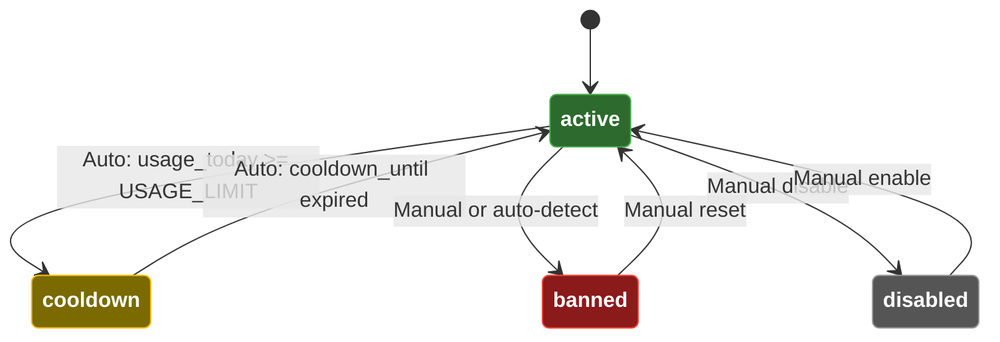
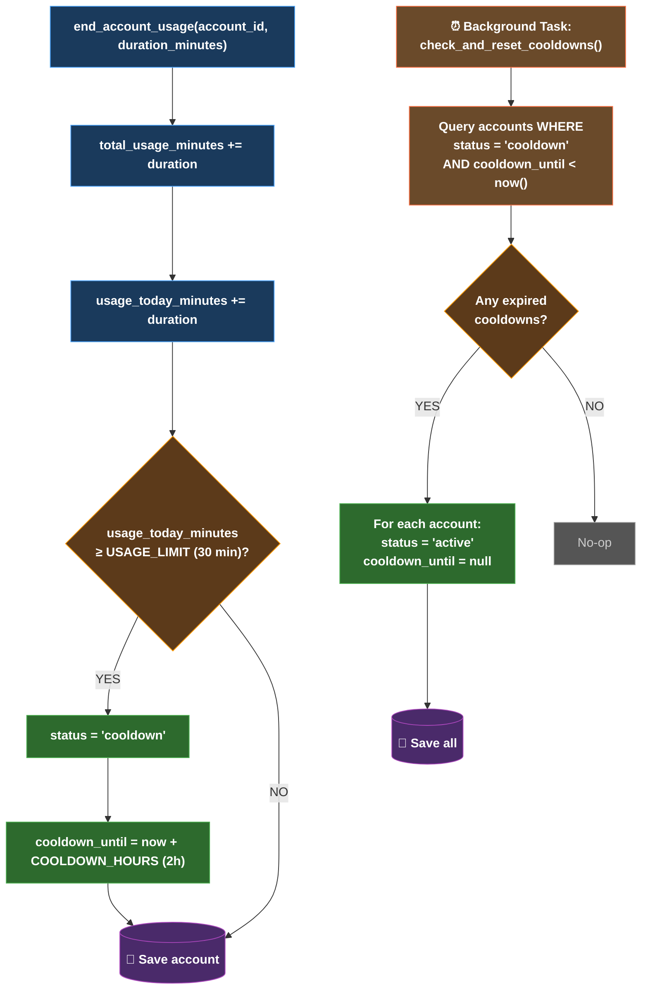

# DF-007: Account & Profile Manager

- **Priority:** P1 (Should Have)
- **Effort:** L (2-4 tuan)
- **Phase:** 2 — Social Media Automation
- **Dependencies:** DF-004 (Device Groups)
- **Assignee:** —
- **Status:** Backlog

---

## 1. Muc tieu

Quan ly danh sach accounts (Facebook, TikTok, Google...) va gan vao devices. Ho tro auto-login, rotate accounts, va theo doi trang thai (active/banned/cooldown).

**Hien tai:** Khong co khai niem account. Moi device tu login thu cong.
**Sau khi xong:** Accounts duoc quan ly tap trung, tu dong inject vao scenario qua variables.

---

## 2. User Stories

**US-007.1:** Toi muon import 100 tai khoan Facebook (email + password) va phan phoi tren 100 devices.

**US-007.2:** Khi mot tai khoan bi ban, toi muon danh dau va tu dong chuyen sang tai khoan khac.

**US-007.3:** Toi muon cooldown tai khoan 2 gio sau khi su dung 30 phut de tranh bi rate limit.

---

## 3. Thiet ke ky thuat

### 3.1 Database

**Bang moi:** `accounts`

```sql
CREATE TABLE accounts (
    id VARCHAR(36) PRIMARY KEY,
    platform VARCHAR(50) NOT NULL,         -- facebook, tiktok, google, instagram
    username VARCHAR(255) NOT NULL,         -- email hoac phone
    password_encrypted VARCHAR(500),        -- encrypted password
    display_name VARCHAR(255) DEFAULT '',
    status VARCHAR(20) DEFAULT 'active',   -- active, banned, cooldown, disabled
    cooldown_until TIMESTAMP,              -- null = khong cooldown
    proxy_id VARCHAR(36),                  -- FK -> proxies (DF-013)
    metadata JSON DEFAULT '{}',            -- extra: cookies, tokens, 2fa_secret, avatar_url
    notes TEXT DEFAULT '',
    tags VARCHAR(500) DEFAULT '',
    user_id VARCHAR(36) REFERENCES users(id) ON DELETE SET NULL,
    created_at TIMESTAMP DEFAULT NOW(),
    updated_at TIMESTAMP DEFAULT NOW(),
    last_used_at TIMESTAMP,
    total_usage_minutes FLOAT DEFAULT 0,
    usage_today_minutes FLOAT DEFAULT 0,
    usage_reset_date DATE
);

CREATE INDEX idx_accounts_platform ON accounts(platform);
CREATE INDEX idx_accounts_status ON accounts(status);
CREATE INDEX idx_accounts_user ON accounts(user_id);
CREATE UNIQUE INDEX idx_accounts_platform_username ON accounts(platform, username);
```

**Bang moi:** `device_accounts` — lien ket device-account

```sql
CREATE TABLE device_accounts (
    id VARCHAR(36) PRIMARY KEY,
    device_id VARCHAR(36) REFERENCES devices(id) ON DELETE CASCADE,
    account_id VARCHAR(36) REFERENCES accounts(id) ON DELETE CASCADE,
    is_primary BOOLEAN DEFAULT FALSE,       -- account chinh cua device
    assigned_at TIMESTAMP DEFAULT NOW(),
    UNIQUE(device_id, account_id)
);

CREATE INDEX idx_da_device ON device_accounts(device_id);
CREATE INDEX idx_da_account ON device_accounts(account_id);
```

### 3.2 Account Status State Machine

```
active → cooldown → active          (tu dong sau cooldown_until)
active → banned                     (thu cong hoac auto-detect)
active → disabled                   (thu cong)
banned → active                     (thu cong reset)
disabled → active                   (thu cong enable)
```

### 3.3 ORM Models

**File moi:** `device_farm/db/models/account.py`

```python
class Account(Base):
    __tablename__ = "accounts"
    id = Column(String(36), primary_key=True, default=gen_uuid)
    platform = Column(String(50), nullable=False)
    username = Column(String(255), nullable=False)
    password_encrypted = Column(String(500))
    display_name = Column(String(255), default="")
    status = Column(String(20), default="active")
    cooldown_until = Column(DateTime, nullable=True)
    proxy_id = Column(String(36), nullable=True)
    metadata = Column(JSON, default=dict)
    notes = Column(Text, default="")
    tags = Column(String(500), default="")
    user_id = Column(String(36), ForeignKey("users.id", ondelete="SET NULL"))
    created_at = Column(DateTime, default=datetime.utcnow)
    updated_at = Column(DateTime, default=datetime.utcnow, onupdate=datetime.utcnow)
    last_used_at = Column(DateTime, nullable=True)
    total_usage_minutes = Column(Float, default=0)
    usage_today_minutes = Column(Float, default=0)
    usage_reset_date = Column(Date, nullable=True)

    device_links = relationship("DeviceAccount", back_populates="account")

class DeviceAccount(Base):
    __tablename__ = "device_accounts"
    id = Column(String(36), primary_key=True, default=gen_uuid)
    device_id = Column(String(36), ForeignKey("devices.id", ondelete="CASCADE"), index=True)
    account_id = Column(String(36), ForeignKey("accounts.id", ondelete="CASCADE"), index=True)
    is_primary = Column(Boolean, default=False)
    assigned_at = Column(DateTime, default=datetime.utcnow)

    device = relationship("Device")
    account = relationship("Account", back_populates="device_links")
```

### 3.4 Password Encryption

```python
# device_farm/common/crypto.py
from cryptography.fernet import Fernet
import os

_KEY = os.environ.get("ACCOUNT_ENCRYPTION_KEY", "").encode()

def encrypt_password(plain: str) -> str:
    if not _KEY:
        return plain  # dev mode: khong encrypt
    f = Fernet(_KEY)
    return f.encrypt(plain.encode()).decode()

def decrypt_password(encrypted: str) -> str:
    if not _KEY:
        return encrypted
    f = Fernet(_KEY)
    return f.decrypt(encrypted.encode()).decode()
```

### 3.5 Account Injection vao Scenario

Khi campaign dispatch, he thong tu dong inject account cua device vao variables:

```python
# device_farm/services/campaign_dispatch.py

async def _get_device_account_vars(device_serial: str, platform: str) -> dict:
    """Get primary account for device as scenario variables."""
    account = await get_primary_account_for_device(device_serial, platform)
    if not account:
        return {}
    return {
        "__ACCOUNT_USERNAME__": account.username,
        "__ACCOUNT_PASSWORD__": decrypt_password(account.password_encrypted),
        "__ACCOUNT_DISPLAY_NAME__": account.display_name,
        "__ACCOUNT_PLATFORM__": account.platform,
    }
```

Scenario template co the dung:
```json
{ "type": "input_selector", "by": "resource-id", "value": "email", "text": "${__ACCOUNT_USERNAME__}" }
{ "type": "input_selector", "by": "resource-id", "value": "pass", "text": "${__ACCOUNT_PASSWORD__}" }
```

### 3.6 Cooldown Logic

```python
# device_farm/services/account_manager.py

async def start_account_usage(account_id: str):
    """Mark account as in-use, track usage start."""
    account = await get_account(account_id)
    account.last_used_at = datetime.utcnow()
    await save(account)

async def end_account_usage(account_id: str, duration_minutes: float):
    """End usage session, apply cooldown if needed."""
    account = await get_account(account_id)
    account.total_usage_minutes += duration_minutes
    account.usage_today_minutes += duration_minutes

    # Auto-cooldown: sau 30 phut su dung, cooldown 2 gio
    USAGE_LIMIT = 30  # minutes
    COOLDOWN_HOURS = 2
    if account.usage_today_minutes >= USAGE_LIMIT:
        account.status = "cooldown"
        account.cooldown_until = datetime.utcnow() + timedelta(hours=COOLDOWN_HOURS)

    await save(account)

async def check_and_reset_cooldowns():
    """Background task: reset cooldown accounts that have expired."""
    expired = await get_accounts_where(
        status="cooldown",
        cooldown_until__lt=datetime.utcnow(),
    )
    for account in expired:
        account.status = "active"
        account.cooldown_until = None
    await save_all(expired)
```

### 3.7 API Endpoints

**File moi:** `device_farm/api/routes/accounts.py`

```
GET    /api/accounts                                → List accounts (filter: platform, status, tags)
POST   /api/accounts                                → Create account
POST   /api/accounts/import                          → Bulk import (CSV/JSON)
GET    /api/accounts/{id}                            → Get account
PATCH  /api/accounts/{id}                            → Update account
DELETE /api/accounts/{id}                            → Delete account
PATCH  /api/accounts/{id}/status                     → Update status (active/banned/cooldown/disabled)

GET    /api/accounts/{id}/devices                    → List devices assigned to account
POST   /api/accounts/{id}/devices                    → Assign device to account
DELETE /api/accounts/{id}/devices/{device_id}        → Unassign

POST   /api/accounts/assign-round-robin              → Auto-assign accounts to devices (round-robin)

GET    /api/devices/{device_id}/accounts              → List accounts on device
POST   /api/devices/{device_id}/accounts/set-primary  → Set primary account for device
```

### 3.8 Bulk Import Format

**CSV:**
```csv
platform,username,password,display_name,tags,notes
facebook,user1@gmail.com,pass123,User One,"farm1,batch1",""
facebook,user2@gmail.com,pass456,User Two,"farm1,batch1",""
tiktok,user3@gmail.com,pass789,User Three,"farm2",""
```

**JSON:**
```json
[
  {"platform": "facebook", "username": "user1@gmail.com", "password": "pass123", "tags": "farm1"},
  {"platform": "tiktok", "username": "user2@gmail.com", "password": "pass456", "tags": "farm2"}
]
```

---

## 4. Frontend Changes

### 4.1 Accounts Page

**File moi:** `front-end/src/app/[locale]/dashboard/accounts/page.tsx`

- DataTable: platform (icon), username, status (badge), device (link), last_used, usage_today
- Filter bar: platform, status, tags
- Bulk actions: import, delete, change status
- Create/edit dialog
- CSV/JSON import dialog voi preview

### 4.2 Device Detail — Accounts Tab

**Sua:** Device list hoac device detail

- Tab "Accounts": list accounts gan vao device
- Set primary account
- Add/remove accounts

### 4.3 Campaign — Account Assignment

**Sua:** Campaign setup flow

- Option: "Auto-assign accounts from pool" (round-robin)
- Hien thi account assigned per device

---

## 5. Environment Variables

| Variable | Mo ta | Default |
|----------|-------|---------|
| `ACCOUNT_ENCRYPTION_KEY` | Fernet key de encrypt password | None (dev: plain text) |
| `ACCOUNT_COOLDOWN_MINUTES` | Thoi gian cooldown sau usage limit | 120 |
| `ACCOUNT_DAILY_USAGE_LIMIT` | Gioi han su dung (phut/ngay) | 30 |

---

## Diagrams & Mockups

### 1. Sequence Diagram: Account Injection into Scenario at Dispatch

```mermaid
sequenceDiagram
    participant CD as ⚙️ CampaignDispatch
    participant DB as 💾 DB
    participant CR as 🔐 Crypto
    participant ST as 📋 ScenarioTask
    participant DV as 📱 Device

    rect rgb(40, 40, 60)
        Note over CD,DV: Loop: for each device in campaign fleet
        CD->>DB: get_primary_account_for_device(serial, "facebook")
        DB-->>CD: Account (username, password_encrypted, display_name)
        CD->>CR: decrypt_password(account.password_encrypted)
        CR-->>CD: plaintext password
        CD->>ST: inject VariableContext:<br/>__ACCOUNT_USERNAME__ = account.username<br/>__ACCOUNT_PASSWORD__ = plaintext<br/>__ACCOUNT_DISPLAY_NAME__ = account.display_name
        ST->>ST: resolve step: ${__ACCOUNT_USERNAME__} → "user1@gmail.com"
        ST->>DV: input_selector(by="resource-id", value="email", text="user1@gmail.com")
        DV-->>ST: OK
        ST->>ST: resolve step: ${__ACCOUNT_PASSWORD__} → "pass123"
        ST->>DV: input_selector(by="resource-id", value="pass", text="pass123")
        DV-->>ST: OK
    end
```



### 2. State Diagram: Account Status State Machine



### 3. Flowchart: Cooldown Logic After Usage Session



### 4. ASCII Mockup: Accounts Page

```
┌──────────────────────────────────────────────────────────────────────────────────────────┐
│  📱 Device Farm    Devices   Campaigns   Scenarios   ▸ Accounts    Settings             │
├──────────────────────────────────────────────────────────────────────────────────────────┤
│                                                                                          │
│  Accounts                                              [ 📥 Import CSV ] [ + Create ]    │
│                                                                                          │
│  ┌─────────────────────────────────────────────────────────────────────────────────────┐  │
│  │ Platform: [ All ▾ ]   Status: [ All ▾ ]   Tags: [ __________________ ]   🔍 Search │  │
│  └─────────────────────────────────────────────────────────────────────────────────────┘  │
│                                                                                          │
│  ┌────────┬──────────────────┬──────────────┬──────────┬───────────┬──────────┬────────┐  │
│  │Platform│ Username         │ Display Name │ Status   │ Device    │ Last Used│Actions │  │
│  ├────────┼──────────────────┼──────────────┼──────────┼───────────┼──────────┼────────┤  │
│  │  f     │ user1@gmail.com  │ User One     │ 🟢 active │ DEV-001  │ 2m ago   │ ⋮      │  │
│  │  f     │ user2@gmail.com  │ User Two     │ 🟡 cool.. │ DEV-002  │ 15m ago  │ ⋮      │  │
│  │  t     │ user3@gmail.com  │ User Three   │ 🔴 banned │ DEV-003  │ 1h ago   │ ⋮      │  │
│  │  f     │ user4@gmail.com  │ User Four    │ 🟢 active │ DEV-004  │ 5m ago   │ ⋮      │  │
│  │  t     │ user5@gmail.com  │ User Five    │ ⚫ disab..│ —        │ 3d ago   │ ⋮      │  │
│  │  f     │ user6@gmail.com  │ User Six     │ 🟡 cool.. │ DEV-006  │ 20m ago  │ ⋮      │  │
│  └────────┴──────────────────┴──────────────┴──────────┴───────────┴──────────┴────────┘  │
│                                                                                          │
│  Showing 1-6 of 128 accounts                              [ < ]  1  2  3 ... 22  [ > ]  │
│                                                                                          │
├──────────────────────────────────────────────────────────────────────────────────────────┤
│                                                                                          │
│  ┌───────────────────── Import Accounts ─────────────────────┐                           │
│  │                                                           │                           │
│  │  Upload CSV file:                                         │                           │
│  │  ┌─────────────────────────────────────────────────────┐  │                           │
│  │  │         📄 Drop file here or click to browse        │  │                           │
│  │  └─────────────────────────────────────────────────────┘  │                           │
│  │                                                           │                           │
│  │  — OR paste CSV content —                                 │                           │
│  │  ┌─────────────────────────────────────────────────────┐  │                           │
│  │  │ platform,username,password,display_name,tags        │  │                           │
│  │  │ facebook,user1@gmail.com,pass123,User One,farm1     │  │                           │
│  │  │ tiktok,user2@gmail.com,pass456,User Two,farm2       │  │                           │
│  │  └─────────────────────────────────────────────────────┘  │                           │
│  │                                                           │                           │
│  │  Preview (3 accounts parsed):                             │                           │
│  │  ┌──────────┬──────────────────┬──────────────┬────────┐  │                           │
│  │  │ Platform │ Username         │ Display Name │ Tags   │  │                           │
│  │  ├──────────┼──────────────────┼──────────────┼────────┤  │                           │
│  │  │ facebook │ user1@gmail.com  │ User One     │ farm1  │  │                           │
│  │  │ tiktok   │ user2@gmail.com  │ User Two     │ farm2  │  │                           │
│  │  └──────────┴──────────────────┴──────────────┴────────┘  │                           │
│  │                                                           │                           │
│  │                          [ Cancel ]  [ Import 3 accounts] │                           │
│  └───────────────────────────────────────────────────────────┘                           │
│                                                                                          │
└──────────────────────────────────────────────────────────────────────────────────────────┘
```

---

## 6. Test Plan

| Test Case | Expected |
|-----------|----------|
| Create account | Account luu voi encrypted password |
| Bulk import CSV 100 accounts | 100 accounts created |
| Assign account to device | Link created |
| Primary account injection | Variables `__ACCOUNT_USERNAME__` inject vao scenario |
| Cooldown after 30 min usage | Status = cooldown, cooldown_until set |
| Cooldown expired | Background task reset to active |
| Duplicate platform+username | 409 Conflict |
| Delete account | Device links cascade delete |
| Round-robin assignment | 100 accounts / 50 devices = 2 each |
| Decrypt password in scenario | Correct plaintext in `${__ACCOUNT_PASSWORD__}` |

---

## 7. Acceptance Criteria

- [ ] Account CRUD API voi encryption
- [ ] Bulk import CSV va JSON
- [ ] Device-account assignment (1 device : N accounts, 1 primary)
- [ ] Auto-inject account variables vao scenario
- [ ] Cooldown logic (usage tracking + auto-reset)
- [ ] Status management (active/banned/cooldown/disabled)
- [ ] Frontend: accounts page voi filter va bulk import
- [ ] Frontend: device accounts tab
- [ ] Round-robin auto-assignment
- [ ] Password encryption voi Fernet

---

## 8. Files Changed

| File | Action | Mo ta |
|------|--------|-------|
| `device_farm/db/models/account.py` | **NEW** | Account + DeviceAccount models |
| `device_farm/db/crud/account.py` | **NEW** | CRUD operations |
| `device_farm/api/routes/accounts.py` | **NEW** | API endpoints |
| `device_farm/api/schemas/account.py` | **NEW** | Pydantic schemas |
| `device_farm/api/mount.py` | EDIT | Mount accounts router |
| `device_farm/common/crypto.py` | **NEW** | Password encrypt/decrypt |
| `device_farm/services/account_manager.py` | **NEW** | Usage tracking, cooldown |
| `device_farm/services/campaign_dispatch.py` | EDIT | Inject account variables |
| `front-end/src/app/[locale]/dashboard/accounts/page.tsx` | **NEW** | Accounts page |
| `front-end/src/features/accounts/` | **NEW** | Components, hooks, services |
| `alembic/versions/xxx_accounts.py` | **NEW** | Migration |
