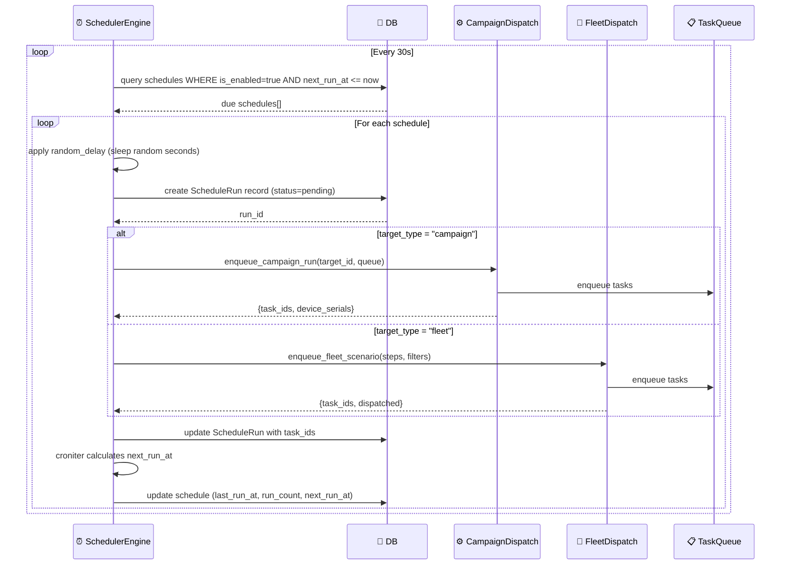
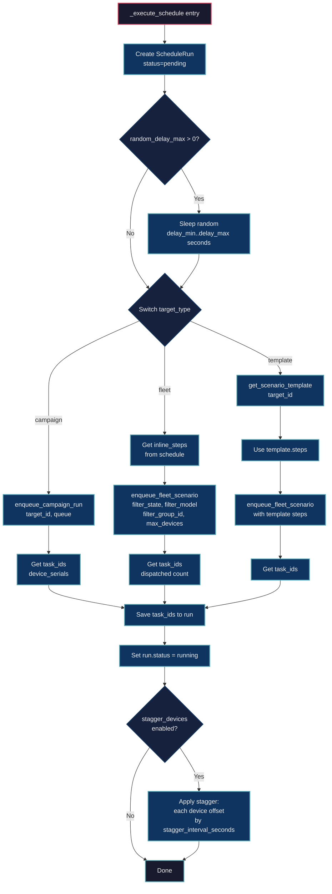
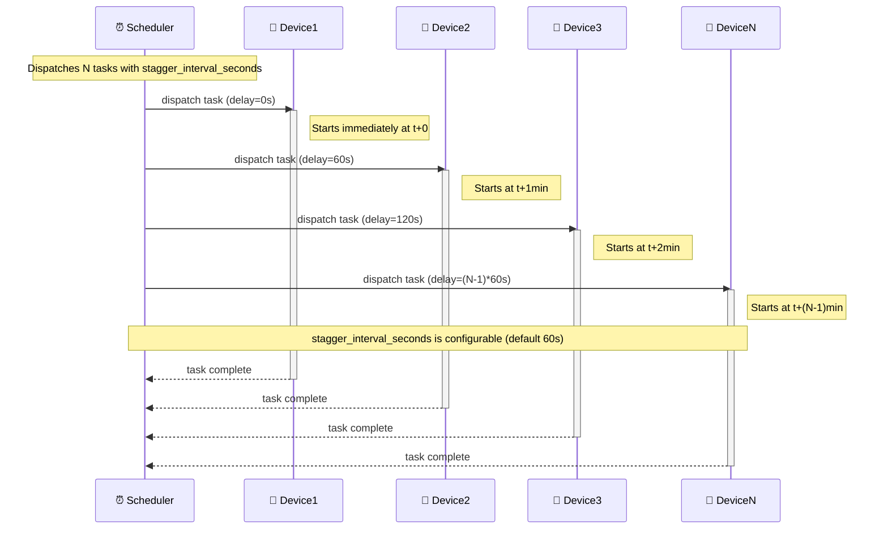

# DF-008: Scheduler & Cron System

- **Priority:** P0 (Must Have)
- **Effort:** M (1-2 tuan)
- **Phase:** 2 — Social Media Automation
- **Dependencies:** DF-004 (Device Groups)
- **Assignee:** —
- **Status:** Backlog

---

## 1. Muc tieu

Len lich chay scenario/campaign theo cron schedule (moi 30 phut, moi ngay luc 8h, ...). Ho tro randomize thoi gian de tranh pattern detection.

**Hien tai:** Campaign chi chay thu cong (click "Run" hoac API call).
**Sau khi xong:** Campaigns co the len lich tu dong, chay dinh ky.

---

## 2. User Stories

**US-008.1:** Toi muon chay campaign "fb_scroll_feed" moi 2 gio tu 8h-22h.

**US-008.2:** Toi muon moi device chay lech nhau 1-5 phut de khong tat ca chay cung luc.

**US-008.3:** Toi muon xem lich su cac lan chay da qua va trang thai (success/failed).

---

## 3. Thiet ke ky thuat

### 3.1 Database

**Bang moi:** `schedules`

```sql
CREATE TABLE schedules (
    id VARCHAR(36) PRIMARY KEY,
    name VARCHAR(255) NOT NULL,
    description TEXT DEFAULT '',
    -- Target: campaign hoac scenario template
    target_type VARCHAR(20) NOT NULL,           -- 'campaign' | 'template' | 'fleet'
    target_id VARCHAR(36),                       -- campaign_id hoac template_id
    -- Hoac inline scenario
    inline_steps JSON,                           -- neu target_type = 'fleet'
    inline_variables JSON DEFAULT '{}',
    -- Targeting devices
    device_group_id VARCHAR(36),                 -- target device group
    filter_state VARCHAR(20) DEFAULT 'READY',
    filter_model VARCHAR(100),
    max_devices INTEGER,
    -- Cron config
    cron_expression VARCHAR(100) NOT NULL,       -- "0 */2 8-22 * *" = moi 2h tu 8h-22h
    timezone VARCHAR(50) DEFAULT 'Asia/Ho_Chi_Minh',
    -- Randomization
    random_delay_min INTEGER DEFAULT 0,          -- seconds
    random_delay_max INTEGER DEFAULT 0,          -- seconds
    stagger_devices BOOLEAN DEFAULT FALSE,       -- moi device lech nhau
    stagger_interval_seconds INTEGER DEFAULT 60, -- khoang cach giua devices
    -- Status
    is_enabled BOOLEAN DEFAULT TRUE,
    last_run_at TIMESTAMP,
    next_run_at TIMESTAMP,
    run_count INTEGER DEFAULT 0,
    -- Meta
    user_id VARCHAR(36) REFERENCES users(id) ON DELETE SET NULL,
    created_at TIMESTAMP DEFAULT NOW(),
    updated_at TIMESTAMP DEFAULT NOW()
);

CREATE INDEX idx_schedules_enabled ON schedules(is_enabled);
CREATE INDEX idx_schedules_next_run ON schedules(next_run_at);
CREATE INDEX idx_schedules_user ON schedules(user_id);
```

**Bang moi:** `schedule_runs` — lich su chay

```sql
CREATE TABLE schedule_runs (
    id VARCHAR(36) PRIMARY KEY,
    schedule_id VARCHAR(36) REFERENCES schedules(id) ON DELETE CASCADE,
    status VARCHAR(20) DEFAULT 'pending',        -- pending, running, completed, failed, partial
    started_at TIMESTAMP DEFAULT NOW(),
    finished_at TIMESTAMP,
    devices_dispatched INTEGER DEFAULT 0,
    devices_succeeded INTEGER DEFAULT 0,
    devices_failed INTEGER DEFAULT 0,
    task_ids JSON DEFAULT '[]',                  -- list task IDs de track
    error_message TEXT,
    created_at TIMESTAMP DEFAULT NOW()
);

CREATE INDEX idx_schedule_runs_schedule ON schedule_runs(schedule_id);
CREATE INDEX idx_schedule_runs_status ON schedule_runs(status);
```

### 3.2 Scheduler Engine

**File moi:** `device_farm/services/scheduler.py`

```python
import asyncio
from datetime import datetime, timedelta
from croniter import croniter
import pytz

class SchedulerEngine:
    """Background task that checks and executes due schedules."""

    def __init__(self, queue: TaskQueue, manager: DeviceManager):
        self._queue = queue
        self._manager = manager
        self._running = False
        self._check_interval = 30  # seconds

    async def start(self):
        self._running = True
        while self._running:
            await self._check_due_schedules()
            await asyncio.sleep(self._check_interval)

    async def stop(self):
        self._running = False

    async def _check_due_schedules(self):
        now = datetime.utcnow()
        due = await get_due_schedules(now)  # is_enabled=True, next_run_at <= now

        for schedule in due:
            try:
                await self._execute_schedule(schedule)
            except Exception as e:
                await log_schedule_error(schedule.id, str(e))

            # Calculate next run
            tz = pytz.timezone(schedule.timezone)
            cron = croniter(schedule.cron_expression, now.astimezone(tz))
            schedule.next_run_at = cron.get_next(datetime)
            schedule.last_run_at = now
            schedule.run_count += 1
            await save_schedule(schedule)

    async def _execute_schedule(self, schedule):
        run = await create_schedule_run(schedule.id)

        # Apply random delay
        if schedule.random_delay_max > 0:
            delay = random.randint(schedule.random_delay_min, schedule.random_delay_max)
            await asyncio.sleep(delay)

        if schedule.target_type == "campaign":
            result, status = await enqueue_campaign_run(schedule.target_id, self._queue)
            run.task_ids = result.get("task_ids", [])
            run.devices_dispatched = len(result.get("device_serials", []))

        elif schedule.target_type == "fleet":
            steps = schedule.inline_steps or []
            result, status = enqueue_fleet_scenario(
                self._manager, self._queue,
                steps=steps,
                filter_state=schedule.filter_state,
                filter_model=schedule.filter_model,
                filter_group_id=schedule.device_group_id,
                max_devices=schedule.max_devices,
                priority=5,
                timeout=300,
                max_retries=2,
            )
            run.task_ids = result.get("task_ids", [])
            run.devices_dispatched = result.get("dispatched", 0)

        elif schedule.target_type == "template":
            template = await get_scenario_template(schedule.target_id)
            if template:
                steps = template.steps
                # Same as fleet dispatch...

        run.status = "running"
        await save_schedule_run(run)

        # Stagger logic
        if schedule.stagger_devices:
            # Task priority increases gradually = later dispatch
            # Already handled in fleet_dispatch by adding incremental delays
            pass
```

### 3.3 Cron Expression Examples

| Expression | Mo ta |
|-----------|-------|
| `*/30 * * * *` | Moi 30 phut |
| `0 */2 8-22 * *` | Moi 2 gio tu 8h-22h |
| `0 8 * * *` | Moi ngay luc 8h sang |
| `0 8,12,18 * * *` | 3 lan/ngay: 8h, 12h, 18h |
| `0 9 * * 1-5` | 9h sang, thu 2 - thu 6 |
| `0 */4 * * *` | Moi 4 gio |

### 3.4 Stagger Logic

Khi `stagger_devices = true`, moi device duoc assign delay tang dan:

```python
def _stagger_tasks(task_ids: list, interval_seconds: int):
    for i, task_id in enumerate(task_ids):
        delay = i * interval_seconds
        # Wrap task fn to sleep first
        original_fn = task.fn
        task.fn = lambda dev, d=delay, fn=original_fn: (time.sleep(d), fn(dev))[1]
```

Vd: 10 devices, stagger_interval=60s → device 1 chay ngay, device 2 sau 1 phut, ..., device 10 sau 9 phut.

### 3.5 Startup Integration

**Sua file:** `device_farm/web/server.py`

```python
scheduler_engine = SchedulerEngine(queue=task_queue, manager=device_manager)

@app.on_event("startup")
async def start_scheduler():
    asyncio.create_task(scheduler_engine.start())

@app.on_event("shutdown")
async def stop_scheduler():
    await scheduler_engine.stop()
```

### 3.6 API Endpoints

**File moi:** `device_farm/api/routes/schedules.py`

```
GET    /api/schedules                              → List schedules
POST   /api/schedules                              → Create schedule
GET    /api/schedules/{id}                         → Get schedule detail
PATCH  /api/schedules/{id}                         → Update schedule
DELETE /api/schedules/{id}                         → Delete schedule
POST   /api/schedules/{id}/toggle                  → Enable/disable
POST   /api/schedules/{id}/run-now                 → Trigger manual run

GET    /api/schedules/{id}/runs                    → List run history
GET    /api/schedules/{id}/runs/{run_id}           → Get run detail
```

### 3.7 API Schemas

```python
class ScheduleCreate(BaseModel):
    name: str
    description: str = ""
    target_type: str  # campaign | template | fleet
    target_id: str | None = None
    inline_steps: list | None = None
    inline_variables: dict = {}
    device_group_id: str | None = None
    filter_state: str = "READY"
    filter_model: str | None = None
    max_devices: int | None = None
    cron_expression: str
    timezone: str = "Asia/Ho_Chi_Minh"
    random_delay_min: int = 0
    random_delay_max: int = 0
    stagger_devices: bool = False
    stagger_interval_seconds: int = 60

class ScheduleOut(BaseModel):
    id: str
    name: str
    description: str
    target_type: str
    target_id: str | None
    cron_expression: str
    timezone: str
    is_enabled: bool
    last_run_at: datetime | None
    next_run_at: datetime | None
    run_count: int
    created_at: datetime

class ScheduleRunOut(BaseModel):
    id: str
    schedule_id: str
    status: str
    started_at: datetime
    finished_at: datetime | None
    devices_dispatched: int
    devices_succeeded: int
    devices_failed: int
    error_message: str | None
```

---

## 4. Frontend Changes

### 4.1 Schedules Page

**File moi:** `front-end/src/app/[locale]/dashboard/schedules/page.tsx`

- DataTable: name, target, cron (human readable), next_run, last_run, status, toggle
- Create/edit dialog voi:
  - Cron expression builder (visual: chon gio, ngay, khoang cach)
  - Target picker (campaign dropdown hoac template dropdown)
  - Device group picker
  - Randomization config (delay, stagger)
- Run history per schedule

### 4.2 Cron Expression Builder Component

**File moi:** `front-end/src/features/schedules/components/cron-builder.tsx`

- Tabs: Simple (presets) | Advanced (raw cron)
- Simple presets:
  - "Moi N phut/gio"
  - "Moi ngay luc HH:MM"
  - "Ngay trong tuan"
  - "Khoang thoi gian (8h-22h)"
- Human-readable preview: "Chay moi 2 gio tu 8h den 22h"

### 4.3 Dashboard Widget

- Schedule overview: upcoming runs, recently completed
- Calendar view: visual schedule timeline

---

## 5. Dependencies (Python)

```
croniter>=2.0.0
pytz>=2024.1
```

---

## Diagrams & Mockups

### 1. Sequence Diagram: Scheduler Engine Polling & Execution



### 2. Flowchart: Schedule Execution by Target Type



### 3. Sequence Diagram: Device Stagger Logic



### 4. ASCII Mockup: Schedules Page + Cron Builder

**Mockup A — Schedules Page**

```
┌──────────────────────────────────────────────────────────────────────────────────┐
│  Schedules                                                    [+ Create Schedule]│
├──────────────────────────────────────────────────────────────────────────────────┤
│                                                                                  │
│  ┌────────────────┬─────────────────────┬──────────────┬──────────────┬─────────┐│
│  │ Name           │ Target              │ Cron         │ Next / Last  │ Status  ││
│  ├────────────────┼─────────────────────┼──────────────┼──────────────┼─────────┤│
│  │ FB Daily Scroll│ Campaign: FB Farm   │ Every 2h     │ Mar 27 10:00 │ [■ ON]  ││
│  │                │                     │ 8-22h        │ Mar 26 22:00 │  45 runs││
│  ├────────────────┼─────────────────────┼──────────────┼──────────────┼─────────┤│
│  │ IG Warm-up     │ Template: IG Browse │ Every day    │ Mar 27 08:00 │ [■ ON]  ││
│  │                │                     │ at 8:00      │ Mar 26 08:00 │  12 runs││
│  ├────────────────┼─────────────────────┼──────────────┼──────────────┼─────────┤│
│  │ TikTok Nightly │ Fleet (inline)      │ Every day    │ —            │ [□ OFF] ││
│  │                │                     │ at 23:00     │ Mar 25 23:00 │   7 runs││
│  └────────────────┴─────────────────────┴──────────────┴──────────────┴─────────┘│
│                                                                                  │
│  Showing 1-3 of 3                                          « 1 »                 │
└──────────────────────────────────────────────────────────────────────────────────┘
```

**Mockup B — Create Schedule Dialog**

```
┌──────────────────────────────────────────────────────────────┐
│  Create Schedule                                         [X] │
├──────────────────────────────────────────────────────────────┤
│                                                              │
│  Name        ┌──────────────────────────────────────┐        │
│              │ FB Daily Scroll                      │        │
│              └──────────────────────────────────────┘        │
│                                                              │
│  Target Type   (●) Campaign   (○) Template   (○) Fleet      │
│                                                              │
│  Target      ┌──────────────────────────────────┐            │
│              │ FB Farm                        ▼ │            │
│              └──────────────────────────────────┘            │
│                                                              │
│  ┌─────────────────────────────────────────────────────┐     │
│  │  [Simple]  [Advanced]                               │     │
│  ├─────────────────────────────────────────────────────┤     │
│  │                                                     │     │
│  │  Run every  [ 2 ▼]  [hours ▼]                       │     │
│  │                                                     │     │
│  │  From  [08:00 ▼]   to  [22:00 ▼]                    │     │
│  │                                                     │     │
│  │  ℹ Runs every 2 hours from 8:00 to 22:00 daily      │     │
│  └─────────────────────────────────────────────────────┘     │
│                                                              │
│  ┌─────────────────────────────────────────────────────┐     │
│  │  Advanced tab (when selected):                      │     │
│  │                                                     │     │
│  │  Cron  ┌────────────────────────┐                   │     │
│  │        │ 0 */2 8-22 * *        │                   │     │
│  │        └────────────────────────┘                   │     │
│  │  ℹ Runs every 2 hours from 8:00 to 22:00 daily      │     │
│  └─────────────────────────────────────────────────────┘     │
│                                                              │
│  ── Randomization ──────────────────────────────────────     │
│                                                              │
│  Random delay   [ 0 ] — [ 300 ] seconds                      │
│                                                              │
│  [✓] Stagger devices     Interval  [ 60 ] seconds            │
│                                                              │
├──────────────────────────────────────────────────────────────┤
│                              [Cancel]   [Create Schedule]     │
└──────────────────────────────────────────────────────────────┘
```

---

## 6. Test Plan

| Test Case | Expected |
|-----------|----------|
| Create schedule | Schedule saved, next_run_at calculated |
| Cron "*/30 * * * *" | Triggers every 30 minutes |
| Cron "0 8 * * *" timezone VN | Triggers at 8:00 VN time |
| Schedule triggers | Campaign/fleet dispatched |
| Random delay 0-300s | Actual run delayed by random amount |
| Stagger 10 devices 60s | Device 10 starts 9 min after device 1 |
| Disable schedule | No longer triggers |
| Run-now manual trigger | Executes immediately regardless of cron |
| Run history recorded | ScheduleRun created with status tracking |
| Failed run | Status = failed, error message saved |
| next_run_at recalculated | After each run, next_run updated |

---

## 7. Acceptance Criteria

- [ ] SchedulerEngine chay background, check due schedules moi 30s
- [ ] Cron expressions parse va execute dung
- [ ] Timezone support (Asia/Ho_Chi_Minh default)
- [ ] Random delay truoc khi execute
- [ ] Stagger devices (incremental delay)
- [ ] Target: campaign, template, fleet (inline steps)
- [ ] Run history luu tru va query duoc
- [ ] API CRUD + toggle + run-now
- [ ] Frontend: schedules page voi cron builder
- [ ] Frontend: run history view

---

## 8. Files Changed

| File | Action | Mo ta |
|------|--------|-------|
| `device_farm/db/models/schedule.py` | **NEW** | Schedule + ScheduleRun models |
| `device_farm/db/crud/schedule.py` | **NEW** | CRUD operations |
| `device_farm/services/scheduler.py` | **NEW** | SchedulerEngine |
| `device_farm/api/routes/schedules.py` | **NEW** | API endpoints |
| `device_farm/api/schemas/schedule.py` | **NEW** | Pydantic schemas |
| `device_farm/api/mount.py` | EDIT | Mount schedules router |
| `device_farm/web/server.py` | EDIT | Start scheduler on startup |
| `front-end/src/app/[locale]/dashboard/schedules/page.tsx` | **NEW** | Schedules page |
| `front-end/src/features/schedules/` | **NEW** | Components, hooks, services |
| `alembic/versions/xxx_schedules.py` | **NEW** | Migration |
| `pyproject.toml` | EDIT | Them croniter, pytz |
