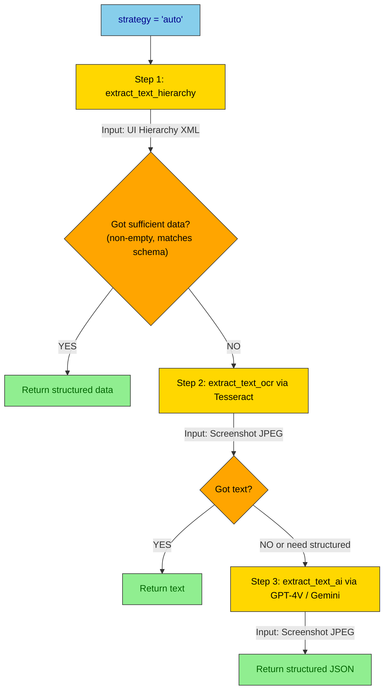
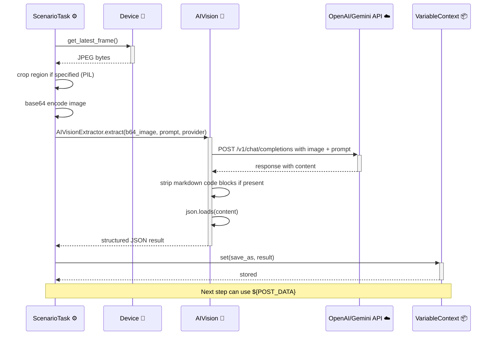
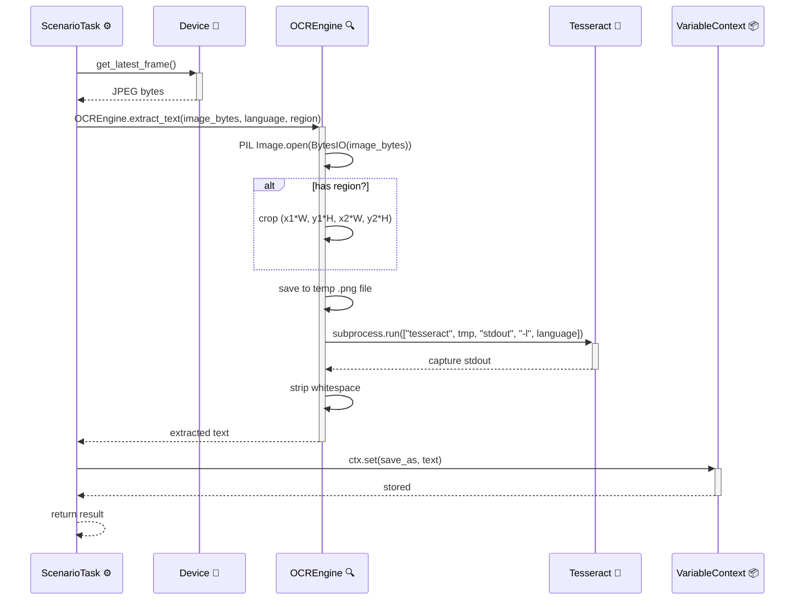

# DF-009: OCR & Screen Text Extraction

- **Priority:** P0 (Must Have)
- **Effort:** L (2-4 tuan)
- **Phase:** 3 — Content & Data
- **Dependencies:** None
- **Assignee:** —
- **Status:** Backlog

---

## 1. Muc tieu

Trich xuat noi dung text tu man hinh thiet bi bang OCR (Tesseract) va AI Vision (GPT-4V, Gemini Vision). Ho tro extract structured data tu social media posts (author, content, likes, comments).

**Hien tai:** Chi doc duoc text tu UI hierarchy XML (chi co text cua native views, khong doc duoc WebView/Canvas).
**Sau khi xong:** Extract text tu bat ky man hinh nao, ke ca WebView, video overlays, images.

---

## 2. User Stories

**US-009.1:** Toi muon extract noi dung bai viet Facebook dang hien tren man hinh (author, text, so like, so comment).

**US-009.2:** Toi muon OCR toan bo man hinh de lay text ma UI hierarchy khong co (render tren canvas).

**US-009.3:** Toi muon extract va luu text tu moi video TikTok dang xem (caption, hashtags, author).

---

## 3. Thiet ke ky thuat

### 3.1 Extraction Engine Architecture

```
┌──────────────┐     ┌────────────────┐     ┌─────────────┐
│  Screenshot  │────▶│  Extraction    │────▶│  Structured │
│  (JPEG)      │     │  Engine        │     │  Data       │
└──────────────┘     │                │     └─────────────┘
                     │  Strategy 1:   │
┌──────────────┐     │  UI Hierarchy  │     ┌─────────────┐
│  UI Hierarchy│────▶│  + Text parse  │────▶│  Variables  │
│  (XML)       │     │                │     │  for next   │
└──────────────┘     │  Strategy 2:   │     │  steps      │
                     │  OCR (Tesseract)│     └─────────────┘
                     │                │
                     │  Strategy 3:   │     ┌─────────────┐
                     │  AI Vision     │────▶│  Content DB │
                     │  (GPT-4V/      │     │  (DF-010)   │
                     │   Gemini)      │     └─────────────┘
                     └────────────────┘
```

### 3.2 New Step Types

#### `extract_text_hierarchy` — Extract tu UI hierarchy

```json
{
  "type": "extract_text_hierarchy",
  "save_as": "SCREEN_TEXT",
  "filter_class": ["android.widget.TextView", "android.widget.EditText"],
  "exclude_empty": true,
  "format": "text"
}
```

| Field | Type | Default | Mo ta |
|-------|------|---------|-------|
| `save_as` | string | Required | Ten variable de luu ket qua |
| `filter_class` | list | null (all) | Chi lay text tu cac class nay |
| `exclude_empty` | bool | true | Bo qua empty text |
| `format` | string | "text" | "text" (plain) / "json" (structured) |

Output format="json":
```json
[
  {"text": "John Doe", "class": "TextView", "resource_id": "author_name", "bounds": [10,100,200,130]},
  {"text": "Great post!", "class": "TextView", "resource_id": "content_text", "bounds": [10,140,400,200]}
]
```

#### `extract_text_ocr` — OCR tu screenshot

```json
{
  "type": "extract_text_ocr",
  "save_as": "OCR_TEXT",
  "region": { "x1": 0, "y1": 0.2, "x2": 1.0, "y2": 0.8 },
  "language": "vie+eng"
}
```

| Field | Type | Default | Mo ta |
|-------|------|---------|-------|
| `save_as` | string | Required | Variable name |
| `region` | object | null (full screen) | Crop region (ratio 0-1) |
| `language` | string | "eng" | Tesseract language(s) |
| `psm` | int | 3 | Page segmentation mode |

Region la ratio-based (0-1) de device-independent.

#### `extract_text_ai` — AI Vision extraction

```json
{
  "type": "extract_text_ai",
  "save_as": "POST_DATA",
  "prompt": "Extract the social media post from this screenshot. Return JSON with: author (string), content (string), likes_count (number), comments_count (number), has_image (boolean), timestamp (string).",
  "provider": "openai",
  "format": "json"
}
```

| Field | Type | Default | Mo ta |
|-------|------|---------|-------|
| `save_as` | string | Required | Variable name |
| `prompt` | string | Required | Extraction instruction |
| `provider` | string | "openai" | "openai" / "gemini" |
| `region` | object | null (full) | Crop region |
| `format` | string | "json" | "json" / "text" |
| `model` | string | null | Override model (default tu env) |

#### `extract_screen_data` — Smart extraction (hierarchy + OCR + AI fallback)

```json
{
  "type": "extract_screen_data",
  "save_as": "EXTRACTED",
  "schema": {
    "author": "string",
    "content": "string",
    "likes": "number",
    "hashtags": "list"
  },
  "strategy": "auto"
}
```

| Field | Type | Default | Mo ta |
|-------|------|---------|-------|
| `save_as` | string | Required | Variable name |
| `schema` | dict | null | Expected output schema |
| `strategy` | string | "auto" | "hierarchy" / "ocr" / "ai" / "auto" |

"auto" strategy:
1. Try hierarchy text first (nhanh, mien phi)
2. Neu khong du data → fallback OCR
3. Neu can structured data → fallback AI Vision

#### `save_extraction` — Luu extraction result

```json
{
  "type": "save_extraction",
  "data_var": "POST_DATA",
  "collection": "fb_posts",
  "dedupe_field": "content"
}
```

| Field | Type | Default | Mo ta |
|-------|------|---------|-------|
| `data_var` | string | Required | Variable chua data |
| `collection` | string | "default" | Ten collection trong content DB |
| `dedupe_field` | string | null | Field de check duplicate |
| `tags` | string | "" | Tags for content |

### 3.3 OCR Engine Integration

**File moi:** `device_farm/runtime/extraction/ocr_engine.py`

```python
import subprocess
import tempfile
from PIL import Image
import io

class OCREngine:
    """Tesseract OCR wrapper."""

    def __init__(self):
        self._check_tesseract()

    def _check_tesseract(self):
        try:
            subprocess.run(["tesseract", "--version"], capture_output=True, check=True)
        except FileNotFoundError:
            raise RuntimeError("Tesseract not installed. Install: brew install tesseract")

    def extract_text(
        self,
        image_bytes: bytes,
        language: str = "eng",
        region: dict = None,
        psm: int = 3,
    ) -> str:
        img = Image.open(io.BytesIO(image_bytes))

        # Crop region (ratio-based)
        if region:
            w, h = img.size
            box = (
                int(region.get("x1", 0) * w),
                int(region.get("y1", 0) * h),
                int(region.get("x2", 1) * w),
                int(region.get("y2", 1) * h),
            )
            img = img.crop(box)

        with tempfile.NamedTemporaryFile(suffix=".png") as tmp:
            img.save(tmp.name)
            result = subprocess.run(
                ["tesseract", tmp.name, "stdout", "-l", language, "--psm", str(psm)],
                capture_output=True, text=True, timeout=30,
            )
            return result.stdout.strip()
```

### 3.4 AI Vision Integration

**File moi:** `device_farm/runtime/extraction/ai_vision.py`

```python
import base64
import httpx
import json
import os

class AIVisionExtractor:
    """Extract structured data from screenshots using AI Vision APIs."""

    async def extract(
        self,
        image_bytes: bytes,
        prompt: str,
        provider: str = "openai",
        format: str = "json",
        model: str = None,
    ) -> dict | str:
        b64 = base64.b64encode(image_bytes).decode()

        if provider == "openai":
            return await self._extract_openai(b64, prompt, format, model)
        elif provider == "gemini":
            return await self._extract_gemini(b64, prompt, format, model)
        else:
            raise ValueError(f"Unknown provider: {provider}")

    async def _extract_openai(self, b64_image, prompt, format, model):
        model = model or os.getenv("OPENAI_VISION_MODEL", "gpt-4o-mini")
        api_key = os.getenv("OPENAI_API_KEY")

        messages = [
            {"role": "user", "content": [
                {"type": "text", "text": prompt},
                {"type": "image_url", "image_url": {
                    "url": f"data:image/jpeg;base64,{b64_image}"
                }}
            ]}
        ]

        if format == "json":
            messages[0]["content"][0]["text"] += "\n\nRespond with valid JSON only, no markdown."

        async with httpx.AsyncClient() as client:
            resp = await client.post(
                "https://api.openai.com/v1/chat/completions",
                headers={"Authorization": f"Bearer {api_key}"},
                json={"model": model, "messages": messages, "max_tokens": 2000},
                timeout=60,
            )
            resp.raise_for_status()
            content = resp.json()["choices"][0]["message"]["content"]

            if format == "json":
                # Strip markdown code blocks if present
                content = content.strip()
                if content.startswith("```"):
                    content = content.split("\n", 1)[1].rsplit("```", 1)[0]
                return json.loads(content)
            return content

    async def _extract_gemini(self, b64_image, prompt, format, model):
        model = model or os.getenv("GEMINI_VISION_MODEL", "gemini-1.5-flash")
        api_key = os.getenv("GEMINI_API_KEY") or os.getenv("GOOGLE_API_KEY")

        parts = [
            {"text": prompt + ("\n\nRespond with valid JSON only." if format == "json" else "")},
            {"inline_data": {"mime_type": "image/jpeg", "data": b64_image}},
        ]

        async with httpx.AsyncClient() as client:
            resp = await client.post(
                f"https://generativelanguage.googleapis.com/v1beta/models/{model}:generateContent",
                params={"key": api_key},
                json={"contents": [{"parts": parts}]},
                timeout=60,
            )
            resp.raise_for_status()
            content = resp.json()["candidates"][0]["content"]["parts"][0]["text"]

            if format == "json":
                content = content.strip()
                if content.startswith("```"):
                    content = content.split("\n", 1)[1].rsplit("```", 1)[0]
                return json.loads(content)
            return content
```

### 3.5 Scenario Task Handlers

**Sua file:** `device_farm/tasks/scenario_task.py`

```python
from device_farm.runtime.extraction.ocr_engine import OCREngine
from device_farm.runtime.extraction.ai_vision import AIVisionExtractor

_ocr = None
_ai_vision = AIVisionExtractor()

def _get_ocr():
    global _ocr
    if _ocr is None:
        _ocr = OCREngine()
    return _ocr


def _handle_extract_text_hierarchy(device, step, ctx):
    xml = device.hierarchy_xml(force_refresh=True)
    if not xml:
        return {"ok": False, "message": "No hierarchy available"}

    # Parse XML and extract text
    texts = _parse_hierarchy_texts(xml, step.get("filter_class"), step.get("exclude_empty", True))

    if step.get("format") == "json":
        ctx.set(step["save_as"], texts)
    else:
        ctx.set(step["save_as"], "\n".join(t["text"] for t in texts))

    return {"ok": True, "message": f"Extracted {len(texts)} text elements"}


def _handle_extract_text_ocr(device, step, ctx):
    frame = device.get_latest_frame()
    if not frame:
        return {"ok": False, "message": "No screenshot available"}

    text = _get_ocr().extract_text(
        frame,
        language=step.get("language", "eng"),
        region=step.get("region"),
        psm=step.get("psm", 3),
    )

    ctx.set(step["save_as"], text)
    return {"ok": True, "message": f"OCR extracted {len(text)} chars"}


async def _handle_extract_text_ai(device, step, ctx):
    frame = device.get_latest_frame()
    if not frame:
        return {"ok": False, "message": "No screenshot available"}

    result = await _ai_vision.extract(
        frame,
        prompt=step["prompt"],
        provider=step.get("provider", "openai"),
        format=step.get("format", "json"),
        model=step.get("model"),
    )

    ctx.set(step["save_as"], result)
    return {"ok": True, "message": f"AI extracted data: {type(result).__name__}"}
```

---

## 4. API Endpoints

**File moi:** `device_farm/api/routes/extraction.py`

```
POST   /api/devices/{serial}/extract/hierarchy      → Extract text from hierarchy
POST   /api/devices/{serial}/extract/ocr             → Extract text via OCR
POST   /api/devices/{serial}/extract/ai              → Extract via AI Vision
```

Standalone extraction (khong can scenario):
```python
@router.post("/api/devices/{serial}/extract/ocr")
async def extract_ocr(serial: str, body: OCRExtractBody):
    device = manager.get_device(serial)
    frame = device.get_latest_frame()
    text = ocr_engine.extract_text(frame, language=body.language, region=body.region)
    return {"text": text}

@router.post("/api/devices/{serial}/extract/ai")
async def extract_ai(serial: str, body: AIExtractBody):
    device = manager.get_device(serial)
    frame = device.get_latest_frame()
    result = await ai_vision.extract(frame, prompt=body.prompt, provider=body.provider)
    return {"data": result}
```

---

## 5. MCP Tools

**Sua file:** `device_farm/mcp/server.py`

```python
@tool
def df_extract_text_ocr(device_id=None, session_id=None, language="eng", region=None):
    """Extract text from device screen using OCR (Tesseract)."""

@tool
def df_extract_text_ai(prompt: str, device_id=None, session_id=None, provider="openai"):
    """Extract structured data from device screen using AI Vision."""

@tool
def df_extract_hierarchy_text(device_id=None, session_id=None, filter_class=None):
    """Extract all visible text from UI hierarchy."""
```

---

## 6. Environment Variables

| Variable | Mo ta | Default |
|----------|-------|---------|
| `OPENAI_VISION_MODEL` | Model for OpenAI Vision | gpt-4o-mini |
| `GEMINI_VISION_MODEL` | Model for Gemini Vision | gemini-1.5-flash |
| `TESSERACT_CMD` | Path to tesseract binary | tesseract (in PATH) |
| `OCR_DEFAULT_LANGUAGE` | Default OCR language | eng |

---

## Diagrams & Mockups

### 1. Flowchart: extract_screen_data Auto Strategy Fallback



### 2. Sequence Diagram: AI Vision Extraction Flow



### 3. Sequence Diagram: OCR Extraction with Region Crop



---

## 7. System Requirements

```bash
# macOS
brew install tesseract
brew install tesseract-lang  # for Vietnamese and other languages

# Ubuntu/Debian
apt-get install tesseract-ocr tesseract-ocr-vie

# Python
pip install Pillow
```

---

## 8. Test Plan

| Test Case | Expected |
|-----------|----------|
| extract_text_hierarchy | Lay duoc list text tu XML |
| extract_text_ocr full screen | Text extracted tu screenshot |
| extract_text_ocr with region | Chi extract tu vung chon |
| extract_text_ocr Vietnamese | Tieng Viet recognized |
| extract_text_ai JSON | Structured JSON returned |
| extract_text_ai text | Plain text returned |
| extract_screen_data auto | Hierarchy first, fallback OCR/AI |
| save_extraction | Data saved to content DB |
| save_extraction dedupe | Duplicate content skipped |
| No screenshot available | Error handled gracefully |
| AI provider error | Error reported, scenario continues |
| OCR timeout | Timeout after 30s |

---

## 9. Acceptance Criteria

- [ ] `extract_text_hierarchy` step lay text tu XML
- [ ] `extract_text_ocr` step dung Tesseract, ho tro region crop
- [ ] `extract_text_ai` step dung OpenAI/Gemini Vision
- [ ] `extract_screen_data` smart fallback (hierarchy → OCR → AI)
- [ ] `save_extraction` luu vao DB (DF-010 dependency)
- [ ] Extracted data luu vao VariableContext de steps sau su dung
- [ ] REST API cho standalone extraction
- [ ] MCP tools cho extraction
- [ ] Tesseract Vietnamese language support

---

## 10. Files Changed

| File | Action | Mo ta |
|------|--------|-------|
| `device_farm/runtime/extraction/__init__.py` | **NEW** | Package |
| `device_farm/runtime/extraction/ocr_engine.py` | **NEW** | Tesseract OCR wrapper |
| `device_farm/runtime/extraction/ai_vision.py` | **NEW** | AI Vision extractor |
| `device_farm/common/scenario_schema.py` | EDIT | Them 5 extraction step types |
| `device_farm/tasks/scenario_task.py` | EDIT | Them extraction handlers |
| `device_farm/api/routes/extraction.py` | **NEW** | Extraction API endpoints |
| `device_farm/api/mount.py` | EDIT | Mount extraction router |
| `device_farm/mcp/server.py` | EDIT | Them extraction MCP tools |
| `pyproject.toml` | EDIT | Them Pillow dependency |
| `tests/test_extraction.py` | **NEW** | Unit tests |
