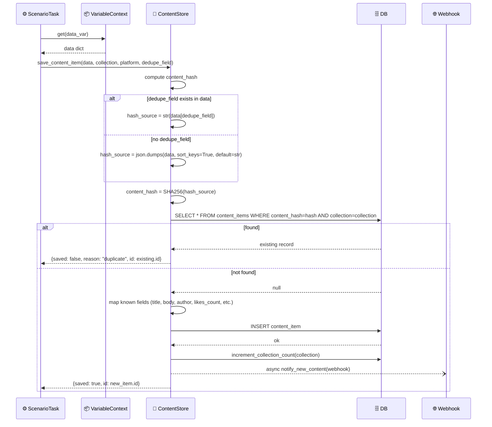
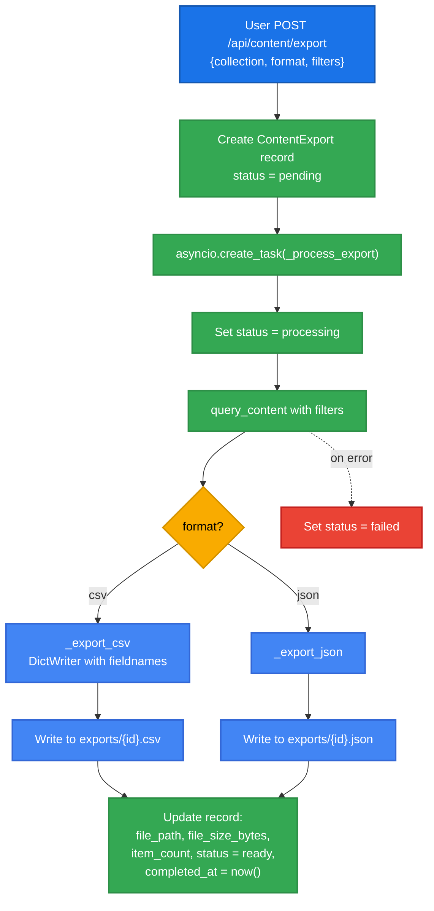
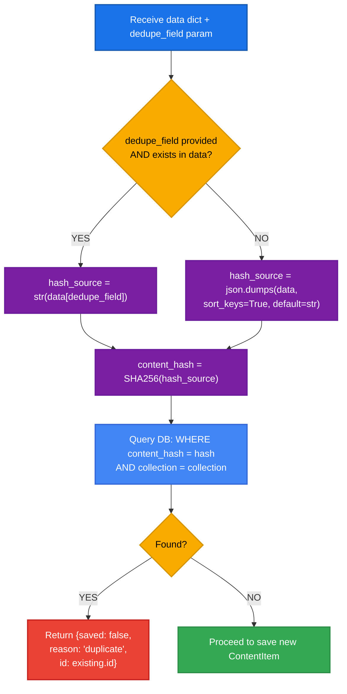

# DF-010: Content Pipeline (Crawl → Store → Export)

- **Priority:** P1 (Should Have)
- **Effort:** XL (4-6 tuan)
- **Phase:** 3 — Content & Data
- **Dependencies:** DF-009 (OCR & Extraction)
- **Assignee:** —
- **Status:** Backlog

---

## 1. Muc tieu

He thong luu tru, tim kiem va export noi dung da extract tu devices. Cho phep crawl content tu social media (posts, profiles, videos) va luu vao database co cau truc.

**Hien tai:** Extraction results chi ton tai trong VariableContext (mat khi scenario xong).
**Sau khi xong:** Content luu tru vinh vien, searchable, exportable.

---

## 2. User Stories

**US-010.1:** Toi muon crawl 1000 bai viet Facebook va export ra CSV de phan tich.

**US-010.2:** Toi muon xem tat ca content da crawl duoc tu dashboard, filter theo platform, ngay, device.

**US-010.3:** Toi muon webhook gui content moi den he thong khac khi crawl duoc.

---

## 3. Thiet ke ky thuat

### 3.1 Database

**Bang moi:** `content_items`

```sql
CREATE TABLE content_items (
    id VARCHAR(36) PRIMARY KEY,
    collection VARCHAR(100) NOT NULL DEFAULT 'default',
    platform VARCHAR(50),                       -- facebook, tiktok, instagram, web
    content_type VARCHAR(50) DEFAULT 'post',    -- post, profile, video, comment, story
    -- Content fields
    title VARCHAR(500),
    body TEXT,
    author VARCHAR(255),
    author_id VARCHAR(255),
    url VARCHAR(1000),
    -- Metrics
    likes_count INTEGER,
    comments_count INTEGER,
    shares_count INTEGER,
    views_count INTEGER,
    -- Media
    thumbnail_url VARCHAR(1000),
    media_urls JSON DEFAULT '[]',               -- list of image/video URLs
    screenshot_path VARCHAR(500),               -- local screenshot path
    -- Metadata
    raw_data JSON DEFAULT '{}',                 -- full extracted JSON
    tags VARCHAR(500) DEFAULT '',
    content_hash VARCHAR(64),                   -- SHA256 for dedup
    -- Source tracking
    device_serial VARCHAR(100),
    campaign_id VARCHAR(36),
    schedule_id VARCHAR(36),
    scenario_name VARCHAR(255),
    -- Timestamps
    extracted_at TIMESTAMP DEFAULT NOW(),
    content_date TIMESTAMP,                     -- khi content duoc post (estimated)
    created_at TIMESTAMP DEFAULT NOW()
);

CREATE INDEX idx_ci_collection ON content_items(collection);
CREATE INDEX idx_ci_platform ON content_items(platform);
CREATE INDEX idx_ci_content_type ON content_items(content_type);
CREATE INDEX idx_ci_content_hash ON content_items(content_hash);
CREATE INDEX idx_ci_device ON content_items(device_serial);
CREATE INDEX idx_ci_campaign ON content_items(campaign_id);
CREATE INDEX idx_ci_extracted ON content_items(extracted_at);
```

**Bang moi:** `content_collections`

```sql
CREATE TABLE content_collections (
    id VARCHAR(36) PRIMARY KEY,
    name VARCHAR(100) NOT NULL UNIQUE,
    description TEXT DEFAULT '',
    platform VARCHAR(50),
    content_type VARCHAR(50),
    item_count INTEGER DEFAULT 0,
    user_id VARCHAR(36) REFERENCES users(id) ON DELETE SET NULL,
    created_at TIMESTAMP DEFAULT NOW(),
    updated_at TIMESTAMP DEFAULT NOW()
);
```

**Bang moi:** `content_exports`

```sql
CREATE TABLE content_exports (
    id VARCHAR(36) PRIMARY KEY,
    collection VARCHAR(100),
    format VARCHAR(10) NOT NULL,               -- csv, json, xlsx
    status VARCHAR(20) DEFAULT 'pending',      -- pending, processing, ready, failed
    filters JSON DEFAULT '{}',                 -- filters applied
    file_path VARCHAR(500),
    file_size_bytes BIGINT,
    item_count INTEGER DEFAULT 0,
    user_id VARCHAR(36) REFERENCES users(id) ON DELETE SET NULL,
    created_at TIMESTAMP DEFAULT NOW(),
    completed_at TIMESTAMP
);
```

### 3.2 Content Ingestion — save_extraction Step Handler

```python
# device_farm/services/content_store.py

import hashlib
import json

async def save_content_item(
    data: dict,
    collection: str = "default",
    platform: str = None,
    content_type: str = "post",
    device_serial: str = None,
    campaign_id: str = None,
    dedupe_field: str = None,
    screenshot_bytes: bytes = None,
    tags: str = "",
) -> dict:
    """Save extracted content to database."""

    # Content hash for dedup
    hash_source = json.dumps(data, sort_keys=True, default=str)
    if dedupe_field and dedupe_field in data:
        hash_source = str(data[dedupe_field])
    content_hash = hashlib.sha256(hash_source.encode()).hexdigest()

    # Check duplicate
    existing = await get_content_by_hash(content_hash, collection)
    if existing:
        return {"saved": False, "reason": "duplicate", "id": existing.id}

    # Save screenshot if provided
    screenshot_path = None
    if screenshot_bytes:
        screenshot_path = await _save_screenshot(screenshot_bytes, content_hash)

    # Map known fields
    item = ContentItem(
        collection=collection,
        platform=platform,
        content_type=content_type,
        title=data.get("title", ""),
        body=data.get("content") or data.get("body") or data.get("text", ""),
        author=data.get("author", ""),
        author_id=data.get("author_id", ""),
        url=data.get("url", ""),
        likes_count=_safe_int(data.get("likes_count") or data.get("likes")),
        comments_count=_safe_int(data.get("comments_count") or data.get("comments")),
        shares_count=_safe_int(data.get("shares_count") or data.get("shares")),
        views_count=_safe_int(data.get("views_count") or data.get("views")),
        media_urls=data.get("media_urls", []),
        raw_data=data,
        tags=tags,
        content_hash=content_hash,
        device_serial=device_serial,
        campaign_id=campaign_id,
        screenshot_path=screenshot_path,
    )

    await save(item)
    await increment_collection_count(collection)

    return {"saved": True, "id": item.id}
```

### 3.3 Export Engine

**File moi:** `device_farm/services/content_export.py`

```python
import csv
import json
import io

async def export_content(
    collection: str,
    format: str,
    filters: dict = None,
    user_id: str = None,
) -> str:
    """Create export job. Returns export_id."""
    export = ContentExport(
        collection=collection,
        format=format,
        filters=filters or {},
        user_id=user_id,
    )
    await save(export)

    # Process in background
    asyncio.create_task(_process_export(export.id))
    return export.id


async def _process_export(export_id: str):
    export = await get_export(export_id)
    export.status = "processing"
    await save(export)

    try:
        items = await query_content(
            collection=export.collection,
            **export.filters,
        )

        if export.format == "csv":
            file_path = await _export_csv(items, export_id)
        elif export.format == "json":
            file_path = await _export_json(items, export_id)

        export.file_path = file_path
        export.item_count = len(items)
        export.file_size_bytes = os.path.getsize(file_path)
        export.status = "ready"
        export.completed_at = datetime.utcnow()

    except Exception as e:
        export.status = "failed"
        export.file_path = None

    await save(export)


async def _export_csv(items: list, export_id: str) -> str:
    path = f"exports/{export_id}.csv"
    os.makedirs("exports", exist_ok=True)

    with open(path, "w", newline="") as f:
        fields = ["id", "platform", "content_type", "author", "body",
                  "likes_count", "comments_count", "url", "tags",
                  "device_serial", "extracted_at"]
        writer = csv.DictWriter(f, fieldnames=fields, extrasaction="ignore")
        writer.writeheader()
        for item in items:
            writer.writerow(item.to_dict())

    return path
```

### 3.4 Webhook Notifications

```python
# device_farm/services/content_webhooks.py

async def notify_new_content(item: ContentItem):
    """Send webhook when new content is saved."""
    webhooks = await get_active_webhooks(collection=item.collection)
    for webhook in webhooks:
        try:
            async with httpx.AsyncClient() as client:
                await client.post(
                    webhook.url,
                    json={
                        "event": "content.new",
                        "collection": item.collection,
                        "item": item.to_dict(),
                    },
                    headers=webhook.headers or {},
                    timeout=10,
                )
        except Exception:
            pass  # log but don't fail
```

### 3.5 API Endpoints

**File moi:** `device_farm/api/routes/content.py`

```
# Content Items
GET    /api/content                                → List content (filter: collection, platform, date range, search)
GET    /api/content/{id}                           → Get content item
DELETE /api/content/{id}                           → Delete content item
DELETE /api/content                                → Bulk delete (by filter)

# Collections
GET    /api/content/collections                    → List collections with counts
POST   /api/content/collections                    → Create collection
DELETE /api/content/collections/{name}             → Delete collection and all items

# Exports
POST   /api/content/export                         → Create export job
GET    /api/content/exports                        → List exports
GET    /api/content/exports/{id}                   → Get export status
GET    /api/content/exports/{id}/download          → Download export file

# Stats
GET    /api/content/stats                          → Aggregate stats (total items, by platform, by date)
```

### 3.6 API Schemas

```python
class ContentItemOut(BaseModel):
    id: str
    collection: str
    platform: str | None
    content_type: str
    title: str | None
    body: str | None
    author: str | None
    url: str | None
    likes_count: int | None
    comments_count: int | None
    shares_count: int | None
    views_count: int | None
    tags: str
    device_serial: str | None
    extracted_at: datetime

class ContentQueryParams(BaseModel):
    collection: str | None = None
    platform: str | None = None
    content_type: str | None = None
    search: str | None = None           # full text search in body
    date_from: datetime | None = None
    date_to: datetime | None = None
    device_serial: str | None = None
    campaign_id: str | None = None
    limit: int = 50
    offset: int = 0

class ExportRequest(BaseModel):
    collection: str
    format: str = "csv"                  # csv | json
    filters: dict = {}

class ContentStatsOut(BaseModel):
    total_items: int
    by_platform: dict[str, int]
    by_collection: dict[str, int]
    by_date: list[dict]                  # [{date, count}, ...]
    latest_extraction: datetime | None
```

---

## 4. Frontend Changes

### 4.1 Content Browser Page

**File moi:** `front-end/src/app/[locale]/dashboard/content/page.tsx`

- DataTable voi columns: platform (icon), type, author, body (truncated), likes, extracted_at
- Filter sidebar: collection, platform, date range, search
- Click row → detail view voi full content + screenshot + raw JSON
- Bulk actions: delete, export selected
- Export button → chon format (CSV/JSON) → download

### 4.2 Collection Manager

- List collections voi item count
- Create/rename/delete collections
- Quick stats per collection

### 4.3 Content Stats Dashboard Widget

- Total items extracted
- Chart: items per day (line chart)
- Breakdown by platform (pie chart)
- Recent extractions list

---

## 5. MCP Tools

```python
@tool
def df_save_content(data: dict, collection: str = "default", platform: str = None, tags: str = ""):
    """Save extracted content to the content database."""

@tool
def df_query_content(collection: str = None, platform: str = None, search: str = None, limit: int = 20):
    """Query saved content items."""

@tool
def df_content_stats():
    """Get content extraction statistics."""

@tool
def df_export_content(collection: str, format: str = "csv"):
    """Export content collection to file."""
```

---

## Diagrams & Mockups

### 1. Sequence Diagram: Content Ingestion (save_extraction step)



### 2. Flowchart: Content Export Pipeline



### 3. Flowchart: Content Deduplication Logic



### 4. ASCII Mockup: Content Browser Page

```
+-------------------------------------------------------------------------------------------+
|  Content Browser                                          [ Export CSV ▼ ]  [ Bulk Delete ] |
+-------------------------------------------------------------------------------------------+
|            |                                                                               |
|  FILTERS   |  +-------+----------+----------+---------------------------+-------+-------+-----------+
|            |  | Platf | Type     | Author   | Body                      | Likes | Cmnts | Extracted |
|  Collection|  +-------+----------+----------+---------------------------+-------+-------+-----------+
|  [▼ all  ] |  | 📘 FB | post     | john.doe | "Ban hang online gia re…" |  1204 |    87 | 03-25 14h |
|            |  | 🎵 TT | video    | tiktoker | "Review san pham moi nh…" | 45.2K |  1.2K | 03-25 13h |
|  Platform  |  | 📘 FB | comment  | user_vn  | "San pham nay co tot kh…" |    32 |     5 | 03-25 12h |
|  ( ) All   |  | 🎵 TT | post     | shop_abc | "Flash sale hom nay! Gi…" |  8.7K |   340 | 03-25 11h |
|  (o) FB    |  | 📘 FB | profile  | brand_x  | "Cua hang chinh hang si…" |   520 |    15 | 03-25 10h |
|  ( ) TT    |  +-------+----------+----------+---------------------------+-------+-------+-----------+
|            |  |                         < 1  2  3 ... 47 >                                |
|  Date Range|  +--------------------------------------------------------------------------|
|  From [__] |                                                                               |
|  To   [__] |                                                                               |
|            |                                                                               |
|  Search    |                                                                               |
|  [🔍 Search content...]                                                                   |
|            |                                                                               |
+-------------------------------------------------------------------------------------------+

Click row → slide-out detail panel:

+-------------------------------------------------------------------------------------------+
|  ...main table...                              |  CONTENT DETAIL                    [ X ]  |
|                                                |                                          |
|                                                |  Platform: 📘 Facebook                   |
|                                                |  Type: post                              |
|                                                |  Author: john.doe                        |
|                                                |                                          |
|                                                |  Body:                                   |
|                                                |  ┌──────────────────────────────────┐     |
|                                                |  │ Ban hang online gia re, chat     │     |
|                                                |  │ luong dam bao. Lien he ngay de   │     |
|                                                |  │ duoc tu van mien phi...          │     |
|                                                |  └──────────────────────────────────┘     |
|                                                |                                          |
|                                                |  Screenshot:                             |
|                                                |  ┌──────────────────────────────────┐     |
|                                                |  │         [screenshot.png]         │     |
|                                                |  └──────────────────────────────────┘     |
|                                                |                                          |
|                                                |  ▶ Raw JSON ─────────────────────────    |
|                                                |                                          |
|                                                |  Tags: #ecommerce #facebook              |
|                                                |  Device: R5CT900XYZ                      |
|                                                |  Campaign: camp_fb_crawl_01 (link)       |
|                                                |                                          |
+-------------------------------------------------------------------------------------------+
```

---

## 6. Test Plan

| Test Case | Expected |
|-----------|----------|
| Save content item | Item saved with hash |
| Duplicate content (same hash) | Skipped, returns existing ID |
| Query by collection | Only matching items returned |
| Query full text search | Body text searched |
| Export CSV | Valid CSV file generated |
| Export JSON | Valid JSON file generated |
| Delete collection | All items in collection deleted |
| Content stats | Correct counts returned |
| Webhook on new content | POST sent to webhook URL |
| Save with screenshot | Screenshot file saved, path stored |
| Pagination (limit/offset) | Correct page returned |

---

## 7. Acceptance Criteria

- [ ] `save_extraction` step luu content vao DB voi dedup
- [ ] Content query API voi filter, search, pagination
- [ ] Collections management (create, list, delete)
- [ ] Export to CSV va JSON
- [ ] Content stats endpoint
- [ ] Webhook notifications (optional)
- [ ] Frontend: content browser page
- [ ] Frontend: export + download
- [ ] MCP tools cho content management
- [ ] Screenshot luu kem content

---

## 8. Files Changed

| File | Action | Mo ta |
|------|--------|-------|
| `device_farm/db/models/content.py` | **NEW** | ContentItem, ContentCollection, ContentExport models |
| `device_farm/db/crud/content.py` | **NEW** | CRUD + query operations |
| `device_farm/services/content_store.py` | **NEW** | Content ingestion logic |
| `device_farm/services/content_export.py` | **NEW** | Export engine |
| `device_farm/services/content_webhooks.py` | **NEW** | Webhook notifications |
| `device_farm/api/routes/content.py` | **NEW** | API endpoints |
| `device_farm/api/schemas/content.py` | **NEW** | Pydantic schemas |
| `device_farm/api/mount.py` | EDIT | Mount content router |
| `device_farm/tasks/scenario_task.py` | EDIT | save_extraction handler |
| `device_farm/mcp/server.py` | EDIT | Content MCP tools |
| `front-end/src/app/[locale]/dashboard/content/page.tsx` | **NEW** | Content browser |
| `front-end/src/features/content/` | **NEW** | Components, hooks, services |
| `alembic/versions/xxx_content.py` | **NEW** | Migration |
