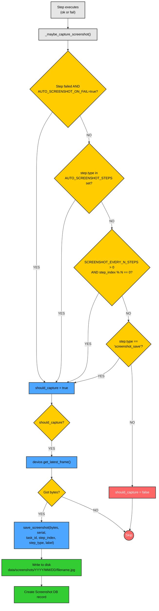
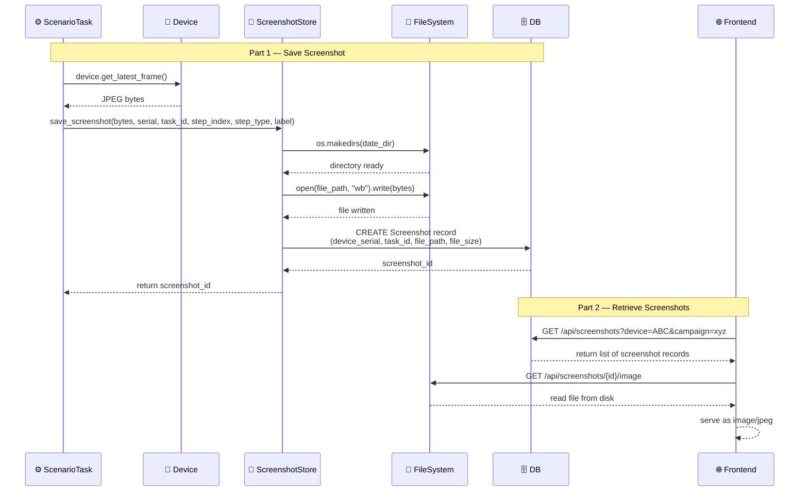

# DF-011: Screenshot Archive & Visual Log

- **Priority:** P1 (Should Have)
- **Effort:** M (1-2 tuan)
- **Phase:** 3 — Content & Data
- **Dependencies:** None
- **Assignee:** —
- **Status:** Backlog

---

## 1. Muc tieu

Luu screenshot theo timeline cho moi scenario run. Cho phep xem lai visual history de debug failed scenarios va review ket qua automation.

**Hien tai:** Screenshot chi ton tai in-memory (latest frame). Mat khi scenario xong.
**Sau khi xong:** Moi step quan trong duoc luu screenshot, viewable tu dashboard.

---

## 2. User Stories

**US-011.1:** Khi scenario fail, toi muon xem screenshot tai buoc fail de biet dang o man hinh nao.

**US-011.2:** Toi muon xem gallery toan bo screenshots cua mot campaign run de verify ket qua.

---

## 3. Thiet ke ky thuat

### 3.1 Database

**Bang moi:** `screenshots`

```sql
CREATE TABLE screenshots (
    id VARCHAR(36) PRIMARY KEY,
    device_serial VARCHAR(100) NOT NULL,
    -- Context
    task_id VARCHAR(36),
    campaign_id VARCHAR(36),
    schedule_run_id VARCHAR(36),
    step_index INTEGER,
    step_type VARCHAR(50),
    label VARCHAR(255) DEFAULT '',
    -- File
    file_path VARCHAR(500) NOT NULL,
    file_size_bytes INTEGER,
    width INTEGER,
    height INTEGER,
    -- Meta
    captured_at TIMESTAMP DEFAULT NOW(),
    created_at TIMESTAMP DEFAULT NOW()
);

CREATE INDEX idx_ss_device ON screenshots(device_serial);
CREATE INDEX idx_ss_task ON screenshots(task_id);
CREATE INDEX idx_ss_campaign ON screenshots(campaign_id);
CREATE INDEX idx_ss_captured ON screenshots(captured_at);
```

### 3.2 Screenshot Storage

**File moi:** `device_farm/services/screenshot_store.py`

```python
import os
from datetime import datetime

SCREENSHOT_DIR = os.getenv("SCREENSHOT_DIR", "data/screenshots")

async def save_screenshot(
    image_bytes: bytes,
    device_serial: str,
    task_id: str = None,
    campaign_id: str = None,
    step_index: int = None,
    step_type: str = None,
    label: str = "",
) -> str:
    """Save screenshot to disk and record in DB."""
    os.makedirs(SCREENSHOT_DIR, exist_ok=True)

    # Path: data/screenshots/2026/03/26/{serial}_{timestamp}_{step}.jpg
    now = datetime.utcnow()
    date_dir = now.strftime("%Y/%m/%d")
    dir_path = os.path.join(SCREENSHOT_DIR, date_dir)
    os.makedirs(dir_path, exist_ok=True)

    filename = f"{device_serial}_{now.strftime('%H%M%S')}_{step_index or 0}_{step_type or 'manual'}.jpg"
    file_path = os.path.join(dir_path, filename)

    with open(file_path, "wb") as f:
        f.write(image_bytes)

    # Save to DB
    record = Screenshot(
        device_serial=device_serial,
        task_id=task_id,
        campaign_id=campaign_id,
        step_index=step_index,
        step_type=step_type,
        label=label,
        file_path=file_path,
        file_size_bytes=len(image_bytes),
    )
    await save(record)
    return record.id
```

### 3.3 Auto-Capture trong Scenario Engine

**Sua file:** `device_farm/tasks/scenario_task.py`

```python
# Config
AUTO_SCREENSHOT_ON_FAIL = True
AUTO_SCREENSHOT_STEPS = {"launch_app", "tap_selector", "assert_element", "extract_text_ai"}
SCREENSHOT_EVERY_N_STEPS = 0  # 0 = disabled, 5 = every 5th step

def _maybe_capture_screenshot(device, step, step_index, task_id, campaign_id, ok):
    """Capture screenshot based on config."""
    should_capture = False

    if not ok and AUTO_SCREENSHOT_ON_FAIL:
        should_capture = True
    elif step.get("type") in AUTO_SCREENSHOT_STEPS:
        should_capture = True
    elif SCREENSHOT_EVERY_N_STEPS > 0 and step_index % SCREENSHOT_EVERY_N_STEPS == 0:
        should_capture = True
    elif step.get("type") == "screenshot_save":
        should_capture = True

    if should_capture:
        frame = device.get_latest_frame()
        if frame:
            asyncio.get_event_loop().run_until_complete(
                save_screenshot(
                    frame, device.serial,
                    task_id=task_id, campaign_id=campaign_id,
                    step_index=step_index, step_type=step.get("type"),
                    label=step.get("label", ""),
                )
            )
```

### 3.4 New Step Type: `screenshot_save`

```json
{
  "type": "screenshot_save",
  "label": "After login success"
}
```

Manual trigger de luu screenshot voi label.

### 3.5 API Endpoints

```
GET    /api/screenshots                            → List (filter: device, task, campaign, date range)
GET    /api/screenshots/{id}                       → Get metadata
GET    /api/screenshots/{id}/image                 → Serve image file
DELETE /api/screenshots/{id}                       → Delete screenshot + file
GET    /api/screenshots/timeline/{device_serial}   → Timeline view (grouped by task)

# Cleanup
POST   /api/screenshots/cleanup                    → Delete screenshots older than N days
```

### 3.6 Cleanup Job

```python
async def cleanup_old_screenshots(days: int = 30):
    """Delete screenshots older than N days."""
    cutoff = datetime.utcnow() - timedelta(days=days)
    old = await get_screenshots_before(cutoff)
    for ss in old:
        if os.path.exists(ss.file_path):
            os.remove(ss.file_path)
        await delete_screenshot(ss.id)
    # Clean empty directories
    _cleanup_empty_dirs(SCREENSHOT_DIR)
```

---

## 4. Frontend Changes

### 4.1 Screenshot Gallery

**File moi:** `front-end/src/features/screenshots/`

- Gallery view: grid of thumbnails
- Filter: device, campaign, date range
- Click → full-size lightbox
- Timeline view: screenshots grouped by task/scenario run

### 4.2 Task Detail — Screenshot Tab

- Trong campaign run progress, moi task hien thi screenshots
- Failed step screenshot highlighted (red border)

### 4.3 Device Detail — Recent Screenshots

- Recent N screenshots tu device
- Link to full gallery

---

## Diagrams & Mockups

### 1. Flowchart: Auto-Capture Decision Logic



### 2. Sequence Diagram: Screenshot Save & Retrieval Flow



### 3. ASCII Mockup: Screenshot Gallery Page

```
┌──────────────────────────────────────────────────────────────────────────────┐
│  Screenshot Gallery                                                          │
├──────────────────────────────────────────────────────────────────────────────┤
│                                                                              │
│  Device: [All Devices     ▼]   Campaign: [All Campaigns  ▼]                 │
│  Date:   [2026-03-01] → [2026-03-26]          [🔍 Search]                   │
│                                                                              │
│  View:  [ Grid View ]  [ Timeline View ]                                    │
│                                                                              │
├──────────────────────────────────────────────────────────────────────────────┤
│                                                                              │
│  ┌────────────┐  ┌────────────┐  ┌────────────┐  ┌────────────┐            │
│  │            │  │            │  │            │  │            │            │
│  │  [thumb]   │  │  [thumb]   │  │  [thumb]   │  │  [thumb]   │            │
│  │            │  │            │  │            │  │            │            │
│  ├────────────┤  ├────────────┤  ├────────────┤  ├────────────┤            │
│  │ 10:30:05   │  │ 10:30:12   │  │ 10:30:18   │  │ 10:30:25   │            │
│  │ Pixel7     │  │ Pixel7     │  │ Samsung_A  │  │ Samsung_A  │            │
│  │ [tap]      │  │ [launch]   │  │ [tap]      │  │ [assert]   │            │
│  └────────────┘  └────────────┘  └────────────┘  └────────────┘            │
│                                                                              │
│  ┌────────────┐  ┌────────────┐  ╔════════════╗  ┌────────────┐            │
│  │            │  │            │  ║            ║  │            │            │
│  │  [thumb]   │  │  [thumb]   │  ║  [thumb]   ║  │  [thumb]   │            │
│  │            │  │            │  ║   FAILED   ║  │            │            │
│  ├────────────┤  ├────────────┤  ╠════════════╣  ├────────────┤            │
│  │ 10:31:01   │  │ 10:31:09   │  ║ 10:31:15   ║  │ 10:31:22   │            │
│  │ OnePlus9   │  │ OnePlus9   │  ║ Pixel7     ║  │ Samsung_A  │            │
│  │ [tap]      │  │ [extract]  │  ║ [fail]     ║  │ [launch]   │            │
│  └────────────┘  └────────────┘  ╚════════════╝  └────────────┘            │
│                                                                              │
│  ┌────────────┐  ┌────────────┐  ┌────────────┐  ┌────────────┐            │
│  │            │  │            │  │            │  │            │            │
│  │  [thumb]   │  │  [thumb]   │  │  [thumb]   │  │  [thumb]   │            │
│  │            │  │            │  │            │  │            │            │
│  ├────────────┤  ├────────────┤  ├────────────┤  ├────────────┤            │
│  │ 10:32:00   │  │ 10:32:08   │  │ 10:32:14   │  │ 10:32:20   │            │
│  │ Pixel7     │  │ Samsung_A  │  │ OnePlus9   │  │ Pixel7     │            │
│  │ [tap]      │  │ [tap]      │  │ [assert]   │  │ [launch]   │            │
│  └────────────┘  └────────────┘  └────────────┘  └────────────┘            │
│                                                                              │
└──────────────────────────────────────────────────────────────────────────────┘

LIGHTBOX (on click):
┌──────────────────────────────────────────────────────────────────────────────┐
│  [X Close]                                                                   │
├──────────────────────────────────────────────────┬───────────────────────────┤
│                                                  │  Metadata                │
│                                                  │                          │
│                                                  │  Device:   Pixel7        │
│                                                  │  Task:     abc123        │
│                                                  │  Step:     5             │
│            Full-size screenshot                   │             tap_selector │
│                                                  │  Label:    "after login" │
│                                                  │  Captured:               │
│                                                  │    2026-03-26 10:30:05   │
│                                                  │                          │
│                                                  │  File size: 245 KB       │
│                                                  │  Resolution: 1080x2400   │
│                                                  │                          │
│                                                  │  [Download] [Delete]     │
├──────────────────────────────────────────────────┴───────────────────────────┤
│  [< Prev]                  3 / 12                          [Next >]          │
└──────────────────────────────────────────────────────────────────────────────┘
```

---

## 5. Environment Variables

| Variable | Mo ta | Default |
|----------|-------|---------|
| `SCREENSHOT_DIR` | Thu muc luu screenshots | data/screenshots |
| `SCREENSHOT_RETENTION_DAYS` | Tu dong xoa sau N ngay | 30 |
| `SCREENSHOT_AUTO_ON_FAIL` | Tu dong chup khi step fail | true |
| `SCREENSHOT_EVERY_N_STEPS` | Chup moi N steps (0=off) | 0 |
| `SCREENSHOT_MAX_SIZE_MB` | Max disk usage | 5000 |

---

## 6. Acceptance Criteria

- [ ] Screenshots tu dong luu khi step fail
- [ ] `screenshot_save` step cho manual capture voi label
- [ ] Screenshots luu vao disk theo date directory
- [ ] Metadata luu trong DB (device, task, step, timestamp)
- [ ] API: list, view, delete, timeline
- [ ] Frontend: gallery view voi filter
- [ ] Frontend: task detail voi screenshots
- [ ] Cleanup job xoa screenshots cu
- [ ] Serve image files qua API

---

## 7. Files Changed

| File | Action | Mo ta |
|------|--------|-------|
| `device_farm/db/models/screenshot.py` | **NEW** | Screenshot model |
| `device_farm/db/crud/screenshot.py` | **NEW** | CRUD operations |
| `device_farm/services/screenshot_store.py` | **NEW** | Save + cleanup logic |
| `device_farm/api/routes/screenshots.py` | **NEW** | API endpoints |
| `device_farm/api/mount.py` | EDIT | Mount screenshots router |
| `device_farm/common/scenario_schema.py` | EDIT | Them screenshot_save step |
| `device_farm/tasks/scenario_task.py` | EDIT | Auto-capture logic |
| `front-end/src/features/screenshots/` | **NEW** | Gallery components |
| `alembic/versions/xxx_screenshots.py` | **NEW** | Migration |
