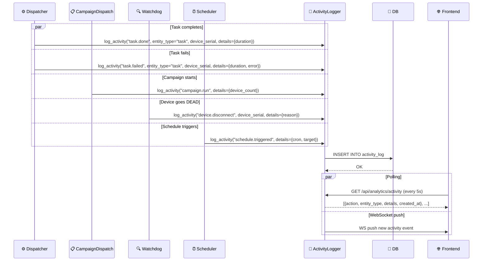
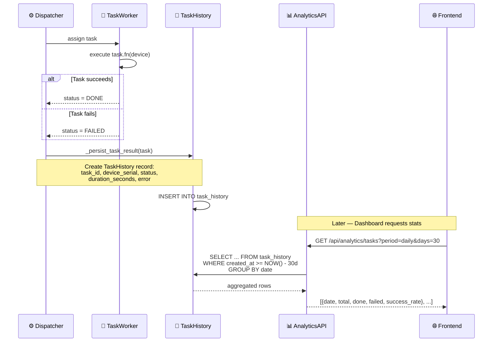
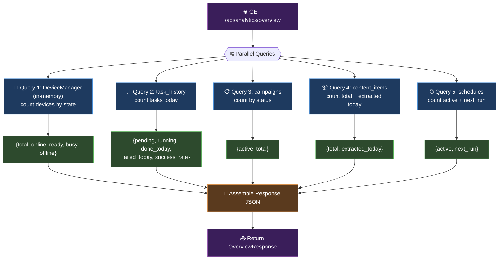

# DF-012: Dashboard Analytics & Reporting

- **Priority:** P1 (Should Have)
- **Effort:** L (2-4 tuan)
- **Phase:** 3 — Content & Data
- **Dependencies:** None
- **Assignee:** —
- **Status:** Backlog

---

## 1. Muc tieu

Dashboard tong quan voi charts va stats: devices online/offline, tasks completed/failed, campaign progress, extraction stats. Cho phep theo doi health cua toan he thong.

**Hien tai:** Dashboard chi co device list va basic campaign table. Khong co analytics.
**Sau khi xong:** Dashboard page voi real-time counters, charts, va activity feed.

---

## 2. User Stories

**US-012.1:** Toi muon xem tong quan: bao nhieu device online, bao nhieu task dang chay, success rate hom nay.

**US-012.2:** Toi muon bieu do trend: tasks/ngay, content extracted/ngay trong 30 ngay qua.

**US-012.3:** Toi muon xem activity log: ai chay gi, luc nao, ket qua the nao.

---

## 3. Thiet ke ky thuat

### 3.1 Analytics API

**File moi:** `device_farm/api/routes/analytics.py`

```
GET /api/analytics/overview          → Realtime overview stats
GET /api/analytics/devices           → Device stats
GET /api/analytics/tasks             → Task stats (daily/weekly/monthly)
GET /api/analytics/campaigns         → Campaign stats
GET /api/analytics/content           → Content extraction stats
GET /api/analytics/activity          → Activity feed (recent actions)
```

### 3.2 Overview Endpoint

```python
@router.get("/api/analytics/overview")
async def get_overview(manager: DeviceManager, queue: TaskQueue):
    devices = manager.all_devices()
    stats = queue.stats()

    return {
        "devices": {
            "total": len(devices),
            "online": sum(1 for d in devices if d.state.value in ("READY", "BUSY")),
            "ready": sum(1 for d in devices if d.state.value == "READY"),
            "busy": sum(1 for d in devices if d.state.value == "BUSY"),
            "offline": sum(1 for d in devices if d.state.value in ("DISCONNECTED", "DEAD", "ERROR")),
        },
        "tasks": {
            "pending": stats.get("PENDING", 0),
            "running": stats.get("RUNNING", 0),
            "done_today": await count_tasks_today("DONE"),
            "failed_today": await count_tasks_today("FAILED"),
            "success_rate_today": await calc_success_rate_today(),
        },
        "campaigns": {
            "active": await count_campaigns_by_status("running"),
            "total": await count_all_campaigns(),
        },
        "content": {
            "total_items": await count_content_items(),
            "extracted_today": await count_content_today(),
        },
        "schedules": {
            "active": await count_enabled_schedules(),
            "next_run": await get_next_schedule_run(),
        },
    }
```

### 3.3 Task Stats Endpoint (Time Series)

```python
@router.get("/api/analytics/tasks")
async def get_task_stats(
    period: str = "daily",        # daily | weekly | monthly
    days: int = 30,               # lookback period
):
    """Return task stats aggregated by period."""
    return {
        "period": period,
        "data": [
            {
                "date": "2026-03-25",
                "total": 150,
                "done": 140,
                "failed": 10,
                "success_rate": 0.93,
                "avg_duration_seconds": 45.2,
            },
            # ...
        ],
        "summary": {
            "total_tasks": 4500,
            "total_done": 4200,
            "total_failed": 300,
            "avg_success_rate": 0.93,
            "avg_duration": 42.1,
        }
    }
```

### 3.4 Activity Feed

**Bang moi:** `activity_log`

```sql
CREATE TABLE activity_log (
    id VARCHAR(36) PRIMARY KEY,
    action VARCHAR(50) NOT NULL,           -- campaign.run, task.done, task.failed, device.connect, etc.
    entity_type VARCHAR(50),               -- campaign, task, device, schedule, content
    entity_id VARCHAR(36),
    device_serial VARCHAR(100),
    user_id VARCHAR(36),
    details JSON DEFAULT '{}',
    created_at TIMESTAMP DEFAULT NOW()
);

CREATE INDEX idx_activity_created ON activity_log(created_at);
CREATE INDEX idx_activity_action ON activity_log(action);
CREATE INDEX idx_activity_device ON activity_log(device_serial);
```

**Activity logging** — inject vao cac diem quan trong:

```python
# device_farm/services/activity_logger.py

async def log_activity(
    action: str,
    entity_type: str = None,
    entity_id: str = None,
    device_serial: str = None,
    user_id: str = None,
    details: dict = None,
):
    record = ActivityLog(
        action=action,
        entity_type=entity_type,
        entity_id=entity_id,
        device_serial=device_serial,
        user_id=user_id,
        details=details or {},
    )
    await save(record)
```

**Actions to log:**

| Action | Where | Details |
|--------|-------|---------|
| `device.connect` | device_manager.ensure_device | model, brand |
| `device.disconnect` | watchdog, DEAD state | reason |
| `campaign.run` | campaign_dispatch | device_count, scenario_count |
| `campaign.complete` | task completion check | success_count, fail_count |
| `task.done` | dispatcher._run_task | duration, step_count |
| `task.failed` | dispatcher._run_task | error, step_index |
| `schedule.triggered` | scheduler._execute_schedule | cron, target |
| `content.extracted` | content_store.save_content_item | collection, platform |
| `account.banned` | account_manager | platform, username |

### 3.5 Task Stats Persistence

Hien tai tasks ton tai in-memory (TaskQueue). De co historical stats, can persist task results.

**Bang moi:** `task_history`

```sql
CREATE TABLE task_history (
    id VARCHAR(36) PRIMARY KEY,
    task_id VARCHAR(36) NOT NULL,
    name VARCHAR(255),
    device_serial VARCHAR(100),
    status VARCHAR(20),
    priority INTEGER,
    created_at TIMESTAMP,
    started_at TIMESTAMP,
    finished_at TIMESTAMP,
    duration_seconds FLOAT,
    error TEXT,
    result_summary JSON DEFAULT '{}'
);

CREATE INDEX idx_th_device ON task_history(device_serial);
CREATE INDEX idx_th_status ON task_history(status);
CREATE INDEX idx_th_created ON task_history(created_at);
```

**Sua:** `device_farm/runtime/core/dispatcher.py`

Sau khi task DONE hoac FAILED, luu vao `task_history`:
```python
async def _persist_task_result(task):
    await save_task_history(TaskHistory(
        task_id=task.id,
        name=task.name,
        device_serial=task.target,
        status=task.status.value,
        priority=task.priority,
        created_at=task.created_at,
        started_at=task.started_at,
        finished_at=task.finished_at,
        duration_seconds=(task.finished_at - task.started_at).total_seconds() if task.started_at else None,
        error=task.error,
    ))
```

---

## 4. Frontend Changes

### 4.1 Dashboard Home Redesign

**Sua:** `front-end/src/app/[locale]/dashboard/page.tsx`

Layout:

```
┌─────────────────────────────────────────────────────────┐
│  ┌──────────┐ ┌──────────┐ ┌──────────┐ ┌──────────┐   │
│  │ Devices  │ │ Tasks    │ │ Campaigns│ │ Content  │   │
│  │ 45 online│ │ 12 running│ │ 3 active │ │ 1.2K items│  │
│  │ 5 offline│ │ 93% rate │ │          │ │ +120 today│  │
│  └──────────┘ └──────────┘ └──────────┘ └──────────┘   │
│                                                         │
│  ┌────────────────────────────┐ ┌────────────────────┐  │
│  │  Tasks / Day (30d chart)  │ │ Device Status      │  │
│  │  ████████████████████████ │ │ (donut chart)      │  │
│  │  done ████ failed ██      │ │                    │  │
│  └────────────────────────────┘ └────────────────────┘  │
│                                                         │
│  ┌─────────────────────────────────────────────────────┐│
│  │  Activity Feed                                      ││
│  │  • 10:30 - Campaign "FB Farm" completed (45/50 ok) ││
│  │  • 10:25 - Device Pixel7-A023 disconnected          ││
│  │  • 10:20 - Schedule "Daily scroll" triggered        ││
│  │  • 10:15 - 15 content items extracted               ││
│  └─────────────────────────────────────────────────────┘│
└─────────────────────────────────────────────────────────┘
```

### 4.2 Components

**File moi:** `front-end/src/features/analytics/`

- `StatCard.tsx` — Single metric card (icon, value, label, trend)
- `TasksChart.tsx` — Line chart: tasks done/failed per day (recharts)
- `DeviceDonut.tsx` — Donut chart: device states
- `ActivityFeed.tsx` — Scrollable activity list
- `SuccessRateGauge.tsx` — Circular gauge for success rate
- `ContentTrendChart.tsx` — Bar chart: content extracted per day

### 4.3 Charting Library

Them `recharts` (lightweight, React-native):
```
pnpm add recharts
```

### 4.4 Real-time Updates

- Dashboard overview auto-refresh moi 10s (React Query refetchInterval)
- Activity feed: WebSocket push hoac polling moi 5s

---

## Diagrams & Mockups

### 1. Sequence Diagram: Activity Logging Flow



### 2. Sequence Diagram: Task History Persistence



### 3. Flowchart: Dashboard Data Assembly



### 4. ASCII Mockup: Dashboard Layout

```
┌──────────────────────────────────────────────────────────┐
│  Dashboard                                                │
├──────────────────────────────────────────────────────────┤
│                                                           │
│  ┌────────────┐ ┌────────────┐ ┌────────────┐ ┌────────────┐
│  │ 📱 Devices │ │ ✅ Tasks   │ │ 📋 Campaign│ │ 📦 Content │
│  │   45 online│ │ 12 running │ │  3 active  │ │  1.2K items│
│  │    5 off   │ │ 93% rate   │ │ 12 total   │ │ +120 today │
│  └────────────┘ └────────────┘ └────────────┘ └────────────┘
│                                                           │
│  ┌─────────────────────────────┐ ┌────────────────────┐   │
│  │  Tasks / Day (30d)          │ │ Device Status      │   │
│  │  ▓▓▓▓▓▓▓▓▓▓▓▓▓▓▓▓▓▓▓▓▓▓▓ │ │    ┌───┐           │   │
│  │  ████████████████████████   │ │   /     \  READY   │   │
│  │  ▓=done  █=failed           │ │  │ 78%   │  35     │   │
│  │                             │ │   \     /  BUSY 8  │   │
│  │                             │ │    └───┘   OFF  2  │   │
│  └─────────────────────────────┘ └────────────────────┘   │
│                                                           │
│  ┌────────────────────────────────────────────────────┐   │
│  │  Activity Feed                                      │   │
│  │  10:30  ✅ Campaign "FB Farm" completed (45/50)    │   │
│  │  10:25  ❌ Device Pixel7-A023 disconnected          │   │
│  │  10:20  ⏰ Schedule "Daily scroll" triggered        │   │
│  │  10:15  📦 15 items extracted in "fb_posts"         │   │
│  │  10:10  ✅ Task done on SM-A515F (45.2s)           │   │
│  │                                    [View All →]     │   │
│  └────────────────────────────────────────────────────┘   │
└──────────────────────────────────────────────────────────┘
```

---

## 5. Test Plan

| Test Case | Expected |
|-----------|----------|
| Overview API | Correct counts cho devices, tasks, campaigns |
| Task stats daily 30d | 30 data points voi correct aggregation |
| Activity log campaign.run | Log entry created khi run campaign |
| Activity log task.failed | Log entry voi error detail |
| Task history persistence | DONE/FAILED tasks saved to DB |
| Success rate calculation | done / (done + failed) * 100 |
| Frontend dashboard load | All widgets render voi data |
| Auto-refresh 10s | Data updates without page reload |

---

## 6. Acceptance Criteria

- [ ] Analytics overview API voi realtime stats
- [ ] Task stats time series (daily/weekly/monthly)
- [ ] Activity log table voi logging at key points
- [ ] Task history persistence (in-memory → DB on completion)
- [ ] Frontend: dashboard voi stat cards, charts, activity feed
- [ ] Frontend: auto-refresh (10s interval)
- [ ] Charts: tasks/day, device status donut, success rate gauge
- [ ] Activity feed: recent 50 entries, paginated

---

## 7. Files Changed

| File | Action | Mo ta |
|------|--------|-------|
| `device_farm/db/models/activity.py` | **NEW** | ActivityLog model |
| `device_farm/db/models/task_history.py` | **NEW** | TaskHistory model |
| `device_farm/db/crud/activity.py` | **NEW** | Activity CRUD |
| `device_farm/db/crud/task_history.py` | **NEW** | Task history CRUD |
| `device_farm/services/activity_logger.py` | **NEW** | Logging service |
| `device_farm/api/routes/analytics.py` | **NEW** | Analytics endpoints |
| `device_farm/api/mount.py` | EDIT | Mount analytics router |
| `device_farm/runtime/core/dispatcher.py` | EDIT | Persist task results |
| `device_farm/services/campaign_dispatch.py` | EDIT | Log campaign.run |
| `front-end/src/app/[locale]/dashboard/page.tsx` | EDIT | Dashboard redesign |
| `front-end/src/features/analytics/` | **NEW** | Chart components |
| `front-end/package.json` | EDIT | Them recharts |
| `alembic/versions/xxx_analytics.py` | **NEW** | Migration |
