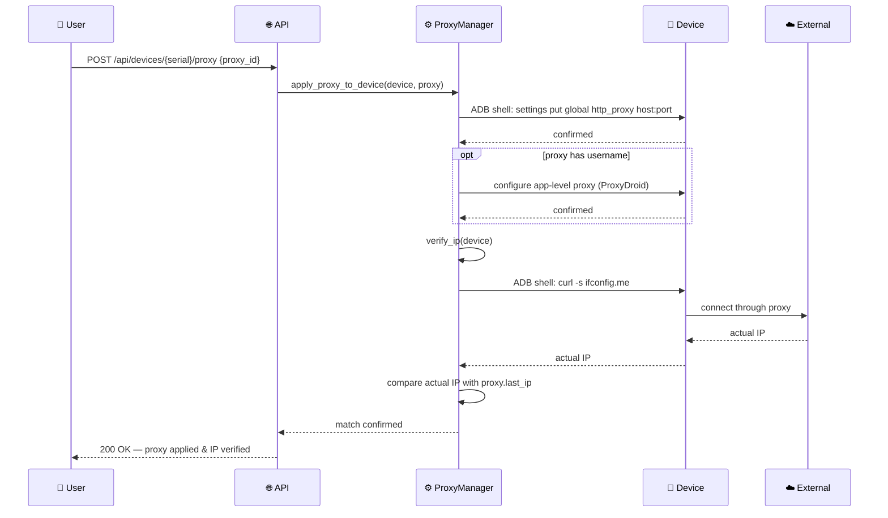
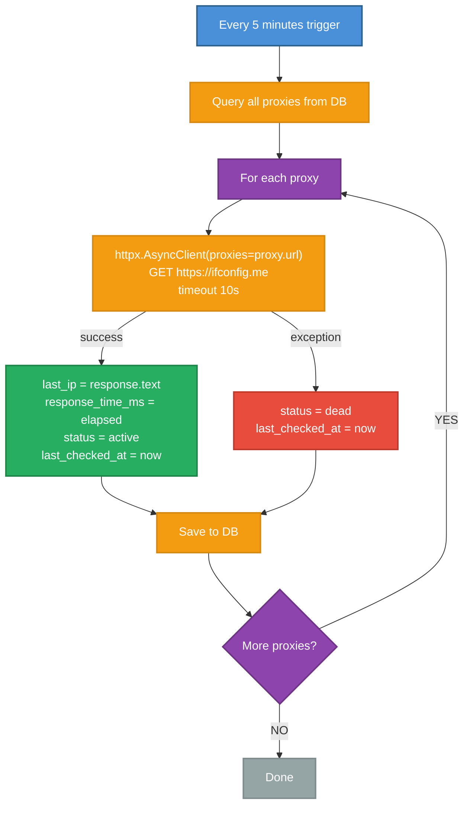

# DF-013: Proxy & Network Config per Device

- **Priority:** P1 (Should Have)
- **Effort:** M (1-2 tuan)
- **Phase:** 4 — Intelligence
- **Dependencies:** None
- **Assignee:** —
- **Status:** Backlog

---

## 1. Muc tieu

Gan proxy (HTTP/SOCKS5) cho tung device hoac account. Ho tro proxy rotation va IP verification truoc khi chay scenario.

---

## 2. User Stories

**US-013.1:** Toi muon moi device su dung proxy khac nhau de tranh cung IP.

**US-013.2:** Toi muon verify IP thuc te cua device truoc khi chay automation.

---

## 3. Thiet ke ky thuat

### 3.1 Database

**Bang moi:** `proxies`

```sql
CREATE TABLE proxies (
    id VARCHAR(36) PRIMARY KEY,
    name VARCHAR(255) DEFAULT '',
    type VARCHAR(10) NOT NULL DEFAULT 'http',    -- http, https, socks5
    host VARCHAR(255) NOT NULL,
    port INTEGER NOT NULL,
    username VARCHAR(255),
    password_encrypted VARCHAR(500),
    -- Status
    status VARCHAR(20) DEFAULT 'active',         -- active, dead, testing
    last_checked_at TIMESTAMP,
    last_ip VARCHAR(45),                         -- IP confirmed
    response_time_ms INTEGER,
    -- Meta
    country VARCHAR(10),
    tags VARCHAR(500) DEFAULT '',
    user_id VARCHAR(36) REFERENCES users(id) ON DELETE SET NULL,
    created_at TIMESTAMP DEFAULT NOW()
);
```

**Lien ket:** `devices.proxy_id` va `accounts.proxy_id` (FK → proxies.id)

### 3.2 Proxy Application

Thiet lap proxy tren Android qua ADB:

```python
# device_farm/services/proxy_manager.py

async def apply_proxy_to_device(device: DeviceClient, proxy: Proxy):
    """Set HTTP proxy on Android device via ADB global settings."""
    proxy_str = f"{proxy.host}:{proxy.port}"

    # Set global HTTP proxy
    device.shell(f"settings put global http_proxy {proxy_str}")

    # For authenticated proxies, need app-level config
    if proxy.username:
        # Use ProxyDroid or similar app-level approach
        pass

async def clear_proxy(device: DeviceClient):
    """Remove proxy from device."""
    device.shell("settings put global http_proxy :0")

async def verify_ip(device: DeviceClient) -> str:
    """Check actual external IP of device."""
    # Open IP check URL and extract
    result = device.shell("curl -s ifconfig.me")
    return result.strip()
```

### 3.3 New Step Types

```json
{ "type": "set_proxy", "proxy_id": "uuid" }
{ "type": "set_proxy", "host": "1.2.3.4", "port": 8080, "type": "http" }
{ "type": "clear_proxy" }
{ "type": "verify_ip", "save_as": "CURRENT_IP" }
```

### 3.4 Proxy Health Check

Background task moi 5 phut check proxy status:
```python
async def check_proxy_health(proxy: Proxy):
    try:
        start = time.time()
        async with httpx.AsyncClient(proxies=proxy.url) as client:
            resp = await client.get("https://ifconfig.me", timeout=10)
            proxy.last_ip = resp.text.strip()
            proxy.response_time_ms = int((time.time() - start) * 1000)
            proxy.status = "active"
    except Exception:
        proxy.status = "dead"
    proxy.last_checked_at = datetime.utcnow()
    await save(proxy)
```

### 3.5 API Endpoints

```
GET    /api/proxies                     → List proxies
POST   /api/proxies                     → Create proxy
POST   /api/proxies/import              → Bulk import (host:port:user:pass per line)
PATCH  /api/proxies/{id}                → Update
DELETE /api/proxies/{id}                → Delete
POST   /api/proxies/{id}/test           → Test proxy connectivity
POST   /api/proxies/assign-round-robin  → Auto-assign to devices
POST   /api/devices/{serial}/proxy      → Set proxy on device
DELETE /api/devices/{serial}/proxy      → Clear proxy
GET    /api/devices/{serial}/ip         → Verify device IP
```

### 3.6 Bulk Import Format

```
host:port
host:port:username:password
type://host:port:username:password
```

---

## Diagrams & Mockups

### 1. Sequence Diagram: Proxy Application & IP Verification Flow



### 2. Flowchart: Proxy Health Check Background Job



### 3. ASCII Mockup: Proxy Management Page

```
┌──────────────────────────────────────────────────────────────────────────────────┐
│  Proxy Management                                          [Import] [+ Add Proxy]│
├──────────────────────────────────────────────────────────────────────────────────┤
│                                                                                  │
│  ┌────────┬──────────┬──────────────────┬────────┬───────────────┬───────┬──────┐│
│  │ Name   │ Type     │ Host:Port        │ Status │ Last IP       │ RT ms │ Tags ││
│  ├────────┼──────────┼──────────────────┼────────┼───────────────┼───────┼──────┤│
│  │ US-01  │ [HTTP  ] │ 45.12.88.10:8080 │ 🟢 act │ 45.12.88.10   │  120  │ 🇺🇸   ││
│  │ DE-03  │ [SOCKS5] │ 91.44.21.5:1080  │ 🟢 act │ 91.44.21.5    │   85  │ 🇩🇪   ││
│  │ SG-07  │ [HTTP  ] │ 103.5.60.2:3128  │ 🔴 dead│ —             │    —  │ 🇸🇬   ││
│  │ JP-02  │ [SOCKS5] │ 178.22.1.44:1080 │ 🟢 act │ 178.22.1.44   │  210  │ 🇯🇵   ││
│  │ BR-11  │ [HTTP  ] │ 201.48.3.99:8888 │ 🔴 dead│ —             │    —  │ 🇧🇷   ││
│  │ VN-04  │ [HTTP  ] │ 14.225.0.17:8080 │ 🟢 act │ 14.225.0.17   │  145  │ 🇻🇳   ││
│  └────────┴──────────┴──────────────────┴────────┴───────────────┴───────┴──────┘│
│                                                                                  │
│  Showing 6 of 42 proxies                                     [< 1 2 3 ... 7 >]  │
│                                                                                  │
├──────────────────────────────────────────────────────────────────────────────────┤
│  Import Dialog                                                                   │
│  ┌──────────────────────────────────────────────────────────────────────────────┐│
│  │  Paste proxies (one per line):                                              ││
│  │  ┌──────────────────────────────────────────────────────────────────────┐    ││
│  │  │ 45.12.88.10:8080:admin:s3cret                                      │    ││
│  │  │ 91.44.21.5:1080                                                    │    ││
│  │  │ socks5://178.22.1.44:1080:user:pass                                │    ││
│  │  │ 14.225.0.17:8080:proxyuser:proxypass                               │    ││
│  │  └──────────────────────────────────────────────────────────────────────┘    ││
│  │                                                                             ││
│  │  Format: host:port:user:pass                  Found 25 proxies              ││
│  │                                                                             ││
│  │                                                    [Cancel]  [Import]       ││
│  └──────────────────────────────────────────────────────────────────────────────┘│
└──────────────────────────────────────────────────────────────────────────────────┘
```

---

## 4. Frontend Changes

- Proxies management page (DataTable + CRUD)
- Bulk import dialog (textarea, one proxy per line)
- Device list: proxy column (IP, status indicator)
- Proxy health status indicators (green/red dot)

---

## 5. Acceptance Criteria

- [ ] Proxy CRUD + bulk import
- [ ] Set/clear proxy on device via ADB
- [ ] Verify device IP endpoint
- [ ] Proxy health check (background, 5 min interval)
- [ ] `set_proxy`, `clear_proxy`, `verify_ip` step types
- [ ] Round-robin proxy assignment to devices
- [ ] Frontend: proxy management page

---

## 6. Files Changed

| File | Action | Mo ta |
|------|--------|-------|
| `device_farm/db/models/proxy.py` | **NEW** | Proxy model |
| `device_farm/db/crud/proxy.py` | **NEW** | CRUD |
| `device_farm/services/proxy_manager.py` | **NEW** | Apply/clear/verify/healthcheck |
| `device_farm/api/routes/proxies.py` | **NEW** | API endpoints |
| `device_farm/api/mount.py` | EDIT | Mount |
| `device_farm/common/scenario_schema.py` | EDIT | Step types |
| `device_farm/tasks/scenario_task.py` | EDIT | Handlers |
| `front-end/src/app/[locale]/dashboard/proxies/page.tsx` | **NEW** | Page |
| `alembic/versions/xxx_proxies.py` | **NEW** | Migration |
