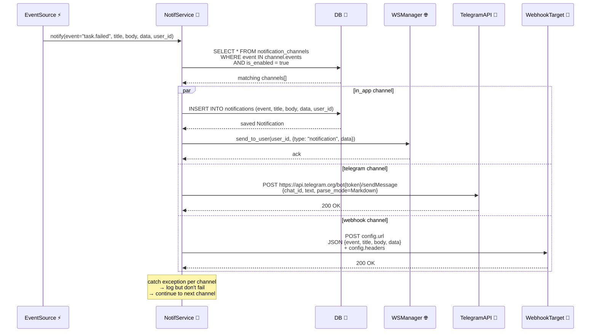
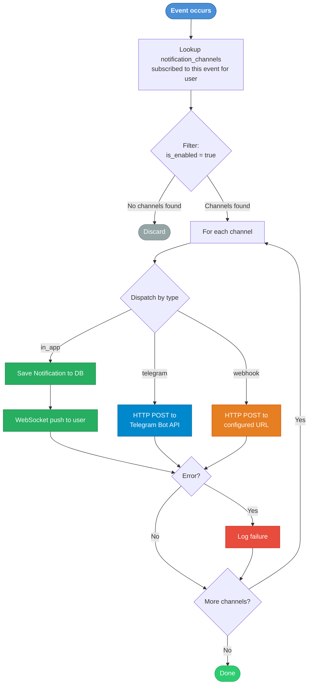

# DF-014: Notification & Alert System

- **Priority:** P2 (Could Have)
- **Effort:** M (1-2 tuan)
- **Phase:** 4 — Intelligence
- **Dependencies:** None
- **Assignee:** —
- **Status:** Backlog

---

## 1. Muc tieu

Thong bao realtime khi co su kien quan trong: device disconnect, scenario fail, campaign complete, account banned. Ho tro nhieu kenh: in-app (WebSocket), Telegram bot, webhook.

---

## 2. Thiet ke ky thuat

### 2.1 Database

**Bang moi:** `notification_channels`

```sql
CREATE TABLE notification_channels (
    id VARCHAR(36) PRIMARY KEY,
    name VARCHAR(255) NOT NULL,
    type VARCHAR(20) NOT NULL,               -- in_app, telegram, webhook
    config JSON NOT NULL DEFAULT '{}',       -- {token, chat_id, url, headers}
    events JSON NOT NULL DEFAULT '[]',       -- ["device.disconnect", "task.failed", ...]
    is_enabled BOOLEAN DEFAULT TRUE,
    user_id VARCHAR(36) REFERENCES users(id) ON DELETE SET NULL,
    created_at TIMESTAMP DEFAULT NOW()
);
```

**Bang moi:** `notifications`

```sql
CREATE TABLE notifications (
    id VARCHAR(36) PRIMARY KEY,
    channel_id VARCHAR(36),
    event VARCHAR(50) NOT NULL,
    title VARCHAR(255) NOT NULL,
    body TEXT,
    data JSON DEFAULT '{}',
    is_read BOOLEAN DEFAULT FALSE,
    sent_at TIMESTAMP DEFAULT NOW(),
    user_id VARCHAR(36) REFERENCES users(id) ON DELETE CASCADE,
    created_at TIMESTAMP DEFAULT NOW()
);

CREATE INDEX idx_notif_user_read ON notifications(user_id, is_read);
```

### 2.2 Notification Service

```python
# device_farm/services/notification_service.py

class NotificationService:
    async def notify(self, event: str, title: str, body: str, data: dict = None, user_id: str = None):
        channels = await get_channels_for_event(event, user_id)
        for channel in channels:
            if channel.type == "in_app":
                await self._send_in_app(channel, event, title, body, data, user_id)
            elif channel.type == "telegram":
                await self._send_telegram(channel, title, body)
            elif channel.type == "webhook":
                await self._send_webhook(channel, event, title, body, data)

    async def _send_telegram(self, channel, title, body):
        config = channel.config
        token = config["bot_token"]
        chat_id = config["chat_id"]
        text = f"*{title}*\n{body}"
        async with httpx.AsyncClient() as client:
            await client.post(
                f"https://api.telegram.org/bot{token}/sendMessage",
                json={"chat_id": chat_id, "text": text, "parse_mode": "Markdown"},
                timeout=10,
            )

    async def _send_in_app(self, channel, event, title, body, data, user_id):
        notif = Notification(event=event, title=title, body=body, data=data or {}, user_id=user_id)
        await save(notif)
        # Push via WebSocket
        await ws_manager.send_to_user(user_id, {"type": "notification", "data": notif.to_dict()})

    async def _send_webhook(self, channel, event, title, body, data):
        config = channel.config
        async with httpx.AsyncClient() as client:
            await client.post(
                config["url"],
                json={"event": event, "title": title, "body": body, "data": data},
                headers=config.get("headers", {}),
                timeout=10,
            )
```

### 2.3 Events to Notify

| Event | Trigger Point | Default Title |
|-------|---------------|---------------|
| `device.disconnect` | Watchdog → DEAD | "Device {serial} disconnected" |
| `device.reconnect` | ensure_device → READY | "Device {serial} reconnected" |
| `task.failed` | Dispatcher task failure | "Task failed on {serial}" |
| `campaign.complete` | All campaign tasks done | "Campaign {name} completed" |
| `campaign.failed` | Campaign has failures | "Campaign {name}: {n} devices failed" |
| `schedule.triggered` | Scheduler execute | "Schedule {name} triggered" |
| `schedule.failed` | Scheduler error | "Schedule {name} failed" |
| `account.banned` | Manual or auto-detect | "Account {username} banned" |
| `content.milestone` | Every N items extracted | "{n} items extracted in {collection}" |

### 2.4 API Endpoints

```
# Channels
GET    /api/notification-channels        → List channels
POST   /api/notification-channels        → Create channel
PATCH  /api/notification-channels/{id}   → Update
DELETE /api/notification-channels/{id}   → Delete
POST   /api/notification-channels/{id}/test → Send test notification

# Notifications (in-app)
GET    /api/notifications                → List (unread first)
PATCH  /api/notifications/{id}/read      → Mark as read
POST   /api/notifications/read-all       → Mark all as read
GET    /api/notifications/unread-count   → Count unread
```

---

## Diagrams & Mockups

### 1. Sequence Diagram: Multi-Channel Notification Dispatch



### 2. Flowchart: Notification Event Routing



### 3. ASCII Mockup: Notification Bell UI + Channel Settings

**Mockup A -- Notification Bell in Header:**

```
┌──────────────────────────────────────────────────────────────────────┐
│  Device Farm       Devices   Campaigns   Schedules     🔔❸   Admin ▾│
└──────────────────────────────────────────────────────────────┬───────┘
                                                              │
                                              ┌───────────────┴──────────────┐
                                              │  Notifications               │
                                              ├──────────────────────────────┤
                                              │ ● ⚠ Task failed on SN-4021  │
                                              │   2 minutes ago             │
                                              ├──────────────────────────────┤
                                              │ ● 📴 Device X3 disconnected │
                                              │   8 minutes ago             │
                                              ├──────────────────────────────┤
                                              │ ● ✅ Campaign "Batch-7" done│
                                              │   23 minutes ago            │
                                              ├──────────────────────────────┤
                                              │   🕐 Schedule "Nightly" ran │
                                              │   1 hour ago                │
                                              ├──────────────────────────────┤
                                              │   📊 500 items extracted    │
                                              │   2 hours ago               │
                                              ├──────────────────────────────┤
                                              │  Mark all read    View all →│
                                              └──────────────────────────────┘
```

**Mockup B -- Notification Channel Settings Page:**

```
┌──────────────────────────────────────────────────────────────────────────┐
│  Notification Channels                              [+ Add Channel]     │
├──────────────────────────────────────────────────────────────────────────┤
│                                                                          │
│  ┌────────────┬──────────────┬─────────────────────────┬────────┬──────┐ │
│  │ Name       │ Type         │ Events                  │Enabled │Action│ │
│  ├────────────┼──────────────┼─────────────────────────┼────────┼──────┤ │
│  │ Browser    │ 📱 in-app    │ [all events]            │ [●━━]  │ ✎ 🗑│ │
│  ├────────────┼──────────────┼─────────────────────────┼────────┼──────┤ │
│  │ Ops Bot    │ 🤖 Telegram  │ [device.*] [task.failed]│ [●━━]  │⚡✎ 🗑│ │
│  ├────────────┼──────────────┼─────────────────────────┼────────┼──────┤ │
│  │ Slack Hook │ 🔗 Webhook   │ [campaign.*]            │ [━━○]  │⚡✎ 🗑│ │
│  └────────────┴──────────────┴─────────────────────────┴────────┴──────┘ │
│                                                                          │
│  ⚡ = Test   ✎ = Edit   🗑 = Delete                                     │
│                                                                          │
└──────────────────────────────────────────────────────────────────────────┘

┌──────────────────────────────────────────────────────────────────────────┐
│  Create Channel                                                    [X]  │
├──────────────────────────────────────────────────────────────────────────┤
│                                                                          │
│  Type:  [ Telegram        ▾ ]                                            │
│                                                                          │
│  ── Telegram Configuration ──────────────────────────────────────────    │
│  Bot Token:  [______________________________________]                    │
│  Chat ID:    [______________________________________]                    │
│                                                                          │
│  ── OR if Webhook ───────────────────────────────────────────────────    │
│  URL:        [______________________________________]                    │
│  Headers:                                                                │
│    ┌──────────────┬──────────────────────────┬─────┐                     │
│    │ Key          │ Value                    │     │                     │
│    ├──────────────┼──────────────────────────┼─────┤                     │
│    │ Authorization│ Bearer ***               │  🗑 │                     │
│    ├──────────────┼──────────────────────────┼─────┤                     │
│    │              │                          │  +  │                     │
│    └──────────────┴──────────────────────────┴─────┘                     │
│                                                                          │
│  ── Subscribe to Events ─────────────────────────────────────────────    │
│    [✓] device.disconnect    [✓] task.failed                              │
│    [✓] device.reconnect     [ ] campaign.complete                        │
│    [ ] campaign.failed      [✓] schedule.triggered                       │
│    [ ] schedule.failed      [ ] account.banned                           │
│    [ ] content.milestone                                                 │
│                                                                          │
│                                    [ Cancel ]  [ Create Channel ]        │
└──────────────────────────────────────────────────────────────────────────┘
```

---

## 3. Frontend Changes

- Notification bell icon trong header (badge voi unread count)
- Dropdown: recent notifications
- Settings page: manage notification channels
- Telegram setup wizard: bot token + chat ID instructions

---

## 4. Acceptance Criteria

- [ ] In-app notifications via WebSocket
- [ ] Telegram bot integration
- [ ] Webhook notifications
- [ ] Channel management CRUD
- [ ] Event subscription per channel
- [ ] Frontend: notification bell + dropdown
- [ ] Test notification endpoint

---

## 5. Files Changed

| File | Action | Mo ta |
|------|--------|-------|
| `device_farm/db/models/notification.py` | **NEW** | Models |
| `device_farm/services/notification_service.py` | **NEW** | Send logic |
| `device_farm/api/routes/notifications.py` | **NEW** | API |
| `device_farm/api/mount.py` | EDIT | Mount |
| Integration points (watchdog, dispatcher, scheduler) | EDIT | Inject notify calls |
| `front-end/src/features/notifications/` | **NEW** | Components |
| `alembic/versions/xxx_notifications.py` | **NEW** | Migration |
