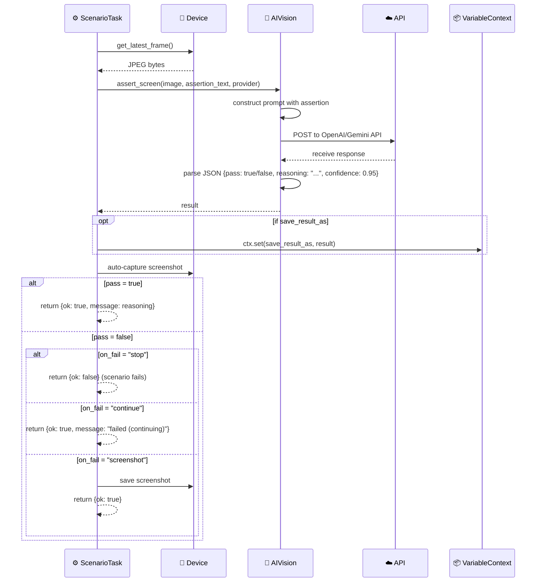
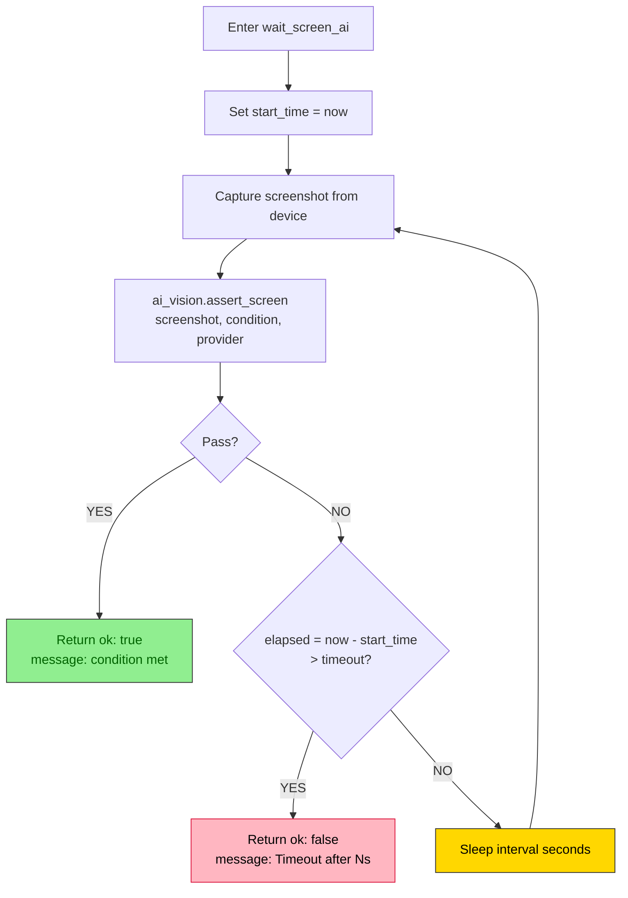
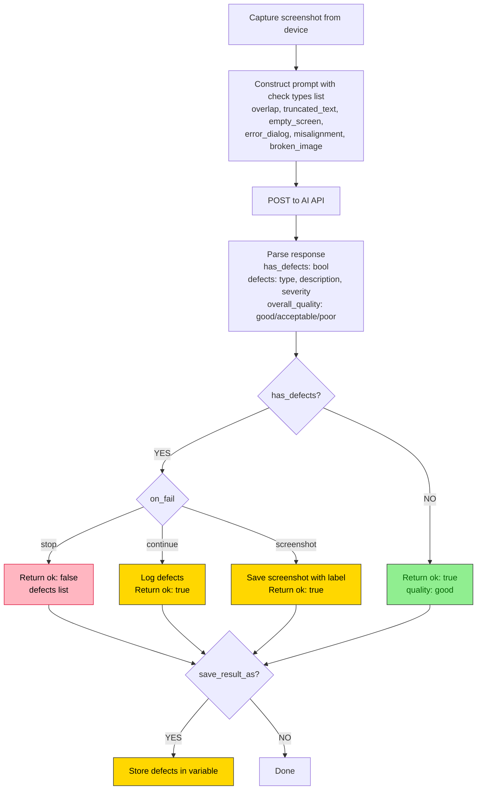

# DF-015: AI Visual Assertions & Screen Verification

- **Priority:** P1 (Should Have)
- **Effort:** M (1-2 tuan)
- **Phase:** 4 — Intelligence
- **Dependencies:** DF-009 (OCR & Extraction)
- **Assignee:** —
- **Status:** Backlog

---

## 1. Muc tieu

Dung AI Vision de verify trang thai man hinh bang ngon ngu tu nhien. Detect loi visual (overlap, truncated text). Verify scenario da thuc hien dung chua.

**Hien tai:** `assert_element` chi kiem tra element ton tai qua UI hierarchy (khong thay WebView, Canvas, visual bugs).
**Sau khi xong:** `assert_screen_ai` kiem tra "man hinh dang hien dung khong" bang AI.

---

## 2. New Step Types

### `assert_screen_ai` — Verify man hinh bang AI

```json
{
  "type": "assert_screen_ai",
  "assertion": "The Facebook news feed is showing with at least 2 posts visible",
  "provider": "openai",
  "on_fail": "stop"
}
```

| Field | Type | Default | Mo ta |
|-------|------|---------|-------|
| `assertion` | string | Required | Mieu ta trang thai mong doi |
| `provider` | string | "openai" | AI provider |
| `on_fail` | string | "stop" | "stop" (fail scenario) / "continue" / "screenshot" |
| `save_result_as` | string | null | Luu AI reasoning vao variable |
| `timeout` | float | 30 | API timeout |

**Execution logic:**
1. Capture screenshot tu device
2. Gui screenshot + assertion prompt den AI Vision
3. AI tra ve: `{ "pass": true/false, "reasoning": "...", "confidence": 0.95 }`
4. Neu fail va on_fail = "stop" → scenario fails
5. Luu screenshot (DF-011) voi label "assertion_{pass/fail}"

### `assert_no_defects` — Detect loi visual

```json
{
  "type": "assert_no_defects",
  "check": ["overlap", "truncated_text", "empty_screen", "error_dialog"],
  "provider": "openai",
  "on_fail": "screenshot"
}
```

| Field | Type | Default | Mo ta |
|-------|------|---------|-------|
| `check` | list | all | Loai loi can kiem tra |
| `provider` | string | "openai" | AI provider |
| `on_fail` | string | "continue" | Action khi co loi |
| `save_result_as` | string | null | Luu defects list |

Defect types:
- `overlap`: Elements chong len nhau
- `truncated_text`: Text bi cat
- `empty_screen`: Man hinh trang/den
- `error_dialog`: Co dialog loi
- `misalignment`: Elements khong can chinh
- `broken_image`: Hinh khong load

### `wait_screen_ai` — Doi cho den khi man hinh dung trang thai

```json
{
  "type": "wait_screen_ai",
  "condition": "The login page has fully loaded with email and password fields visible",
  "timeout": 30,
  "interval": 3,
  "provider": "openai"
}
```

Polling moi `interval` giay, check bang AI, timeout sau N giay.

---

## 3. Implementation

**Sua file:** `device_farm/runtime/extraction/ai_vision.py`

```python
async def assert_screen(
    self,
    image_bytes: bytes,
    assertion: str,
    provider: str = "openai",
) -> dict:
    prompt = f"""Analyze this mobile app screenshot and determine if the following assertion is TRUE or FALSE.

Assertion: "{assertion}"

Respond with ONLY valid JSON:
{{
  "pass": true/false,
  "reasoning": "brief explanation",
  "confidence": 0.0-1.0
}}"""

    result = await self.extract(image_bytes, prompt, provider=provider, format="json")
    return result


async def detect_defects(
    self,
    image_bytes: bytes,
    checks: list = None,
    provider: str = "openai",
) -> dict:
    check_str = ", ".join(checks) if checks else "all visual defects"
    prompt = f"""Analyze this mobile app screenshot for visual defects.
Check for: {check_str}

Respond with ONLY valid JSON:
{{
  "has_defects": true/false,
  "defects": [
    {{"type": "overlap", "description": "...", "severity": "high/medium/low"}}
  ],
  "overall_quality": "good/acceptable/poor"
}}"""

    result = await self.extract(image_bytes, prompt, provider=provider, format="json")
    return result
```

**Sua file:** `device_farm/tasks/scenario_task.py`

```python
async def _handle_assert_screen_ai(device, step, ctx):
    frame = device.get_latest_frame()
    if not frame:
        return {"ok": False, "message": "No screenshot available"}

    result = await ai_vision.assert_screen(
        frame, step["assertion"], provider=step.get("provider", "openai")
    )

    passed = result.get("pass", False)
    reasoning = result.get("reasoning", "")

    if step.get("save_result_as"):
        ctx.set(step["save_result_as"], result)

    # Auto screenshot
    _maybe_capture_screenshot(device, step, ...)

    if not passed:
        on_fail = step.get("on_fail", "stop")
        if on_fail == "stop":
            return {"ok": False, "message": f"AI assertion failed: {reasoning}"}
        elif on_fail == "continue":
            return {"ok": True, "message": f"AI assertion failed (continuing): {reasoning}"}
        elif on_fail == "screenshot":
            return {"ok": True, "message": f"AI assertion failed (screenshot saved): {reasoning}"}

    return {"ok": True, "message": f"AI assertion passed: {reasoning}"}
```

---

## Diagrams & Mockups

### 1. Sequence Diagram: `assert_screen_ai` Step Execution



### 2. Flowchart: `wait_screen_ai` Polling Loop



### 3. Flowchart: `assert_no_defects` Defect Detection



---

## 4. API Endpoints

```
POST /api/devices/{serial}/assert-screen     → One-off AI assertion
POST /api/devices/{serial}/detect-defects    → One-off defect detection
```

---

## 5. MCP Tools

```python
@tool
def df_assert_screen(assertion: str, device_id=None, session_id=None, provider="openai"):
    """Assert screen state using AI Vision. Returns pass/fail with reasoning."""

@tool
def df_detect_defects(device_id=None, session_id=None, checks=None, provider="openai"):
    """Detect visual defects on screen using AI Vision."""
```

---

## 6. Acceptance Criteria

- [ ] `assert_screen_ai` step: AI verify man hinh, pass/fail
- [ ] `assert_no_defects` step: detect visual bugs
- [ ] `wait_screen_ai` step: polling until AI confirms
- [ ] on_fail options: stop, continue, screenshot
- [ ] Save reasoning vao variable
- [ ] Auto screenshot on assertion
- [ ] REST API for standalone assertions
- [ ] MCP tools

---

## 7. Files Changed

| File | Action | Mo ta |
|------|--------|-------|
| `device_farm/runtime/extraction/ai_vision.py` | EDIT | assert_screen, detect_defects |
| `device_farm/common/scenario_schema.py` | EDIT | 3 step types |
| `device_farm/tasks/scenario_task.py` | EDIT | Handlers |
| `device_farm/api/routes/extraction.py` | EDIT | Assert endpoints |
| `device_farm/mcp/server.py` | EDIT | MCP tools |
| `tests/test_ai_assertions.py` | **NEW** | Tests |
