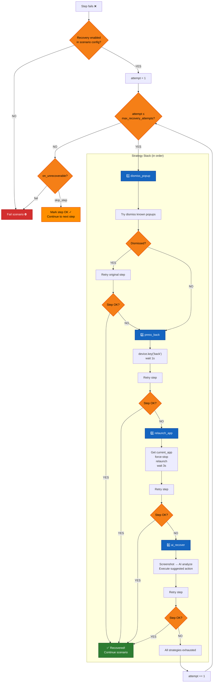
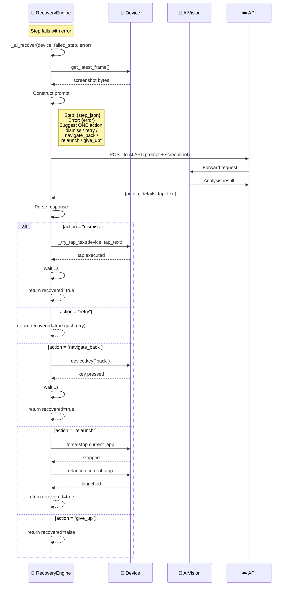
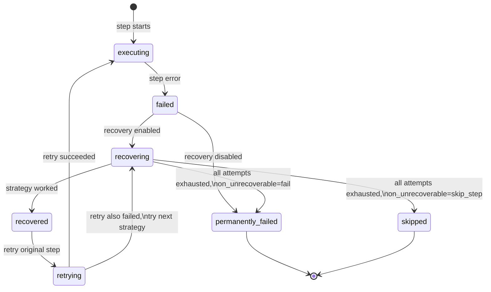

# DF-016: Auto-Recovery & Self-Healing Scenarios

- **Priority:** P2 (Could Have)
- **Effort:** L (2-4 tuan)
- **Phase:** 4 — Intelligence
- **Dependencies:** DF-015 (AI Visual Assertions)
- **Assignee:** —
- **Status:** Backlog

---

## 1. Muc tieu

Khi scenario fail, thay vi dung lai, he thong tu dong phan tich screenshot va co gang recover: dong popup, press back, retry step, hoac AI de xuat hanh dong tiep theo.

**Hien tai:** Step fail → scenario fail. Chi co `dismiss_popup` co sieu thong minh nho.
**Sau khi xong:** System tu dong xu ly unexpected states, giam can thiep thu cong.

---

## 2. Recovery Strategies

### 2.1 Strategy Stack (thu tu uu tien)

```
1. Rule-based recovery (nhanh, mien phi)
   - Dismiss known popups
   - Press Back
   - Press Home → relaunch app
   - Clear app data → restart

2. AI-assisted recovery (cham hon, ton chi phi)
   - Screenshot → AI analyze → de xuat action
   - AI evaluate: "co nen retry step khong?"

3. Escalation (khi khong recover duoc)
   - Log detailed error voi screenshots
   - Notify via DF-014
   - Mark device as ERROR
```

### 2.2 Scenario-level Config

```json
{
  "steps": [...],
  "recovery": {
    "enabled": true,
    "max_recovery_attempts": 3,
    "strategies": ["dismiss_popup", "press_back", "relaunch_app", "ai_recover"],
    "ai_provider": "openai",
    "on_unrecoverable": "skip_step"
  }
}
```

| Field | Type | Default | Mo ta |
|-------|------|---------|-------|
| `enabled` | bool | false | Bat recovery |
| `max_recovery_attempts` | int | 3 | Toi da so lan thu recover |
| `strategies` | list | all | Strategies de thu |
| `ai_provider` | string | "openai" | AI provider cho AI recovery |
| `on_unrecoverable` | string | "fail" | "fail" / "skip_step" / "skip_and_continue" |

---

## 3. Implementation

### 3.1 Recovery Engine

**File moi:** `device_farm/services/recovery_engine.py`

```python
class RecoveryEngine:
    """Attempt to recover from scenario step failure."""

    RULE_BASED_STRATEGIES = [
        ("dismiss_popup", _try_dismiss_popup),
        ("press_back", _try_press_back),
        ("relaunch_app", _try_relaunch_app),
    ]

    async def attempt_recovery(
        self,
        device: DeviceClient,
        failed_step: dict,
        error: str,
        config: dict,
        ctx: VariableContext,
    ) -> RecoveryResult:
        max_attempts = config.get("max_recovery_attempts", 3)
        strategies = config.get("strategies", ["dismiss_popup", "press_back", "relaunch_app"])

        for attempt in range(max_attempts):
            for strategy_name in strategies:
                if strategy_name == "ai_recover":
                    result = await self._ai_recover(device, failed_step, error, config)
                else:
                    result = self._rule_based_recover(device, strategy_name)

                if result.recovered:
                    # Retry the failed step
                    retry_ok = _execute_single_step(device, failed_step, ctx, [])
                    if retry_ok:
                        return RecoveryResult(
                            recovered=True,
                            strategy=strategy_name,
                            attempt=attempt + 1,
                        )

        return RecoveryResult(recovered=False, attempts=max_attempts)

    def _rule_based_recover(self, device, strategy):
        if strategy == "dismiss_popup":
            dismissed = _try_dismiss_known_popups(device)
            return RecoveryResult(recovered=dismissed)
        elif strategy == "press_back":
            device.key("back")
            time.sleep(1)
            return RecoveryResult(recovered=True)  # optimistic
        elif strategy == "relaunch_app":
            # Get current app package, force stop, relaunch
            current = device.current_app
            if current:
                device.shell(f"am force-stop {current}")
                time.sleep(1)
                device.launch_app(current)
                time.sleep(3)
                return RecoveryResult(recovered=True)
            return RecoveryResult(recovered=False)

    async def _ai_recover(self, device, failed_step, error, config):
        frame = device.get_latest_frame()
        if not frame:
            return RecoveryResult(recovered=False)

        prompt = f"""A mobile automation scenario failed at this step:
Step: {json.dumps(failed_step)}
Error: {error}

Looking at the current screenshot, suggest ONE action to recover:
- If there's a popup/dialog, say "dismiss" and specify what to tap
- If the app crashed, say "relaunch"
- If the screen is wrong, say "navigate_back"
- If the step should be retried as-is, say "retry"
- If recovery is not possible, say "give_up"

Respond with JSON: {{"action": "...", "details": "...", "tap_text": "..."}}"""

        result = await ai_vision.extract(
            frame, prompt,
            provider=config.get("ai_provider", "openai"),
            format="json",
        )

        action = result.get("action", "give_up")
        if action == "dismiss" and result.get("tap_text"):
            _try_tap_text(device, result["tap_text"])
            time.sleep(1)
            return RecoveryResult(recovered=True, strategy="ai_dismiss")
        elif action == "retry":
            return RecoveryResult(recovered=True, strategy="ai_retry")
        elif action == "navigate_back":
            device.key("back")
            time.sleep(1)
            return RecoveryResult(recovered=True, strategy="ai_back")
        elif action == "relaunch":
            self._rule_based_recover(device, "relaunch_app")
            return RecoveryResult(recovered=True, strategy="ai_relaunch")

        return RecoveryResult(recovered=False)
```

### 3.2 Integration vao Scenario Engine

**Sua file:** `device_farm/tasks/scenario_task.py`

```python
def _execute_steps_with_recovery(device, steps, ctx, results, depth, recovery_config):
    recovery_engine = RecoveryEngine()

    for i, raw_step in enumerate(steps):
        step = ctx.resolve(raw_step, step_index=i)
        ok = _execute_single_step(device, step, ctx, results)

        if not ok and recovery_config.get("enabled"):
            # Attempt recovery
            recovery_result = asyncio.get_event_loop().run_until_complete(
                recovery_engine.attempt_recovery(device, step, results[-1].get("message", ""), recovery_config, ctx)
            )

            if recovery_result.recovered:
                # Update last result
                results[-1]["ok"] = True
                results[-1]["message"] += f" [recovered via {recovery_result.strategy}]"
                results[-1]["recovered"] = True
                continue
            else:
                on_unrec = recovery_config.get("on_unrecoverable", "fail")
                if on_unrec == "skip_step":
                    results[-1]["message"] += " [skipped - unrecoverable]"
                    results[-1]["ok"] = True  # mark as ok to continue
                    continue
                elif on_unrec == "fail":
                    return False

        elif not ok:
            return False

    return True
```

---

## Diagrams & Mockups

### 1. Flowchart: Recovery Strategy Stack Execution



### 2. Sequence Diagram: AI-Assisted Recovery Flow



### 3. State Diagram: Step Execution with Recovery States



### 4. ASCII Mockup: Recovery Config in ScenarioDialog

```
┌─────────────────────────────────────────────────────────────────┐
│  Scenario Editor                                                │
│  ─────────────────────────────────────────────────────────────  │
│  ...                                                            │
│  (existing scenario fields above)                               │
│  ...                                                            │
│                                                                 │
│  ┌─────────────────────────────────────────────────────────────┐│
│  │  Auto-Recovery                                 [■ ON /OFF] ││
│  │  ─────────────────────────────────────────────────────────  ││
│  │                                                             ││
│  │  Max attempts:    [ 3  ▲▼ ]                                 ││
│  │                                                             ││
│  │  Strategies:                                                ││
│  │    ☑ Dismiss popups                                         ││
│  │    ☑ Press Back                                             ││
│  │    ☑ Relaunch app                                           ││
│  │    ☐ AI-assisted recovery                                   ││
│  │        ┌─────────────────────────────────┐                  ││
│  │        │ AI Provider:  [ openai       ▼] │                  ││
│  │        └─────────────────────────────────┘                  ││
│  │                                                             ││
│  │  On unrecoverable:  [ fail           ▼]                     ││
│  │                     ┌─────────────────┐                     ││
│  │                     │ fail            │                     ││
│  │                     │ skip_step       │                     ││
│  │                     └─────────────────┘                     ││
│  │                                                             ││
│  │  ┄┄┄┄┄┄┄┄┄┄┄┄┄┄┄┄┄┄┄┄┄┄┄┄┄┄┄┄┄┄┄┄┄┄┄┄┄┄┄┄┄┄┄┄┄┄┄┄┄┄┄┄┄  ││
│  │  Recovery will attempt to fix failed steps automatically    ││
│  │  before marking scenario as failed.                         ││
│  └─────────────────────────────────────────────────────────────┘│
└─────────────────────────────────────────────────────────────────┘
```

---

## 4. Frontend Changes

- Recovery config section trong ScenarioDialog
- Toggle: Enable auto-recovery
- Checkboxes: strategies to use
- Recovery log trong task detail (voi screenshots)

---

## 5. Acceptance Criteria

- [ ] Rule-based recovery: dismiss_popup, press_back, relaunch_app
- [ ] AI-assisted recovery: screenshot → AI → suggested action
- [ ] Max recovery attempts respected
- [ ] Failed step retried after recovery
- [ ] on_unrecoverable: fail / skip_step
- [ ] Recovery events logged (activity log + screenshots)
- [ ] Frontend: recovery config trong scenario editor

---

## 6. Files Changed

| File | Action | Mo ta |
|------|--------|-------|
| `device_farm/services/recovery_engine.py` | **NEW** | Recovery logic |
| `device_farm/tasks/scenario_task.py` | EDIT | Integrate recovery |
| `device_farm/common/scenario_schema.py` | EDIT | Recovery config schema |
| `front-end/src/features/campaigns/components/ScenarioDialog.tsx` | EDIT | Recovery config UI |
| `tests/test_recovery.py` | **NEW** | Tests |
