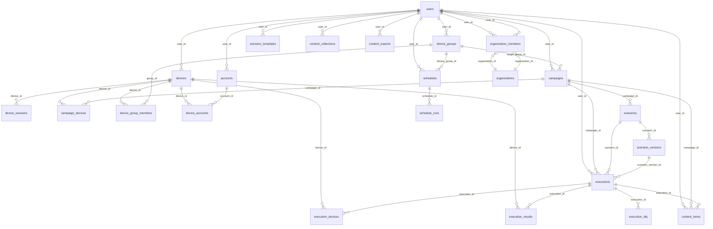

# Device Farm — schema CSDL (Mermaid)

Nguồn: SQLAlchemy `device_farm/db/models/*.py`. Kiểu cột rút gọn (`string` ~ `VARCHAR`, `json` = `JSON`, `text` = `TEXT`). Cột ORM `metadata` / `account_metadata` lưu tên cột DB `metadata` nơi ghi chú.

---

## 1. Biểu đồ quan hệ (FK) — dễ nhìn tổng thể

**Không có FK trong model:** `mcp_sessions.user_id` (chỉ index), `u2_recovery_events`, `device_events` (chỉ theo `serial`), `content_items.parent_id` (hash cha, không FK tới `content_items.id`).

---

## 2. Toàn bộ bảng + cột (một ER lớn)

```mermaid
erDiagram
    users {
        string id PK
        string email UK
        string name
        string hashed_password
        string api_key UK
        string role
        bool is_active
        datetime created_at
    }

    organizations {
        string id PK
        string business_name
        string business_email
        string business_logo
        datetime created_at
        string webhook_url
        string webhook_secret
        string webhook_events
    }

    organization_members {
        string id PK
        string organization_id FK
        string user_id FK
        string role
        datetime created_at
    }

    devices {
        string id PK
        string serial UK
        string name
        string device_key UK
        string user_id FK
        string brand
        string model
        string android_version
        int sdk_version
        int screen_width
        int screen_height
        string adb_ip
        int adb_port
        string tags
        bool relay_scrcpy_enabled
        datetime last_seen
        datetime created_at
    }

    device_sessions {
        string id PK
        string device_id FK
        string client_ip
        datetime connected_at
        datetime disconnected_at
    }

    device_groups {
        string id PK
        string name
        text description
        string color
        string user_id FK
        datetime created_at
        datetime updated_at
    }

    device_group_members {
        string id PK
        string group_id FK
        string device_id FK
        datetime added_at
    }

    campaigns {
        string id PK
        string name
        text description
        json variables
        string status
        string target_group_id FK
        string user_id FK
        datetime created_at
        datetime updated_at
    }

    campaign_devices {
        string id PK
        string campaign_id FK
        string device_id FK
    }

    scenarios {
        string id PK
        string campaign_id FK
        string name
        text instructions
        json steps
        json nodes
        json edges
        json variables
        int order
        datetime created_at
        datetime updated_at
    }

    mcp_sessions {
        string id PK
        string device_serial
        string user_id
        string status
        datetime created_at
        datetime ended_at
    }

    scenario_templates {
        string id PK
        string name UK
        text description
        string category
        json steps
        json nodes
        json edges
        json variables
        string tags
        bool is_builtin
        string user_id FK
        datetime created_at
        datetime updated_at
    }

    scenario_versions {
        string id PK
        string scenario_id FK
        int version
        json steps
        json nodes
        json edges
        json variables
        text instructions
        datetime created_at
    }

    accounts {
        string id PK
        string platform
        string username
        string password_encrypted
        string display_name
        string status
        datetime cooldown_until
        string proxy_id
        json metadata
        text notes
        string tags
        string user_id FK
        datetime created_at
        datetime updated_at
        datetime last_used_at
        float total_usage_minutes
        float usage_today_minutes
        date usage_reset_date
    }

    device_accounts {
        string id PK
        string device_id FK
        string account_id FK
        bool is_primary
        datetime assigned_at
    }

    content_items {
        string id PK
        string collection
        string platform
        string content_type
        string title
        text body
        string author
        string author_id
        string url
        int likes_count
        int comments_count
        int shares_count
        int views_count
        json media_urls
        string screenshot_path
        json raw_data
        string tags
        string content_hash
        string parent_id
        int item_level
        string device_serial
        string campaign_id FK
        string run_id FK
        string execution_id FK
        string user_id FK
        string scenario_name
        datetime extracted_at
        datetime content_date
        datetime created_at
    }

    content_collections {
        string id PK
        string name UK
        text description
        string platform
        string content_type
        int item_count
        string user_id FK
        datetime created_at
        datetime updated_at
    }

    content_exports {
        string id PK
        string collection
        string format
        string status
        json filters
        string file_path
        int file_size_bytes
        int item_count
        string user_id FK
        datetime created_at
        datetime completed_at
    }

    schedules {
        string id PK
        string name
        text description
        string target_type
        string target_id
        json inline_steps
        json inline_variables
        string device_group_id FK
        string filter_state
        string filter_model
        int max_devices
        string cron_expression
        string timezone
        int random_delay_min
        int random_delay_max
        bool stagger_devices
        int stagger_interval_seconds
        bool is_enabled
        datetime last_run_at
        datetime next_run_at
        int run_count
        string user_id FK
        datetime created_at
        datetime updated_at
    }

    schedule_runs {
        string id PK
        string schedule_id FK
        string status
        datetime started_at
        datetime finished_at
        int devices_dispatched
        int devices_succeeded
        int devices_failed
        json task_ids
        text error_message
        datetime created_at
    }

    executions {
        string id PK
        string run_type
        string status
        string campaign_id FK
        string scenario_id FK
        string scenario_version_id FK
        json device_config
        json loop_config
        json error_config
        json meta
        string user_id FK
        datetime created_at
        datetime started_at
        datetime finished_at
    }

    execution_devices {
        string id PK
        string execution_id FK
        string device_id FK
    }

    execution_results {
        string id PK
        string execution_id FK
        string device_id FK
        string status
        float run_time_sec
        json passed_steps
        json failed_steps
        text error_detail
        datetime started_at
        datetime finished_at
        datetime created_at
    }

    execution_dlq {
        string id PK
        string execution_id FK
        string device_serial
        text error
        int retry_count
        string status
        datetime last_attempt_at
        datetime created_at
    }

    u2_recovery_events {
        int id PK
        datetime created_at
        string serial
        string event
        string reason
        string outcome
        int duration_ms
        string host
        int port
        json metadata
    }

    device_events {
        string id PK
        string serial
        string event
        string reason
        string old_state
        string new_state
        string device_model
        string device_brand
        json extra_data
        datetime created_at
    }

    users ||--o{ devices : user_id
    users ||--o{ campaigns : user_id
    users ||--o{ organization_members : user_id
    users ||--o{ device_groups : user_id
    users ||--o{ accounts : user_id
    users ||--o{ scenario_templates : user_id
    users ||--o{ content_collections : user_id
    users ||--o{ content_exports : user_id
    users ||--o{ schedules : user_id
    users ||--o{ executions : user_id
    users ||--o{ content_items : user_id
    organizations ||--o{ organization_members : organization_id
    organization_members }o--|| users : user_id
    organization_members }o--|| organizations : organization_id
    devices ||--o{ device_sessions : device_id
    devices ||--o{ campaign_devices : device_id
    devices ||--o{ device_group_members : device_id
    devices ||--o{ execution_devices : device_id
    devices ||--o{ execution_results : device_id
    devices ||--o{ device_accounts : device_id
    device_groups ||--o{ device_group_members : group_id
    device_groups ||--o{ campaigns : target_group_id
    device_groups ||--o{ schedules : device_group_id
    campaigns ||--o{ campaign_devices : campaign_id
    campaigns ||--o{ scenarios : campaign_id
    campaigns ||--o{ executions : campaign_id
    campaigns ||--o{ content_items : campaign_id
    scenarios ||--o{ scenario_versions : scenario_id
    scenarios ||--o{ executions : scenario_id
    executions ||--o{ execution_devices : execution_id
    executions ||--o{ execution_results : execution_id
    executions ||--o{ execution_dlq : execution_id
    executions ||--o{ content_items : execution_id
    scenario_versions ||--o{ executions : scenario_version_id
    accounts ||--o{ device_accounts : account_id
    schedules ||--o{ schedule_runs : schedule_id
```

---

## Danh sách bảng (26)

| Bảng | Ghi chú |
|------|---------|
| `users` | Auth + API key |
| `organizations` | Webhook org |
| `organization_members` | N-N user ↔ org |
| `devices` | Thiết bị agent |
| `device_sessions` | Lịch sử WS |
| `device_groups` | Nhóm thiết bị |
| `device_group_members` | N-N device ↔ group |
| `campaigns` | Chiến dịch |
| `campaign_devices` | N-N campaign ↔ device |
| `scenarios` | Kịch bản (SSOT) |
| `mcp_sessions` | Phiên MCP (user_id không FK) |
| `scenario_templates` | Template tái sử dụng |
| `scenario_versions` | Snapshot bất biến của scenario |
| `accounts` | Tài khoản MXH |
| `device_accounts` | N-N device ↔ account |
| `content_items` | Nội dung crawl |
| `content_collections` | Bộ sưu tập tên |
| `content_exports` | Job export |
| `schedules` | Lịch cron |
| `schedule_runs` | Lần chạy schedule |
| `executions` | Điều phối run |
| `execution_devices` | N-N execution ↔ device |
| `execution_results` | Kết quả theo thiết bị |
| `execution_dlq` | DLQ sau retry |
| `u2_recovery_events` | Log phục hồi U2 |
| `device_events` | Log sự kiện thiết bị |

Cập nhật file này khi thêm/sửa model hoặc migration.
