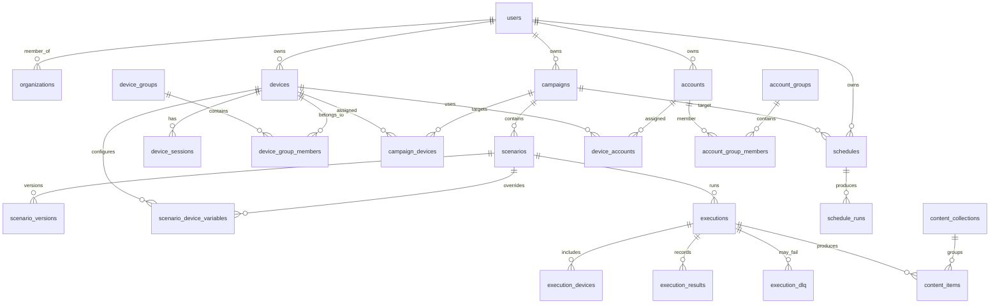

# Data Schema

Status: active
Last audited: 2026-05-18

## Scope

This document maps durable data ownership. The detailed ERD remains in
`docs/data/db-schema-full.md` after archive cleanup.

## Source Of Truth

| Area | Source |
|---|---|
| SQLAlchemy models | `device_farm/db/models/*` |
| CRUD helpers | `device_farm/db/crud/*` |
| Migrations | `device_farm/db/migrations/*` |
| Seeds | `device_farm/db/seeds/*` |
| Generated schema doc | `docs/data/db-schema-full.md` |

## Table Ownership

| Tables | Owning module |
|---|---|
| `users`, `organizations`, `organization_members` | API auth and tenancy |
| `devices`, `device_sessions`, `device_events`, `relay_agents` | Devices/control plane, agent boot relay |
| `device_groups`, `device_group_members` | Devices/control plane |
| `campaigns`, `campaign_devices`, `scenarios`, `scenario_versions`, `scenario_device_variables` | Campaigns/scenarios/executions |
| `executions`, `execution_devices`, `execution_results`, `execution_dlq` | Campaigns/scenarios/executions |
| `schedules`, `schedule_runs` | Scheduling |
| `accounts`, `device_accounts`, `account_groups`, `account_group_members` | Accounts and groups |
| `content_items`, `content_collections` | Content/extraction/artifacts |
| `notification_channels`, `notifications` | Notifications and analytics |
| `activity_log` | Notifications and analytics |
| `mcp_sessions`, `u2_recovery_events` | Runtime/agent support |

## Diagrams

### Core Domain ERD

## Migration Notes

- Migrations `001` through `036` describe the current schema evolution.
- `031_drop_content_exports.py` means old content-export specs must be verified
  before implementing export persistence.
- `019_merge_campaign_runs_into_executions.py` makes `executions` the canonical
  run table.
- `017_scenario_versioning.py`, `020_execution_scenario_version_consistency.py`,
  and `025_repair_executions_scenario_version_column.py` are important for
  scenario execution correctness.
- `content_items.content_type` is a free-form classification string. For social
  extraction output, use platform-qualified values such as `fb_post`,
  `fb_comment`, `tiktok_video`, `tiktok_comment`, `threads_post`, `ig_media`,
  and `ig_comment`. Keep `content_items.platform` populated when known for
  filtering and grouping.

## Agent Implementation Checklist

- Add model, migration, API schema, route behavior, and docs together for new
  persisted concepts.
- Do not add a table based only on archived PRD/spec text. Validate current code
  and module docs first.
- Update this table ownership map when adding or deleting durable tables.
