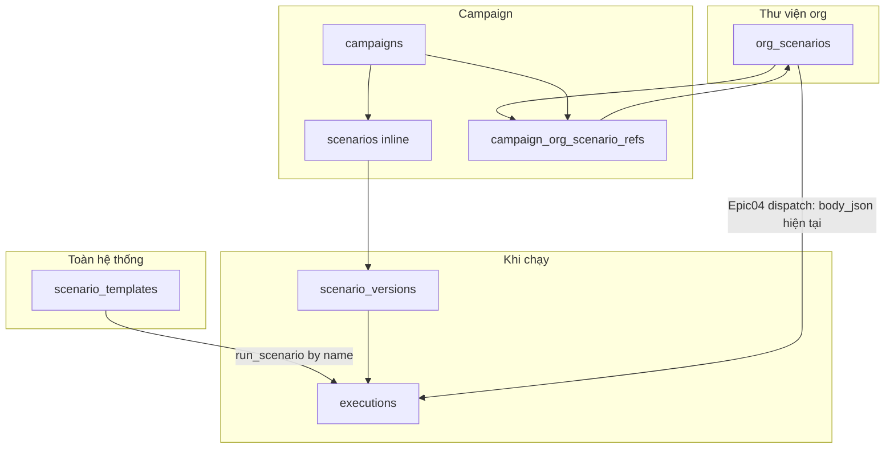

# Device Farm — Database schema (đầy đủ cột)

Tài liệu mô tả **toàn bộ bảng và cột** PostgreSQL từ SQLAlchemy models (`device_farm/db/models/`).

**Cập nhật:** 2026-06-01 (migrations `081` + `082_schema_tenant_org_not_null`)  
**Nguồn:** ORM models + mixin `TenantScopedModel` (`device_farm/tenancy/models.py`)

### Chuẩn multi-org (081)

| Khái niệm | Cột / nơi lưu |
|-----------|----------------|
| Workspace mặc định của user | `users.default_org_id` → FK `organizations` |
| Org đang thao tác trên request | Header `X-Organization-Id` → `tenancy.context.current_org_id` (phải có membership) |
| Quyền platform | `users.role` — `superadmin`, `support`, `system` |
| Quyền theo org | `organization_members.role` — `owner`, `admin`, `member`, `supervisor` |
| Tenant isolation | `org_id` NOT NULL + FK trên bảng nghiệp vụ / execution / analytics |

Unique theo tenant (ví dụ): `accounts (org_id, platform, username)`, `device_groups (org_id, name)`, `campaigns (org_id, name_lower) WHERE deleted_at IS NULL`.

## Mục lục

1. [Cách đọc bảng cột](#cách-đọc-bảng-cột)
2. [Organization & Auth](#1-organization--auth)
3. [Devices](#2-devices)
4. [Accounts](#3-accounts)
5. [Campaigns & Scenarios](#4-campaigns--scenarios) — gồm [mô hình Scenario (nghiệp vụ)](#mô-hình-scenario-nghiệp-vụ)
6. [Executions](#5-executions)
7. [Content](#6-content)
8. [Scheduling](#7-scheduling)
9. [Relay](#8-relay)
10. [Notifications & Analytics](#9-notifications--analytics)
11. [Misc](#10-misc)
12. [Sơ đồ quan hệ (ER)](#sơ-đồ-quan-hệ-er)
13. [Tenant & tham chiếu mềm](#tenant--tham-chiếu-mềm)

---

## Cách đọc bảng cột

| Cột | Ý nghĩa |
|-----|---------|
| **Type** | Kiểu logic: `string`, `text`, `int`, `bool`, `datetime`, `date`, `float`, `json`, `bigint` |
| **Null** | `no` = `NOT NULL` |
| **PK** | Primary key |
| **FK** | `ForeignKey` trong ORM (`ondelete` nếu có) |
| **Unique** | Ràng buộc unique / composite (hoặc partial index — ghi chú) |
| **Default** | Giá trị mặc định trong model |

**Tenant:** Bảng ghi `(TenantScopedModel)` có `org_id` → `organizations.id` (`RESTRICT`).

**Cột DB khác tên Python:** `accounts.metadata` ↔ attr `account_metadata`; `u2_recovery_events.metadata` ↔ attr `extra_data`.

---

## 1. Organization & Auth

### `users`

| Column | Type | Null | PK | FK | Unique | Default |
|--------|------|------|----|----|--------|---------|
| id | string | no | yes | | | uuid |
| email | string | no | | | yes | |
| name | string | no | | | | |
| hashed_password | string | no | | | | |
| api_key | string | no | | | yes | generated |
| role | string | no | | | | system (platform: superadmin / support / system) |
| is_active | bool | no | | | | true |
| default_org_id | string | yes | | organizations.id RESTRICT | | |
| created_at | datetime | no | | | | now |
| failed_login_count | int | no | | | | 0 |
| locked_until | datetime | yes | | | | |
| last_failed_login_at | datetime | yes | | | | |

### `organizations`

| Column | Type | Null | PK | FK | Unique | Default |
|--------|------|------|----|----|--------|---------|
| id | string | no | yes | | | uuid |
| business_name | string | no | | | | |
| business_email | string | yes | | | | |
| business_logo | string | yes | | | | |
| slug | string | yes | | | yes | |
| status | string | no | | | | active |
| plan | string | no | | | | standard |
| created_at | datetime | no | | | | now |
| updated_at | datetime | no | | | | now |
| webhook_url | string | yes | | | | |
| webhook_secret | string | yes | | | | |
| webhook_events | string | yes | | | | task.failed |

### `organization_members`

| Column | Type | Null | PK | FK | Unique | Default |
|--------|------|------|----|----|--------|---------|
| id | string | no | yes | | | uuid |
| organization_id | string | no | | organizations.id CASCADE | (organization_id, user_id) | |
| user_id | string | no | | users.id CASCADE | (organization_id, user_id) | |
| role | string | no | | | | member (org RBAC) |
| status | string | no | | | | active |
| joined_at | datetime | yes | | | | |
| created_at | datetime | no | | | | now |

### `organization_invitations`

| Column | Type | Null | PK | FK | Unique | Default |
|--------|------|------|----|----|--------|---------|
| id | string | no | yes | | | uuid |
| organization_id | string | no | | organizations.id CASCADE | | |
| email | string | no | | | | |
| role | string | no | | | | member |
| token | string | no | | | yes | |
| status | string | no | | | | pending |
| invited_by_user_id | string | yes | | users.id SET NULL | | |
| accepted_by_user_id | string | yes | | users.id SET NULL | | |
| expires_at | datetime | no | | | | |
| accepted_at | datetime | yes | | | | |
| created_at | datetime | no | | | | now |

### `tenant_settings`

| Column | Type | Null | PK | FK | Unique | Default |
|--------|------|------|----|----|--------|---------|
| org_id | string | no | yes | organizations.id CASCADE | | |
| dead_threshold_sec | int | no | | | | 600 |
| session_idle_thresholds | json | yes | | | | |

### `refresh_tokens`

| Column | Type | Null | PK | FK | Unique | Default |
|--------|------|------|----|----|--------|---------|
| id | string | no | yes | | | uuid |
| user_id | string | no | | users.id CASCADE | | |
| token_hash | string | no | | | yes | |
| expires_at | datetime | no | | | | |
| revoked_at | datetime | yes | | | | |
| device_fingerprint | string | yes | | | | |
| last_used_at | datetime | yes | | | | |
| last_ip | string | yes | | | | |
| user_agent | string | yes | | | | |
| created_at | datetime | no | | | | now |

### `password_history`

| Column | Type | Null | PK | FK | Unique | Default |
|--------|------|------|----|----|--------|---------|
| id | string | no | yes | | | uuid |
| user_id | string | no | | users.id CASCADE | | |
| password_hash | string | no | | | | |
| created_at | datetime | no | | | | now |

### `activity_log`

| Column | Type | Null | PK | FK | Unique | Default |
|--------|------|------|----|----|--------|---------|
| id | string | no | yes | | | uuid |
| action | string | no | | | | |
| entity_type | string | yes | | | | |
| entity_id | string | yes | | | | |
| device_serial | string | yes | | | | |
| org_id | string | yes | | | | soft |
| user_id | string | yes | | users.id SET NULL | | |
| method | string | yes | | | | |
| path | string | yes | | | | |
| route_template | string | yes | | | | |
| status_code | int | yes | | | | |
| request_id | string | yes | | | | |
| ip_address | string | yes | | | | |
| user_agent | string | yes | | | | |
| outcome | string | yes | | | | |
| duration_ms | int | yes | | | | |
| before_state | json | no | | | | {} |
| after_state | json | no | | | | {} |
| reason | string | yes | | | | |
| event_id | string | yes | | | | |
| details | json | no | | | | {} |
| created_at | datetime | no | | | | now |

---

## 2. Devices

### `devices` (TenantScopedModel)

| Column | Type | Null | PK | FK | Unique | Default |
|--------|------|------|----|----|--------|---------|
| id | string | no | yes | | | uuid |
| org_id | string | no | | organizations.id RESTRICT | | |
| serial | string | no | | | yes | |
| device_serial | string | no | | | | "" |
| relay_serial | string | yes | | | | |
| name | string | no | | | | "" |
| status | string | no | | | | paired |
| notes | text | no | | | | "" |
| device_key | string | no | | | yes | generated |
| user_id | string | yes | | users.id SET NULL | | |
| brand | string | no | | | | "" |
| model | string | no | | | | "" |
| android_version | string | no | | | | "" |
| sdk_version | int | no | | | | 0 |
| screen_width | int | no | | | | 0 |
| screen_height | int | no | | | | 0 |
| adb_serial | string | yes | | | | |
| adb_ip | string | yes | | | | |
| adb_port | int | no | | | | 5555 |
| tags | string | no | | | | "" |
| relay_scrcpy_enabled | bool | no | | | | true |
| last_seen | datetime | yes | | | | |
| paired_at | datetime | yes | | | | |
| unpaired_at | datetime | yes | | | | |
| created_at | datetime | no | | | | now |
| updated_at | datetime | yes | | | | |

### `device_sessions`

| Column | Type | Null | PK | FK | Unique | Default |
|--------|------|------|----|----|--------|---------|
| id | string | no | yes | | | uuid |
| device_id | string | no | | devices.id CASCADE | | |
| client_ip | string | no | | | | "" |
| connected_at | datetime | no | | | | now |
| disconnected_at | datetime | yes | | | | |

### `device_groups` (TenantScopedModel)

| Column | Type | Null | PK | FK | Unique | Default |
|--------|------|------|----|----|--------|---------|
| id | string | no | yes | | | uuid |
| org_id | string | no | | organizations.id RESTRICT | | |
| name | string | no | | | (org_id, name) | |
| description | text | no | | | | "" |
| color | string | no | | | | #6366f1 |
| user_id | string | yes | | users.id SET NULL | | |
| created_at | datetime | no | | | | now |
| updated_at | datetime | no | | | | now |

### `device_group_members` (TenantScopedModel)

| Column | Type | Null | PK | FK | Unique | Default |
|--------|------|------|----|----|--------|---------|
| id | string | no | yes | | | uuid |
| org_id | string | no | | organizations.id RESTRICT | | |
| group_id | string | no | | device_groups.id CASCADE | (org_id, group_id, device_id) | |
| device_id | string | no | | devices.id CASCADE | (org_id, group_id, device_id) | |
| added_at | datetime | no | | | | now |

### `device_states`

| Column | Type | Null | PK | FK | Unique | Default |
|--------|------|------|----|----|--------|---------|
| device_id | string | no | yes | devices.id CASCADE | | |
| state | string | no | | | | UNKNOWN |
| updated_at | datetime | no | | | | now |
| last_event_id | string | yes | | | | |
| session_id | string | yes | | | | |
| reconnecting_since | datetime | yes | | | | |

### `device_state_transitions`

| Column | Type | Null | PK | FK | Unique | Default |
|--------|------|------|----|----|--------|---------|
| id | int | no | yes | autoincrement | | |
| device_id | string | no | | devices.id CASCADE | | |
| from_state | string | no | | | | |
| to_state | string | no | | | | |
| event | string | no | | | | |
| source | string | no | | | | |
| event_id | string | yes | | | | |
| timestamp | datetime | no | | | | now |
| payload | json | yes | | | | |

### `device_keys`

| Column | Type | Null | PK | FK | Unique | Default |
|--------|------|------|----|----|--------|---------|
| id | string | no | yes | | | uuid |
| device_id | string | no | | devices.id CASCADE | | |
| key_hash | string | no | | | | |
| version | int | no | | | | 1 |
| status | string | no | | | | active |
| created_at | datetime | no | | | | now |
| revoked_at | datetime | yes | | | | |

### `device_reserve_sessions`

| Column | Type | Null | PK | FK | Unique | Default |
|--------|------|------|----|----|--------|---------|
| id | string | no | yes | | | uuid |
| device_id | string | no | | devices.id CASCADE | | |
| org_id | string | no | | | soft | |
| owner_type | string | no | | | | |
| owner_id | string | no | | | | |
| claimed_at | datetime | no | | | | now |
| released_at | datetime | yes | | | | |
| last_heartbeat | datetime | no | | | | now |
| ttl_sec | int | no | | | | |
| release_reason | string | yes | | | | |
| ctx | json | yes | | | | |
| created_by_user_id | string | yes | | | soft | |

### `device_events`

| Column | Type | Null | PK | FK | Unique | Default |
|--------|------|------|----|----|--------|---------|
| id | string | no | yes | | | uuid |
| serial | string | no | | | | soft → devices.serial |
| event | string | no | | | | |
| reason | string | yes | | | | |
| old_state | string | yes | | | | |
| new_state | string | yes | | | | |
| device_model | string | yes | | | | |
| device_brand | string | yes | | | | |
| extra_data | json | yes | | | | |
| created_at | datetime | no | | | | now |

### `reconnect_policies`

| Column | Type | Null | PK | FK | Unique | Default |
|--------|------|------|----|----|--------|---------|
| org_id | string | no | yes | organizations.id RESTRICT | | |
| interval_base_ms | int | no | | | | 1000 |
| max_interval_ms | int | no | | | | 60000 |
| max_attempts | int | no | | | | 20 |
| jitter_factor | float | no | | | | 0.2 |
| updated_at | datetime | no | | | | now |
| updated_by | string | yes | | | soft | |

---

## 3. Accounts

### `accounts` (TenantScopedModel)

| Column | Type | Null | PK | FK | Unique | Default |
|--------|------|------|----|----|--------|---------|
| id | string | no | yes | | | uuid |
| org_id | string | no | | organizations.id RESTRICT | | |
| platform | string | no | | | (org_id, platform, username) | |
| username | string | no | | | (org_id, platform, username) | |
| password_encrypted | string | yes | | | | |
| display_name | string | no | | | | "" |
| status | string | no | | | | active |
| state | string | no | | | | active |
| state_reason | text | yes | | | | |
| state_changed_at | datetime | yes | | | | |
| cooldown_until | datetime | yes | | | | |
| proxy_id | string | yes | | | | future |
| metadata | json | no | | | | {} |
| notes | text | no | | | | "" |
| tags | string | no | | | | "" |
| user_id | string | yes | | users.id SET NULL | | |
| created_at | datetime | no | | | | now |
| updated_at | datetime | no | | | | now |
| last_used_at | datetime | yes | | | | |
| total_usage_minutes | float | no | | | | 0 |
| usage_today_minutes | float | no | | | | 0 |
| usage_reset_date | date | yes | | | | |

### `device_accounts`

| Column | Type | Null | PK | FK | Unique | Default |
|--------|------|------|----|----|--------|---------|
| id | string | no | yes | | | uuid |
| device_id | string | no | | devices.id CASCADE | (device_id, account_id) | |
| account_id | string | no | | accounts.id CASCADE | (device_id, account_id) | |
| is_primary | bool | no | | | | false |
| assigned_at | datetime | no | | | | now |

### `account_groups` (TenantScopedModel)

| Column | Type | Null | PK | FK | Unique | Default |
|--------|------|------|----|----|--------|---------|
| id | string | no | yes | | | uuid |
| org_id | string | no | | organizations.id RESTRICT | | |
| user_id | string | yes | | users.id SET NULL | | |
| name | string | no | | | (org_id, platform, name) | |
| description | text | no | | | | "" |
| platform | string | no | | | | |
| rotation_strategy | string | no | | | | round_robin |
| rotation_cursor | int | no | | | | 0 |
| created_at | datetime | no | | | | now |
| updated_at | datetime | no | | | | now |

### `account_group_members` (TenantScopedModel)

| Column | Type | Null | PK | FK | Unique | Default |
|--------|------|------|----|----|--------|---------|
| id | string | no | yes | | | uuid |
| org_id | string | no | | organizations.id RESTRICT | | |
| group_id | string | no | | account_groups.id CASCADE | (org_id, group_id, account_id) | |
| account_id | string | no | | accounts.id CASCADE | (org_id, group_id, account_id) | |
| position | int | no | | | | 0 |
| last_used_at | datetime | yes | | | | |
| added_at | datetime | no | | | | now |

### `account_events`

| Column | Type | Null | PK | FK | Unique | Default |
|--------|------|------|----|----|--------|---------|
| id | string | no | yes | | | uuid |
| account_id | string | no | | accounts.id CASCADE | | |
| user_id | string | yes | | users.id SET NULL | | |
| event_type | string | no | | | | |
| device_serial | string | yes | | | | |
| platform | string | yes | | | | |
| entity_type | string | yes | | | | |
| entity_id | string | yes | | | | |
| details | json | no | | | | {} |
| created_at | datetime | no | | | | now |

---

## 4. Campaigns & Scenarios

### Mô hình Scenario (nghiệp vụ)

Hệ thống có **năm bảng** liên quan scenario. Chúng **không trùng vai trò**: mỗi bảng phục vụ một lớp khác nhau (global snippet → thư viện org → gắn campaign → snapshot khi chạy).

#### Tóm tắt vai trò

| Bảng | Phạm vi | Mục đích | API / code chính |
|------|---------|----------|------------------|
| `scenario_templates` | **Global** (không `org_id`) | Khối step dùng lại toàn hệ thống; tham chiếu trong step `run_scenario` qua **tên** (`by_template_name` trong registry). | `scenario_templates` CRUD; legacy `campaign_dispatch._build_scenario_registry` |
| `org_scenarios` | **Theo org** (`org_id`) | Thư viện kịch bản dùng lại trong organization; body trong `body_json`, version số trên cùng row (`scenario_version`). | `GET/POST /api/scenarios` |
| `scenarios` | **Theo campaign** (`campaign_id`) | Kịch bản **nhúng (inline)** chỉ thuộc một campaign; từng campaign có thể có nhiều row, sắp `order`. | `GET/POST /api/campaigns/{id}/scenarios` |
| `scenario_versions` | Gắn **inline** `scenarios` | Snapshot bất biến của một inline scenario khi tạo execution (`executions.scenario_version_id`). | `db/crud/scenario_version` |
| `campaign_org_scenario_refs` | Campaign ↔ org | Campaign chọn scenario từ thư viện org + **pin** version (`pinned_version`, `order_index`). | Epic 04 `campaign.scenario_refs` khi tạo/sửa campaign |

#### Quan hệ (logic)

#### Hai luồng dispatch (quan trọng)

| Luồng | Scenario nào được dùng | Ghi chú |
|-------|------------------------|---------|
| **Epic 04 (mặc định cho campaign mới)** | Chỉ `campaign_org_scenario_refs` → `org_scenarios` | `services/campaign/dispatcher.py` đọc `org_scenario_refs`, build step `run_scenario` theo `scenario_id`. **Không** đọc bảng `scenarios` inline. |
| **Legacy** | `scenarios` inline trên campaign + optional `scenario_templates` | `services/campaign_dispatch.py`, registry `by_id` / `by_campaign_name` / `by_template_name`. Vẫn dùng cho campaign/UI cũ và `scenario_device_variables`. |

Một campaign **có thể** vừa có `org_scenario_refs` (chạy thật qua Epic 04) vừa còn row `scenarios` inline (UI/embed cũ). Operator nên coi **`scenario_refs` trên campaign** là nguồn chạy chính; inline chỉ còn cho tương thích hoặc chỉnh sửa legacy.

#### Versioning — khác nhau giữa inline và org

| | Inline `scenarios` | Org `org_scenarios` |
|--|-------------------|---------------------|
| Version lưu ở đâu | Bảng `scenario_versions` (nhiều row / scenario) | Cột `org_scenarios.scenario_version` (số nguyên tăng khi save body) |
| Body tại version cũ | Còn trong `scenario_versions` | **Chỉ** `body_json` hiện tại trên row; không có bảng lịch sử body theo version |
| Pin khi gắn campaign | Không qua ref table | `campaign_org_scenario_refs.pinned_version` — validate ≤ `scenario_version` lúc lưu campaign |
| Execution trace | `executions.scenario_version_id` → snapshot inline | Meta `org_scenario_refs`; runtime load **body mới nhất** từ `org_scenarios` (xem hạn chế bên dưới) |

**Hạn chế hiện tại (org pin):** `pinned_version` được kiểm tra khi gắn campaign, nhưng `build_org_scenario_registry` luôn đọc `body_json` mới nhất. Nếu cần chạy đúng body tại version N sau khi đã save version N+1, cần thêm bảng lịch sử (ví dụ `org_scenario_versions`) — tương tự `scenario_versions` cho inline.

#### `scenario_templates` vs org template (`__system`)

- **`scenario_templates`**: bảng global, tên unique toàn DB; dùng trong registry legacy và step `run_scenario` theo **template name**.
- **Org scenarios trong org `__system`**: seed `system_org_scenarios` — cùng ý “mẫu hệ thống” nhưng model **`org_scenarios`** (có `org_id`, API `/api/scenarios`, clone vào org khách). Hai nguồn mẫu tồn song song; ưu tiên org library cho campaign Epic 04.

#### Có nên gộp `scenarios` và `org_scenarios`?

| | Đánh giá |
|--|----------|
| **Giống nhau** | Cùng lưu steps/nodes/edges/variables (inline: cột riêng; org: `body_json`). |
| **Khác nhau** | Phạm vi (campaign vs org), API, versioning (bảng `scenario_versions` vs `scenario_version` int), dispatch Epic 04 chỉ dùng org refs. |
| **Khuyến nghị** | **Chưa gộp schema.** Hướng sản phẩm: campaign mới chỉ `scenario_refs` → `org_scenarios`; deprecate dần `/campaigns/{id}/scenarios` và inline row. Gộp DB chỉ khi đã migrate dữ liệu + bỏ legacy dispatch. |

---

### `campaigns` (TenantScopedModel)

| Column | Type | Null | PK | FK | Unique | Default |
|--------|------|------|----|----|--------|---------|
| id | string | no | yes | | | uuid |
| org_id | string | no | | organizations.id RESTRICT | (org_id, name_lower) partial | |
| name | string | no | | | | |
| name_lower | string | no | | | partial unique | "" |
| description | text | no | | | | "" |
| variables | json | no | | | | {} |
| per_device_overrides | json | no | | | | {} |
| account_group_id | string | yes | | account_groups.id SET NULL | | |
| scenario_account_id | string | yes | | accounts.id SET NULL | | |
| per_device_accounts | json | no | | | | {} |
| status | string | no | | | | draft |
| target_group_id | string | yes | | device_groups.id SET NULL | | |
| user_id | string | yes | | users.id SET NULL | | |
| created_by | string | yes | | users.id SET NULL | | |
| deleted_at | datetime | yes | | | | |
| started_at | datetime | yes | | | | |
| completed_at | datetime | yes | | | | |
| cancelled_at | datetime | yes | | | | |
| lock_version | int | no | | | | 0 |
| created_at | datetime | no | | | | now |
| updated_at | datetime | no | | | | now |

### `campaign_targets`

| Column | Type | Null | PK | FK | Unique | Default |
|--------|------|------|----|----|--------|---------|
| id | string | no | yes | | | uuid |
| campaign_id | string | no | | campaigns.id CASCADE | | |
| dispatch_id | string | no | | | | |
| device_id | string | no | | devices.id CASCADE | | |
| source_kind | string | no | | | | |
| source_ref_id | string | no | | | | |
| created_at | datetime | no | | | | now |

### `campaign_devices`

| Column | Type | Null | PK | FK | Unique | Default |
|--------|------|------|----|----|--------|---------|
| id | string | no | yes | | | uuid |
| campaign_id | string | no | | campaigns.id CASCADE | (campaign_id, device_id) | |
| device_id | string | no | | devices.id CASCADE | (campaign_id, device_id) | |

### `scenarios`

**Vai trò:** Kịch bản **inline** — một row gắn `campaign_id`; legacy + `scenario_device_variables` + snapshot qua `scenario_versions`. Epic 04 dispatch **không** đọc bảng này.

| Column | Type | Null | PK | FK | Unique | Default |
|--------|------|------|----|----|--------|---------|
| id | string | no | yes | | | uuid |
| campaign_id | string | no | | campaigns.id CASCADE | | |
| name | string | no | | | | Scenario |
| instructions | text | no | | | | "" |
| steps | json | no | | | | [] |
| nodes | json | no | | | | [] |
| edges | json | no | | | | [] |
| variables | json | no | | | | {} |
| account_group_id | string | yes | | account_groups.id SET NULL | | |
| order | int | no | | | | 0 |
| last_validation_summary | json | yes | | | | |
| last_validated_at | datetime | yes | | | | |
| created_at | datetime | no | | | | now |
| updated_at | datetime | no | | | | now |

### `campaign_tags`

| Column | Type | Null | PK | FK | Unique | Default |
|--------|------|------|----|----|--------|---------|
| id | string | no | yes | | | uuid |
| campaign_id | string | no | | campaigns.id CASCADE | (campaign_id, tag) | |
| tag | string | no | | | (campaign_id, tag) | |

### `org_scenarios` (TenantScopedModel)

**Vai trò:** Thư viện scenario **theo organization** (`/api/scenarios`). Campaign Epic 04 chạy qua `campaign_org_scenario_refs`. Version: `scenario_version` + `body_json` trên cùng row.

| Column | Type | Null | PK | FK | Unique | Default |
|--------|------|------|----|----|--------|---------|
| id | string | no | yes | | | uuid |
| org_id | string | no | | organizations.id RESTRICT | (org_id, name_lower) partial | |
| name | string | no | | | | |
| name_lower | string | no | | | partial unique | |
| description | text | no | | | | "" |
| kind | string | no | | | | sequence |
| status | string | no | | | | draft |
| scenario_version | int | no | | | | 1 |
| body_json | json | yes | | | | |
| last_validation_summary | json | yes | | | | |
| last_validated_at | datetime | yes | | | | |
| created_by | string | yes | | users.id SET NULL | | |
| deleted_at | datetime | yes | | | | |
| created_at | datetime | no | | | | now |
| updated_at | datetime | no | | | | now |

### `org_scenario_tags`

| Column | Type | Null | PK | FK | Unique | Default |
|--------|------|------|----|----|--------|---------|
| id | string | no | yes | | | uuid |
| org_scenario_id | string | no | | org_scenarios.id CASCADE | (org_scenario_id, tag) | |
| tag | string | no | | | (org_scenario_id, tag) | |

### `campaign_org_scenario_refs`

**Vai trò:** Danh sách scenario org mà campaign dùng khi dispatch — `pinned_version` (null = head/current), `order_index` = thứ tự `run_scenario`.

| Column | Type | Null | PK | FK | Unique | Default |
|--------|------|------|----|----|--------|---------|
| id | string | no | yes | | | uuid |
| campaign_id | string | no | | campaigns.id CASCADE | (campaign_id, org_scenario_id) | |
| org_scenario_id | string | no | | org_scenarios.id CASCADE | (campaign_id, org_scenario_id) | |
| pinned_version | int | yes | | | | |
| order_index | int | no | | | | 0 |
| created_at | datetime | no | | | | now |

### `scenario_versions`

**Vai trò:** Snapshot **chỉ cho inline** `scenarios` — `executions.scenario_version_id` trỏ tới đây. **Không** dùng cho `org_scenarios`.

| Column | Type | Null | PK | FK | Unique | Default |
|--------|------|------|----|----|--------|---------|
| id | string | no | yes | | | uuid |
| scenario_id | string | no | | scenarios.id CASCADE | (scenario_id, version) | |
| version | int | no | | | (scenario_id, version) | 1 |
| steps | json | no | | | | [] |
| nodes | json | no | | | | [] |
| edges | json | no | | | | [] |
| variables | json | no | | | | {} |
| instructions | text | no | | | | "" |
| created_at | datetime | no | | | | now |

### `scenario_device_variables`

| Column | Type | Null | PK | FK | Unique | Default |
|--------|------|------|----|----|--------|---------|
| scenario_id | string | no | yes | scenarios.id CASCADE | composite PK | |
| device_id | string | no | yes | devices.id CASCADE | composite PK | |
| vars | json | no | | | | {} |
| updated_at | datetime | no | | | | now |

### `scenario_templates`

**Vai trò:** Mẫu step **global** (không tenant); tham chiếu bằng `name` trong registry legacy (`by_template_name`). Khác `org_scenarios` org `__system`.

| Column | Type | Null | PK | FK | Unique | Default |
|--------|------|------|----|----|--------|---------|
| id | string | no | yes | | | uuid |
| name | string | no | | | yes | |
| display_name | string | no | | | | "" |
| description | text | no | | | | "" |
| category | string | no | | | | general |
| steps | json | no | | | | [] |
| nodes | json | no | | | | [] |
| edges | json | no | | | | [] |
| variables | json | no | | | | {} |
| tags | string | no | | | | "" |
| is_builtin | bool | no | | | | false |
| user_id | string | yes | | users.id SET NULL | | |
| created_at | datetime | no | | | | now |
| updated_at | datetime | no | | | | now |

---

## 5. Executions

### `executions`

| Column | Type | Null | PK | FK | Unique | Default |
|--------|------|------|----|----|--------|---------|
| id | string | no | yes | | | uuid |
| run_type | string | no | | | | |
| kind | string | no | | | | campaign |
| status | string | no | | | | pending |
| org_id | string | no | | organizations.id RESTRICT | | |
| trigger_type | string | yes | | | | manual / schedule / api / retry |
| trigger_id | string | yes | | | | |
| priority | int | no | | | | 0 |
| retry_of_execution_id | string | yes | | | | |
| correlation_id | string | yes | | | | |
| idempotency_key | string | yes | | | | |
| campaign_id | string | yes | | campaigns.id SET NULL | | |
| scenario_id | string | yes | | scenarios.id SET NULL | | |
| scenario_version_id | string | yes | | scenario_versions.id SET NULL | | |
| device_config | json | no | | | | {} |
| loop_config | json | no | | | | {} |
| error_config | json | no | | | | {} |
| meta | json | no | | | | {} |
| user_id | string | yes | | users.id SET NULL | | |
| account_id | string | yes | | accounts.id SET NULL | | |
| created_at | datetime | no | | | | now |
| started_at | datetime | yes | | | | |
| finished_at | datetime | yes | | | | |
| pause_signal_received_at | datetime | yes | | | | |
| cancel_signal_received_at | datetime | yes | | | | |
| cancelled_at | datetime | yes | | | | |
| cancel_reason | text | yes | | | | |
| pinned_at | datetime | yes | | | | |
| pinned_by | string | yes | | users.id SET NULL | | |
| checkpoint_step | int | no | | | | 0 |

### `execution_devices`

| Column | Type | Null | PK | FK | Unique | Default |
|--------|------|------|----|----|--------|---------|
| id | string | no | yes | | | uuid |
| execution_id | string | no | | executions.id CASCADE | (execution_id, device_id) | |
| device_id | string | no | | devices.id CASCADE | (execution_id, device_id) | |

### `execution_results`

| Column | Type | Null | PK | FK | Unique | Default |
|--------|------|------|----|----|--------|---------|
| id | string | no | yes | | | uuid |
| org_id | string | no | | organizations.id RESTRICT | | |
| execution_id | string | no | | executions.id CASCADE | (execution_id, device_id) | |
| device_id | string | no | | devices.id CASCADE | (execution_id, device_id) | |
| status | string | no | | | | pending |
| run_time_sec | float | yes | | | | |
| passed_steps | json | no | | | | [] |
| failed_steps | json | no | | | | [] |
| error_detail | text | yes | | | | |
| started_at | datetime | yes | | | | |
| finished_at | datetime | yes | | | | |
| created_at | datetime | no | | | | now |

### `execution_steps`

| Column | Type | Null | PK | FK | Unique | Default |
|--------|------|------|----|----|--------|---------|
| id | string | no | yes | | | uuid |
| org_id | string | no | | organizations.id RESTRICT | | |
| execution_id | string | no | | executions.id CASCADE | (execution_id, step_index) | |
| device_id | string | yes | | devices.id SET NULL | | per-device step trace |
| step_index | int | no | | | (execution_id, step_index) | |
| step_id | string | yes | | | | |
| step_type | string | yes | | | | |
| status | string | no | | | | |
| started_at | datetime | yes | | | | |
| ended_at | datetime | yes | | | | |
| duration_ms | float | yes | | | | |
| error_json | json | no | | | | {} |
| effective_config_json | json | no | | | | {} |
| artifacts_json | json | no | | | | [] |
| attempts_json | json | no | | | | [] |
| marked_ignored | bool | no | | | | false |
| message | text | yes | | | | |
| created_at | datetime | no | | | | now |
| updated_at | datetime | no | | | | now |

### `execution_events`

| Column | Type | Null | PK | FK | Unique | Default |
|--------|------|------|----|----|--------|---------|
| id | int | no | yes | autoincrement | | |
| event_id | string | no | | | yes | uuid |
| event_type | string | no | | | | |
| schema_version | string | no | | | | 1 |
| org_id | string | no | | organizations.id RESTRICT | | |
| campaign_id | string | yes | | | soft | |
| execution_id | string | no | | executions.id CASCADE | | |
| step_id | string | yes | | | | |
| payload | json | no | | | | {} |
| occurred_at | datetime | no | | | | now |
| published_at | datetime | yes | | | | outbox |
| publish_attempts | int | no | | | | 0 |
| created_at | datetime | no | | | | now |

### `execution_dlq`

| Column | Type | Null | PK | FK | Unique | Default |
|--------|------|------|----|----|--------|---------|
| id | string | no | yes | | | uuid |
| org_id | string | yes | | organizations.id RESTRICT | | |
| execution_id | string | no | | executions.id CASCADE | partial (execution_id, device_serial) | |
| device_serial | string | no | | | partial open status | |
| error | text | yes | | | | |
| retry_count | int | no | | | | 0 |
| status | string | no | | | | pending |
| failed_step_id | string | yes | | | | |
| failure_reason | text | yes | | | | |
| failed_at | datetime | yes | | | | |
| closed_by | string | yes | | | soft | |
| closed_at | datetime | yes | | | | |
| close_reason | text | yes | | | | |
| replayed_to_execution_id | string | yes | | | soft | |
| artifact_refs | json | no | | | | {} |
| campaign_id | string | yes | | | soft | |
| last_attempt_at | datetime | yes | | | | |
| created_at | datetime | no | | | | now |

---

## 6. Content

### `content_types`

| Column | Type | Null | PK | FK | Unique | Default |
|--------|------|------|----|----|--------|---------|
| code | string | no | yes | | | |
| platform | string | no | | | | |
| object_kind | string | no | | | | |
| status | string | no | | | | active |
| parent_kinds_json | json | no | | | | [] |
| description | text | no | | | | "" |
| created_at | datetime | no | | | | now |
| updated_at | datetime | no | | | | now |

### `execution_artifacts`

| Column | Type | Null | PK | FK | Unique | Default |
|--------|------|------|----|----|--------|---------|
| id | string | no | yes | | | uuid |
| org_id | string | no | | organizations.id RESTRICT | | |
| execution_id | string | no | | executions.id CASCADE | | |
| device_id | string | yes | | devices.id SET NULL | | |
| step_index | int | no | | | | 0 |
| kind | string | no | | | | |
| object_key | string | no | | | | |
| content_type_mime | string | no | | | | image/jpeg |
| size_bytes | bigint | no | | | | 0 |
| sha256 | string | no | | | | "" |
| captured_at | datetime | no | | | | now |
| retention_class | string | no | | | | standard |
| object_deleted | bool | no | | | | false |
| object_deleted_at | datetime | yes | | | | |
| created_at | datetime | no | | | | now |

### `content_items` (TenantScopedModel)

| Column | Type | Null | PK | FK | Unique | Default |
|--------|------|------|----|----|--------|---------|
| id | string | no | yes | | | uuid |
| org_id | string | no | | organizations.id RESTRICT | | |
| collection | string | no | | | | default |
| platform | string | yes | | | | |
| content_type | string | no | | | | post |
| title | string | yes | | | | |
| body | text | yes | | | | |
| author | string | yes | | | | |
| author_id | string | yes | | | | |
| url | string | yes | | | | |
| likes_count | int | yes | | | | |
| comments_count | int | yes | | | | |
| shares_count | int | yes | | | | |
| views_count | int | yes | | | | |
| media_urls | json | no | | | | [] |
| screenshot_path | string | yes | | | | |
| raw_data | json | no | | | | {} |
| tags | string | no | | | | "" |
| content_hash | string | no | | | (content_hash, collection, user_id) | |
| parent_id | string | yes | | | soft content_hash | |
| item_level | int | no | | | | 0 |
| device_serial | string | yes | | | | |
| campaign_id | string | yes | | campaigns.id SET NULL | | |
| execution_id | string | yes | | executions.id SET NULL | | |
| scenario_name | string | yes | | | | |
| scenario_id | string | yes | | org_scenarios.id SET NULL | | |
| device_id | string | yes | | devices.id SET NULL | | |
| account_id | string | yes | | accounts.id SET NULL | | |
| external_id | string | yes | | | | |
| user_id | string | yes | | users.id SET NULL | | |
| extracted_at | datetime | no | | | | now |
| content_date | datetime | yes | | | | |
| created_at | datetime | no | | | | now |
| updated_at | datetime | no | | | | now |
| deleted_at | datetime | yes | | | | |

### `content_collections` (TenantScopedModel)

| Column | Type | Null | PK | FK | Unique | Default |
|--------|------|------|----|----|--------|---------|
| id | string | no | yes | | | uuid |
| org_id | string | no | | organizations.id RESTRICT | | |
| name | string | no | | | (org_id, name, user_id) | |
| description | text | no | | | | "" |
| platform | string | yes | | | | |
| content_type | string | yes | | | | |
| item_count | int | no | | | | 0 |
| user_id | string | yes | | users.id SET NULL | (org_id, name, user_id) | |
| created_at | datetime | no | | | | now |
| updated_at | datetime | no | | | | now |

---

## 7. Scheduling

### `schedules` (TenantScopedModel)

| Column | Type | Null | PK | FK | Unique | Default |
|--------|------|------|----|----|--------|---------|
| id | string | no | yes | | | uuid |
| org_id | string | no | | organizations.id RESTRICT | | |
| name | string | no | | | | |
| description | text | no | | | | "" |
| target_type | string | no | | | | campaign/template/fleet |
| target_id | string | yes | | | soft | |
| inline_steps | json | yes | | | | |
| inline_variables | json | no | | | | {} |
| device_group_id | string | yes | | device_groups.id SET NULL | | |
| filter_state | string | no | | | | READY |
| filter_model | string | yes | | | | |
| max_devices | int | yes | | | | |
| cron_expression | string | yes | | | | |
| timezone | string | no | | | | Asia/Ho_Chi_Minh |
| schedule_kind | string | no | | | | cron |
| run_at | datetime | yes | | | | |
| skip_dates | json | no | | | | [] |
| skip_windows | json | no | | | | [] |
| misfire_policy | string | no | | | | skip |
| random_delay_min | int | no | | | | 0 |
| random_delay_max | int | no | | | | 0 |
| stagger_devices | bool | no | | | | false |
| stagger_interval_seconds | int | no | | | | 60 |
| is_enabled | bool | no | | | | true |
| status | string | no | | | | enabled |
| priority | string | no | | | | normal |
| max_concurrent_per_device | int | no | | | | 1 |
| account_rate_limit_per_hour | int | yes | | | | |
| quota_policy | json | no | | | | {} |
| last_run_at | datetime | yes | | | | |
| next_run_at | datetime | yes | | | | |
| run_count | int | no | | | | 0 |
| user_id | string | yes | | users.id SET NULL | | |
| created_at | datetime | no | | | | now |
| updated_at | datetime | no | | | | now |
| deleted_at | datetime | yes | | | | |

### `schedule_runs` (TenantScopedModel)

| Column | Type | Null | PK | FK | Unique | Default |
|--------|------|------|----|----|--------|---------|
| id | string | no | yes | | | uuid |
| org_id | string | no | | organizations.id RESTRICT | | |
| schedule_id | string | no | | schedules.id CASCADE | | |
| status | string | no | | | | pending |
| trigger_source | string | no | | | | cron |
| scheduled_at | datetime | yes | | | | |
| started_at | datetime | no | | | | now |
| finished_at | datetime | yes | | | | |
| deferred_until | datetime | yes | | | | |
| was_catch_up | bool | no | | | | false |
| execution_id | string | yes | | executions.id SET NULL | | |
| devices_dispatched | int | no | | | | 0 |
| devices_succeeded | int | no | | | | 0 |
| devices_failed | int | no | | | | 0 |
| task_ids | json | no | | | | [] |
| workflow_ids | json | no | | | | [] |
| error_code | string | yes | | | | |
| error_message | text | yes | | | | |
| created_at | datetime | no | | | | now |

---

## 8. Relay

### `relay_agents` (TenantScopedModel)

| Column | Type | Null | PK | FK | Unique | Default |
|--------|------|------|----|----|--------|---------|
| id | string | no | yes | | | uuid |
| org_id | string | no | | organizations.id RESTRICT | | |
| relay_id | string | no | | | yes | |
| hostname | string | no | | | | "" |
| ip | string | no | | | | "" |
| version | string | no | | | | "" |
| serials | json | no | | | | [] |
| status | string | no | | | | online |
| user_id | string | yes | | users.id SET NULL | | |
| enrollment_token_id | string | yes | | relay_agent_tokens.id SET NULL | | |
| connected_at | datetime | no | | | | now |
| last_heartbeat_at | datetime | yes | | | | |
| disconnected_at | datetime | yes | | | | |
| created_at | datetime | no | | | | now |

### `relay_agent_tokens` (TenantScopedModel)

| Column | Type | Null | PK | FK | Unique | Default |
|--------|------|------|----|----|--------|---------|
| id | string | no | yes | | | uuid |
| org_id | string | no | | organizations.id RESTRICT | | |
| user_id | string | no | | users.id CASCADE | | |
| name | string | no | | | | "" |
| token_hash | string | no | | | yes | |
| prefix | string | no | | | | "" |
| status | string | no | | | | active |
| last_used_at | datetime | yes | | | | |
| revoked_at | datetime | yes | | | | |
| created_at | datetime | no | | | | now |

### `relay_agent_jobs` (TenantScopedModel)

| Column | Type | Null | PK | FK | Unique | Default |
|--------|------|------|----|----|--------|---------|
| id | string | no | yes | | | uuid |
| org_id | string | no | | organizations.id RESTRICT | | |
| user_id | string | no | | users.id CASCADE | | |
| relay_id | string | no | | | | |
| kind | string | no | | | | |
| status | string | no | | | | pending |
| total | int | no | | | | 0 |
| ok | int | no | | | | 0 |
| failed | int | no | | | | 0 |
| pending | int | no | | | | 0 |
| created_at | datetime | no | | | | now |
| started_at | datetime | yes | | | | |
| finished_at | datetime | yes | | | | |
| updated_at | datetime | no | | | | now |

### `relay_agent_job_items` (TenantScopedModel)

| Column | Type | Null | PK | FK | Unique | Default |
|--------|------|------|----|----|--------|---------|
| id | string | no | yes | | | uuid |
| org_id | string | no | | organizations.id RESTRICT | | |
| job_id | string | no | | relay_agent_jobs.id CASCADE | | |
| serial | string | no | | | | |
| device_id | string | yes | | devices.id SET NULL | | |
| status | string | no | | | | pending |
| step | string | no | | | | "" |
| attempts | int | no | | | | 0 |
| error | text | no | | | | "" |
| result | json | no | | | | {} |
| created_at | datetime | no | | | | now |
| started_at | datetime | yes | | | | |
| finished_at | datetime | yes | | | | |
| updated_at | datetime | no | | | | now |

---

## 9. Notifications & Analytics

### `notification_channels` (TenantScopedModel)

| Column | Type | Null | PK | FK | Unique | Default |
|--------|------|------|----|----|--------|---------|
| id | string | no | yes | | | uuid |
| org_id | string | no | | organizations.id RESTRICT | | |
| name | string | no | | | | |
| type | string | no | | | | |
| config | json | no | | | | {} |
| events | json | no | | | | [] |
| is_enabled | bool | no | | | | true |
| user_id | string | yes | | users.id CASCADE | | |
| created_at | datetime | no | | | | now |

### `notifications` (TenantScopedModel)

| Column | Type | Null | PK | FK | Unique | Default |
|--------|------|------|----|----|--------|---------|
| id | string | no | yes | | | uuid |
| org_id | string | no | | organizations.id RESTRICT | | |
| channel_id | string | yes | | notification_channels.id SET NULL | | |
| event | string | no | | | | |
| title | string | no | | | | |
| body | text | yes | | | | |
| data | json | no | | | | {} |
| is_read | bool | no | | | | false |
| read_at | datetime | yes | | | | |
| sent_at | datetime | no | | | | now |
| user_id | string | yes | | users.id CASCADE | | |
| created_at | datetime | no | | | | now |

### `metric_rollup_daily`

| Column | Type | Null | PK | FK | Unique | Default |
|--------|------|------|----|----|--------|---------|
| id | string | no | yes | | | uuid |
| org_id | string | no | | organizations.id RESTRICT | natural key | |
| bucket_date | date | no | | | natural key | |
| resource_type | string | no | | | natural key | |
| resource_id | string | yes | | | natural key | |
| event_type | string | no | | | natural key | |
| count | int | no | | | | 0 |
| success_count | int | no | | | | 0 |
| fail_count | int | no | | | | 0 |
| latency_p50 | float | yes | | | | |
| latency_p95 | float | yes | | | | |
| updated_at | datetime | no | | | | now |

### `metric_rollup_weekly`

| Column | Type | Null | PK | FK | Unique | Default |
|--------|------|------|----|----|--------|---------|
| id | string | no | yes | | | uuid |
| org_id | string | no | | organizations.id RESTRICT | natural key | |
| week_start | date | no | | | natural key | |
| resource_type | string | no | | | natural key | |
| resource_id | string | yes | | | natural key | |
| event_type | string | no | | | natural key | |
| count | int | no | | | | 0 |
| success_count | int | no | | | | 0 |
| fail_count | int | no | | | | 0 |
| latency_p50 | float | yes | | | | |
| latency_p95 | float | yes | | | | |
| updated_at | datetime | no | | | | now |

### `notification_rules`

| Column | Type | Null | PK | FK | Unique | Default |
|--------|------|------|----|----|--------|---------|
| id | string | no | yes | | | uuid |
| org_id | string | no | | organizations.id RESTRICT | | |
| event_type | string | no | | | | |
| recipient_resolver | string | no | | | | |
| channel_list | json | no | | | | [] |
| priority | int | no | | | | 0 |
| is_enabled | bool | no | | | | true |
| created_at | datetime | no | | | | now |

### `notification_preferences`

| Column | Type | Null | PK | FK | Unique | Default |
|--------|------|------|----|----|--------|---------|
| id | string | no | yes | | | uuid |
| org_id | string | no | | organizations.id RESTRICT | scope unique | |
| persona | string | yes | | | scope | |
| user_id | string | yes | | users.id CASCADE | scope | |
| channel | string | no | | | scope | |
| event_type | string | no | | | scope | |
| enabled | bool | no | | | | true |
| source | string | no | | | | user |
| reason | string | yes | | | | |
| created_at | datetime | no | | | | now |
| updated_at | datetime | no | | | | now |

### `webhook_delivery_log`

| Column | Type | Null | PK | FK | Unique | Default |
|--------|------|------|----|----|--------|---------|
| id | string | no | yes | | | uuid |
| org_id | string | yes | | organizations.id RESTRICT | | nullable when channel has no org |
| channel_id | string | yes | | notification_channels.id SET NULL | | |
| event_id | string | yes | | | | |
| event_type | string | no | | | | |
| attempt | int | no | | | | 1 |
| status | string | no | | | | |
| status_code | int | yes | | | | |
| latency_ms | int | yes | | | | |
| error | text | yes | | | | |
| created_at | datetime | no | | | | now |

### `webhook_dlq`

| Column | Type | Null | PK | FK | Unique | Default |
|--------|------|------|----|----|--------|---------|
| id | string | no | yes | | | uuid |
| org_id | string | yes | | organizations.id RESTRICT | | |
| channel_id | string | yes | | notification_channels.id SET NULL | | |
| event_payload | json | no | | | | {} |
| final_status | string | no | | | | |
| last_error | text | yes | | | | |
| last_attempt_at | datetime | no | | | | now |

### `alert_rules`

| Column | Type | Null | PK | FK | Unique | Default |
|--------|------|------|----|----|--------|---------|
| id | string | no | yes | | | uuid |
| org_id | string | no | | organizations.id RESTRICT | | |
| name | string | no | | | | |
| metric | string | no | | | | |
| comparator | string | no | | | | |
| threshold | float | no | | | | |
| window_minutes | int | no | | | | 60 |
| severity | string | no | | | | warning |
| target_personas | json | no | | | | [] |
| escalation_minutes | int | no | | | | 15 |
| is_enabled | bool | no | | | | true |
| created_at | datetime | no | | | | now |

### `alerts`

| Column | Type | Null | PK | FK | Unique | Default |
|--------|------|------|----|----|--------|---------|
| id | string | no | yes | | | uuid |
| org_id | string | no | | organizations.id RESTRICT | | |
| rule_id | string | yes | | alert_rules.id SET NULL | | |
| status | string | no | | | | open |
| severity | string | no | | | | warning |
| title | string | no | | | | |
| body | text | yes | | | | |
| observed_value | float | yes | | | | |
| ack_by | string | yes | | users.id SET NULL | | |
| ack_at | datetime | yes | | | | |
| ack_reason | string | yes | | | | |
| escalated_at | datetime | yes | | | | |
| escalated_to | string | yes | | | soft | |
| created_at | datetime | no | | | | now |

### `alert_decisions`

| Column | Type | Null | PK | FK | Unique | Default |
|--------|------|------|----|----|--------|---------|
| id | string | no | yes | | | uuid |
| org_id | string | no | | organizations.id RESTRICT | | |
| notification_id | string | yes | | | soft | |
| rule_id | string | yes | | | soft | |
| suppressed | bool | no | | | | false |
| digested | bool | no | | | | false |
| reason | string | yes | | | | |
| next_delivery_at | datetime | yes | | | | |
| created_at | datetime | no | | | | now |

### `analytics_retention_policies`

| Column | Type | Null | PK | FK | Unique | Default |
|--------|------|------|----|----|--------|---------|
| id | string | no | yes | | | uuid |
| org_id | string | no | | organizations.id RESTRICT | (org_id, data_type) | |
| data_type | string | no | | | (org_id, data_type) | |
| retention_days | int | no | | | | 180 |
| action | string | no | | | | purge |
| legal_hold | bool | no | | | | false |
| created_at | datetime | no | | | | now |
| updated_at | datetime | no | | | | now |

---

## 10. Misc

### `mcp_sessions`

| Column | Type | Null | PK | FK | Unique | Default |
|--------|------|------|----|----|--------|---------|
| id | string | no | yes | | | uuid |
| device_serial | string | no | | | soft | |
| user_id | string | yes | | | soft | |
| status | string | no | | | | active |
| created_at | datetime | no | | | | now |
| ended_at | datetime | yes | | | | |

### `u2_recovery_events`

| Column | Type | Null | PK | FK | Unique | Default |
|--------|------|------|----|----|--------|---------|
| id | int | no | yes | autoincrement | | |
| created_at | datetime | no | | | | now |
| serial | string | no | | | soft | |
| event | string | no | | | | |
| reason | string | yes | | | | |
| outcome | string | yes | | | | |
| duration_ms | int | yes | | | | |
| host | string | yes | | | | |
| port | int | yes | | | | |
| metadata | json | no | | | | {} |

---

## Sơ đồ quan hệ (ER)

Chỉ hiển thị **quan hệ FK**; chi tiết cột xem các mục trên.

```mermaid
erDiagram
    organizations ||--o{ organization_members : ""
    users ||--o{ organization_members : ""
    organizations ||--o{ users : "default_org_id"
    organizations ||--o| tenant_settings : ""
    organizations ||--o{ organization_invitations : ""
    users ||--o{ refresh_tokens : ""
    users ||--o{ password_history : ""
    users ||--o{ activity_log : ""

    organizations ||--o{ devices : org_id
    organizations ||--o{ device_groups : org_id
    organizations ||--o{ device_group_members : org_id
    organizations ||--o{ accounts : org_id
    organizations ||--o{ account_groups : org_id
    organizations ||--o{ account_group_members : org_id
    organizations ||--o{ campaigns : org_id
    organizations ||--o{ org_scenarios : org_id
    organizations ||--o{ schedules : org_id
    organizations ||--o{ schedule_runs : org_id
    organizations ||--o{ content_items : org_id
    organizations ||--o{ content_collections : org_id
    organizations ||--o{ relay_agents : org_id
    organizations ||--o{ relay_agent_tokens : org_id
    organizations ||--o{ relay_agent_jobs : org_id
    organizations ||--o{ relay_agent_job_items : org_id
    organizations ||--o{ notification_channels : org_id
    organizations ||--o{ notifications : org_id
    organizations ||--o{ executions : org_id
    organizations ||--o{ execution_events : org_id
    organizations ||--o{ execution_results : org_id
    organizations ||--o{ execution_steps : org_id
    organizations ||--o{ execution_artifacts : org_id
    organizations ||--o{ metric_rollup_daily : org_id
    organizations ||--o{ alert_rules : org_id
    organizations ||--o{ alerts : org_id

    devices ||--o{ device_sessions : ""
    devices ||--o| device_states : ""
    devices ||--o{ device_state_transitions : ""
    devices ||--o{ device_keys : ""
    devices ||--o{ device_reserve_sessions : ""
    devices ||--o{ device_accounts : ""
    device_groups ||--o{ device_group_members : ""
    devices ||--o{ device_group_members : ""

    accounts ||--o{ device_accounts : ""
    account_groups ||--o{ account_group_members : ""
    accounts ||--o{ account_group_members : ""
    accounts ||--o{ account_events : ""

    campaigns ||--o{ scenarios : "inline legacy"
    campaigns ||--o{ campaign_org_scenario_refs : "Epic04"
    campaigns ||--o{ campaign_devices : ""
    campaigns ||--o{ campaign_tags : ""
    campaigns ||--o{ campaign_targets : ""
    org_scenarios ||--o{ campaign_org_scenario_refs : ""
    org_scenarios ||--o{ org_scenario_tags : ""
    scenarios ||--o{ scenario_versions : ""
    scenarios ||--o{ scenario_device_variables : ""
    devices ||--o{ scenario_device_variables : ""

    campaigns ||--o{ executions : ""
    scenarios ||--o{ executions : ""
    scenario_versions ||--o{ executions : ""
    executions ||--o{ execution_devices : ""
    executions ||--o{ execution_results : ""
    executions ||--o{ execution_steps : ""
    executions ||--o{ execution_events : ""
    executions ||--o{ execution_dlq : ""
    executions ||--o{ execution_artifacts : ""
    executions ||--o{ content_items : ""

    schedules ||--o{ schedule_runs : ""
    executions ||--o{ schedule_runs : execution_id
    relay_agent_tokens ||--o{ relay_agents : ""
    relay_agent_jobs ||--o{ relay_agent_job_items : ""
    notification_channels ||--o{ notifications : ""
    notification_channels ||--o{ webhook_delivery_log : ""
    alert_rules ||--o{ alerts : ""
```

---

## Tenant & tham chiếu mềm

### Bảng `TenantScopedModel` (có `org_id` FK)

`devices`, `device_groups`, `device_group_members`, `accounts`, `account_groups`, `account_group_members`, `campaigns`, `org_scenarios`, `schedules`, `schedule_runs`, `content_items`, `content_collections`, `relay_agents`, `relay_agent_tokens`, `relay_agent_jobs`, `relay_agent_job_items`, `notification_channels`, `notifications`

### Bảng nghiệp vụ có `org_id` FK (NOT NULL sau migration 082)

| Bảng | `org_id` | Ghi chú |
|------|----------|---------|
| `executions` | NOT NULL | FK `organizations.id` RESTRICT |
| `execution_events` | NOT NULL | FK `organizations.id` RESTRICT |
| `execution_results` | NOT NULL | FK `organizations.id` RESTRICT |
| `execution_steps` | NOT NULL | FK `organizations.id` RESTRICT |
| `execution_artifacts` | NOT NULL | FK `organizations.id` RESTRICT |
| `execution_dlq` | nullable | backfill từ execution; FK khi có giá trị |
| `metric_rollup_daily` / `weekly` | NOT NULL | FK `organizations.id` RESTRICT |
| `notification_rules` | NOT NULL | FK; rules không gắn org bị xóa khi migrate |
| `notification_preferences` | NOT NULL | FK |
| `alert_rules`, `alerts`, `alert_decisions` | NOT NULL | FK |
| `analytics_retention_policies` | NOT NULL | FK |
| `reconnect_policies` | PK = org_id | FK `organizations.id` RESTRICT |

### Cột tham chiếu mềm (audit / log / optional)

| Bảng | Cột | Ghi chú |
|------|-----|---------|
| `activity_log` | `org_id` | audit, không FK |
| `device_reserve_sessions` | `org_id` | |
| `execution_events` | `campaign_id` | optional snapshot |
| `execution_dlq` | `campaign_id`, `replayed_to_execution_id` | |
| `content_items` | `parent_id` | content tree |
| `device_events`, `u2_recovery_events` | `serial` | → `devices.serial` |
| `mcp_sessions` | `user_id`, `device_serial` | |
| `schedules` | `target_id` | theo `target_type` |
| `webhook_delivery_log`, `webhook_dlq` | `org_id` | FK; nullable nếu delivery không gắn channel/org |
| `alert_decisions` | `notification_id`, `rule_id` | soft refs |

---

## Liên quan

- Models: [`device_farm/db/models/`](../device_farm/db/models/)
- Migrations: [`device_farm/db/migrations/`](../device_farm/db/migrations/)
