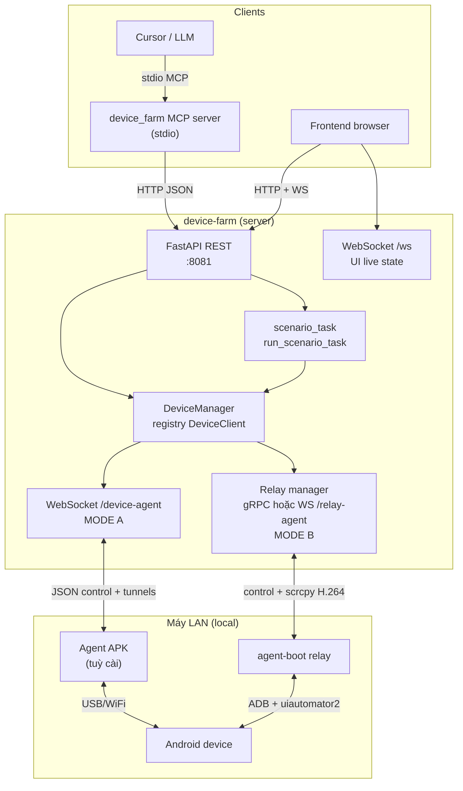
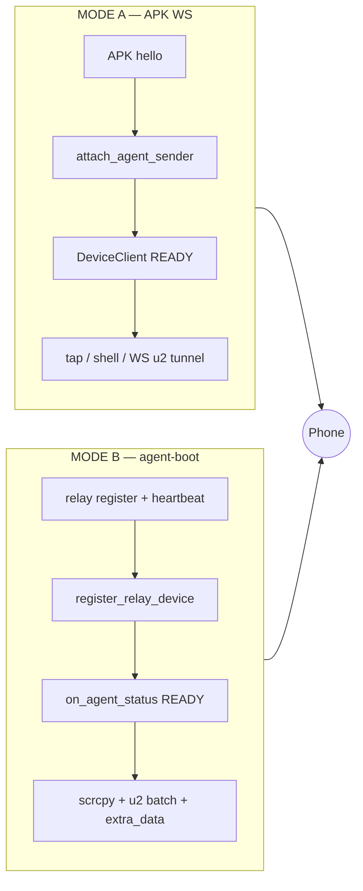
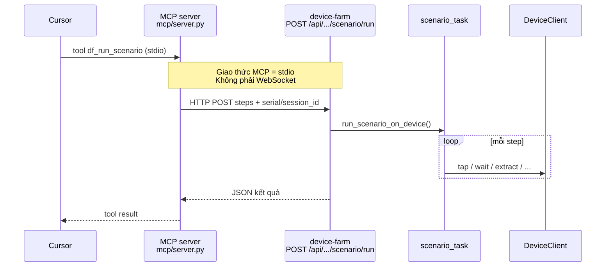
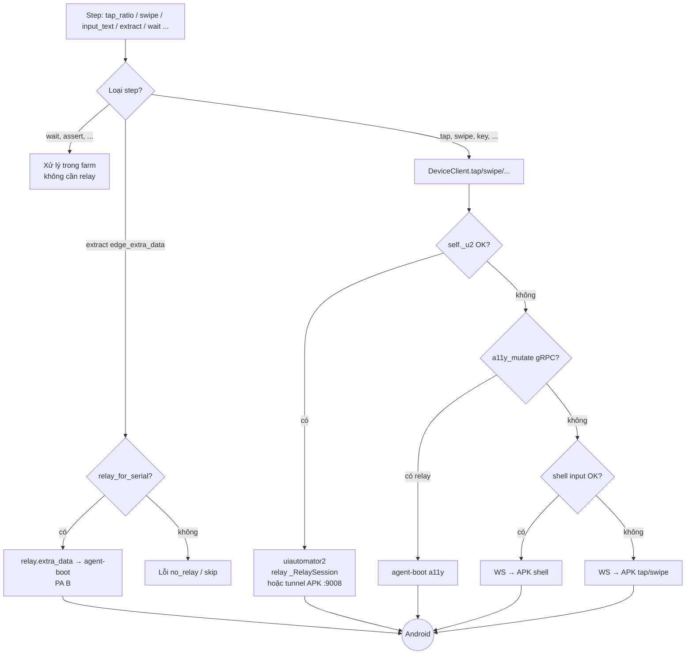
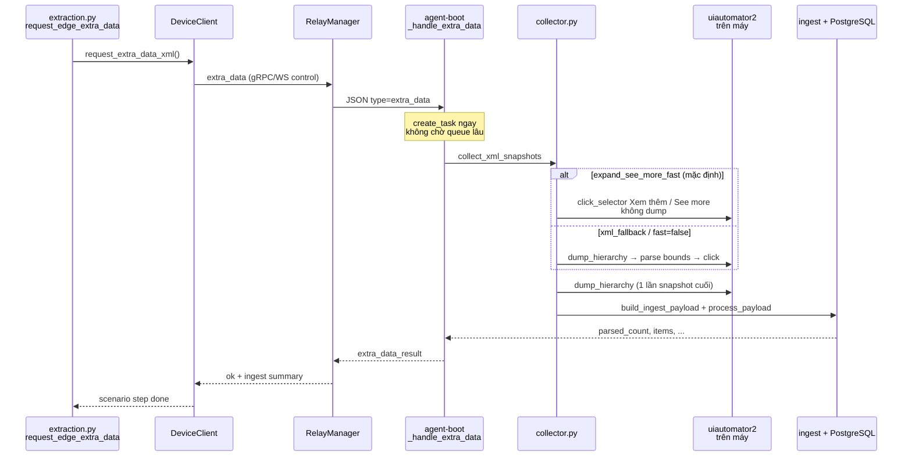
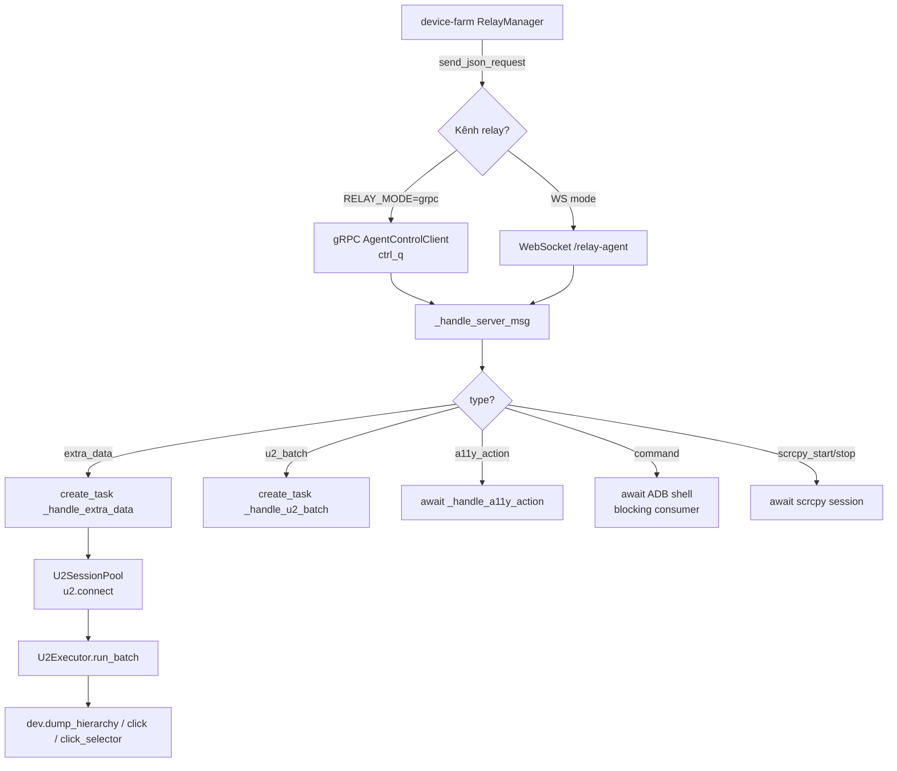
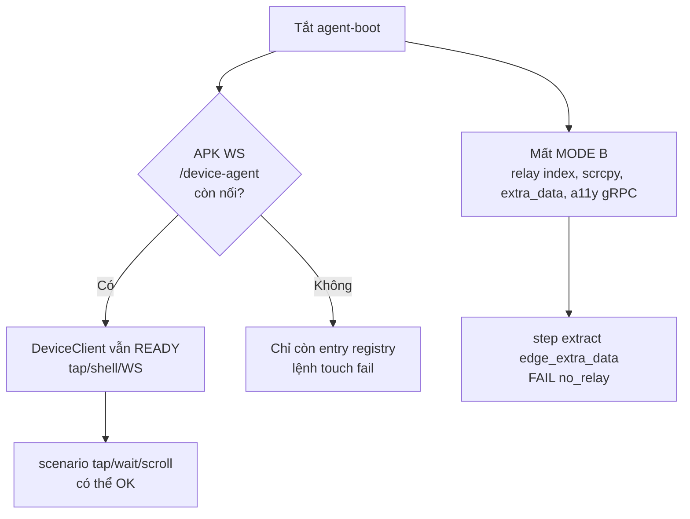
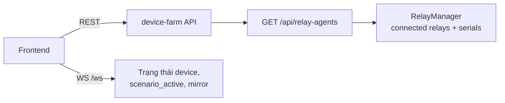
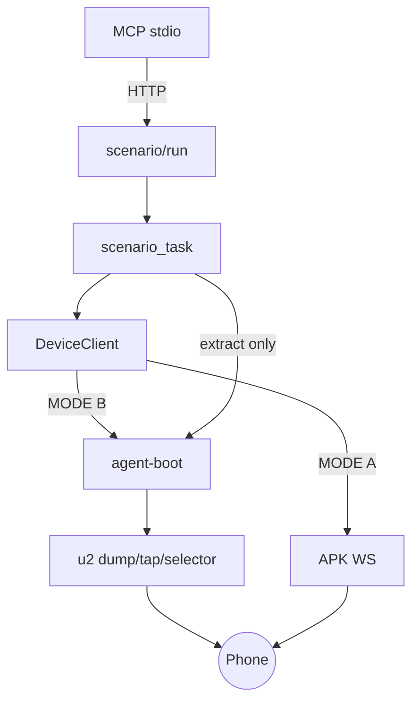

# Device Farm — Luồng điều khiển & scenario (tổng quan)

Tài liệu này mô tả **toàn bộ luồng** từ Cursor/MCP → device-farm → thiết bị thật, gồm **hai kênh song song** (agent-boot relay vs APK WebSocket) và PA B `extra_data`.

> **Review (2026-05-24):** Đối chiếu với `device_client.py`, `device_manager.py`, `mcp/server.py`, `adb_relay_server.py`, `agent-boot/relay/agent.py`, `collector.py`.

---

## 1. Kiến trúc tổng quan



**Không gửi XML từ cloud xuống agent-boot.** Farm chỉ gửi **lệnh/metadata**; XML sinh trên máy qua u2.

---

## 2. Hai mode kết nối thiết bị

| | **MODE A — APK Agent** | **MODE B — agent-boot relay** |
|---|------------------------|-------------------------------|
| Kết nối | APK → `WS /device-agent` | agent-boot → gRPC hoặc `WS /relay-agent` |
| Đăng ký | `DeviceManager.ensure_device(serial)` khi hello | `register_relay_device` + heartbeat serials |
| Mirror | JPEG/H.264 từ APK (MediaProjection) | scrcpy qua relay |
| Touch ưu tiên | u2 tunnel :9008, WS tap/shell | u2 qua relay, `a11y_mutate` gRPC |
| Edge extract PA B | **Không** (cần relay) | **Có** (`extra_data`) |
| Tắt agent-boot | MODE A vẫn có thể chạy scenario cơ bản | Mất scrcpy relay, extra_data, a11y gRPC |



**Lưu ý:** Tắt agent-boot **không** xóa `DeviceClient` khỏi registry. Nếu APK WS còn sống, thiết bị vẫn **READY** → scenario API vẫn chấp nhận chạy.

---

## 3. MCP chạy scenario (không dùng WS)



**Session MCP** (`df_start_session`) chỉ khóa thiết bị trong DB — vẫn là HTTP, không mở WS riêng cho MCP.

---

## 4. Scenario step → thiết bị (ưu tiên touch)



---

## 5. PA B — `extra_data` (edge extract, relay-only)

Farm **không** có XML. Chỉ gửi `strategy` + `context` (expand flags, execution_id, …).



**Thời gian chủ yếu:** `dump_hierarchy` trên máy (~10s/lần trên một số OEM). Spinner UI = farm **block** chờ `extra_data_result` (một response cuối).

---

## 6. agent-boot nhận lệnh relay



`extra_data` dùng `create_task` → không block consumer cho tới khi dump xong; farm vẫn **đợi** reply qua `send_json_request`.

---

## 7. Vì sao tắt agent-boot scenario vẫn chạy?



---

## 8. Frontend & relay panel



UI mirror có thể từ **APK stream** hoặc **relay scrcpy** — độc lập với MCP.

---

## 9. Bảng giao thức theo từng đoạn

| Đoạn | Giao thức | Ghi chú |
|------|-----------|---------|
| Cursor ↔ MCP | **stdio** (MCP) | Không WS |
| MCP ↔ device-farm | **HTTP REST** | `DEVICE_FARM_URL` |
| Frontend ↔ farm | HTTP + **WS `/ws`** | Live UI |
| APK ↔ farm | **WS `/device-agent`** | MODE A |
| agent-boot ↔ farm | **gRPC** (hoặc WS `/relay-agent`) | MODE B, log `GRPC mode` |
| farm ↔ phone (extract) | Relay JSON `extra_data` → u2 | Không đẩy XML từ cloud |
| u2 trên máy | **uiautomator2** Python → atx-agent :7912 | Qua `U2SessionPool` |

---

## 10. Scenario selector (uiautomator2)

Các bước `tap_selector`, `wait_element`, `assert_element`, `input_selector`, `long_tap_selector`, `scroll_to`, `if_element` và `tap` hỗ trợ **selector nested**:

```json
{
  "type": "tap_selector",
  "selector": {
    "by": "text",
    "value": "Wi‑Fi",
    "conditions": { "className": "android.widget.TextView" },
    "instance": 0,
    "chain": {
      "op": "relative",
      "direction": "right",
      "target": { "className": "android.widget.Switch" }
    }
  },
  "fallback": { "rx": 0.5, "ry": 0.8 },
  "timeout": 8
}
```

| Thành phần | Mô tả |
|------------|--------|
| `by` + `value` | Điều kiện chính (text, resource-id, xpath, …) |
| `conditions` | AND thêm (className, clickable, textContains, …) |
| `instance` / `index` | Phần tử thứ N trùng điều kiện |
| `chain` | `child`, `sibling`, `relative`, `child_by_text`, `child_by_description` |

**Legacy:** top-level `by`/`value` vẫn được đọc. UI ghi `selector` nested khi ghi kịch bản.

**Runtime:** selector đơn / multi-field → JSON-RPC (`u2_jsonrpc.find_element_spec`). Chain → **agent-boot** `wait_and_click_spec` / `exists_spec` (Python u2). Không có relay → fallback xpath (`compile_chain_to_xpath`).

| File | Vai trò |
|------|---------|
| `device_farm/services/scenario_selector.py` | Normalize, RPC dict, xpath compile |
| `device_farm/runtime/transports/u2_jsonrpc.py` | `find_element_spec` |
| `agent-boot/relay/u2_executor.py` | `_resolve_spec`, chain ops |
| `device_farm/tasks/scenario/utils.py` | `_retry_find_element`, `_execute_tap` |

---

## 11. File code tham chiếu

| Thành phần | File |
|------------|------|
| Hai mode, tap priority | `device_farm/runtime/core/device_client.py` |
| Registry | `device_farm/runtime/core/device_manager.py` |
| MCP → HTTP | `device_farm/mcp/server.py` |
| Scenario API | `device_farm/api/routes/device_control/scenarios.py` |
| Edge extract | `device_farm/tasks/scenario/steps/extraction.py` |
| Relay RPC | `device_farm/runtime/transports/adb_relay_server.py` |
| Relay handler | `agent-boot/relay/agent.py` |
| Collect + expand | `agent-boot/relay/extra_data/collector.py` |
| u2 ops | `agent-boot/relay/u2_executor.py`, `u2_session_pool.py` |
| PA B runbook | `docs/plans/agent-boot-direct-content-writer/reports/edge-extra-runbook.md` |

---

## Sơ đồ một trang (quick reference)


