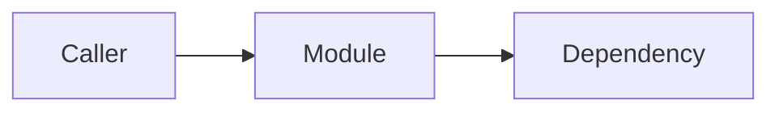

# Module Documentation Template

Use this format for durable module documentation. Keep planning notes and
research outside canonical module docs unless they are current implementation
contracts.

```md
# <Module Name>

Status: active | implemented | backlog | deprecated
Last audited: YYYY-MM-DD

## Scope

What this module owns.

## Out Of Scope

What this module must not own.

## Current Code State

| Area | Source |
|---|---|
| API routes | `path` |
| Services | `path` |
| Models | `path` |
| Frontend | `path` |
| Tests | `path` |

## Diagrams

Include at least one Mermaid diagram when the module has multiple components,
states, or cross-module integrations.



## Behavior Contract

Happy path, failure path, and integration path.

## Data Contract

Tables, durable fields, queue/workflow state, and API contracts.

## Agent Implementation Checklist

- Source files to inspect first.
- Tests to run or add.
- Contracts that must not drift.

## Open Risks

Known mismatches, missing tests, or future work.
```
