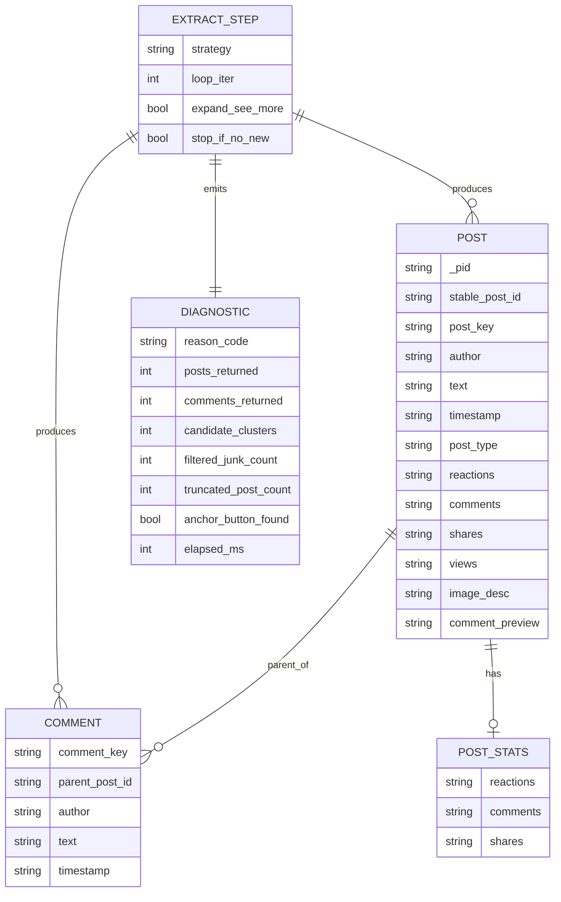

# FB Extract Data Flow

## End-to-end flow

```mermaid
flowchart LR
    A["Android Device UI"] --> B["handle_extract(strategy)"]
    B --> C["hierarchy_xml(force_refresh=true)"]
    C --> D["dispatch by strategy"]
    D --> E["fb_posts path"]
    D --> F["fb_comments path"]

    E --> E1["_parse_posts_with_diag(xml)"]
    E1 --> E2["parse_fb_posts_from_xml_with_diagnostic"]
    E2 --> E3{"Recycler/List container?"}
    E3 -->|yes| E4["_extract_posts_from_recycler"]
    E3 -->|no| E5["cluster fallback (_cluster_into_posts)"]
    E4 --> E6["_extract_post + post_extractor enrich"]
    E5 --> E6
    E6 --> E7["_dedup(posts)"]

    F --> F1["_parse_comments_with_diag(xml, parent_post_id)"]
    F1 --> F2["parse_fb_comments_from_xml_with_diagnostic"]
    F2 --> F3["_resolve_comment_region_anchors"]
    F3 --> F4["filter nodes in comment band"]
    F4 --> F5["_cluster_into_comments + _extract_comment"]
    F5 --> F6["_extract_header_stats + attach post stats"]
    F6 --> F7["_dedup_comments(comments)"]
    F7 --> F8["optional comment_scroll_passes merge loop"]

    E7 --> G["Scenario ctx: ctx['posts']"]
    F8 --> H["Scenario ctx: ctx['comments']"]

    G --> I["inline auto-save (optional collection)"]
    H --> I
    I --> J["content store / persisted output"]
    H --> K["compute_content_hash (comment parent mapping)"]

    E1 --> L["extract_diagnostic(posts)"]
    F1 --> M["extract_diagnostic(comments)"]
    L --> N["trace event (posts)"]
    L --> O["failure bundle (conditional on fatal reason_code)"]
    M --> P["comment diagnostic (no dedicated trace event emitter)"]
```

## Data entities

## Main files mapped

- `device_farm/tasks/scenario/steps/extraction.py`
- `device_farm/tasks/fb_extract/feed_pipeline.py`
- `device_farm/tasks/fb_extract/comment_pipeline.py`
- `device_farm/tasks/fb_extract/post_extractor.py`
- `device_farm/tasks/fb_extract/dedup.py`
- `device_farm/tasks/fb_extract/_impl.py`
