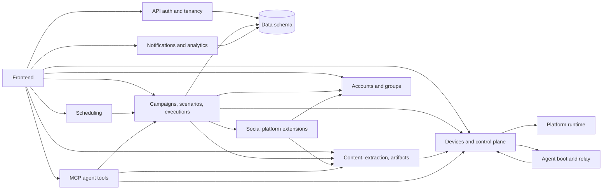

# Module Index

Status: active
Last audited: 2026-05-18

Device Farm is organized around the current source modules below. The old
`docs/specs/DF-*` ticket files have been consolidated into these module docs.

## Module Boundaries

| Module | Owns | Does not own |
|---|---|---|
| Platform runtime | FastAPI app composition, health, lifecycle, global runtime services | Product CRUD semantics |
| API auth and tenancy | Route mounting, user auth, device auth, policy helpers | Per-module business rules |
| Devices and control plane | Device inventory, pairing, real-time gestures, sessions, media stream control | Campaign orchestration |
| Campaigns, scenarios, executions | Scenario schema, graph execution, Temporal workflows, execution results, DLQ | Low-level device transport implementation |
| Social platform extensions | Contract for adding platform-specific scenario steps, extraction strategies, content types, and profiles | Platform-specific parser implementation details |
| Scheduling | Cron/fallback scheduling and schedule run history | Scenario step execution internals |
| Content, extraction, artifacts | OCR/AI/hierarchy extraction, saved content, screenshots/artifacts | Account rotation |
| Accounts and groups | Social/account records, device-account assignment, account group rotation | Device group membership |
| Notifications and analytics | Notification channels, in-app notifications, activity log | External monitoring stack |
| Agent boot and relay | Bootstrap CLI, relay agent, ADB/u2/scrcpy/STF channel management | Backend CRUD ownership |
| MCP agent tools | MCP stdio tools for AI-agent device/session/campaign/content control | AI reasoning policy or platform-specific workflow design |
| Frontend | Dashboard feature surfaces, generated API client, Next API proxies | Backend source-of-truth API semantics |

## Module Dependency Map

## Implementation Flow For Agents

1. Read the module doc for the feature.
2. Check the source paths listed in the module doc.
3. Check `docs/api/route-matrix.md` for API/auth impact.
4. Check `docs/data/schema.md` for tables and migrations.
5. If code and docs differ, update docs in the same change.
