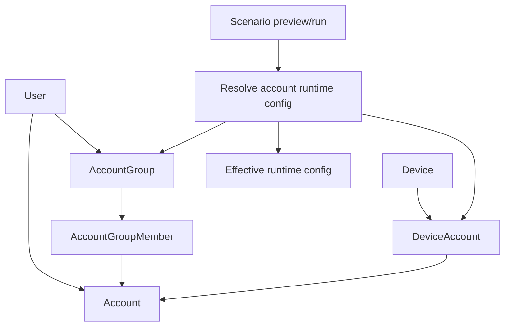
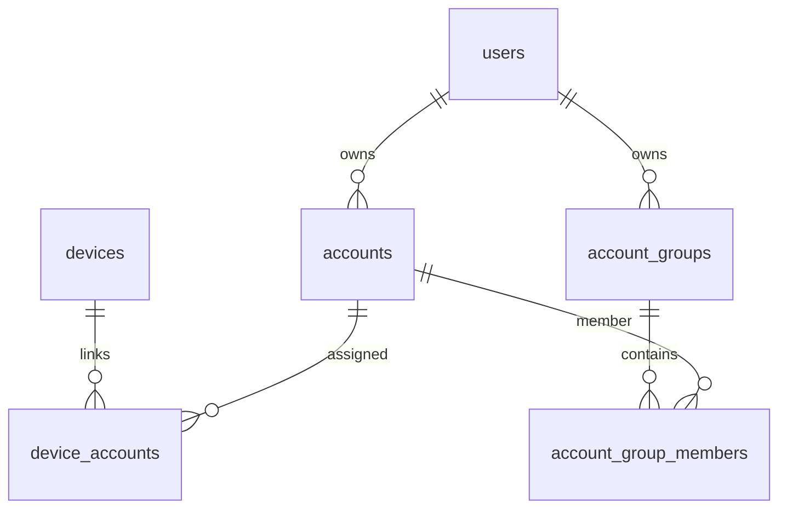

# Accounts And Account Groups

Status: active
Last audited: 2026-05-18

## Scope

This module owns social/account records, device-account assignment, account
status, import, account groups, batch selection, and account-related runtime
config passed into scenario preview/execution.

## Out Of Scope

It does not own device group membership or campaign execution once account
variables are resolved.

## Current Code State

| Area | Source |
|---|---|
| Account routes | `device_farm/api/routes/accounts.py` |
| Account group routes | `device_farm/api/routes/account_groups.py` |
| Account group CRUD | `device_farm/db/crud/account_group.py` |
| Services | `device_farm/services/account_manager.py` |
| Models | `device_farm/db/models/account.py`, `device_farm/db/models/account_group.py` |
| Scenario integration | `device_farm/api/routes/device_control/scenarios.py`, `device_farm/services/campaign_dispatch.py` |
| Frontend | `front-end/src/features/accounts/*`, `front-end/src/features/account-groups/*` |

## Diagrams

### Account Assignment And Rotation

### Account Data Relationship

## Behavior Contract

- Accounts are user-scoped resources with platform, username, status, tags,
  metadata, usage counters, and optional proxy id.
- Device-account links associate accounts with devices and may mark primary
  assignments.
- Account groups provide rotation/batch selection for scenario variables.
- Account-related values may be carried through scenario config, device context,
  and effective runtime config for the current product slice.
- Scenario-owned account intent is canonical: if a scenario needs login/account
  data, the scenario config or per-device context must provide or reference it.
  Device Farm still executes the scenario as written; missing required
  account/login config is a scenario configuration error owned by the scenario
  author when the run gets stuck or fails.
- Runtime should not silently choose a device primary account as a product-level
  fallback when the scenario did not declare account intent.
- Product intent is to avoid designing workflows around plaintext credentials,
  but credential separation and vault-backed references are lower-priority
  hardening. Current scenario/device config may still accept any valid JSON.
- Scenario execution should prefer account identifiers, usernames, group ids,
  and platform keys when practical, but must remain compatible with free-form
  account runtime config.

## Data Contract

Primary tables:

- `accounts`
- `device_accounts`
- `account_groups`
- `account_group_members`

Primary APIs:

- `/api/accounts*`
- `/api/accounts/import*`
- `/api/accounts/round-robin`
- `/api/devices/{device_id}/accounts*`
- `/api/account-groups*`

## Agent Implementation Checklist

- Keep secret handling server-side.
- Do not require typed account schemas or vault-backed credential separation
  unless the feature explicitly prioritizes secret hardening.
- Add tests for ownership and account resolution behavior when touching
  scenario/account integration.
- Do not introduce new implicit account fallbacks. Prefer explicit scenario
  config, per-device context, or account group references.
- Distinguish account groups from device groups in names and docs.

## Open Risks

- Some old docs use "profile" and "account" interchangeably. Current canonical
  term is `Account`; use `Profile` only for data owned by an external platform.
- Current campaign dispatch still has a legacy fallback from unbound scenarios
  to the device primary account. This behavior exists in source but is not the
  target product contract for new social-platform workflows.
