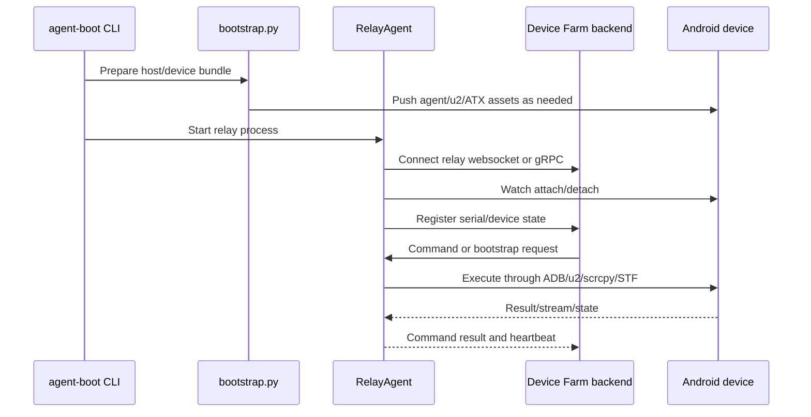
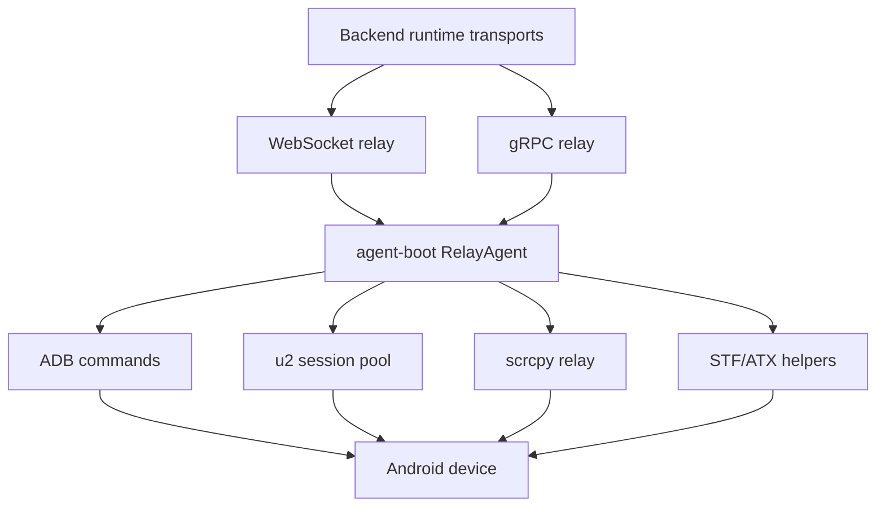

# Agent Boot And Relay

Status: active
Last audited: 2026-05-31

## Scope

This module owns the local bootstrap CLI, relay process, device watcher,
ADB/u2/STF/scrcpy channel management, relay control clients, reconnect loops,
and device-side command execution.

## Out Of Scope

It does not own backend CRUD semantics, campaign planning, or frontend UI state.

## Current Code State

| Area | Source |
|---|---|
| CLI launcher | `agent-boot/main.py` |
| Bootstrap steps | `agent-boot/bootstrap.py`, `agent-boot/pack_bundle.py` |
| Relay core | `agent-boot/relay/agent.py`, `agent-boot/relay/device_watcher.py`, `agent-boot/relay/device_state.py`, `agent-boot/relay/supervisor.py` |
| Execution channels | `agent-boot/relay/adb.py`, `agent-boot/relay/u2_executor.py`, `agent-boot/relay/u2_session_pool.py`, `agent-boot/relay/scrcpy_relay.py`, `agent-boot/relay/session_manager.py` |
| Control transport | `agent-boot/relay/control_client.py`, `agent-boot/relay/grpc_client.py`, `agent-boot/relay/grpc_gen/*` |
| Backend relay transport | `device_farm/runtime/transports/adb_relay_server.py`, `device_farm/runtime/transports/grpc_relay_server.py`, `device_farm/api/routes/relay_agents.py` |
| Frontend | `front-end/src/features/devices/components/relay-agents-panel.tsx`, `front-end/src/app/[locale]/dashboard/relay-agents/page.tsx` |

## Diagrams

### Relay Lifecycle

### Command Channel Map

## Behavior Contract

- Bootstrap prepares the device/host relay environment and deploys required
  bundles when needed.
- Relay agent watches attached devices, maintains heartbeat/reconnect state, and
  exposes command execution paths to backend control.
- Execution channels must keep serial identity and session ownership explicit.
- Backend relay-agent APIs register devices, push connect URLs, bootstrap relay
  devices in bulk, and expose relay state to dashboard surfaces.
- gRPC relay supports server-side TLS and the agent can opt into TLS with
  `grpcs://`, `RELAY_GRPC_TLS=true`, or `RELAY_GRPC_ROOT_CERT_FILE`.
- Relay registration is persisted through the control-channel enrollment token;
  missing or revoked tokens are rejected when ownership enforcement is enabled.

## Data Contract

Primary tables:

- `relay_agents`
- `devices`
- `device_sessions`

Primary APIs:

- `/api/relay-agents*`
- `/api/relay/status`
- `/relay-agent`
- `/device-agent`

## Agent Implementation Checklist

- Test relay behavior with unit tests under `agent-boot/relay/tests` when
  changing local relay logic.
- Keep WS and gRPC command paths behaviorally equivalent when both are supported.
- Document any new device identity field in device docs and API matrix.

## Open Risks

- Agent-boot was under-documented relative to its current source footprint. New
  relay work should update this doc first.
- Revoking an enrollment token prevents future registration, but active control
  streams are not forcibly disconnected yet.
