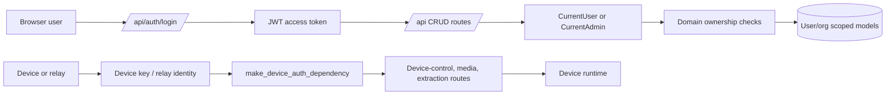

# API Auth And Tenancy

Status: active
Last audited: 2026-05-18

## Scope

This module owns HTTP route composition, user authentication, device
authentication, and shared authorization helpers.

## Out Of Scope

It does not own endpoint-specific business validation. Each domain route remains
responsible for ownership checks on its own objects.

## Current Code State

| Area | Source |
|---|---|
| CRUD router aggregation | `device_farm/api/crud/router.py` |
| Router mounting | `device_farm/api/mount.py` |
| API dependencies | `device_farm/api/deps.py` |
| Auth context and policy | `device_farm/api/auth/context.py`, `device_farm/api/auth/policy.py` |
| Auth routes | `device_farm/api/routes/auth.py` |
| User/org models | `device_farm/db/models/user.py`, `device_farm/db/models/organization.py` |
| Frontend auth | `front-end/src/features/auth/*`, `front-end/src/features/device-farm/services/client.ts` |

## Diagrams

### Auth Boundary Map

## Behavior Contract

- User API routes are mounted under `/api` through `api_router`.
- Device-control APIs are mounted separately and protected by device identity,
  not normal user session semantics.
- Login and refresh endpoints are public auth flows.
- `/auth/me` style identity endpoints require a valid user token.
- Organization and user ownership must be checked at the domain route level.

## Data Contract

Primary tables:

- `users`
- `organizations`
- `organization_members`

Frontend auth state is not the source of truth. Backend token validation and
route dependencies are authoritative.

## Agent Implementation Checklist

- Do not infer user ownership from frontend route params.
- Before adding an API route, choose one auth boundary: public, user-auth,
  admin-auth, or device-auth.
- For user-auth route additions, include schema source and ownership rules in
  `docs/api/route-matrix.md`.
- For generated client changes, check `front-end/generate/openapi.json` and
  `front-end/src/features/device-farm/services/generated/DeviceFarmApi.ts`.

## Open Risks

- Route documentation and generated client can drift. Notifications, relay
  agents, and analytics should be checked first when regenerating OpenAPI.
