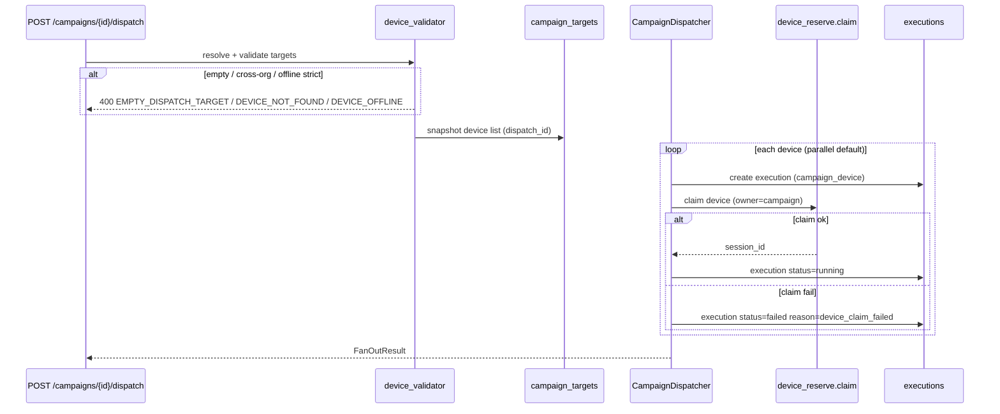
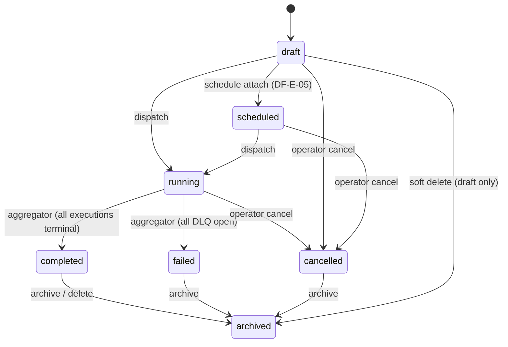
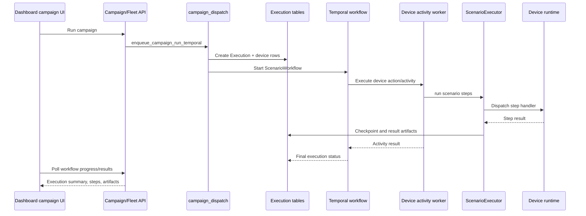
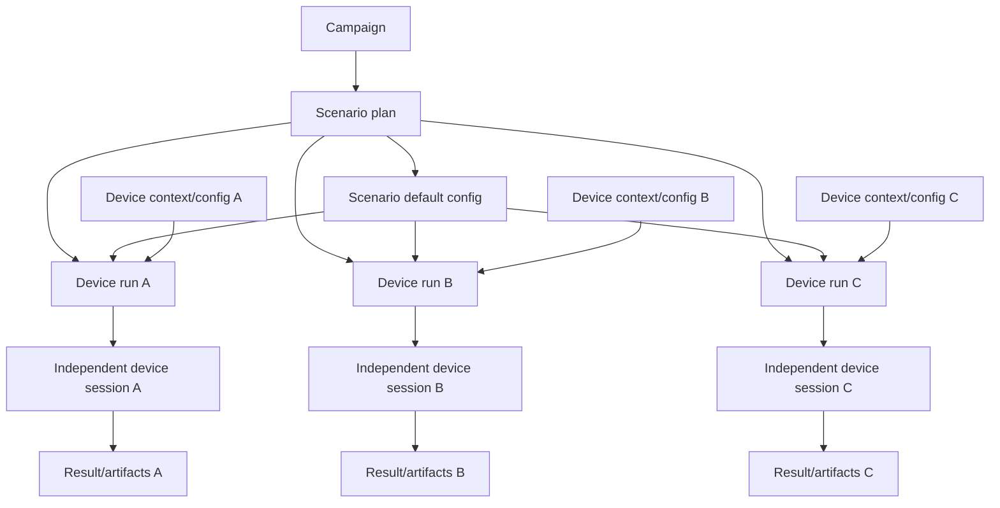
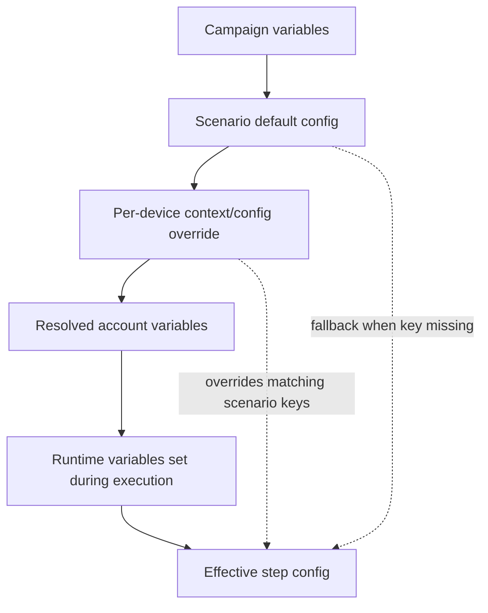
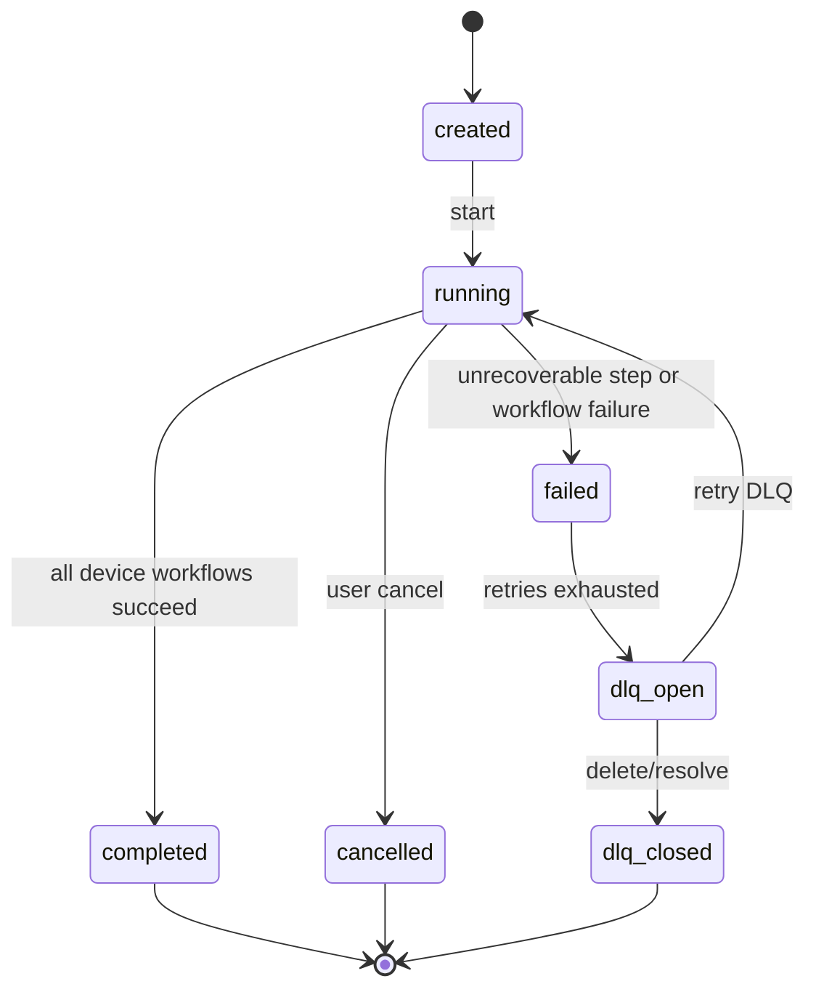
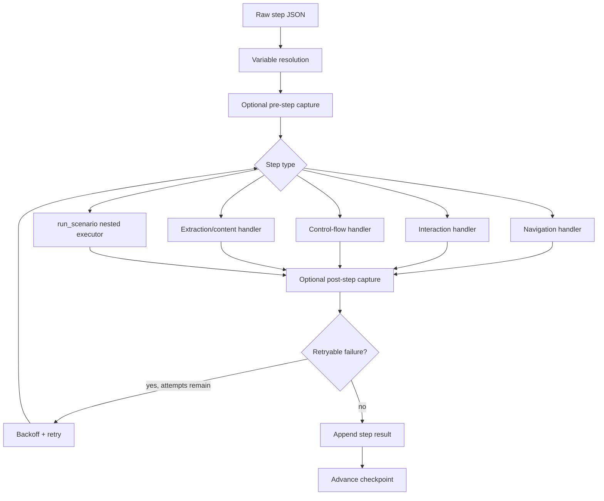
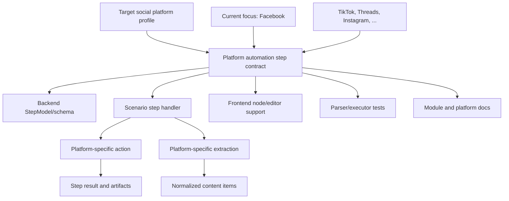

# Campaigns, Scenarios, And Executions

Status: active
Last audited: 2026-05-18

## Scope

This module owns campaign lifecycle, scenario graph and step schema, scenario
template usage, variable resolution, execution records, Temporal workflow
dispatch, workflow control, execution results, artifacts, checkpoints, and DLQ
retry.

## Out Of Scope

It does not own low-level ADB/scrcpy/u2 implementation or frontend-only graph
editing state that is not persisted through campaign/scenario models.

## Current Code State

| Area | Source |
|---|---|
| Campaign/scenario routes | `device_farm/api/routes/campaigns.py` |
| Fleet run/workflow control | `device_farm/api/routes/device_control/campaign_fleet.py` |
| Execution CRUD/DLQ/artifacts | `device_farm/api/routes/executions.py` |
| Scenario schema | `device_farm/api/schemas/scenario.py` |
| Scenario execution loop | `device_farm/tasks/scenario/executor.py`, `device_farm/tasks/scenario/steps/*` |
| Dispatch service | `device_farm/services/campaign_dispatch.py`, `device_farm/services/campaign/dispatcher.py` |
| Temporal workflows | `device_farm/temporal/workflows.py`, `device_farm/temporal/activities.py`, `device_farm/temporal/worker.py` |
| Models | `device_farm/db/models/campaign.py`, `device_farm/db/models/scenario_version.py`, `device_farm/db/models/execution.py`, `device_farm/db/models/execution_dlq.py` |
| Frontend | `front-end/src/features/campaigns/*`, `front-end/src/features/scenario-templates/*`, `front-end/src/app/[locale]/scenario-flow/[id]/page.tsx` |

## Diagrams

### Campaign Fan-Out Dispatch (DF-T-04-008)

Epic 04 org-scoped campaigns dispatch via `POST /api/campaigns/{id}/dispatch`.
Targets may be explicit `device_ids` and/or `device_group_ids` (expanded at
dispatch time). Group membership is snapshotted into `campaign_targets` so
later group edits do not affect an in-flight dispatch.

Per-device variables: campaign `vars` plus `per_device_overrides[device_id]`
merge into each execution's `device_config.effective_vars`. The DSL resolver
uses `EffectiveVariableResolver.for_campaign_device(...)`.

### Campaign Lifecycle FSM (DF-T-04-007)

Org-scoped Epic 04 campaigns use a finite state machine enforced by
`services/campaign/fsm.py` and `services/campaign/lifecycle.py`. Invalid
transitions return HTTP 409 (`INVALID_TRANSITION`); body edits on non-draft
campaigns return `CAMPAIGN_LOCKED`.

Timestamps: `started_at` on `running`, `completed_at` on `completed`,
`cancelled_at` on `cancelled`. Each transition emits `campaign.status.changed`
and increments `campaign_status_transition_total{from,to}`.

Aggregation uses grouped SQL counts (not full execution row loads) and is
debounced per campaign via `aggregator_scheduler.py` (~500ms coalesce) so
N concurrent execution terminals trigger one evaluation.

### Execution runtime (DF-T-04-010)

After fan-out (`POST /campaigns/{id}/dispatch`), `execution_runtime.py`
starts one durable workflow per running execution:

- **Temporal path:** `workflow_id = exec_{execution_id}`, task queue from config.
  Pinned org scenarios are expanded into `run_scenario` steps with a pre-built
  registry (`by_id` / `by_campaign_name`).
- **Fallback path:** when Temporal is disabled or `start_workflow` fails,
  `dispatch_source=fallback` is stored on the execution and an in-process
  asyncio task runs `run_scenario_task` (best-effort durability).
- **Terminal:** `finalize_campaign` activity calls `finish_fan_out_execution`
  (release device claim + debounced campaign aggregator). Legacy campaign-idle
  logic is skipped when `dispatch_source` is set.
- **Sequential dispatch:** when one execution finishes, the next queued
  pending execution for the same `dispatch_id` is claimed and started.
- **Step retry (DF-T-04-011):** on the Temporal path, steps with an explicit
  `retry` block run one `execute_device_action` per attempt; backoff uses
  `workflow.sleep()` so waits survive worker restart. In-process / fallback
  execution still uses `execute_step_with_retry` inside the executor.
- **Step traceability:** control-flow handlers carry `__scenario_trace__`
  through loop/repeat iterations, branches, and `run_scenario` calls. Leaf step
  events and persisted step rows include `trace.step_path`; control-flow nodes
  emit only boundary events with `iterations_run`/`stopped_by`, never one event
  per loop iteration.

`GET /api/execution/runtime` reports `fallback_mode_active` when Temporal is off.

### Campaign Dispatch Sequence

### Independent Device Execution

### Runtime Config Resolution

### Execution State Model

### Scenario Step Dispatch

### Social Platform Step Model

## Behavior Contract

- A campaign contains one or more scenarios.
- Scenarios may be represented as ordered steps and/or graph nodes/edges.
- Platform-specific social automation must be represented as scenario steps or
  graph nodes. Do not implement Facebook, TikTok, Threads, Instagram, or future
  platform automation as a separate runner that bypasses scenario validation,
  execution, variable resolution, evidence, or content contracts.
- Platform-specific extraction should use `type: "extract"` with a
  `strategy` named as `<platform>_<data_object>`, for example `fb_posts` or
  `fb_comments`.
- Platform-specific actions should use explicit step types named as
  `<platform>_<verb>_<object>`. Existing legacy names may be accepted as
  aliases for backward compatibility, but new templates and docs should use the
  canonical naming model.
- Scenario step validation is defined by `ScenarioModel` and `StepModel` in
  `device_farm/api/schemas/scenario.py`.
- The executor resolves variables before dispatching each step.
- Scenario variables are the default config for a scenario run.
- Per-device variables/context override scenario defaults for that scenario and
  device pair. Missing keys fall back to scenario defaults.
- The same scenario can run across many independent device sessions with
  different effective configs.
- Scenario/device config is currently free-form JSON. The system should preserve
  valid JSON values without requiring a typed schema.
- Scenario execution follows the authored steps. Missing business inputs such
  as login/account values should surface as run/step failure with evidence,
  rather than triggering implicit account fallback or hidden repair behavior.
- Social automation steps are UI-gated by default: a step must observe or rely
  on the expected app UI state before its action can be considered successful.
- A failed UI-gated step stops the remaining scenario steps by default, like a
  normal script failure. Later steps run only when the scenario explicitly
  models retry, branch, skip, or recovery behavior.
- User-facing execution follows the authored scenario flow. Preview, campaign,
  MCP/session runs, Temporal-backed runs, or any future execution backend must
  preserve the same scenario-authored step/branch/recovery semantics.
- Supported explicit recovery primitives include condition branches
  (`if_element`, `if_variable`), loops (`repeat`, `repeat_until`, `loop`,
  `break_if`), nested composition (`run_scenario`), per-step retry config, and
  explicit error policy fields such as `ignore_error` or `on_error` where the
  execution path supports them.
- Explicit `ignore_error` and `on_error` values are scenario error policy, not
  backend-specific behavior. Defaults should stop on failed steps; non-stop
  behavior must be authored into the scenario.
- Secrets in config are discouraged by product policy, but current validation is
  only valid JSON. Do not block existing config payloads solely because they may
  contain secret-like keys until secret hardening is explicitly prioritized.
- Future typed schemas may add `type`, `default`, `required`, `description`,
  `secret`, and `allowed_values` metadata, but implementation should stay
  backward-compatible with existing free-form config.
- Step execution supports pre/post capture, retry on selected retryable reasons,
  cancellation, nesting depth limits, and checkpoint persistence.
- Step failure reporting must include enough context for the scenario author to
  understand which step stopped the run: step index/type, status/message, and
  available UI evidence such as screenshot, hierarchy, or artifacts.
- Campaign dispatch creates execution/workflow state and can target devices or
  groups.
- DLQ retry re-enters campaign dispatch (legacy) or Epic 04 execution runtime
  (checkpoint replay via `replayed_from` + `start_step`) and must preserve
  ownership and idempotency semantics. Operator guide:
  [dlq-playbook.md](../operator/dlq-playbook.md).

## Step Families

Current step families are:

- Navigation: `launch_app`, `open_url`, `key`
- Interaction: `tap`, `tap_ratio`, `tap_position`, `tap_selector`,
  `long_tap_selector`, `swipe_ratio`, `scroll_down`, `scroll_to`
- Input and wait: `input_text`, `input_selector`, `wait`, `wait_element`,
  `wait_stable`
- Verification: `assert_element`, `verify_screen`
- Variables/control flow: `set_variable`, `repeat`, `repeat_until`,
  `if_element`, `if_variable`, `random_pick`, `loop`, `break_if`
- Composition: `run_scenario`
- Extraction/content: `extract`, `extract_text_hierarchy`, `extract_text_ocr`,
  `extract_text_ai`, `extract_screen_data`, `save_extraction`
- Platform-specific social actions/extraction: currently Facebook-oriented
  behavior such as `tap_fb_comment_button` and extraction strategies such as
  `fb_posts` and `fb_comments`; future TikTok, Threads, Instagram, and other
  platform features should be added as explicit steps or extraction strategies
  with schema, handler, editor, tests, and docs.
  `tap_fb_comment_button` is a legacy alias shape; new platform action names
  should put the platform prefix first.

## Data Contract

Primary tables:

- `campaigns`
- `campaign_devices`
- `scenarios`
- `scenario_versions`
- `scenario_device_variables`
- `executions`
- `execution_devices`
- `execution_results`
- `execution_dlq`

Primary APIs:

- `/api/campaigns*`
- `/api/campaigns/{campaign_id}/scenarios*`
- `/api/campaigns/{campaign_id}/scenarios/{scenario_id}/devices/{device_id}/variables`
- `/api/campaigns/{campaign_id}/run`
- `/api/executions*`
- `/api/executions/dlq` — list (`status=open` → pending entries)
- `/api/executions/dlq/summary`
- `/api/executions/dlq/executions/{execution_id}` — DLQ detail (DF-T-04-012)
- `/api/executions/dlq/{dlq_id}/retry` — body `{ from_checkpoint }`
- `/api/executions/dlq/{dlq_id}/close` — body `{ reason }`
- `/api/executions/dlq/bulk-retry` — body `{ execution_ids, from_checkpoint }`
- `/api/executions/{id}/events` — catch-up (`?since=event_id`)
- `/api/executions/{id}/events/stream` — SSE live stream (DF-T-04-013)
- `/api/workflows/{workflow_id}/progress`
- `/api/workflows/{workflow_id}/steps`
- `/api/workflows/{workflow_id}/pause|resume|cancel`

## Agent Implementation Checklist

- Run GitNexus context/impact before editing executor, dispatch, or workflow
  symbols.
- Do not add new step types only in frontend. Add backend schema, handler,
  docs, and tests together.
- Do not add platform-specific automation outside the scenario step/node model.
  A new social-platform capability must declare its step contract, config keys,
  outputs, evidence, and failure modes.
- Do not add default continue-on-error behavior for social automation steps.
  If continuing after a failed action is needed, model it explicitly through
  scenario control flow.
- Treat execution engines as implementation details. When touching executor
  paths, keep behavior aligned with the authored scenario flow rather than with
  engine-specific assumptions.
- Treat explicit error policy fields as part of scenario semantics. Do not make
  them work only on one execution backend.
- For extraction, prefer `extract` plus a `<platform>_<data_object>` strategy.
  For actions, prefer explicit `<platform>_<verb>_<object>` step types. Preserve
  legacy aliases only when needed for existing scenarios.
- When adding config keys, define default scenario values and specify whether
  per-device overrides are allowed. Do not require typed schema metadata or
  secret enforcement unless the feature explicitly needs it.
- Keep scenario graph and steps contracts compatible with
  `front-end/src/features/campaigns/*`.
- For DLQ/retry changes, update execution docs and route matrix.

## Open Risks

- Some old DF specs describe planned behavior that is now implemented under
  different module names. Use this module doc and source paths first.
- Multiple execution surfaces exist in source. They should be checked for
  consistency against the authored scenario flow before changing execution
  behavior.
