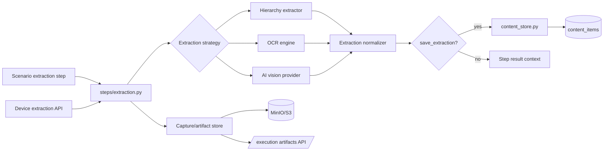
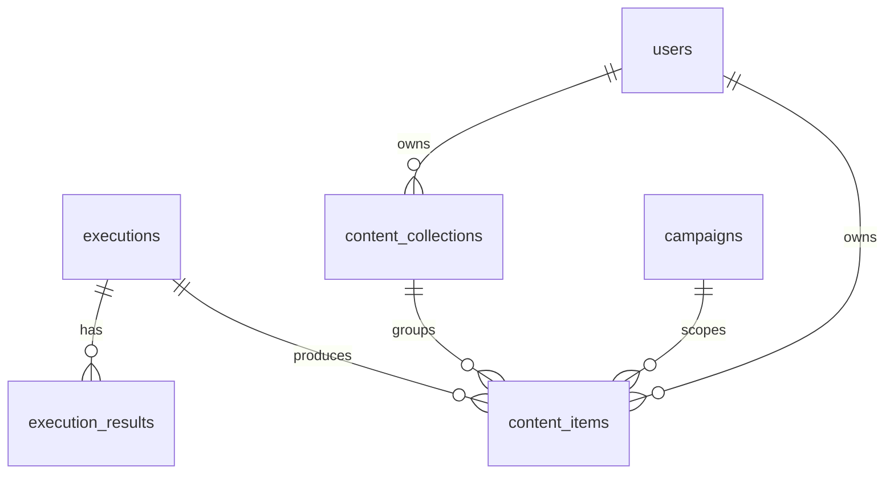
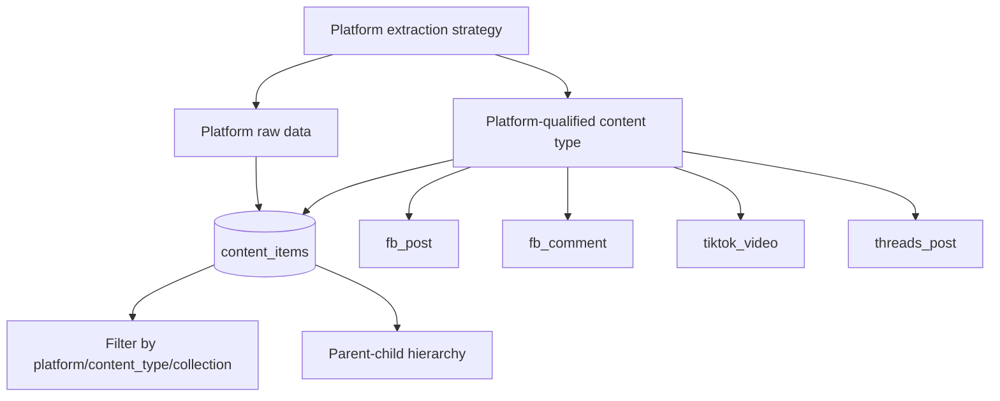

# Content, Extraction, And Artifacts

Status: active
Last audited: 2026-05-18

## Scope

This module owns hierarchy/OCR/AI extraction, saved content, collections,
exports, screenshots, execution artifacts, and capture persistence used by
scenario runs.

## Out Of Scope

It does not own campaign scheduling, account rotation, or low-level stream
transport except where media endpoints expose screenshots/streams.

## Current Code State

| Area | Source |
|---|---|
| Content routes | `device_farm/api/routes/content.py` |
| Extraction routes | `device_farm/api/routes/extraction.py` |
| Media routes | `device_farm/api/routes/device_media.py` |
| Scenario extraction handlers | `device_farm/tasks/scenario/steps/extraction.py` |
| Capture/artifact support | `device_farm/tasks/scenario/capture.py`, `device_farm/services/capture_store.py`, `device_farm/services/image_store.py`, `device_farm/services/minio_store.py` |
| Extraction engines | `device_farm/runtime/extraction/hierarchy_extractor.py`, `device_farm/runtime/extraction/ocr_engine.py`, `device_farm/runtime/extraction/ai_vision.py` |
| Models | `device_farm/db/models/content.py`, `device_farm/db/models/execution.py` |
| Frontend | `front-end/src/features/content/*`, `front-end/src/features/devices/components/*` |

## Diagrams

### Extraction And Persistence Flow

### Content Data Ownership

### Social Content Classification

## Behavior Contract

- Extraction can be requested directly through device-auth endpoints or as
  scenario steps.
- `save_extraction` persists normalized content into `content_items`.
- Social extraction output should use platform-qualified `content_type` values
  such as `fb_post`, `fb_comment`, `tiktok_video`, `tiktok_comment`,
  `threads_post`, or `ig_media`.
- The separate `platform` field should still be populated when known to support
  filtering, grouping, and compatibility with existing content APIs.
- Platform-specific fields that do not fit common columns should remain in
  `raw_data`.
- Parent-child relationships use `parent_id` and `item_level` for comments,
  replies, thread children, and other nested social objects.
- Do not use `thread` as a generic content object by default. For Meta Threads,
  use `threads_post`. For conversation grouping, use parent-child links or raw
  platform metadata until a dedicated conversation model is needed.
- Content collections organize saved items by user/project semantics.
- Execution artifacts are exposed through `/api/executions/{execution_id}/artifacts`.
- Screenshot and stream endpoints are runtime/device-auth surfaces and should not
  be confused with saved content records.

## Data Contract

Primary tables:

- `content_items`
- `content_collections`
- `executions`
- `execution_results`

Primary APIs:

- `/api/content*`
- `/api/content/export/stream`
- `/api/devices/{serial}/extract/hierarchy|ocr|ai`
- `/api/stream/{serial}`
- `/api/screenshot/{serial}`
- `/api/screenshot-b64/{serial}`
- `/api/executions/{execution_id}/artifacts`

`content_items.content_type` is the primary social content classification key.
For social data, prefer platform-qualified values over generic `post` or
`comment` values. Examples:

| Platform | Data object | Preferred `content_type` |
|---|---|---|
| Facebook | Post | `fb_post` |
| Facebook | Comment | `fb_comment` |
| TikTok | Video | `tiktok_video` |
| TikTok | Comment | `tiktok_comment` |
| Threads | Post/thread item | `threads_post` |
| Instagram | Media/post | `ig_media` |
| Instagram | Comment | `ig_comment` |

`thread` is intentionally not listed as a canonical generic content object.

## Agent Implementation Checklist

- Treat extracted raw data, normalized content, screenshots, and execution
  artifacts as separate concepts.
- For new social extraction strategies, define the platform-qualified
  `content_type`, expected `platform`, parent-child behavior, and raw data keys
  in the relevant platform profile.
- Add/update tests in `device_farm/tests/test_content_pipeline.py`,
  `device_farm/tests/test_extraction.py`, or capture accuracy tests for parser
  changes.
- Do not persist provider secrets in content records.

## Open Risks

- Old docs discuss content exports; current migrations include
  `031_drop_content_exports.py`, so exports should be verified against current
  route behavior before extending.
