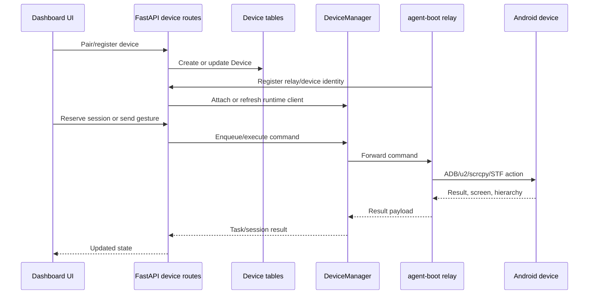
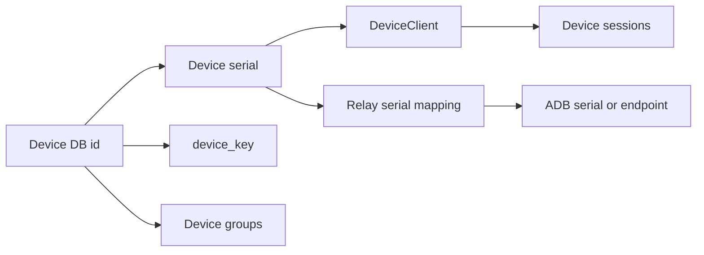
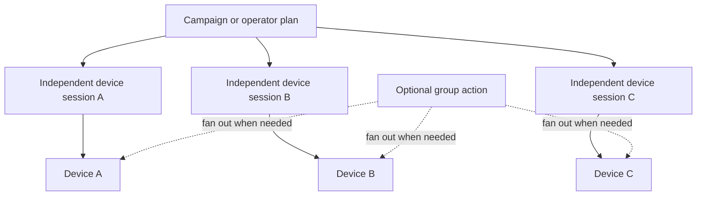
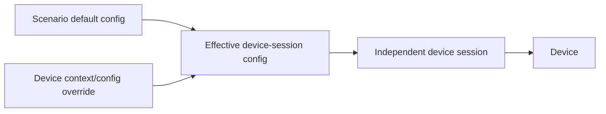

# Devices And Control Plane

Status: active
Last audited: 2026-05-18

## Scope

This module owns device inventory, pairing, sessions, device grouping,
real-time device actions, UI hierarchy access, media streaming, STF controls,
scrcpy attach/detach, and task queue command submission.

## Out Of Scope

It does not own campaign orchestration, scenario business meaning, or content
storage beyond raw capture/extraction endpoints.

## Current Code State

| Area | Source |
|---|---|
| Device CRUD and pairing | `device_farm/api/routes/devices.py`, `device_farm/services/pairing.py` |
| Device groups | `device_farm/api/routes/device_groups.py`, `device_farm/db/models/device_group.py` |
| Device control router | `device_farm/api/routes/device_control/__init__.py` |
| Gestures/UI/STF/sessions/tasks | `device_farm/api/routes/device_control/*.py` |
| Media routes | `device_farm/api/routes/device_media.py` |
| Runtime manager/client | `device_farm/runtime/core/device_manager.py`, `device_farm/runtime/core/device_client.py` |
| Dispatcher/queue | `device_farm/runtime/core/dispatcher.py`, `device_farm/runtime/core/task_queue.py` |
| Frontend | `front-end/src/features/devices/*`, `front-end/src/app/[locale]/dashboard/devices/page.tsx`, `front-end/src/app/[locale]/dashboard/device-farm/*` |

## Diagrams

### Device Registration And Control

### Device Identity Map

### Independent Session Coordination

### Device Context Fallback

## Behavior Contract

- Device inventory is persisted by `Device` and `DeviceSession`.
- Pairing creates device-facing registration flows and should not bypass
  ownership rules.
- Device-control endpoints enqueue or execute actions against the runtime
  manager. They are mounted with device authentication.
- Sessions reserve/release devices for controlled interaction.
- The primary product model is many independent device sessions coordinated by
  scenario/campaign context. Group-level actions are allowed as a helper but
  should not replace per-device session ownership.
- Each independent device session has device context/config. Device-specific
  values override scenario defaults; missing values fall back to scenario
  defaults.
- Media endpoints expose stream/screenshot surfaces and should be treated as
  device-auth runtime APIs.
- Device groups are persisted resource groups used by campaign/schedule targeting.

## Data Contract

Primary tables:

- `devices`
- `device_sessions`
- `device_groups`
- `device_group_members`
- `device_events`
- `relay_agents`

Important routes are listed in `docs/api/route-matrix.md`.

## Agent Implementation Checklist

- Check `device_farm/api/mount.py` to confirm whether a new endpoint should be
  user-auth or device-auth.
- Keep device identity, serial, DB id, ADB serial, and relay serial distinct.
- Update frontend services in `front-end/src/features/devices/services/*` when
  adding user-visible device endpoints.
- Add tests for route behavior and session ownership if changing reservation or
  pairing.

## Open Risks

- Some endpoints use serial path params while others use DB ids. New docs and
  code should name those fields explicitly.
