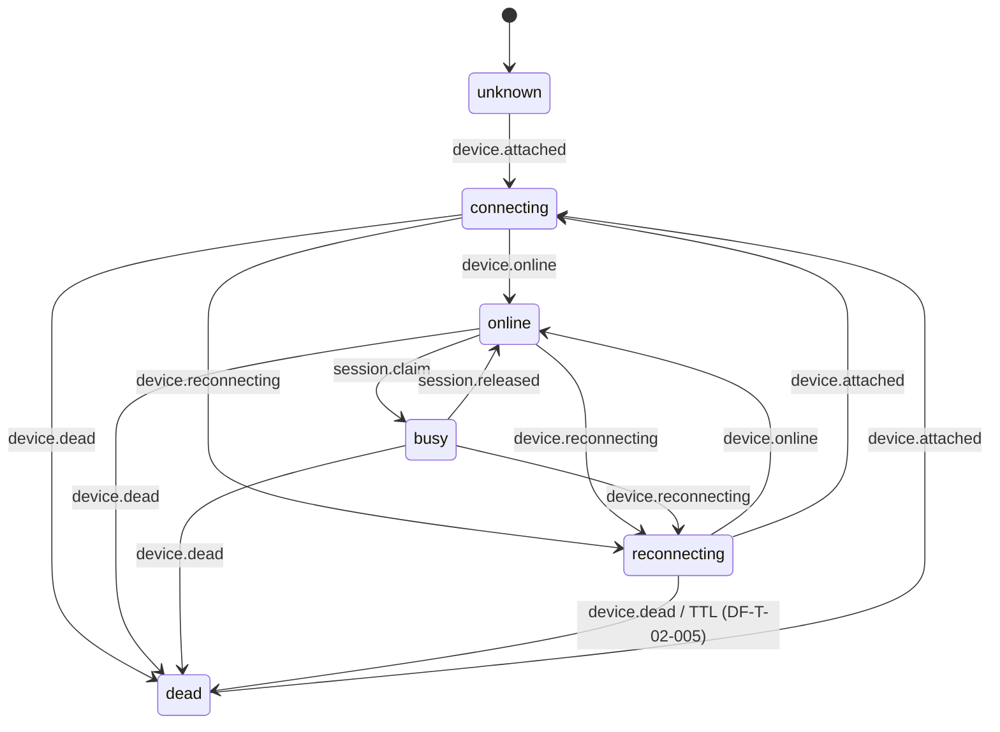

# Device FSM (DF-T-02-002)

Six lifecycle states for fleet devices at the control plane:
`unknown`, `connecting`, `online`, `busy`, `reconnecting`, `dead`.

Agent reports connection events; control plane owns session `busy` via claim/release.

## State diagram

## Transition matrix (agent events)

| From \\ Event | attached | online | reconnecting | dead | busy (agent) |
|---------------|----------|--------|--------------|------|--------------|
| **unknown** | → connecting | illegal | illegal | → dead | illegal |
| **connecting** | no-op | → online | → reconnecting | → dead | illegal |
| **online** | illegal | no-op | → reconnecting | → dead | ignored |
| **busy** | illegal | illegal | → reconnecting | → dead | ignored |
| **reconnecting** | → connecting | → online | illegal | → dead | illegal |
| **dead** | → connecting | illegal | illegal | no-op | illegal |

Control plane only:

| From | Event | To |
|------|-------|-----|
| online | session.claim | busy |
| busy | session.released | online |

## Storage

- `device_states` — current state (`device_id` PK), `last_event_id`, optional `session_id`, `reconnecting_since`
- `device_state_transitions` — append-only audit (`from_state`, `to_state`, `event`, `source`, `payload`)

## Event bus

Agent events are published in-process on topic `agent.state_event` (see `services/device_state/bus.py`).
No public HTTP endpoint for agent push — transport is DF-E-03.

Internal FSM transitions emit `device.state_changed` via `services/device_state/events.py`.

## Lifecycle WebSocket stream (DF-T-02-015)

Authenticated clients connect to `GET /ws/lifecycle?token=<access_jwt>`.

On connect the server sends a `lifecycle.snapshot` with current FSM state per device in the caller's organization plus recent replay events (in-memory TTL ring buffer, default 5 minutes).

Live events (org-scoped only):

| WS `event.type` | When |
|-----------------|------|
| `device.state_changed` | Any FSM transition except session claim/release |
| `session.claimed` | `session.claim` → BUSY |
| `session.released` | `session.released` → ONLINE |
| `device.unpaired` | Device deleted via `DELETE /api/devices/{id}` |

Event payload fields: `event_id`, `organization_id`, `device_id`, optional `session_id`, `from_state`, `to_state`, `timestamp`, optional `source` / `payload`.

Bursty transitions are debounced per organization (default 75ms) into `lifecycle.batch` when multiple devices change in the same window.

Metrics: `device_farm_lifecycle_ws_clients_connected`, `device_farm_lifecycle_ws_backpressure_total{org_id}`, `device_farm_lifecycle_ws_events_sent_total{event_type}`.

Config: `DEVICE_LIFECYCLE_DEBOUNCE_MS`, `DEVICE_LIFECYCLE_REPLAY_TTL_SEC`, `DEVICE_LIFECYCLE_REPLAY_MAX`, `DEVICE_LIFECYCLE_WS_QUEUE_MAX`.

Auth: requires valid access JWT and Casbin `devices:read` in the user's organization. Missing/invalid token → close `4401`; permission denied → `4403`.

- `DEVICE_FSM_RECONNECTING_TTL_SECONDS` — default `300` (5 minutes); consumed by DF-T-02-005 dead detection via `list_reconnecting_past_ttl()`.

## Metrics

- `fsm_transition_count{from_state,to_state}`
- `fsm_illegal_transition_count`
- `fsm_event_dedup_count`

## API

`GET /api/devices` and `GET /api/devices/{id}` include `state` (lowercase enum string).

Event bus emits `device.state_changed` for DF-T-02-015 (see Lifecycle WebSocket stream above).

## Debug drift

Compare agent-reported state vs `device_states.state` for the same `device_id`. Hourly reconcile placeholder runs in background (`device-fsm-reconcile` lifecycle task). Alert when drift exceeds 1 minute (full reconcile deferred).
