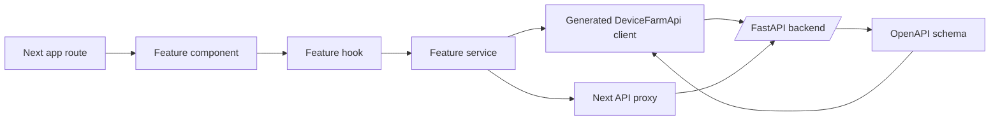
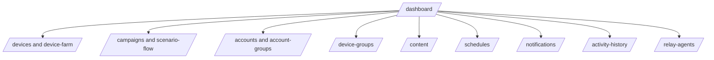

# Frontend

Status: active
Last audited: 2026-05-18

## Scope

The frontend owns dashboard screens, feature-specific hooks/components/services,
generated API client usage, and local Next API proxy adapters.

## Out Of Scope

It does not define backend API truth. Backend route files and OpenAPI generation
are authoritative for API contracts.

## Current Code State

| Area | Source |
|---|---|
| App routes | `front-end/src/app/[locale]/dashboard/*`, `front-end/src/app/[locale]/scenario-flow/[id]/page.tsx` |
| Generated API source | `front-end/generate/openapi.json` |
| Generated client | `front-end/src/features/device-farm/services/generated/DeviceFarmApi.ts` |
| Client bootstrap | `front-end/src/features/device-farm/services/client.ts`, `front-end/src/lib/farm-api.ts` |
| Next API proxies | `front-end/src/app/api/*`, `front-end/src/app/api/_device-farm/proxy.ts` |
| Feature modules | `front-end/src/features/*` |

## Diagrams

### Frontend API Consumption

### Dashboard Feature Map

## Behavior Contract

- Feature folders own UI, hooks, and service adapters for their domain.
- Generated client code is derived from OpenAPI and should not be manually
  edited for durable behavior.
- Next API routes act as proxy/adapters and may not appear in backend OpenAPI.
- Scenario graph UI must remain compatible with backend `ScenarioModel`,
  persisted `nodes`, `edges`, and `steps`.

## Feature Map

| Feature | Routes | Backend modules |
|---|---|---|
| Devices/control | `/dashboard/devices`, `/dashboard/device-farm`, `/dashboard/device-farm/control` | devices, device control, media, sessions |
| Campaigns/scenarios | `/dashboard/campaigns`, `/scenario-flow/{id}`, `/dashboard/scenario-templates` | campaigns, scenario templates, executions |
| Accounts | `/dashboard/accounts`, `/dashboard/device-farm/account-groups` | accounts, account groups |
| Device groups | `/dashboard/device-groups` | device groups |
| Content | `/dashboard/content`, `/dashboard/content/{id}` | content/extraction |

Content detail permalink flow: API E2E `device_farm/tests/test_content_permalink_e2e.py`; client bounce `front-end/src/features/content/lib/permalink-flow.test.ts` (`pnpm test:content:permalink-e2e`).
| Schedules | `/dashboard/schedules` | schedules |
| Notifications | `/dashboard/notifications` | notifications |
| Analytics | `/dashboard/activity-history` | analytics/activity |
| Relay agents | `/dashboard/relay-agents` | relay agents |

## UC-11-03 — Fleet operator device list (`/dashboard/devices`)

| Item | Detail |
|------|--------|
| Persona | Fleet operator (`role`: `operator` or `admin`) |
| Route | `/dashboard/devices` → `DeviceList` (`front-end/src/features/devices/components/device-list/`) |
| API | `GET /devices`, **`GET /devices/fleet/stats`** (`useFleetStats`), `GET /relay-agents` for live transport |
| Online/offline | `isDeviceOnlineForList`: relay `status === 'online'` **or** `last_seen` within 60s (DB heartbeat) |
| Identity columns | Name, serial, brand/model, Android/SDK, ADB serial, screen, tags, connection host |
| Access | Any authenticated user; nav item has no `roles` restriction. Unauthenticated → login; wrong org → tenancy-scoped empty list (backend). |
| Failure UI | Loading copy, `loadError` on query failure, empty state when no devices |
| Verify | `pnpm verify:nav` (includes `device-online.test.ts`) |

## Agent Implementation Checklist

- Prefer feature-local service modules over ad hoc fetch calls in components.
- When backend API changes, regenerate or check OpenAPI and generated client.
- If using a Next API proxy, document whether it is proxy-only or owns frontend
  transformation behavior.
- Keep dashboard navigation aligned with actual feature folders (`src/config/dashboard-nav.ts`, `pnpm verify:nav`).
- Main sidebar groups: devices, campaigns/schedules, library, operations (notifications). Settings: organization + relay agents.

## Open Risks

- Some frontend services consume routes that may be backend-only or not present
  in generated client. Treat `docs/api/route-matrix.md` as the parity checklist.
