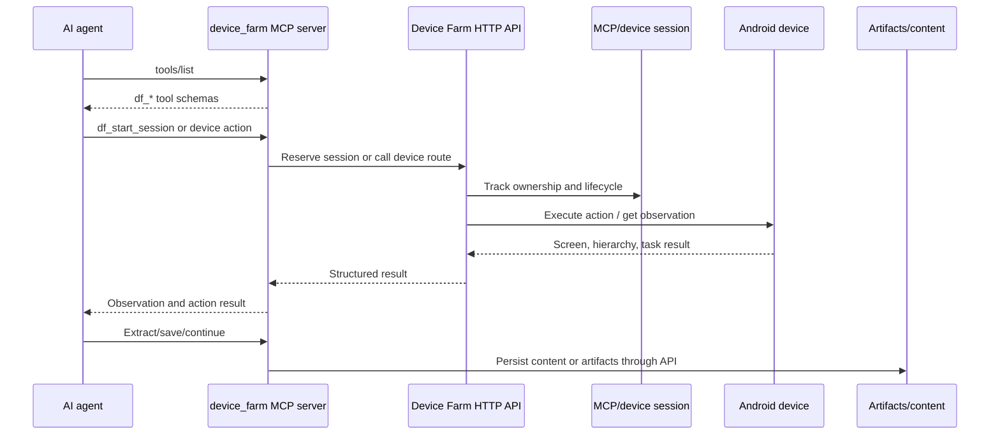
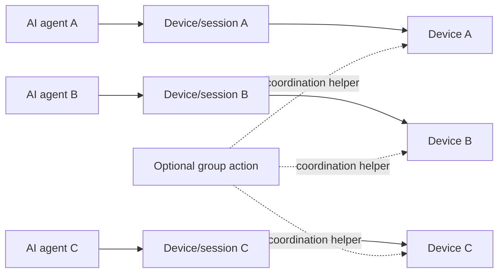

# MCP Agent Tools

Status: active
Last audited: 2026-05-19

## Scope

This module owns the Device Farm MCP stdio server and client helpers that expose
Device Farm device, session, campaign, scenario, and content operations as tools
for AI agents.

## Out Of Scope

It does not own the AI agent's reasoning policy, platform-specific social
workflow definitions, or backend business rules behind the HTTP APIs it calls.

## Current Code State

| Area | Source |
|---|---|
| MCP server | `device_farm/mcp/server.py` |
| MCP client helper | `device_farm/mcp/client.py` |
| MCP usage docs | `device_farm/mcp/README.md` |
| Session lifecycle routes | `device_farm/api/routes/device_control/sessions.py` |
| Scenario run routes | `device_farm/api/routes/device_control/scenarios.py` |
| Task/device control routes | `device_farm/api/routes/device_control/tasks_queue.py`, `device_farm/api/routes/device_control/gestures.py`, `device_farm/api/routes/device_control/device_ui.py` |
| Campaign/content routes | `device_farm/api/routes/campaigns.py`, `device_farm/api/routes/content.py` |

## Diagrams

### MCP Control Loop

### L3 Ownership Model

## Behavior Contract

- MCP tools expose Device Farm HTTP APIs as `df_*` tools.
- Device tools accept `device` or `session_id`; session-scoped operation is
  preferred for multi-step agent workflows.
- L3 assigns one AI agent to one device/session at a time. A single agent should
  not own multiple active devices concurrently unless a future PRD explicitly
  changes that rule.
- MCP tools that require auth use `MCP_AUTH_TOKEN`; token scope is enforced by
  the generated `dfmcp_*` token record.
- L3 social automation uses MCP as the agent-facing control surface; it must
  still respect backend session, auth, device, and artifact rules.

## Data Contract

Primary durable records touched through MCP:

- `mcp_sessions`
- `devices`
- `executions`
- `execution_results`
- `content_items`
- `content_collections`

## Agent Implementation Checklist

- Prefer adding a backend route/schema first, then expose it through MCP.
- Tool descriptions must tell agents when to use `session_id` instead of raw
  device serial.
- New tools need clear output shape, failure messages, and auth requirements.
- Platform-specific L3 behavior belongs in `docs/product/platforms/*`, not as
  hidden MCP-only assumptions.
- Preserve one-agent-one-device/session ownership when adding or changing tools.

## Open Risks

- MCP can become a parallel API surface. Keep MCP docs, HTTP route matrix, and
  generated/OpenAPI contracts aligned where tools wrap HTTP routes.
