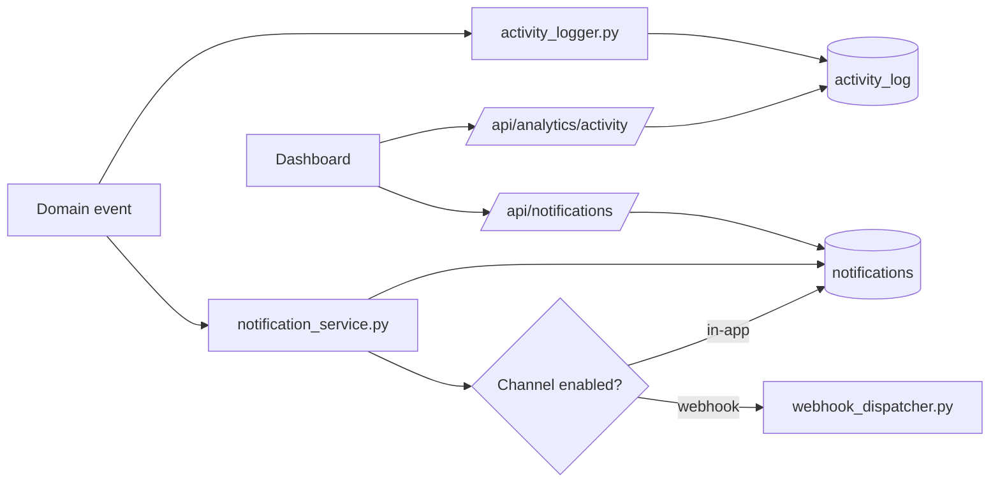

# Notifications And Analytics

Status: active
Last audited: 2026-05-18

## Scope

This module owns notification channels, in-app notification records, unread
counts, webhook-like delivery service behavior, and activity log analytics.

## Out Of Scope

It does not own Prometheus metrics, external log shipping, or campaign execution
state transitions themselves.

## Current Code State

| Area | Source |
|---|---|
| Notification routes | `device_farm/api/routes/notifications.py` |
| Analytics routes | `device_farm/api/routes/analytics.py` |
| Services | `device_farm/services/notification_service.py`, `device_farm/services/activity_logger.py`, `device_farm/services/webhook_dispatcher.py` |
| Models | `device_farm/db/models/notification.py`, `device_farm/db/models/activity.py` |
| Frontend | `front-end/src/features/notifications/*`, `front-end/src/features/analytics/*` |

## Diagrams

### Event Visibility Flow

## Behavior Contract

- Notification channels define delivery targets and channel configuration.
- Notifications are user-visible records with read/unread behavior.
- Activity logs are append-style records for dashboard history.
- Domain modules should emit events through services rather than writing UI
  records directly.

## Data Contract

Primary tables:

- `notification_channels`
- `notifications`
- `activity_log`

Primary APIs:

- `/api/notification-channels*`
- `/api/notifications*`
- `/api/notifications/unread-count`
- `/api/analytics/activity`

## Agent Implementation Checklist

- When adding a new domain event, document whether it creates an activity log,
  notification, webhook dispatch, or all three.
- Keep frontend unread-count behavior aligned with backend read/read-all routes.
- Check OpenAPI/client parity for this module because it has historically
  drifted.

## Open Risks

- Generated frontend API coverage may lag the backend for notifications and
  analytics. Verify before relying on generated client methods.
