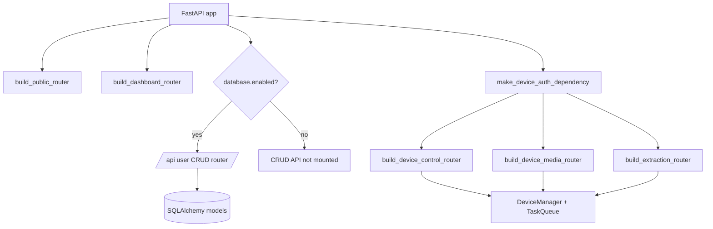

# Platform Runtime

Status: active
Last audited: 2026-05-18

## Scope

Platform runtime owns process startup, FastAPI app composition, global lifecycle
services, health endpoints, websocket entrypoints, safe mode, and shared runtime
objects such as the device manager, task queue, dispatcher, watchdog, and session
lock store.

## Out Of Scope

It does not own campaign business logic, scenario step semantics, account
rotation, or frontend feature behavior.

## Current Code State

| Area | Source |
|---|---|
| App entrypoint | `device_farm/main.py` |
| App composition | `device_farm/web/server.py` |
| HTTP router mount graph | `device_farm/api/mount.py` |
| Safe mode | `device_farm/web/safe_mode.py`, `front-end/src/features/core/services/safe-mode.ts` |
| Runtime lifecycle | `device_farm/runtime/lifecycle.py` |
| Core runtime services | `device_farm/runtime/core/device_manager.py`, `device_farm/runtime/core/task_queue.py`, `device_farm/runtime/core/dispatcher.py`, `device_farm/runtime/core/watchdog.py` |

## Diagrams

### Router Mount Boundary

## Behavior Contract

- Startup builds the runtime objects once and mounts public, CRUD, dashboard,
  device-control, media, and extraction routers.
- Public and infrastructure routes are always mounted by `build_public_router`.
- Database-backed CRUD routes are mounted under `/api` only when
  `config.database.enabled` is true.
- Device-control, media, and extraction routers are protected by the device auth
  dependency created in `make_device_auth_dependency`.
- Safe mode is a runtime guard surface. It should expose state without changing
  module-level ownership.

## Data Contract

Runtime state is partly in memory and partly persisted through domain models.
Durable runtime-related tables include `devices`, `device_sessions`,
`relay_agents`, `executions`, and `schedules`.

## Agent Implementation Checklist

- Inspect `device_farm/api/mount.py` before adding a router.
- Decide whether a new route belongs to public, CRUD user API, device-auth API,
  or dashboard web surface.
- If the route is exposed to frontend, update `docs/api/route-matrix.md`.
- If the route depends on database mode, document behavior when DB is disabled.

## Open Risks

- Several runtime endpoints are implementation-facing and were under-documented:
  `/api/server/safe-mode`, `/api/relay/status`, `/ws`, `/device-agent`, and
  `/relay-agent`.
