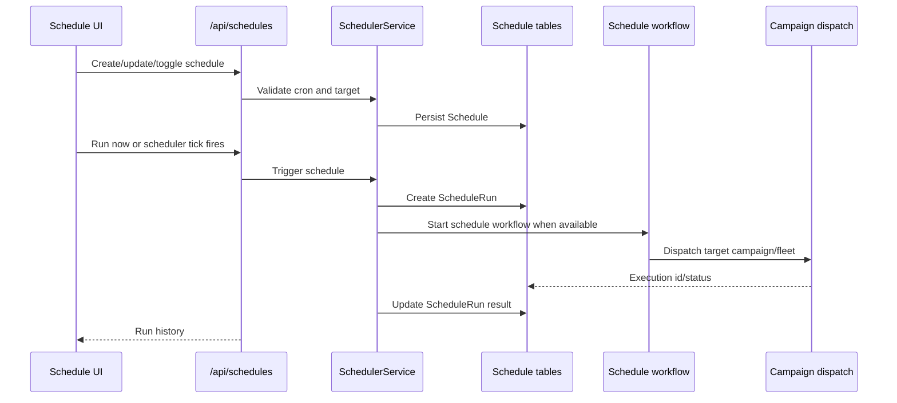

# Scheduling

Status: active
Last audited: 2026-05-18

## Scope

Scheduling owns cron-like campaign/fleet dispatch, schedule status, manual
run-now behavior, and schedule run history.

## Out Of Scope

It does not own scenario execution internals or low-level device command
transport.

## Current Code State

| Area | Source |
|---|---|
| Routes | `device_farm/api/routes/schedules.py` |
| Service | `device_farm/services/scheduler.py` |
| Temporal schedule flow | `device_farm/temporal/schedule_workflow.py`, `device_farm/temporal/schedule_activities.py`, `device_farm/temporal/schedule_shared.py` |
| Models | `device_farm/db/models/schedule.py` |
| Frontend | `front-end/src/features/schedules/*`, `front-end/src/app/[locale]/dashboard/schedules/page.tsx` |

## Diagrams

### Schedule Run Flow

## Behavior Contract

- A schedule belongs to a user scope and targets a campaign or fleet-like
  dispatch path.
- Schedules can be listed, created, patched, deleted, toggled, triggered
  immediately, and inspected through run history.
- The scheduler may use Temporal or a fallback dispatch body depending on
  runtime configuration.
- Schedule run records should capture enough information to explain what was
  dispatched and why a run failed.

## Data Contract

Primary tables:

- `schedules`
- `schedule_runs`

Primary APIs:

- `GET|POST /api/schedules`
- `GET|PATCH|DELETE /api/schedules/{schedule_id}`
- `POST /api/schedules/{schedule_id}/toggle`
- `POST /api/schedules/{schedule_id}/run-now`
- `GET /api/schedules/{schedule_id}/runs`

## Agent Implementation Checklist

- Keep cron expression validation in backend and frontend aligned.
- Document whether a new scheduling behavior requires Temporal availability.
- Add tests around manual run, disabled schedule behavior, and run history.

## Open Risks

- Scheduling docs should explicitly state fallback behavior when Temporal is not
  available before changing runtime dispatch semantics.
