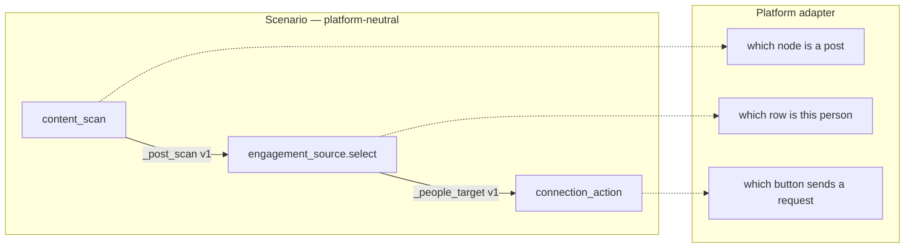

# Social Node Contract

Status: active
Last audited: 2026-08-28

## Scope

The platform-neutral contract between social scenario nodes: which capabilities
a scenario may name, what each one writes into scenario variables (schema v1),
and which part of that a platform adapter is allowed to decide.

A scenario says *what* to do — scan this surface, verify this person, send this
request. An adapter decides *how* that looks on one app's screen. Everything
here is the seam between those two.

## Out Of Scope

- Raw hierarchy parsing and extra-data ingest. Those belong to `agent-boot`; see
  [social-ext-contract.md](social-ext-contract.md).
- Registration, feature flags and versioning of a platform extension — also
  `social-ext-contract.md`.
- Facebook screen choreography. It lives in the adapter, never in this document
  and never in a reusable template.

## Current Code State

| Area | Source |
|---|---|
| Schema v1 payloads and readers | `device_farm/services/social_actions/schema.py` |
| Capability step handlers | `device_farm/tasks/scenario/steps/social_actions.py` |
| Adapter boundary (observe) | `device_farm/services/social_actions/contract.py` |
| Facebook adapter | `device_farm/services/social_actions/facebook.py`, `agent-boot/relay/fb_*.py` |
| Authored-step tree traversal | `device_farm/services/scenario_dsl/step_tree.py` |
| Body validation | `device_farm/services/scenario_dsl/body_validator.py` |
| Templates | `device_farm/db/seeds/scenario_templates.py` |
| Tests | `device_farm/tests/test_social_contract_schema_v1.py`, `device_farm/tests/test_scenario_step_tree_validation.py` |

## Capabilities

These are the public verbs a scenario may use. They are named for what they
achieve, not for the app they were first built against.

| Capability | Step type | Writes |
|---|---|---|
| `open_surface` | `social_connect_visible_people` (`open_surface: true`) | — |
| `community_membership` | `community_membership` | action result |
| `content_scan` | `social_scan_posts_interact` | scan payload (`_post_scan`) |
| `content_interaction` | `content_interaction` | action result |
| `engagement_source.select` | `social_open_commenter_from_post_match` / `social_open_author_from_post_match` | person target (`_people_target`) |
| `profile_verify` | `social_select_target` (`target_type: person`) | person target |
| `connection_action` | `connection_request` | action result |

The variable names above are the defaults; a scenario overrides them with
`save_as` / `source_var`. What is fixed is the *shape*, not the name.

## Diagrams



## Data Contract

### Schema v1

Every capability payload declares three things:

- `schema_version` — which contract the reader is holding. `1` today.
- `platform` — which adapter produced it. A payload names its own origin
  instead of being assumed to be Facebook.
- `proof` — the evidence the next node's decision rests on, in one place.

`content_scan` (`_post_scan`):

```json
{
  "schema_version": 1,
  "platform": "facebook",
  "actions": [],
  "proof": {
    "verified": false,
    "reason": "no_matching_post",
    "interacted_count": 0,
    "liked_count": 0,
    "commented_count": 0,
    "candidate_count": 0,
    "screens_scanned": 0,
    "scrolls": 0
  }
}
```

`actions` is always present, even when nothing matched: "the scan found nothing"
and "this variable was never a scan result" must stay distinguishable, and
`read_actions()` returns `None` only for the second.

`profile_verify` / `engagement_source.select` (`_people_target`):

```json
{
  "schema_version": 1,
  "platform": "facebook",
  "verified": true,
  "identity": {
    "target_type": "person",
    "target_id": "ui_commenter:abc",
    "display_name": "…",
    "source": "matched_feed_post_commenter"
  },
  "proof": {
    "verified": true,
    "confidence": 92,
    "matched_keywords": [],
    "action_bounds": [0, 0, 0, 0],
    "profile_opened": true
  }
}
```

`identity` answers *who this is*; `proof` answers *why we believe it*. Keeping
them apart is what lets a second adapter fill the identity without inventing
Facebook's evidence fields.

### The envelope is additive

Every key the resolver returned stays at the top level alongside the envelope.
Two reasons, both load-bearing:

1. A scenario can be mid-run when the code changes underneath it. A payload
   written by the previous build is not a migration window — it is a live value
   in a running execution. Readers (`read_verified`, `read_actions`,
   `read_identity`, `read_proof`) accept both shapes, so there is no flag day.
2. The account-action ledger's `stable_target()` reads `name`, `target_type`,
   `target_id` and `source` off the top level. Moving them would change the
   idempotency key of actions already recorded, which would re-open actions the
   ledger already considers done.

Read a target's verification with `read_verified()`, never `target["verified"]`.
A request must not be refused because of the shape of its evidence.

### `connection_action` still refuses a blind send

`require_verified_target` is unchanged and non-negotiable: no verified target,
no request. Schema v1 makes the evidence easier to read; it does not make the
gate softer.

## Behavior Contract

**Adapter responsibility.** The adapter owns everything screen-shaped: which
node is a post, which row belongs to which person, which button sends a request,
and what the button's state means afterwards. It returns a schema v1 payload and
nothing about how it got there.

**Scenario responsibility.** The scenario owns sequencing, budgets, keywords and
gating. It must not carry the adapter's knowledge.

A reusable template must therefore never contain:

- app label strings (`Nhóm`, `Groups`, `Trang chủ`)
- coordinate fallbacks (`tap_ratio` as a "if the selector missed" branch)
- tab-strip swipes and other navigation choreography specific to one app

Those belong behind the adapter. A template that has them is a Facebook script,
not a capability scenario — which is exactly what a second platform then has to
copy and diverge from.

**Facebook is the first adapter, not the reference implementation.** Adding a
platform means implementing the capabilities above against that app's UI and
returning schema v1 — not cloning a Facebook template and editing labels. The
Facebook identity/geometry rules in
[adr-facebook-ui-reasoning.md](../adr-facebook-ui-reasoning.md) are Facebook's,
and a new adapter inherits the *reasoning* (verify by identity, refuse when
ambiguous), not the selectors.

**Authored step ids.** Every authored step, at every nesting depth, has a stable
`id`. The durable ledger keys a claim by step id and refuses the claim without
one, so an id-less `connection_request` inside a loop fails with "Enabled
account action ledger requires execution id and stable step id" and the request
is never sent. A duplicate id is worse: two sends collapse onto one idempotency
key and the second is silently dropped.

`services/scenario_dsl/step_tree.py` walks the whole tree (`steps`, `then`,
`else`, `else_steps`, `completion_steps`, `completion_verify`,
`branches[].steps`). It yields only dicts carrying a `type`, so config objects —
a `random_pick` branch wrapper, a `login_if_needed` profile recipe, a step's
`config` block — are never asked for an id they have no place to hold.

A missing id is **filled, not rejected**. `assign_missing_step_ids()` runs
before any check, at every ingress:

| Ingress | Where |
|---|---|
| Flow editor | `createDefaultStep()` mints a nanoid (frontend) |
| Editor save / import / AI compile | `_fill_missing_step_ids()` in the body validator |
| Builtin template seed | `_seedable_steps()` in `db/seeds/scenario_templates.py` |

| Check | Depth | Behaviour |
|---|---|---|
| Missing step id | every depth | filled by derivation, then asserted |
| Duplicate step id | every depth | **error** |

The derived id is anchored to the nearest ancestor that carries one —
`seed_friends_cycle__then_0__steps_2` — and is **structural, never random**.
Builtin templates are rewritten from their code spec on every startup, so a
random id would rename the same step on each deploy: exactly the instability an
id exists to prevent. Structural also means idempotent.

**A derived id is a safety net, not the way to author.** It moves when a sibling
is inserted above it. Within one execution that is harmless — the step tree is
frozen into the workflow input at dispatch, and `stable_action_key` scopes a
ledger claim by execution id (cross-execution dedupe uses
`stable_account_target_key`, which carries no step id). Across two versions of a
scenario it means the two runs of "the same" step cannot be joined by id. Steps
that write to the ledger — `connection_request`, `content_interaction`,
`community_membership` — should be given an explicit, role-named id by whoever
authors them. `HARDENED_TEMPLATES` in
`tests/test_scenario_step_tree_validation.py` lists the templates where every id
is human-chosen; the test keeps them that way.

## Execution Traceability

Scenario execution reports the authored node path separately from the social
payload contract. Social steps do not compute this path themselves; they inherit
it from the execution layer through `__scenario_trace__`.

Example path:

```text
seed_friends_group_loop#0/seed_friends_cycle#37/seed_friends_connect_0.then/seed_friends_connection_request_0
```

The path format is intentionally readable and grep-friendly:

| Token | Meaning |
|---|---|
| `/` | Descend into a child step |
| `#N` | Loop/repeat iteration, zero-based |
| `.then`, `.else`, `.branchN` | Selected control-flow branch |

Social action payloads still own `action_performed`, `outcome`, target identity,
and proof. Execution trace owns where that action happened in the authored tree.
Keep those concerns separate so a platform adapter never needs to know whether
it is inside a loop or branch.

## Agent Implementation Checklist

- Read first: `services/social_actions/schema.py`, then the handler you are
  touching in `tasks/scenario/steps/social_actions.py`.
- Writing a payload: go through `content_scan_payload()` /
  `people_target_payload()`. Never hand-build the envelope.
- Reading a payload: go through `read_verified()` / `read_actions()` /
  `read_identity()` / `read_proof()`. Never index the shape directly.
- Adding a template: give every authored step a stable, role-named id, then add
  the template to `HARDENED_TEMPLATES`.
- Tests to run:

  ```bash
  cd device_farm
  uv run pytest tests/test_social_contract_schema_v1.py \
                tests/test_scenario_step_tree_validation.py \
                tests/test_social_action_steps.py \
                tests/test_template_comment_dedupe_contract.py -q
  ```

- Contracts that must not drift: top-level `verified` / `target_type` /
  `target_id` / `source` on a target (ledger idempotency); `actions` always
  present on a scan payload; `require_verified_target` on every
  `connection_action`.

## Open Risks

- Schema v1 is written by `device_farm`, not by `agent-boot`. If a resolver
  starts returning its own `proof`, that one wins by design
  (`_merged_proof`) — worth re-reading if the two ever disagree.
- Only two templates are id-hardened; the rest rely on derived ids, which shift
  when a step is inserted above them. That is safe within an execution but
  breaks id continuity across scenario versions. Hardening the remainder — at
  minimum every step that writes to the ledger — is follow-up work.
- Capability names in this document are not yet enforced by the step registry;
  they are a naming discipline, and a step type could still be added that leaks
  a platform noun.
- No live device proof is attached to this contract. Runtime behavior on a real
  phone still needs a campaign or preview execution trace.
