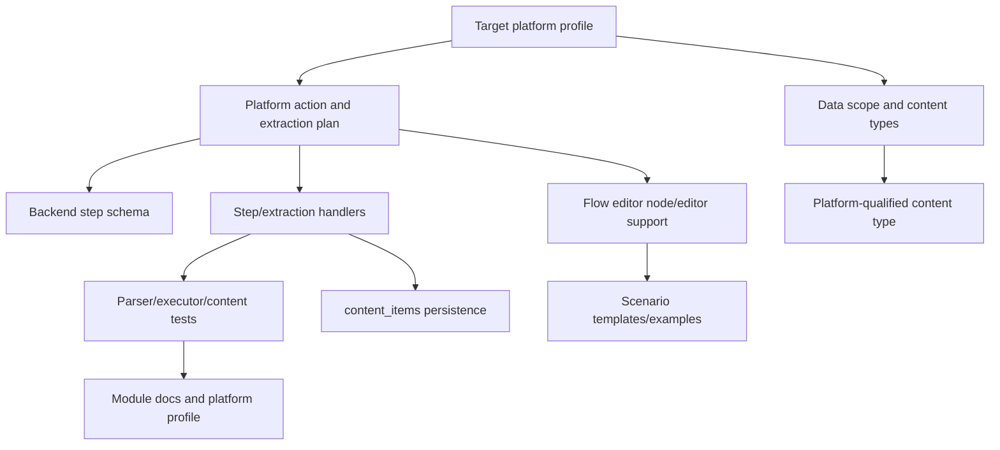
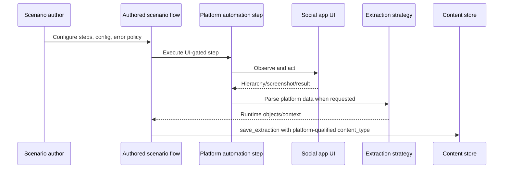

# Social Platform Extensions

Status: active
Last audited: 2026-05-19

## Scope

This module defines the contract for adding social-platform-specific behavior to
Device Farm. It covers platform profiles, platform automation steps, extraction
strategies, platform-qualified content types, account runtime config, frontend
node/editor requirements, tests, and documentation updates.

## Out Of Scope

It does not own low-level device transport, generic scenario execution, content
storage internals, or hidden platform runners. Platform-specific parser
implementation details belong near the parser code and must still conform to
this module contract.

## Current Code State

| Area | Source |
|---|---|
| Scenario schema | `device_farm/api/schemas/scenario.py` |
| Scenario step handlers | `device_farm/tasks/scenario/steps/*` |
| Extraction handlers | `device_farm/tasks/scenario/steps/extraction.py` |
| Extraction profiles | `device_farm/services/extract_profiles.py` |
| Step normalization | `device_farm/services/scenario_step_contract.py` |
| Facebook parser implementation | `device_farm/tasks/fb_extract/*` |
| Content persistence | `device_farm/services/content_store.py`, `device_farm/db/models/content.py` |
| Frontend flow editor | `front-end/src/features/campaigns/components/flow-editor/*` |
| Platform profiles | `docs/product/platforms/*` |

## Diagrams

### Extension Lifecycle

### Runtime Contract

## Behavior Contract

- Platform-specific automation must be expressed as scenario steps or graph
  nodes.
- Do not create a separate platform runner for Facebook, TikTok, Instagram,
  Threads, or future target platforms.
- User-facing behavior follows the authored scenario flow. Execution engines
  must conform to the scenario's steps, branches, retry, and error policy.
- Social automation steps are UI-gated by default.
- Step failure blocks later steps unless the scenario explicitly defines an
  error policy, retry, branch, loop, skip, pause, or recovery path.
- Config is free-form valid JSON. Typed config schemas may be added later, but
  are not required for current platform extensions.
- Account-related values may be supplied through scenario config, device
  context, or explicit account resource/group references. Missing required
  account/login inputs are scenario configuration errors owned by the scenario
  author.

## Naming Contract

| Concept | Naming rule | Example |
|---|---|---|
| Extraction step | `type: "extract"` | `{"type": "extract", "strategy": "fb_posts"}` |
| Extraction strategy | `<platform>_<data_object>` | `fb_posts`, `tiktok_videos`, `ig_comments` |
| Platform action step | `<platform>_<verb>_<object>` | `fb_tap_comment_button`, `tiktok_open_video_comments` |
| Platform-qualified content type | `<platform>_<content_object>` | `fb_post`, `tiktok_comment`, `threads_post` |
| Legacy alias | Existing older name kept for compatibility | `tap_fb_comment_button` |

Legacy aliases may remain valid for existing scenarios, but new docs/templates
should use the canonical naming model once implementation aliases exist.

## Content Output Contract

Platform extraction output should map common fields into `content_items` where
possible and keep platform-specific parser fields in `raw_data`.

Required extension decisions:

| Decision | Requirement |
|---|---|
| `platform` | Populate when known for filtering/grouping |
| `content_type` | Use platform-qualified value |
| Parent-child behavior | Define `parent_id` and `item_level` behavior |
| Dedupe | Define the dedupe key/field and hash scope |
| Runtime variable | Define where parsed objects land, for example `posts` or `comments` |
| Save behavior | Define default collection/content type examples |

## Platform Profile Requirements

Every active or draft target platform profile should define:

- product goal
- current coverage and target coverage
- supported or proposed data objects
- platform automation steps and extraction strategies
- platform-qualified content types
- account/session requirements
- config categories and examples
- authored-flow and error-policy expectations
- completion criteria
- known gaps

Draft profiles must clearly state that current implementation support is not
active.

## Agent Implementation Checklist

When adding a new platform capability:

1. Update or create the target platform profile.
2. Define step/action naming and extraction strategy naming.
3. Define platform-qualified content types and parent-child behavior.
4. Add backend schema support in `device_farm/api/schemas/scenario.py`.
5. Add or update handlers under `device_farm/tasks/scenario/steps/*`.
6. Add parser/profile code near the platform extraction implementation.
7. Add frontend node/editor support in the campaign flow editor.
8. Add tests for schema validation, executor behavior, parser output, content
   persistence, and failure semantics.
9. Update scenario templates/examples if the capability should be user-facing.
10. Keep MCP behavior generic unless the platform profile defines L3 guardrails.

## Current Platform Status

| Platform | Profile | Status |
|---|---|---|
| Facebook | `docs/product/platforms/facebook.md` | Active L2, L3 foundation |
| TikTok | `docs/product/platforms/tiktok.md` | Draft target |
| Instagram | `docs/product/platforms/instagram.md` | Draft target |
| Threads | `docs/product/platforms/threads.md` | Draft target |

## Open Risks

- Existing code has Facebook-specific legacy names such as
  `tap_fb_comment_button`. New action names should use the platform-prefix model
  once aliases are implemented.
- Some execution surfaces may differ in how they apply scenario error policy.
  Treat authored scenario flow as the product contract when aligning them.
