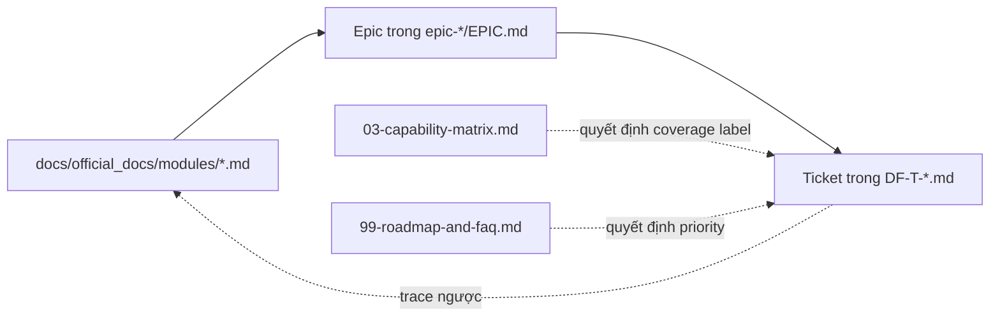

# Device Farm — Backlog chính thức

> **Mã tài liệu:** DF-BL-INDEX
> **Phiên bản:** 1.0
> **Cập nhật lần cuối:** 2026-05-26
> **Trạng thái:** Approved
> **Đối tượng đọc:** Team Device Farm
> **Tài liệu liên quan:** [Official Docs Index](../official_docs/README.md), [Modules Index](../official_docs/modules/README.md), [Ma trận năng lực](../official_docs/03-capability-matrix.md), [Lộ trình & FAQ](../official_docs/99-roadmap-and-faq.md)

## 1. Mục đích bộ backlog

Bộ backlog này chuyển hóa toàn bộ đặc tả nghiệp vụ trong `docs/official_docs/` thành các **Epic** và **Ticket** sẵn sàng đưa vào sprint planning. Mỗi Epic bám sát một module nghiệp vụ; mỗi ticket bám sát một Functional Requirement (FR) hoặc nhóm FR liên quan đã được mô tả trong tài liệu module.

Mục tiêu của bộ backlog:

- **Truy vết ngược 2 chiều:** từ ticket → FR → Use Case → Persona; và ngược lại từ Persona/Use Case → ticket cần làm.
- **Đủ ngữ cảnh để bắt tay vào làm:** mỗi ticket có bối cảnh nghiệp vụ, tiêu chí chấp nhận, kế hoạch triển khai, test case nghiệp vụ, phụ thuộc và rủi ro — không cần đọc thêm tài liệu khác để hiểu phải build cái gì.
- **Đo lường tiến độ:** mỗi Epic có điều kiện hoàn thành (DoD) và checklist các ticket bắt buộc cho Active status.
- **Phân nhóm rõ ràng theo layer:** label `layer:*` cho phép pivot backlog theo backend / frontend / contract / infra / test khi cần.

## 2. Cấu trúc thư mục

```
docs/official_backlog/
├── README.md                           ← Index hiện tại
├── _template.md                        Template ticket chuẩn (copy khi tạo ticket mới)
├── business-core-release-checklist.md  Checklist release core theo happy path nghiệp vụ
├── epic-01/                            DF-MOD-01 — Nền tảng & Bảo mật truy cập
│   ├── EPIC.md                         Tổng quan Epic + danh sách ticket + DoD
│   └── DF-T-01-NNN-slug.md             Từng ticket
├── epic-02/                            DF-MOD-02 — Thiết bị & Mặt phẳng điều khiển
├── epic-03/                            DF-MOD-03 — Agent Boot & Relay
├── epic-04/                            DF-MOD-04 — Campaign, Scenario & Execution
├── epic-05/                            DF-MOD-05 — Scheduling
├── epic-06/                            DF-MOD-06 — Content Extraction & Artifact
├── epic-07/                            DF-MOD-07 — Account & Account Group
├── epic-08/                            DF-MOD-08 — Social Platform Extensions
├── epic-09/                            DF-MOD-09 — Notifications & Analytics
├── epic-10/                            DF-MOD-10 — MCP Agent Tools (Preview)
└── epic-11/                            DF-MOD-11 — Frontend & Dashboard
```

## 3. Danh sách Epic

| Epic ID | Tên Epic | Module gốc | Persona chính | Trạng thái | Business priority | Ước lượng tickets |
|---|---|---|---|---|---|---|
| DF-E-01 | Nền tảng & Bảo mật truy cập | DF-MOD-01 | Platform Engineer, Admin | Active | Medium | 13 |
| DF-E-02 | Thiết bị & Mặt phẳng điều khiển | DF-MOD-02 | Fleet Operator, Social Data Operator | Active | High | 15 |
| DF-E-03 | Agent Boot & Relay | DF-MOD-03 | Fleet Operator, Platform Engineer | Active | Medium | 14 |
| DF-E-04 | Campaign, Scenario & Execution | DF-MOD-04 | Automation Builder, Social Data Operator | Active | High | 18 |
| DF-E-05 | Scheduling | DF-MOD-05 | Operator, Automation Builder | Active | Medium | 12 |
| DF-E-06 | Content Extraction & Artifact | DF-MOD-06 | Social Data Operator | Active | High | 16 |
| DF-E-07 | Account & Account Group | DF-MOD-07 | Social Data Operator | Active | High | 14 |
| DF-E-08 | Social Platform Extensions | DF-MOD-08 | Platform Engineer | Active (contract); per-platform coverage | Medium | 17 |
| DF-E-09 | Notifications & Analytics | DF-MOD-09 | Operator, Supervisor | Active | Low | 15 |
| DF-E-10 | MCP Agent Tools | DF-MOD-10 | AI Ops Supervisor (forward-looking) | Active (release track: Preview) | Low | 14 |
| DF-E-11 | Frontend & Dashboard | DF-MOD-11 | Tất cả persona | Active | High | 18 |

Tổng dự kiến: ~166 ticket. Con số này có thể dao động khi từng Epic được mở ra thực hiện.

Checklist release core nằm ở `business-core-release-checklist.md`. File đó là nguồn đọc nhanh cho scope P0/P1 theo luồng nghiệp vụ, còn từng `EPIC.md` vẫn là nguồn đầy đủ cho dependency và DoD.

## 4. Quy ước đặt mã ticket

Mỗi ticket dùng định dạng: `DF-T-<epic>-<seq>-<slug>.md`

Ví dụ: `DF-T-04-007-scenario-versioning.md` — ticket số 7 trong DF-E-04, slug `scenario-versioning`.

Quy ước:

- `epic` luôn 2 chữ số (`01` → `11`).
- `seq` luôn 3 chữ số bắt đầu từ `001`, chừa khoảng trống cho insert sau.
- `slug` lowercase, kebab-case, mô tả ngắn nội dung ticket (3-5 từ).
- Bên trong nội dung ticket, ID đầy đủ là `DF-T-04-007` (không có slug).

### 4.1 Quy ước ngôn ngữ & thuật ngữ

Backlog dùng tiếng Việt trước. Chỉ giữ tiếng Anh khi đó là thuật ngữ product/code đã thống nhất, ví dụ `API`, `OpenAPI`, `RBAC`, `JWT`, `WebSocket`, `gRPC`, `workflow`, `artifact`, `content item`, `handler`, `parser`, `Draft`, `Preview`, `Active`, `GA`, `L1/L2/L3`, `label`, `status`, `enum`, `metric`.

Khi nhắc ticket hoặc Epic khác, chỉ ghi ID như `DF-T-04-010` hoặc `DF-E-08`; không dùng markdown link tới ticket/Epic.

| Nhóm | Cách gọi chuẩn trong backlog |
|---|---|
| Section trong ticket | Bối cảnh nghiệp vụ, Câu chuyện người dùng, Yêu cầu chức năng, Tiêu chí chấp nhận, Ngoài phạm vi, Kế hoạch triển khai, Test case nghiệp vụ, Phụ thuộc & rủi ro, Điều kiện hoàn thành, Truy vết & tài liệu tham chiếu |
| Phụ thuộc | Bị chặn bởi, Chặn, Phụ thuộc giữa Epic, Epic liên quan |
| Tài liệu tham chiếu | Đặc tả module, Ma trận năng lực, Nhóm người dùng, Thuật ngữ, Lộ trình |
| Dữ liệu content | `content item`, `content type`, `artifact`, `raw_data`, truy vết, chuẩn hóa |
| Maturity/status | `Draft`, `Preview`, `Active`, `GA`, `L1`, `L2`, `L3` |

### 4.2 Quy ước ưu tiên nghiệp vụ

Backlog dùng **Business priority** để tách giá trị sản phẩm khỏi mức độ blocker kỹ thuật:

- **High:** Epic/ticket end-user dùng trực tiếp trong happy path core hoặc tạo output nghiệp vụ rõ ràng.
- **Medium:** technical enabler hoặc workflow vận hành quan trọng nhưng không phải bề mặt happy path đầu tiên.
- **Low:** preview, experimental, optimize, hardening, observability sâu, multi-platform roadmap hoặc analytics nâng cao.

Release core đầu tiên ưu tiên luồng: `login -> fleet/device -> account -> campaign/scenario -> execution -> content/artifact -> export`.

## 5. Mẫu ticket — Hybrid chi tiết

Chi tiết đầy đủ template ở [`_template.md`](_template.md). Tóm tắt 10 phần bắt buộc:

1. **Header block** — bảng metadata gồm: ID, Type, Epic, Priority, Story Points, Status, Labels, Assignee placeholder, Reporter placeholder, Created date, truy vết FR/UC.
2. **Bối cảnh nghiệp vụ** — vì sao ticket này tồn tại, persona nào hưởng lợi, đặt trong bối cảnh module nào.
3. **Câu chuyện người dùng** — định dạng "Là [persona], tôi muốn [hành động], để [giá trị]".
4. **Yêu cầu chức năng** — danh sách FR cụ thể bằng prose hoặc bullet ngắn (~5-10 item).
5. **Tiêu chí chấp nhận (Given/When/Then)** — tối thiểu 3 kịch bản.
6. **Ngoài phạm vi** — minh bạch những thứ ticket này KHÔNG bao gồm để tránh scope creep.
7. **Kế hoạch triển khai** — bullet checklist chia theo layer (backend / frontend / contract / infra / docs / test).
8. **Test case nghiệp vụ** — bảng test gồm: Test ID, Loại (Positive / Negative / Edge), Tiền điều kiện, Bước thực hiện, Kết quả mong đợi. Tối thiểu 5 test/ticket.
9. **Phụ thuộc & rủi ro** — bị chặn bởi / chặn (theo ID ticket khác), risk list ngắn.
10. **Điều kiện hoàn thành** — checklist 5-8 mục cần đạt mới được close ticket.

## 6. Quy ước Priority, Story Points, Labels

### Priority

- **P0 — Core happy path:** bắt buộc để end-user hoặc API consumer chạy được luồng core release đầu tiên.
- **P1 — Release support:** hỗ trợ trực tiếp cho release đầu nhưng không phải bước tối thiểu của happy path.
- **P2 — Beta operation:** hữu ích cho vận hành, failure handling, visibility hoặc workflow phase 2; có thể delay mà không vỡ happy path.
- **P3 — Later / technical:** hardening, optimize, observability sâu, preview, AI/MCP, multi-platform roadmap hoặc polish.

### Story Points (Fibonacci)

- **1** — 1 buổi sáng, 1 dev, không cần thiết kế.
- **2** — 1-2 ngày, 1 dev, thiết kế đơn giản.
- **3** — 3-4 ngày, 1 dev, có thiết kế cần review.
- **5** — 1 tuần, 1-2 dev, có rủi ro vừa.
- **8** — 1.5-2 tuần, 2 dev hoặc 1 dev nhưng có nhiều dependency.
- **13** — Ticket lớn, ứng viên cần split. Chỉ giữ nguyên khi không thể tách.

Ticket lớn hơn 13 SP phải được split trước khi đưa vào sprint.

### Labels

Mỗi ticket có ít nhất 3 nhãn (module + layer + type), thêm các nhãn khác khi áp dụng:

| Nhóm | Giá trị có thể | Bắt buộc? |
|---|---|---|
| `module:*` | `module:platform-runtime`, `module:devices`, `module:relay`, `module:campaigns`, `module:scheduling`, `module:content`, `module:accounts`, `module:social-ext`, `module:notif-analytics`, `module:mcp`, `module:frontend` | Bắt buộc |
| `layer:*` | `layer:backend`, `layer:frontend`, `layer:contract`, `layer:infra`, `layer:db`, `layer:docs`, `layer:test` | Bắt buộc (có thể nhiều) |
| `type:*` | `type:feature`, `type:bug`, `type:tech-debt`, `type:spike`, `type:doc`, `type:test` | Bắt buộc |
| `platform:*` | `platform:facebook`, `platform:tiktok`, `platform:threads`, `platform:instagram`, `platform:agnostic` | Khi liên quan đến social platform |
| `persona:*` | `persona:fleet-operator`, `persona:social-data-operator`, `persona:automation-builder`, `persona:platform-engineer`, `persona:ai-ops` | Khuyến nghị |
| `coverage:*` | `coverage:L1`, `coverage:L2`, `coverage:L3` | Khi liên quan đến ma trận năng lực |
| `risk:*` | `risk:auth`, `risk:data-loss`, `risk:performance`, `risk:legal-compliance`, `risk:platform-tos` | Khi áp dụng |

## 7. Phụ thuộc & quan hệ chặn

Mỗi ticket có 2 trường:

- **Bị chặn bởi:** ticket khác phải xong trước. Liệt kê bằng ID ticket (vd `DF-T-01-005`).
- **Chặn:** ticket khác đang chờ ticket này. Tự động suy ngược nhưng vẫn ghi explicit để đọc nhanh.

Bản đồ phụ thuộc tổng giữa các Epic theo `docs/official_docs/modules/README.md` mục 4. Bản đồ chi tiết giữa các ticket được duy trì trong từng `EPIC.md` ở phần dependency graph.

## 8. Test case nghiệp vụ — quy ước

Tất cả ticket `type:feature` phải có **tối thiểu 5 test case**, phân bổ:

- **Positive (luồng thành công):** tối thiểu 2 case.
- **Negative (sai input / lỗi quyền / lỗi state):** tối thiểu 2 case.
- **Edge / Boundary:** tối thiểu 1 case (giới hạn, rỗng, max, concurrency, retry, timeout, ...).

Mã test case dùng định dạng `TC-<ticket>-<seq>` (vd `TC-DF-T-04-007-01`). Test case là **mức nghiệp vụ**, mô tả hành vi mong đợi từ góc nhìn người dùng cuối hoặc API consumer; KHÔNG ghi step UI cụ thể nếu chưa có wireframe.

Ticket `type:bug` phải có **regression test** mô tả case làm reproduced bug.

Ticket `type:spike` không bắt buộc test case nhưng phải có **Deliverable** (báo cáo, prototype, ADR).

## 9. Điều kiện hoàn thành (DoD) — mặc định

Mọi ticket phải đáp ứng DoD chung trước khi close:

1. Code merged vào nhánh chính, đã pass CI.
2. Unit test cho logic mới đạt coverage ≥ 80% trên file thay đổi.
3. Test case trong ticket đã được map sang test tự động (integration / e2e) hoặc đã chạy manual và lưu kết quả.
4. Tài liệu kỹ thuật liên quan đã được cập nhật (vd `docs/modules/<mod>.md`).
5. Nếu thay đổi capability có thể nhìn thấy từ phía nghiệp vụ, tài liệu nghiệp vụ tương ứng trong `docs/official_docs/` đã được cập nhật cùng release.
6. Telemetry (log, metric, event) đã được thêm cho path quan trọng.
7. Code review đã có ≥ 1 approve từ owner module.
8. Ticket đã được link tới release notes hoặc changelog.

Mỗi Epic có thể bổ sung DoD riêng (vd DF-E-10 yêu cầu kèm tài liệu giới hạn Preview).

## 10. Quan hệ với tài liệu nghiệp vụ



Khi có thay đổi trong tài liệu nghiệp vụ (vd thêm FR, downgrade priority module), bộ backlog phải được cập nhật trong cùng release — phụ trách bởi người sở hữu Epic tương ứng.

## 11. Quy ước cập nhật backlog

Khi thêm ticket mới:

1. Tăng `seq` lên giá trị cao hơn cao nhất hiện tại trong Epic.
2. Tạo file `DF-T-<epic>-<seq>-<slug>.md` từ `_template.md`.
3. Cập nhật bảng ticket trong `EPIC.md` của Epic tương ứng.
4. Nếu ticket có dependency mới giữa các Epic, cập nhật mục "Dependency Graph" của cả 2 Epic liên quan.

Khi xoá ticket: **không xoá file**, đổi trạng thái thành `Cancelled` trong header và ghi rõ lý do; giữ history để có thể audit.
