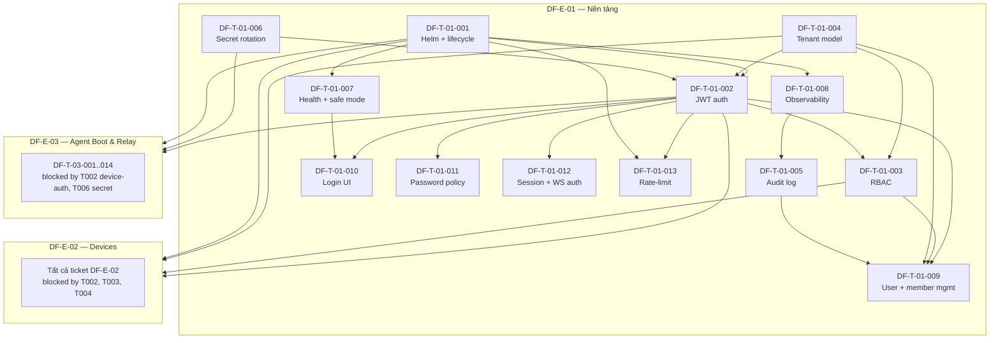

# DF-E-01 — Nền tảng & Bảo mật truy cập

> **Mã Epic:** DF-E-01
> **Module gốc:** DF-MOD-01 — Nền tảng & Bảo mật truy cập
> **Phiên bản:** 1.0
> **Cập nhật lần cuối:** 2026-05-26
> **Trạng thái:** Active
> **Tài liệu liên quan:** [Đặc tả module](../../official_docs/modules/01-platform-runtime-and-access.md), [Nhóm người dùng](../../official_docs/02-personas-and-journeys.md), [Ma trận năng lực](../../official_docs/03-capability-matrix.md), [Backlog README](../README.md)

## 1. Header

| Trường | Giá trị |
|---|---|
| **Epic ID** | DF-E-01 |
| **Title** | Nền tảng & Bảo mật truy cập |
| **Module** | DF-MOD-01 |
| **Persona chính** | Platform Engineer, Admin tổ chức |
| **Persona phụ** | Mọi persona vận hành (tiêu thụ gián tiếp qua login dashboard và API) |
| **Owner (placeholder)** | (sẽ điền khi import vào tracker) |
| **Status** | Active |
| **Business priority** | Medium - technical enabler cho login, tenant, RBAC và member management; hardening/foundation không trực tiếp tạo happy path nên giữ P2/P3. |
| **Story point tổng** | 52 SP |
| **Số ticket** | 13 |
| **Release target** | M1 — Infrastructure Bootstrap |

## 2. Tổng quan Epic

Epic này thiết lập nền móng kỹ thuật mà tất cả các Epic nghiệp vụ khác dựa lên. Trước khi team có thể nói về device, campaign, scenario, content hay analytics, hệ thống phải có ba bảo đảm cốt lõi: (1) danh tính người gọi luôn được xác minh — là người vận hành đăng nhập, là thiết bị Android gọi runtime, hay là tiến trình giám sát hạ tầng; (2) dữ liệu giữa các tổ chức khách hàng tuyệt đối không rò lẫn; (3) các route công khai (đặc biệt là health check) vẫn phục vụ khi database tạm tắt để giám sát phân biệt được sự cố tầng dữ liệu với sự cố toàn bộ ứng dụng.

Epic gồm 13 ticket, chia ba lớp chính. Lớp một là **runtime bootstrap & boundary** — helm chart deploy, lifecycle khởi động, mount 4 auth boundary (public / user-auth / admin-auth / device-auth), safe mode, health check, WebSocket entrypoint. Lớp hai là **identity & access** — JWT access + refresh, password policy, session lifecycle, RBAC, mô hình organization và thành viên, device-auth qua device key. Lớp ba là **observability & guardrail** — audit log, secret rotation, observability foundation (log + metric + trace), rate-limit foundation, OpenAPI spec là chân lý và generated TypeScript client.

Theo tiêu chí nghiệp vụ, Epic này có Business priority Medium: phần login, tenant, RBAC và member management là bắt buộc cho release core, còn runtime foundation, audit, secret rotation, observability và rate limit được hạ xuống P2/P3 nếu không trực tiếp chặn happy path. Các ticket P0/P1 trong Epic này vẫn cần làm trước khi mở luồng end-user phụ thuộc auth; xem mục 5 để biết cross-Epic dependency cụ thể.

## 3. Mapping FR ↔ Ticket

Bảng dưới mapping mỗi FR trong đặc tả module tới ticket trong Epic. Một FR có thể trải nhiều ticket; một ticket có thể chạm nhiều FR.

| FR ID | Tên FR (rút gọn) | Ticket primary | Ticket phụ |
|---|---|---|---|
| FR-01-01 | Đăng nhập username/password | DF-T-01-002 | DF-T-01-011 |
| FR-01-02 | Refresh token | DF-T-01-002 | DF-T-01-012 |
| FR-01-03 | Xác thực JWT cho user-auth | DF-T-01-002 | DF-T-01-013 |
| FR-01-04 | Phân biệt vai trò admin tổ chức | DF-T-01-003 | DF-T-01-009 |
| FR-01-05 | Multi-tenancy organization | DF-T-01-004 | DF-T-01-009 |
| FR-01-06 | Mời và quản lý thành viên | DF-T-01-009 | DF-T-01-003 |
| FR-01-07 | Device-auth qua device key | DF-T-01-002, DF-T-01-006 | — |
| FR-01-08 | OpenAPI là chân lý API | DF-T-01-001 | DF-T-01-013 |
| FR-01-09 | Safe mode | DF-T-01-007 | DF-T-01-001 |
| FR-01-10 | Endpoint trạng thái safe mode | DF-T-01-007 | DF-T-01-008 |
| FR-01-11 | WebSocket entrypoint | DF-T-01-001 | DF-T-01-012 |
| FR-01-12 | 4 auth boundary khi mount | DF-T-01-001 | DF-T-01-002, DF-T-01-003 |
| FR-01-13 | Ranh giới ownership chuyển cho route nghiệp vụ | DF-T-01-003 | DF-T-01-013 |

Các năng lực Lộ trình trong đặc tả module mục 7 cũng được phủ trong Epic này ở mức foundation: **structured logging với request-id** → DF-T-01-008; **per-agent identity rotation** mới chỉ thiết kế khung secret rotation tại DF-T-01-006 (rotation thực sự cho relay nằm ở DF-E-03); **rate limit trung ương** → DF-T-01-013 (foundation, chưa policy đầy đủ).

## 4. Danh sách ticket

| Ticket ID | Title | Type | Priority | SP | Status |
|---|---|---|---|---|---|
| DF-T-01-001 | Helm chart skeleton & runtime lifecycle | feature | P2 | 5 | Backlog |
| DF-T-01-002 | JWT auth (access + refresh token) | feature | P0 | 5 | Backlog |
| DF-T-01-003 | RBAC role model & enforcement | feature | P0 | 5 | Backlog |
| DF-T-01-004 | Tenant (organization) model & data scoping | feature | P0 | 5 | Backlog |
| DF-T-01-005 | Audit log foundation | feature | P2 | 3 | Backlog |
| DF-T-01-006 | Secret rotation framework | feature | P3 | 5 | Backlog |
| DF-T-01-007 | Health check & safe mode | feature | P1 | 3 | Backlog |
| DF-T-01-008 | Observability foundation (log + metric + trace) | feature | P2 | 5 | Backlog |
| DF-T-01-009 | User & organization member management API | feature | P0 | 5 | Backlog |
| DF-T-01-010 | Login UI minimal & dashboard shell | feature | P1 | 3 | Backlog |
| DF-T-01-011 | Password policy & lockout | feature | P1 | 2 | Backlog |
| DF-T-01-012 | Session lifecycle & WebSocket auth | feature | P1 | 3 | Backlog |
| DF-T-01-013 | API rate-limit foundation | feature | P3 | 3 | Backlog |

**Tổng SP:** 52 SP. Phân bổ priority nghiệp vụ: 4 ticket P0 (20 SP), 4 ticket P1 (11 SP), 3 ticket P2 (13 SP), 2 ticket P3 (8 SP).

## 5. Dependency Graph

### 5.1 Phụ thuộc giữa Epic từ DF-E-01

- **DF-T-01-001 (Helm + lifecycle)** blocks toàn bộ ticket DF-E-02 và DF-E-03 cần deploy môi trường.
- **DF-T-01-002 (JWT auth + device-auth)** blocks DF-T-02-003 (claim/release API) và DF-T-03-013 (secure handshake với control plane).
- **DF-T-01-003 (RBAC)** blocks DF-T-02-011 (manual override fleet), DF-T-02-013 (fleet stats — admin-only).
- **DF-T-01-004 (Tenant model)** blocks DF-T-02-001 (device registry — scoping theo org).
- **DF-T-01-006 (Secret rotation)** blocks DF-T-03-013 (handshake) — cần khung lưu device key có thể rotate.
- **DF-T-01-008 (Observability)** blocks DF-T-02-015 (device lifecycle event stream) và DF-T-03-009 (agent log shipper) — cần trace-id và log pipeline.

### 5.2 Phụ thuộc giữa Epic từ DF-E-01 (incoming)

DF-E-01 không bị block bởi Epic nào (đây là Epic gốc). Tuy nhiên DF-T-01-013 (rate-limit) có thể được hardening lại sau khi có traffic profile thực tế từ DF-E-02/3.

## 6. Điều kiện hoàn thành riêng cho Epic

Ngoài DoD chung trong [Backlog README mục 9](../README.md), DF-E-01 yêu cầu thêm:

1. **Không có route nào bypass auth boundary.** Mọi route mới phải khai báo public/user-auth/admin-auth/device-auth trước khi merge; CI check route matrix.
2. **Cross-tenant isolation test pass 100%.** Phải có integration test cố tình thử truy cập tài nguyên tổ chức khác và xác nhận bị reject. Bug ở đây là critical.
3. **OpenAPI spec không drift.** Mỗi PR đụng route phải kèm regenerate spec; CI fail nếu spec không khớp source code.
4. **Audit log cho mọi sự kiện auth.** Login thành công, login fail, refresh, invite, role change, password reset — đều phải có audit entry.
5. **Safe mode đã test trên môi trường staging.** Tắt database thật, xác nhận health vẫn 200 và frontend banner xuất hiện trong < 10 s.
6. **JWT secret và device key đã có cơ chế rotation văn bản hóa.** Runbook rotation phải nằm trong `docs/runbooks/` trước khi đóng ticket DF-T-01-006.
7. **Observability foundation đã deploy.** Có dashboard "API health" trên hệ thống giám sát hiển thị p50/p99 latency theo route.

## 7. KPI Epic

| KPI | Mục tiêu | Đo từ ticket |
|---|---|---|
| Tỷ lệ đăng nhập thành công (loại trừ sai mật khẩu) | ≥ 99,5% | DF-T-01-002, DF-T-01-011 |
| Độ trễ phát hành JWT (p99) | < 1 s | DF-T-01-002 |
| Tỷ lệ request user-auth nhận diện đúng organization | 100% | DF-T-01-004 |
| Tỷ lệ đồng bộ OpenAPI ↔ generated client | 100% mỗi release | DF-T-01-001 |
| Thời gian khôi phục từ safe mode về phục vụ đầy đủ | < 60 s | DF-T-01-007 |
| Sự cố bypass auth boundary phát hiện trong production | 0 mỗi quý | DF-T-01-003, DF-T-01-004 |
| Uptime endpoint health public | ≥ 99,9% | DF-T-01-007 |
| Tỷ lệ audit entry không mất khi load cao | ≥ 99,99% | DF-T-01-005 |

## 8. Risks Epic-level

- **R1 — JWT secret rò rỉ.** Mọi token cấp trước thời điểm rò đều phải invalidate. Giảm thiểu: DF-T-01-006 (rotation) + DF-T-01-002 (jti revocation list).
- **R2 — Multi-tenant data leak.** Bug cross-tenant query sẽ vi phạm hợp đồng B2B. Giảm thiểu: DF-T-01-004 enforce filter ở ORM layer + integration test bắt buộc.
- **R3 — Safe mode flip-flop.** Database vừa lên vừa xuống có thể gây mount/unmount route liên tục. Giảm thiểu: DF-T-01-007 có debounce.
- **R4 — OpenAPI drift kéo theo frontend gãy.** Giảm thiểu: DF-T-01-001 + CI check.
- **R5 — Rate-limit foundation chưa phủ hết route, vẫn bị abuse.** Giảm thiểu: DF-T-01-013 chỉ là foundation; hardening đầy đủ về sau, tạm thời dựa reverse proxy.

## 9. Liên kết tài liệu

- Đặc tả module: [`docs/official_docs/modules/01-platform-runtime-and-access.md`](../../official_docs/modules/01-platform-runtime-and-access.md)
- Nhóm người dùng: [`docs/official_docs/02-personas-and-journeys.md`](../../official_docs/02-personas-and-journeys.md) — Platform Engineer (mục 3.4), Admin tổ chức.
- Ma trận năng lực: [`docs/official_docs/03-capability-matrix.md`](../../official_docs/03-capability-matrix.md) — mục "Năng lực hỗ trợ ngang".
- Backlog README: [`docs/official_backlog/README.md`](../README.md) — quy ước Priority, SP, Labels, DoD chung.
