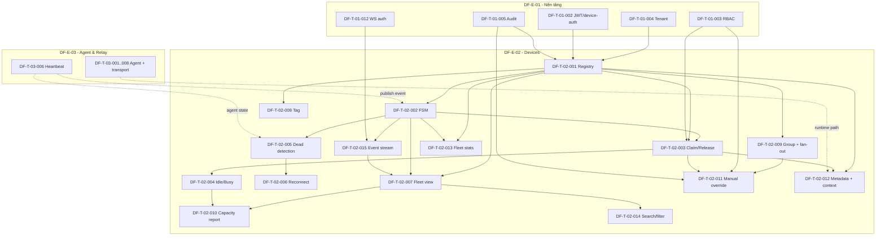

# DF-E-02 — Thiết bị & Mặt phẳng điều khiển

> **Mã Epic:** DF-E-02
> **Module gốc:** DF-MOD-02 — Thiết bị & Mặt phẳng điều khiển
> **Phiên bản:** 1.0
> **Cập nhật lần cuối:** 2026-05-26
> **Trạng thái:** Active
> **Tài liệu liên quan:** [Đặc tả module](../../official_docs/modules/02-devices-and-control-plane.md), [Nhóm người dùng](../../official_docs/02-personas-and-journeys.md), [Ma trận năng lực](../../official_docs/03-capability-matrix.md), [Backlog README](../README.md)

## 1. Header

| Trường | Giá trị |
|---|---|
| **Epic ID** | DF-E-02 |
| **Title** | Thiết bị & Mặt phẳng điều khiển |
| **Module** | DF-MOD-02 |
| **Persona chính** | Fleet Operator, Social Data Operator |
| **Persona phụ** | Automation Builder (gián tiếp qua module L2), AI Operations Supervisor (gián tiếp qua module L3 Preview) |
| **Owner (placeholder)** | (sẽ điền khi import vào tracker) |
| **Status** | Active |
| **Business priority** | High - core device/fleet/session để end-user nhìn thấy, claim và sử dụng device. |
| **Story point tổng** | 60 SP |
| **Số ticket** | 15 |
| **Release target** | M2 — Device Control Plane |

## 2. Tổng quan Epic

Epic này build **lõi sản phẩm của Device Farm**: nơi hệ thống quản lý vòng đời thiết bị Android từ pair lần đầu, qua reserve/release, qua nhận lệnh và đẩy kết quả, tới khi unpair. Đây là mặt phẳng điều khiển (control plane) mà mọi module L2 nghiệp vụ (campaign, scenario, content) dựa lên. Mô hình thiết kế cốt lõi: **nhiều device session độc lập** — mỗi thiết bị có ngữ cảnh thực thi riêng (account, target list, pacing), per-device override scenario default. Group action là helper điều phối lô, không phải execution model chính.

Epic gồm 15 ticket, chia ba nhóm. Nhóm một là **data model & registry** — device registry với 4 loại định danh tách biệt (db id, device serial, ADB serial, relay serial), device group, device tag, metadata API. Nhóm hai là **FSM & lifecycle** — máy trạng thái UNKNOWN→CONNECTING→ONLINE↔BUSY→RECONNECTING→DEAD (phối hợp với DF-E-03 — agent là nguồn sự kiện, control plane là store + API), claim/release qua reserve, dead detection, reconnect strategy. Nhóm ba là **API & operator UX** — fleet view query, search/filter, capacity planning report, manual override, fleet stats, lifecycle event stream cho dashboard realtime.

Epic phụ thuộc DF-E-01 cứng (auth, tenancy, RBAC, audit) và phụ thuộc DF-E-03 ở **runtime path** (gesture/hierarchy/screenshot/stream thực sự đi qua relay agent — DF-E-03 lo). Epic này sở hữu **API và state machine ở control plane**; DF-E-03 sở hữu **agent thực thi và transport**. Ranh giới này được giữ chặt để hai team có thể parallel.

## 3. Mapping FR ↔ Ticket

| FR ID | Tên FR (rút gọn) | Ticket primary | Ticket phụ |
|---|---|---|---|
| FR-02-01 | Pair thiết bị mới | DF-T-02-001 | DF-T-02-002, DF-T-02-015 |
| FR-02-02 | Liệt kê thiết bị fleet | DF-T-02-007 | DF-T-02-014 |
| FR-02-03 | Reserve device session | DF-T-02-003 | DF-T-02-013 |
| FR-02-04 | Release device session | DF-T-02-003 | DF-T-02-004 |
| FR-02-05 | Gửi gesture realtime | DF-T-02-012 (metadata API spec) | (thực thi gesture: cross-DF-E-03) |
| FR-02-06 | Đọc UI hierarchy | DF-T-02-012 | (cross-DF-E-03) |
| FR-02-07 | Lấy screenshot | DF-T-02-012 | (cross-DF-E-03) |
| FR-02-08 | Mở stream realtime | DF-T-02-012 | (cross-DF-E-03) |
| FR-02-09 | Attach/detach scrcpy | DF-T-02-012 | (cross-DF-E-03) |
| FR-02-10 | Per-device context override | DF-T-02-012 | DF-T-04-* (cross-Epic) |
| FR-02-11 | Tạo và quản lý device group | DF-T-02-009 | DF-T-02-008 |
| FR-02-12 | Group action fan-out | DF-T-02-009 | DF-T-02-011 |
| FR-02-13 | Xem trạng thái device session | DF-T-02-013 | DF-T-02-011 |
| FR-02-14 | Unpair thiết bị | DF-T-02-001 | DF-T-02-015 |
| FR-02-15 | Phân biệt 4 loại định danh | DF-T-02-001 | DF-T-02-012 |

**Open question coverage:** "Cho phép queue reserve khi thiết bị BUSY?" — chốt: **từ chối ngay** ở M2; queue đưa vào lộ trình sau. "Group action de-duplicate khi device thuộc nhiều group?" — chốt: **không**; mỗi group action độc lập, người vận hành chịu trách nhiệm; sẽ revisit khi có pattern thực tế.

## 4. Danh sách ticket

| Ticket ID | Title | Type | Priority | SP | Status |
|---|---|---|---|---|---|
| DF-T-02-001 | Device registry — schema, 4 định danh, pair/unpair | feature | P0 | 5 | Backlog |
| DF-T-02-002 | FSM state machine — định nghĩa và state store | feature | P0 | 5 | Backlog |
| DF-T-02-003 | Claim/release device session API | feature | P0 | 5 | Backlog |
| DF-T-02-004 | Idle/busy transition logic & auto-release | feature | P0 | 3 | Backlog |
| DF-T-02-005 | Dead detection — chuyển RECONNECTING → DEAD | feature | P1 | 3 | Backlog |
| DF-T-02-006 | Reconnect strategy — exponential backoff config | feature | P1 | 3 | Backlog |
| DF-T-02-007 | Fleet view query API — paginated list | feature | P0 | 5 | Backlog |
| DF-T-02-008 | Device tag — gắn tag tự do | feature | P2 | 2 | Backlog |
| DF-T-02-009 | Device group & group action fan-out | feature | P1 | 5 | Backlog |
| DF-T-02-010 | Capacity planning report | feature | P3 | 5 | Backlog |
| DF-T-02-011 | Manual override — admin force-release & state reset | feature | P2 | 3 | Backlog |
| DF-T-02-012 | Device metadata API — context override & primitive contract | feature | P0 | 5 | Backlog |
| DF-T-02-013 | Fleet stats endpoint — health summary | feature | P2 | 3 | Backlog |
| DF-T-02-014 | Device search & filter | feature | P2 | 3 | Backlog |
| DF-T-02-015 | Device lifecycle event stream (WS publish) | feature | P1 | 5 | Backlog |

**Tổng SP:** 60 SP. Phân bổ priority nghiệp vụ: 6 ticket P0 (28 SP), 4 ticket P1 (16 SP), 4 ticket P2 (11 SP), 1 ticket P3 (5 SP).

## 5. Dependency Graph

### 5.1 Phụ thuộc giữa Epic — incoming (DF-E-02 phụ thuộc)

- **DF-T-01-002 (JWT + device-auth)** — DF-E-01 — block toàn bộ DF-E-02 API.
- **DF-T-01-003 (RBAC)** — block DF-T-02-011 (admin force-release).
- **DF-T-01-004 (Tenant)** — block DF-T-02-001 (device thuộc org).
- **DF-T-01-005 (Audit)** — block sự kiện pair, claim, force-release.
- **DF-T-01-012 (WS auth)** — block DF-T-02-015 (event stream).
- **DF-T-03-006 (Heartbeat)** — DF-E-03 — feed FSM event vào DF-T-02-002.
- **DF-T-03-001..014 (Agent + transport)** — runtime path cho FR-02-05..08.

### 5.2 Phụ thuộc giữa Epic — outgoing (Epic khác phụ thuộc DF-E-02)

- **DF-E-04 (Campaign):** mọi scenario run cần DF-T-02-003 claim, DF-T-02-012 context override.
- **DF-E-05 (Scheduling):** dispatch cần DF-T-02-007 fleet view và DF-T-02-013 stats.
- **DF-E-06 (Content):** screenshot artifact cần primitive DF-T-02-012.
- **DF-E-07 (Account):** per-device context (FR-02-10) cần DF-T-02-012.
- **DF-E-09 (Notif):** alert "device DEAD" subscribe DF-T-02-015 event stream.

## 6. Điều kiện hoàn thành riêng cho Epic

Ngoài DoD chung [README mục 9](../README.md), DF-E-02 yêu cầu thêm:

1. **FSM transition test 100%** — mọi cặp state (current, event) phải có test xác nhận transition đúng hoặc reject đúng.
2. **Cross-tenant device test pass 100%** — alice không claim được device của org khác; kiểm tra ở mọi endpoint của DF-E-02.
3. **Auto-release test với 100 session đồng thời** — verify không có race khi 100 session timeout cùng lúc.
4. **Reconnect đã test trên thiết bị thật** — ít nhất 10 thiết bị thật, simulate WiFi flap 5s, mass disconnect 30s — phục hồi ≥ 95% trong < 10 phút.
5. **API contract đã đồng bộ với DF-E-03** — gesture/hierarchy/screenshot/stream endpoint spec match đúng giữa control plane (DF-E-02) và agent (DF-E-03).
6. **Event stream không miss event** khi 1000 device đồng loạt thay đổi state — pub/sub broker đáp ứng.
7. **Fleet view paginated p99 < 500ms** với 1000 device trong org.

## 7. KPI Epic

| KPI | Mục tiêu | Đo từ ticket |
|---|---|---|
| Tỷ lệ thiết bị online trong giờ vận hành | ≥ 99% | DF-T-02-002, DF-T-02-005 |
| Thời gian từ cắm thiết bị đến xuất hiện fleet | < 60 s | DF-T-02-001, DF-T-02-015 |
| Độ trễ thực thi gesture trung vị | < 500 ms | DF-T-02-012 (cross-DF-E-03) |
| Tỷ lệ session reserve không xung đột | 100% | DF-T-02-003, DF-T-02-004 |
| Tỷ lệ thiết bị có owner session rõ ràng khi BUSY | 100% | DF-T-02-003, DF-T-02-013 |
| Thời gian phục hồi thiết bị sau sự cố mạng | < 10 phút | DF-T-02-005, DF-T-02-006 |
| Tỷ lệ group action báo cáo per-device đầy đủ | 100% | DF-T-02-009 |
| Fleet view p99 latency | < 500 ms | DF-T-02-007, DF-T-02-014 |
| Tỷ lệ effective config được lưu đúng | 100% | DF-T-02-012 |

## 8. Risks Epic-level

- **R1 — Race condition khi 2 process cùng claim device.** Giảm thiểu: DF-T-02-003 dùng `SELECT ... FOR UPDATE` hoặc Redis lock.
- **R2 — FSM state drift giữa control plane và agent.** Giảm thiểu: agent là source of truth cho ONLINE/BUSY transition; control plane reconcile từ heartbeat (DF-T-02-002 + DF-T-03-006).
- **R3 — Auto-release timeout cắt phiên đang chạy.** Giảm thiểu: heartbeat từ owner refresh `last_active`; configurable per workflow.
- **R4 — Group action fan-out partial failure không rõ ràng.** Giảm thiểu: DF-T-02-009 trả per-device result với status.
- **R5 — Event stream bùng nổ khi 1000 device đồng loạt offline (WiFi outage).** Giảm thiểu: DF-T-02-015 batching + backpressure.

## 9. Liên kết tài liệu

- Đặc tả module: [`docs/official_docs/modules/02-devices-and-control-plane.md`](../../official_docs/modules/02-devices-and-control-plane.md)
- Nhóm người dùng: Fleet Operator (3.3), Social Data Operator (3.1).
- Ma trận năng lực: mục 4.1 "Năng lực điều khiển và quan sát thiết bị".
- Cross-Epic: DF-E-03.
